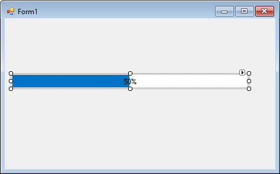
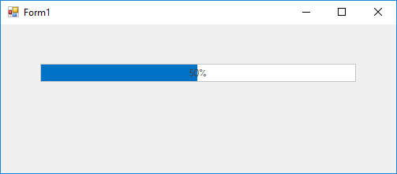
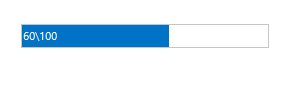

# Getting started

This section describes how to add [ProgressBarAdv](https://help.syncfusion.com/cr/cref_files/windowsforms/tools/Syncfusion.Shared.Base~Syncfusion.Windows.Forms.Tools.ProgressBarAdv.html) control in a Windows Forms application and overview of its basic functionalities.

## Assembly deployment

The following list of assemblies should be added as reference to use the [ProgressBarAdv](https://help.syncfusion.com/cr/cref_files/windowsforms/tools/Syncfusion.Shared.Base~Syncfusion.Windows.Forms.Tools.ProgressBarAdv.html) in any application:

<table>
<tr>
<td>
{{'**Required assemblies**'| markdownify }}
</td>
<td>
{{'**Description**'| markdownify }}
</td>
</tr>
<tr>
<td>
Syncfusion.Shared.Base
</td>
<td>
The Syncfusion.Shared.Base contains the class that handles all UI operations and contains helper class of ProgressBarAdv control.
</td>
</tr>
</table>

## Installing NuGet Packages

To use [ProgressBarAdv](https://help.syncfusion.com/cr/cref_files/windowsforms/tools/Syncfusion.Shared.Base~Syncfusion.Windows.Forms.Tools.ProgressBarAdv.html) control in Windows Forms application via nuget, the following packages should be installed.
 
<table>
<tr>
<td>{{'**S.No**'| markdownify }}
</td>
<td>{{'**Framework version**'| markdownify }}
</td>
<td>{{'**NuGet Packages**'| markdownify }}
</td>
</tr>
<tr>
<td> 1
</td>
<td> 2.0
</td>
<td> Syncfusion.Shared.Base20
</td>
</tr>
<tr>
<td> 2
</td>
<td> 3.5
</td>
<td> Syncfusion.Shared.Base35
</td>
</tr>
<tr>
<td> 3
</td>
<td> 4.0
</td>
<td> Syncfusion.Shared.Base40
</td>
</tr>
<tr>
<td> 4
</td>
<td> 4.5
</td>
<td> Syncfusion.Shared.Base45
</td>
</tr>
<tr>
<td> 5
</td>
<td> 4.5.1
</td>
<td> Syncfusion.Shared.Base451
</td>
</tr>
<tr>
<td> 6
</td>
<td> 4.6
</td>
<td>Syncfusion.Shared.Base46
</td>
</tr>
</table>
 
Please find more details regarding how to install the nuget packages in windows form application in the below link:
 
[How to install nuget packages](https://help.syncfusion.com/windowsforms/nuget-packages)

# Creating simple application with ProgressBarAdv

You can create the Windows Forms application with ProgressBarAdv control as follows:

1. [Creating project](#creating-the-project)
2. [Adding control via Form Designer](#adding-control-via-form-designer)
3. [Adding control manually using code](#adding-control-manually-using-code)
4. [Configure text format](#configure-text-format)
5. [Configure TextAlignment](#configure-textAlignment)

### Creating the project

Create a new Windows Forms project in the Visual Studio to display the [ProgressBarAdv](https://help.syncfusion.com/cr/cref_files/windowsforms/tools/Syncfusion.Shared.Base~Syncfusion.Windows.Forms.Tools.ProgressBarAdv.html) with basic functionalities.

## Adding control via Form designer

The [ProgressBarAdv](https://help.syncfusion.com/cr/cref_files/windowsforms/tools/Syncfusion.Shared.Base~Syncfusion.Windows.Forms.Tools.ProgressBarAdv.html) control can be added to the application by dragging it from the toolbox and dropping it in a designer view. The following required assembly references will be added automatically:

* Syncfusion.Shared.Base.dll

## Adding control manually using code

To add control manually in C#, follow the given steps:

**Step 1** - Add the following required assembly references to the project:

	* Syncfusion.Shared.Base.dll

**Step 2** - Include the namespaces **Syncfusion.Shared.Base**.





using Syncfusion.Shared.Base;





Imports Syncfusion.Shared.Base



 

**Step 3** - Create `ProgressBarAdv` control instance and add it to the form.





ProgressBarAdv progressBarAdv1 = new ProgressBarAdv();

this.progressBarAdv1.ProgressStyle = ProgressBarStyles.Office2016Colorful;

 this.progressBarAdv1.Value = 60;

this.Controls.Add(progressBarAdv1);





Dim progressBarAdv1 As ProgressBarAdv = New ProgressBarAdv()

Me.progressBarAdv1.ProgressStyle = ProgressBarStyles.Office2016Colorful

 this.progressBarAdv1.Value = 60

Me.Controls.Add(progressBarAdv1)





## Configure text format

Text format of the ProgressBarAdv can be customized using [TextStyle](https://help.syncfusion.com/cr/cref_files/windowsforms/tools/Syncfusion.Shared.Base~Syncfusion.Windows.Forms.Tools.ProgressBarAdv~TextStyle.html) property.

**Value** represents the current value out of maximum value format.





this.progressBarAdv1.TextStyle = ProgressBarTextStyles.Value;





Me.progressBarAdv1.TextStyle = ProgressBarTextStyles.Value





**Percentage** represents the percentage format.





this.progressBarAdv1.TextStyle = ProgressBarTextStyles.Percentage;





Me.progressBarAdv1.TextStyle = ProgressBarTextStyles.Percentage





**Custom** represents the other custom format.





this.progressBarAdv1.CustomText = "Loading";
this.progressBarAdv1.TextStyle = ProgressBarTextStyles.Custom;





Me.progressBarAdv1.CustomText = "Loading"
Me.progressBarAdv1.TextStyle = ProgressBarTextStyles.Custom





## Configure TextAlignment

Alignment of the foreground text can be modified using [TextAlignment](#https://help.syncfusion.com/cr/cref_files/windowsforms/tools/Syncfusion.Shared.Base~Syncfusion.Windows.Forms.Tools.ProgressBarAdv~TextAlignment.html) property.

**Center** represents text aligned to the Center.





this.progressBarAdv1.TextAlignment = TextAlignment.Center;





Me.progressBarAdv1.TextAlignment = TextAlignment.Center





**Left** represents text aligned to the left.





this.progressBarAdv1.TextAlignment = TextAlignment.Left;





Me.progressBarAdv1.TextAlignment = TextAlignment.Left





**Right** represents text aligned to the right.





this.progressBarAdv1.TextAlignment = TextAlignment.Right;





Me.progressBarAdv1.TextAlignment = TextAlignment.Right





