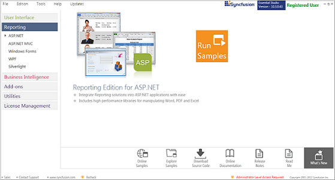
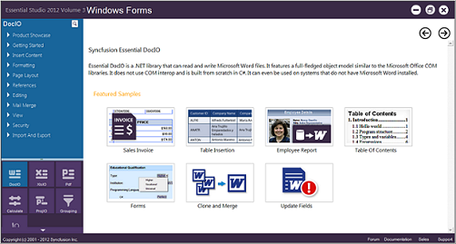
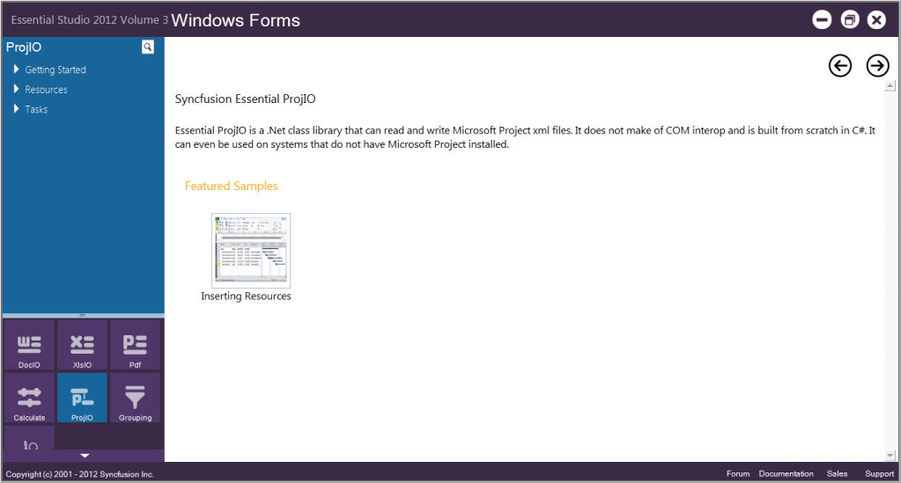
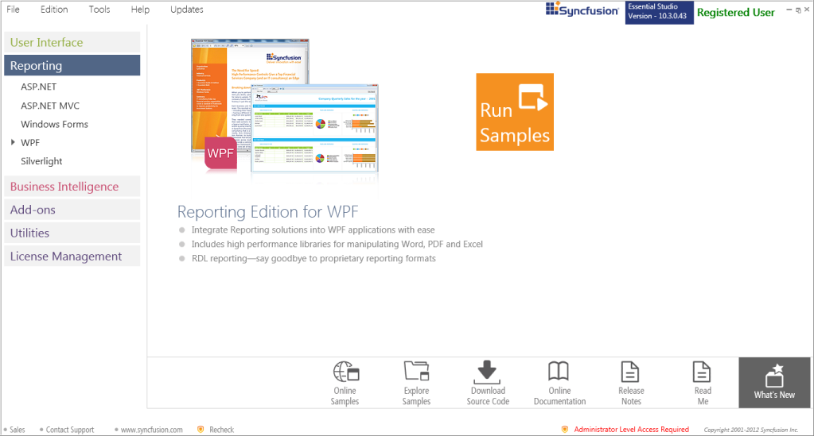
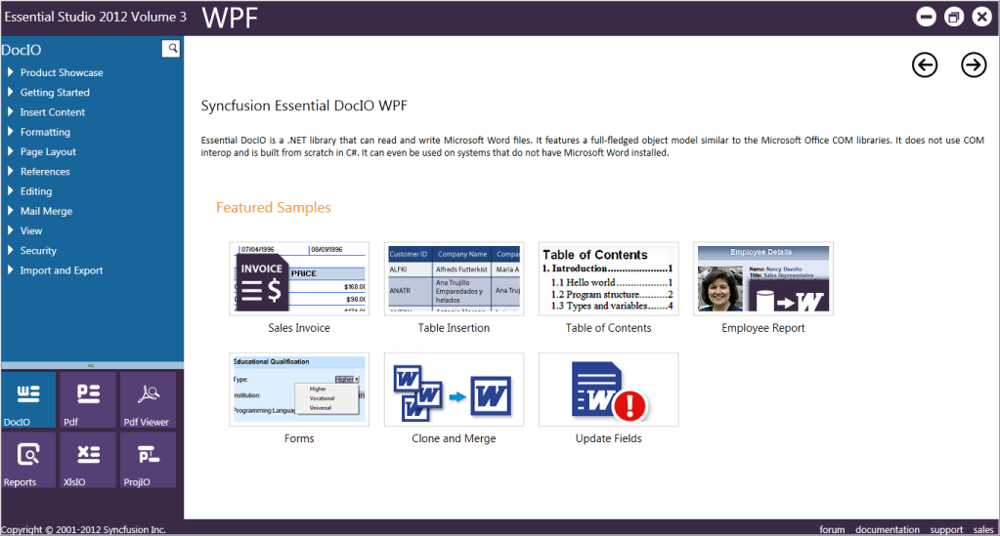
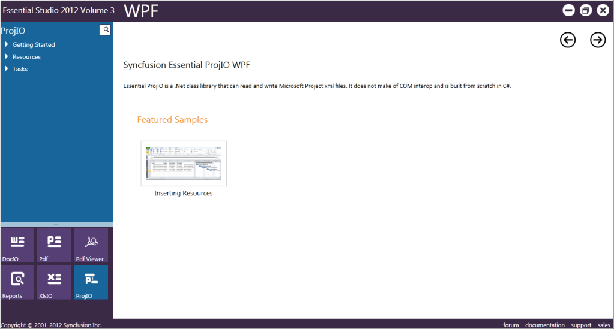

# Installation and Deployment in Windows Forms ProjIO

## Installation

For step-by-step installation procedure for the installation of Essential Studio, refer to the Installation topic under Installation and Deployment in the Common UG.

## Where to Find Samples?

This section covers the location of the installed samples and describes the procedure to run the samples through the sample browser and online. It also lists the location of utilities, assemblies, and source code.

### Sample Installation Location

Sample install locations for different platforms are listed below:

* Windows Forms – The Windows Forms samples are installed in the following location:

  ...\MyDocuments\Syncfusion\EssentialStudio\VersionNumber\Windows\ProjIO.Windows\Samples\2.0

* WPF - The WPF samples are installed in the following location:

  ...\MyDocuments\Syncfusion\EssentialStudio\VersionNumber\WPF\ProjIO.WPF\Samples\3.5

### Viewing Samples

The samples can be viewed in any of the following three ways:

* Run Samples – Click to view the locally installed samples.
* Online Samples-Click to view online samples.
* Explore Samples – Explore samples on disk.

To view the samples:

1. Click Start -> All Programs-> Syncfusion -> Essential Studio <x.x.x.x> -> Dashboard. The UI samples are displayed by default.
2. Select Reporting.

   

The steps to view the ProjIO samples in various platforms are discussed below.

#### Windows

1. In the Dashboard window, click Run Samples for Windows Forms under Reporting Edition Panel. The Windows Forms Sample Browser window is displayed.

   

2. Click ProjIO from the bottom-left pane. The ProjIO samples are displayed.

   

3. Select any sample and browse through the features.

   WPF

   1. In the dashboard window, click Run Samples for WPF under Reporting edition panel. The WPF Sample Browser window is displayed.

   

   2. Select Run Samples. The default WPF sample will be displayed.

   

   3. Click ProjIO form the bottom-left pane and browse through the features.

   

## Deployment Procedures 

### Assemblies

The following assemblies need to be referenced in your application for the usage of ProjIO.

* Syncfusion.Core.dll
* Syncfusion.ProjIO.Base.dll
