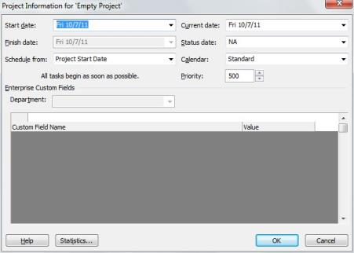

# Project

You can open, modify and create Project files using the Project Class. Project class has a structure similar to the MS Project document. Project class is useful in creating MS Projects in XML format. It can also be used to open or modify the existing Project files in XML format.

## Properties, Methods, and Events Tables for Project

### Constructors

Project Constructor

<table>
<tr>
<th>
Name</th><th>
Description</th></tr>
<tr>
<td>
Project.Project()</td><td>
Initializes a new instance of the Project class</td></tr>
</table>

### Properties

Project Properties

<table>
<tr>
<th>
Property</th><th>
Description</th></tr>
<tr>
<td>
SaveVersion</td><td>
Gets or sets the version of Microsoft Office Project from which the project was saved. </td></tr>
<tr>
<td>
UID</td><td>
Gets or set the unique ID of the project.</td></tr>
<tr>
<td>
Name</td><td>
Gets or sets the name of the project.</td></tr>
<tr>
<td>
Title </td><td>
Gets or sets the title of the project.</td></tr>
<tr>
<td>
Subject </td><td>
Gets or sets the subject of the project.</td></tr>
<tr>
<td>
Category </td><td>
Gets or sets the category of the project.</td></tr>
<tr>
<td>
Company </td><td>
Gets or sets the company that owns the project.</td></tr>
<tr>
<td>
Manager </td><td>
Gets or sets the manager of the project.</td></tr>
<tr>
<td>
Author </td><td>
Gets or sets the author of the project.</td></tr>
<tr>
<td>
CreationDate </td><td>
Gets or sets the date when the project was created.</td></tr>
<tr>
<td>
Revision </td><td>
Gets or sets the number of times a project has been saved.</td></tr>
<tr>
<td>
LastSaved </td><td>
Gets or sets the date the project was last saved.</td></tr>
<tr>
<td>
ScheduleFromStart </td><td>
True if the project is scheduled from the start date.</td></tr>
<tr>
<td>
StartDate </td><td>
Gets or sets the start date of the project. Required if ScheduleFromStart is true.</td></tr>
<tr>
<td>
FinishDate </td><td>
Gets or sets the finish date of the project. Required if ScheduleFromStart is false.</td></tr>
<tr>
<td>
FYStartDate </td><td>
Gets or sets the Fiscal Year starting month</td></tr>
<tr>
<td>
CriticalSlackLimit </td><td>
Gets or sets the number of days past its end date that a task can go before Microsoft Project marks that task as a critical task.</td></tr>
<tr>
<td>
CurrencyDigits </td><td>
Gets or sets the number of digits after the decimal symbol.</td></tr>
<tr>
<td>
CurrencySymbol </td><td>
Gets or sets the currency symbol used in the project.</td></tr>
<tr>
<td>
CurrencyCode </td><td>
Gets or sets the three letter currency character code as defined in ISO 4217. Only USD is supported.</td></tr>
<tr>
<td>
CurrencySymbolPosition </td><td>
Gets or sets the position of the currency symbol.</td></tr>
<tr>
<td>
CalendarUID</td><td>
Gets or sets the project calendar UID.  Refers to a valid UID in the Calendars collection.</td></tr>
<tr>
<td>
Calendar</td><td>
Gets or sets the project calendar.</td></tr>
<tr>
<td>
DefaultStartTime </td><td>
Gets or sets the default start time of new tasks.</td></tr>
<tr>
<td>
DefaultFinishTime </td><td>
Gets or sets the default finish time of new tasks.</td></tr>
<tr>
<td>
MinutesPerDay </td><td>
Gets or sets the number of minutes per day.</td></tr>
<tr>
<td>
MinutesPerWeek </td><td>
Gets or sets the number of minutes per week.</td></tr>
<tr>
<td>
DaysPerMonth </td><td>
Gets or sets the number of days per month.</td></tr>
<tr>
<td>
DefaultTaskType </td><td>
Gets or sets the default type of new tasks.</td></tr>
<tr>
<td>
DefaultFixedCostAccrual</td><td>
Gets or sets the default from where fixed costs are accrued.  </td></tr>
<tr>
<td>
DefaultStandardRate</td><td>
Gets or sets the default standard rate for new resources.</td></tr>
<tr>
<td>
DefaultOvertimeRate</td><td>
Gets or sets the default overtime rate for new resources.</td></tr>
<tr>
<td>
DurationFormat</td><td>
Gets or sets the format for expressing the bulk duration.</td></tr>
<tr>
<td>
WorkFormat</td><td>
Gets or sets the default work unit format.</td></tr>
<tr>
<td>
EditableActualCosts</td><td>
True if actual costs are editable.</td></tr>
<tr>
<td>
HonorConstraints</td><td>
True if tasks honor their constraint dates.</td></tr>
<tr>
<td>
EarnedValueMethod</td><td>
Gets or sets the default method for calculating earned value.</td></tr>
<tr>
<td>
InsertedProjectsLikeSummary</td><td>
True if subtasks are calculated as summary tasks.</td></tr>
<tr>
<td>
MultipleCriticalPaths</td><td>
True if multiple critical paths are calculated.</td></tr>
<tr>
<td>
NewTasksEffortDriven</td><td>
True if new tasks are effort driven.</td></tr>
<tr>
<td>
NewTasksEstimated</td><td>
True to show the estimated duration by default.</td></tr>
<tr>
<td>
SplitsInProgressTasks</td><td>
True if in-progress tasks can be split.</td></tr>
<tr>
<td>
SpreadActualCost</td><td>
True if actual costs are spread to the status date.</td></tr>
<tr>
<td>
SpreadPercentComplete</td><td>
True if percent complete is spread to the status date.</td></tr>
<tr>
<td>
TaskUpdatesResource</td><td>
True if updates to tasks, update resources.</td></tr>
<tr>
<td>
FiscalYearStart</td><td>
True to use fiscal year numbering.</td></tr>
<tr>
<td>
WeekStartDay</td><td>
Gets or sets the Start day of the week.</td></tr>
<tr>
<td>
MoveCompletedEndsBack</td><td>
True if the end of completed portions of tasks scheduled to begin after the status date but begun early should be moved back to the status date.</td></tr>
<tr>
<td>
MoveRemainingStartsBack</td><td>
True if the beginning of remaining portions of tasks scheduled to begin after the status date but began early, should be moved back to the status date.</td></tr>
<tr>
<td>
MoveRemainingStartsForward</td><td>
True if the beginning of remaining portions of tasks scheduled to begin late should be moved up to the status date.</td></tr>
<tr>
<td>
MoveCompleteEndsForward</td><td>
True if the end of completed portions of tasks scheduled to get completed before the status date but began late should be moved up to the status date.</td></tr>
<tr>
<td>
BaselineForEarnedValue</td><td>
Gets or sets the specific baseline used to calculate Variance values.</td></tr>
<tr>
<td>
AutoAddNewResourcesAndTasks</td><td>
True to automatically add new resources to the resource pool.</td></tr>
<tr>
<td>
StatusDate</td><td>
Gets or sets the date used for calculation and reporting.</td></tr>
<tr>
<td>
CurrentDate</td><td>
Gets or sets the system date that the XML was generated.</td></tr>
<tr>
<td>
MicrosoftProjectServerURL</td><td>
True if the project was created by a Project Server user as opposed to an NT user.</td></tr>
<tr>
<td>
Autolink</td><td>
True to auto link inserted or moved tasks.</td></tr>
<tr>
<td>
NewTaskStartDate</td><td>
Gets or sets the default date for new tasks start.</td></tr>
<tr>
<td>
DefaultTaskEVMethod</td><td>
Gets or sets the default earned value method for tasks.</td></tr>
<tr>
<td>
ProjectExternallyEdited</td><td>
True if the project XML was edited.</td></tr>
<tr>
<td>
ExtendedCreationDate</td><td>
Gets or sets date used for calculation and reporting.</td></tr>
<tr>
<td>
ActualInSync</td><td>
True if all actual work has been synchronized with the project.</td></tr>
<tr>
<td>
RemoveFileProperties</td><td>
True to remove all file properties on save.</td></tr>
<tr>
<td>
AdminProject</td><td>
True if the project is an administrative project.</td></tr>
<tr>
<td>
BaselineCalendar</td><td>
Gets or sets the name of the Baseline Calendar.</td></tr>
<tr>
<td>
NewTasksAreManual</td><td>
True if new tasks should be made in Manual mode.</td></tr>
<tr>
<td>
UpdateManuallyScheduledTasksWhenEditingLinks</td><td>
True to update manually scheduled tasks when editing links.</td></tr>
<tr>
<td>
KeepTaskOnNearestWorkingTimeWhenMadeAutoScheduled</td><td>
True if tasks moving from Manual to Auto Scheduled should be moved to the nearest working time.</td></tr>
<tr>
<td>
OutlineCodes</td><td>
Gets or sets the collection of outline code definitions associated with the project.</td></tr>
<tr>
<td>
WBSMasks</td><td>
Gets or sets the table of entries that define the outline code mask.</td></tr>
<tr>
<td>
ExtendedAttributes</td><td>
Gets or sets the collection of extended attribute (custom field) definitions associated with the project.</td></tr>
<tr>
<td>
Calendars</td><td>
Gets or sets the collection of calendars that are associated with the project.</td></tr>
<tr>
<td>
Tasks</td><td>
Gets or sets the collection of tasks that make up the project.</td></tr>
<tr>
<td>
Resources</td><td>
Gets or sets the collection of resources that make up the project.</td></tr>
<tr>
<td>
Assignments</td><td>
Gets or sets the collection of assignments that make up the project.</td></tr>
</table>

### Methods

Project Methods

<table>
<tr>
<th>
Method</th><th>
Description</th></tr>
<tr>
<td>
Save</td><td>
Saves Project instance to disk</td></tr>
<tr>
<td>
CalculateResourceIDs</td><td>
Recalculates UID's and ID's of resources starting from 0</td></tr>
<tr>
<td>
CalculateTaskIDs</td><td>
Recalculates UID's and ID's of tasks starting from 0</td></tr>
<tr>
<td>
Equals</td><td>
Returns a value indicating whether this instance is equal to a specified object</td></tr>
<tr>
<td>
GetHashCode</td><td>
Serves as a hash function for Project type</td></tr>
<tr>
<td>
GetType</td><td>
Gets the type of the current instance</td></tr>
<tr>
<td>
ToString</td><td>
Returns a string that represents the current object</td></tr>
</table>

## Creating a simple project

Project is the main class of Essential ProjIO. We can only create project files in XML format. The following lines of code create a simple project.



// Creating an instance of Project

Project project = new Project();

// Saving the project - Creates an empty project

project.Save("Empty Project.xml");





' Creating an instance of Project

Dim project As Project = New Project()

' Saving the Project - Creates an empty project

project.Save("Empty Project.xml")



The XML project file can be viewed in Microsoft Project using the option File – Open and then selecting the XML format (*.xml) option from the file types. Select ‘Project Information’ option from the Projects menu and the options will look as follows:

## Reading a project file

Read method of the ProjectReader class is used to read the project files. The Read method has two overloads namely:

* Read(string filename) – opens the file specified by the given file name.
* Read(Stream stream) – opens the file specified by the Stream.

Read method returns a Project object, which can then be used to retrieve or manipulate project information.

The following code illustrates the use of the Read method:



// Assigning the Project object returned by the Read method

Project P = ProjectReader.Open("SimpleProject.xml");





' Assigning the Project object returned by the Read method

Dim P As Project = ProjectReader.Open("SimpleProject.xml")



## General Project Properties

### Retrieving Project Properties

The Project Properties can be retrieved by using the Project class. The following code snippet shows how to get the project properties. These properties can be viewed in MS Project by selecting Project Properties from the File -Project Menu.



// Calling Open method of ProjectReader to get the Project object

Project project = ProjectReader.Open("Sample Project.xml");

// Displaying Project information

Console.WriteLine("Project Start Date: " + project.StartDate);

if (project.ScheduleFromStart)

    Console.WriteLine("Project Finish Date: " + project.StartDate);

else

    Console.WriteLine("Project Finish Date: " + project.FinishDate);

Console.WriteLine("Project Schedule From: " + (project.ScheduleFromStart ? "Project Start Date" : "Project Finish Date"));

Console.WriteLine("Current Date: " + project.CurrentDate);

Console.WriteLine("Status Date: " + project.StatusDate);

Console.WriteLine("Calendar: " + project.Calendar.Name);





' Creating an instance of Project

Dim project As Project = ProjectReader.Open("Sample Project.xml")

' Displaying Project information

Console.WriteLine("Project Start Date: " + project.StartDate)

If (project.ScheduleFromStart) Then

     Console.WriteLine("Project Finish Date: " + project.StartDate)

Else

     Console.WriteLine("Project Finish Date: " + project.FinishDate)

End If

Console.WriteLine("Project Schedule From: " + If(project.ScheduleFromStart = True, "Project Start Date", "Project Finish Date"))

Console.WriteLine("Current Date: " + project.CurrentDate)

Console.WriteLine("Status Date: " + project.StatusDate)

Console.WriteLine("Calendar: " + project.Calendar.Name)



### Setting Project Properties

The Project class can be used to set Project properties such as Start Date, Finish Date, Calendar and so on.

The following code snippet shows how to set the Project properties:



// Creating a new instance of the Project object

Project project = new Project();

// Setting Project information

project.ScheduleFromStart = true;

project.StartDate = new DateTime(2011, 7, 9);

project.CurrentDate = new DateTime(2011, 7, 9);

project.StatusDate = new DateTime(2011, 7, 9);

// Saving the Project

project.Save("ProjectProperties.xml");





' Creating an instance of Project

Dim project As Project = New Project()

' Setting Project information

project.ScheduleFromStart = True

project.StartDate = New DateTime(2011, 7, 9)

project.CurrentDate = New DateTime(2011, 7, 9)

project.StatusDate = New DateTime(2011, 7, 9)

' Saving the Project

project.Save("ProjectProperties.xml")



## Default Project Properties

The Project class is used to get/set Project Default Properties. The default properties of a project can be viewed using the Tools – Options menu in MS Project.

### Retrieving Default Project Properties

The following example illustrates how to retrieve default project properties.



// Calling Open method of ProjectReader to get the Project object

Project project = ProjectReader.Open("Sample Project.xml");

// Retrieving Project Default information

Console.WriteLine("Default Start Time: " + project.DefaultStartTime);

Console.WriteLine("Default Finish Time: " + project.DefaultFinishTime);

Console.WriteLine("Default Standard Rate: " + project.DefaultStandardRate);

Console.WriteLine("Default Overtime Rate: " + project.DefaultOvertimeRate);

Console.WriteLine("Default Task EV Method: " + project.DefaultTaskEVMethod);

Console.WriteLine("Default Cost Accrual: " + project.DefaultFixedCostAccrual);





' Creating an instance of Project

Dim project As Project = ProjectReader.Open("Sample Project.xml")

' Retriving Project information

Console.WriteLine("Default Start Time: " & project.DefaultStartTime.ToString())

Console.WriteLine("Default Finish Time: " & project.DefaultFinishTime.ToString())

Console.WriteLine("Default Standard Rate: " & project.DefaultStandardRate)

Console.WriteLine("Default Overtime Rate: " & project.DefaultOvertimeRate)

Console.WriteLine("Default Task EV Method: " & project.DefaultTaskEVMethod)

Console.WriteLine("Default Cost Accrual: " & project.DefaultFixedCostAccrual)



### Setting Default Project Properties

The following example shows how to set the default project properties.



// Creating a new instance of the Project object

Project project = new Project();

// Setting Project Default information

project.DefaultStartTime = new TimeSpan(8, 0, 0);

project.DefaultFinishTime = new TimeSpan(17, 0, 0);

project.DefaultStandardRate = 0f;

project.DefaultOvertimeRate = 0f;

project.DefaultTaskEVMethod = EarnedValueMethod.PercentComplete;

project.DefaultFixedCostAccrual = DefaultFixedCostAccrual.Prorated;

// Saving the Project

project.Save("DefaultProjectProperties.xml");





' Creating an instance of a Project

Dim project As Project = New Project()

' Setting Project information

project.DefaultStartTime = New TimeSpan(8, 0, 0)

project.DefaultFinishTime = New TimeSpan(17, 0, 0)

project.DefaultStandardRate = 0.0F

project.DefaultOvertimeRate = 0.0F

project.DefaultTaskEVMethod = EarnedValueMethod.PercentComplete

project.DefaultFixedCostAccrual = DefaultFixedCostAccrual.Prorated

' Saving the Project

project.Save("DefaultProjectProperties.xml")



## Writing Project Summary Information

Project class contains properties that can get or set the summary information of a project file in XML format. Using this class, the summary information can be updated and the file can be written back in XML format. The following code shows how this can be done.



// Calling Read method of ProjectReader to get the Project object

Project project = ProjectReader.Open("Sample Project.xml");

// Setting Project Default information

project.SaveVersion = 14;

project.Author = "Sam Anderson";

project.Manager = "John Henson";

project.Company = "Syncfusion";

project.CreationDate = new DateTime(2011, 10, 8);

project.Subject = "Essential ProjIO";

project.Title = "Sample Project";

// Saving the Project

project.Save("Empty Project.xml");





' Calling Read method of ProjectReader to get the Project object

Dim project As Project = ProjectReader.Open("Sample Project.xml")

' Retriving Project information

project.SaveVersion = 14

project.Author = "Sam Anderson"

project.Manager = "John Henson"

project.Company = "Syncfusion"

project.CreationDate = New DateTime(2011, 10, 8)

project.Subject = "Essential ProjIO"

project.Title = "Sample Project"

' Saving the Project

project.Save("Empty Project.xml")



The project summary information added through the above code can be viewed by checking the Project Information – Advanced Properties in the File menu.

## Fiscal Year Properties

The Project class properties FYStartDate and FiscalYearStart are used to get or set the Fiscal Year properties. FYStartDate defines the fiscal year start month and the FiscalYearStart property determines whether the fiscal year numbering has been used in the project.

### Retrieving Fiscal Year Properties

The following code snippets retrieve Fiscal year properties from a project:



// Calling Open method of ProjectReader to get the Project object

Project project = ProjectReader.Open("Sample Project.xml");

// Retrieving Fiscal Year information

Console.WriteLine("Fiscal Year Start Month: " + project.FYStartDate);

Console.WriteLine(project.FiscalYearStart ? "Fiscal Year Numbering is used in the Project" : "Fiscal Year Numbering is not used in the Project");





' Calling Read method of ProjectReader to get the Project object

Dim project As Project = ProjectReader.Open("Sample Project.xml")

' Retrieving Fiscal Year information

Console.WriteLine("Fiscal Year Start Month: " + project.FYStartDate)

Console.WriteLine(If(project.FiscalYearStart, "Fiscal Year Numbering is used in the Project", "Fiscal Year Numbering is not used in the Project"))



### Setting Fiscal Year Properties

The following code sets the Fiscal year properties for a project.



// Creating a new instance of Project object

Project project = new Syncfusion.ProjIO.Project();

// Setting Fiscal Year information

project.FYStartDate = FYStartDate.April;

project.FiscalYearStart = true;

// Saving the Project

project.Save("FiscalProperties.xml");





' Creating an instance of Project

Dim project As Project = New Project()

' Setting Fiscal Year information

project.FYStartDate = FYStartDate.April

project.FiscalYearStart = True

' Saving the Project

project.Save("FiscalProperties.xml")



## Week Day Properties

The Project class contains properties WeekStartDay, DaysPerMonth, MinutesPerDay, MinutesPerWeek that can be used to get or set Week day properties of a project.

### Retrieving Week Day Properties

The following code snippets illustrate how to retrieve the Week day properties of a project.



// Opening the project file

Project project = Syncfusion.ProjIO.ProjectReader.Open("Sample Project.xml");

// Retrieving Week day properties

Console.WriteLine("Weeks starts on: " + project.WeekStartDay);

Console.WriteLine("No. of working days per month: " + project.DaysPerMonth);

Console.WriteLine("No.of minutes per day: " + project.MinutesPerDay);

Console.WriteLine("No. of minutes per week: " + project.MinutesPerWeek);





' Opening the project file

Dim project As Project = ProjectReader.Open("Sample Project.xml")

' Retrieving Week day properties

Console.WriteLine("Weeks starts on: " + project.WeekStartDay)

Console.WriteLine("No. of working days per month: " + project.DaysPerMonth)

Console.WriteLine("No.of minutes per day: " + project.MinutesPerDay)

Console.WriteLine("No. of minutes per week: " + project.MinutesPerWeek)



### Setting Week Day Properties

The following code snippet illustrates how to set the Week day properties of a project.



// Creating a new Project instance

Project project = new Project();

// Setting week day properties

project.WeekStartDay = WeekStartDay.Monday;

project.DaysPerMonth = 24;

project.MinutesPerDay = 480;

project.MinutesPerWeek = 2880;

//Saving the project

project.Save("WeekDayProperties.xml");





' Creating a new Project instance

Dim project As Project = New Project()

' Setting Week day properties

project.WeekStartDay = WeekStartDay.Monday

project.DaysPerMonth = 24

project.MinutesPerDay = 480

project.MinutesPerWeek = 2880

' Saving the Project

project.Save("WeekDayProperties.xml")



