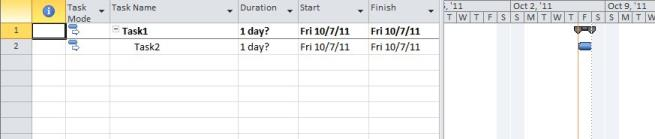

# Task

Task class exposes ways to create a task for a Project. Task is useful in creating tasks and adding them to the Project. Using Task class, one can create, add and modify tasks. It can also be used to obtain task information.

## Properties, Methods, and Events Tables for Task

### Constructors

_Table_ _7_: _Task Constructors_

<table>
<tr>
<th>
Name</th><th>
Description</th></tr>
<tr>
<td>
Task.Task()</td><td>
Initializes a new instance of the Task class.</td></tr>
<tr>
<td>
Task.Task(string taskName)</td><td>
Initializes a new instance of the Task class with the task name. </td></tr>
</table>

### Properties

_Table_ _8_: _Task Properties_

<table>
<tr>
<th>
Property</th><th>
Description</th></tr>
<tr>
<td>
UID</td><td>
Gets or sets the unique ID of the task.</td></tr>
<tr>
<td>
ID</td><td>
Gets or sets the position identifier of the task within the list of tasks.</td></tr>
<tr>
<td>
Name</td><td>
Gets or sets the name of the task.</td></tr>
<tr>
<td>
Type</td><td>
Gets or sets the type of task.</td></tr>
<tr>
<td>
IsNull</td><td>
True if the task is null</td></tr>
<tr>
<td>
CreateDate</td><td>
Gets or sets the date the task was created.</td></tr>
<tr>
<td>
Contact</td><td>
Gets or sets the contact person for the task.</td></tr>
<tr>
<td>
WBS</td><td>
Gets or sets the work breakdown structure code of the task.</td></tr>
<tr>
<td>
WBSLevel</td><td>
Gets or sets the rightmost WBS level of the task.</td></tr>
<tr>
<td>
OutlineNumber</td><td>
Gets or sets the outline number of the task.</td></tr>
<tr>
<td>
OutlineLevel</td><td>
Gets or sets the outline level of the task.</td></tr>
<tr>
<td>
Priority</td><td>
Gets or sets the priority of the task from 0 to 1000.</td></tr>
<tr>
<td>
Start</td><td>
Gets or sets the scheduled start date of the task</td></tr>
<tr>
<td>
Finish</td><td>
Gets or sets the scheduled finish date of the task.</td></tr>
<tr>
<td>
Duration</td><td>
Gets or sets the planned duration of the task.</td></tr>
<tr>
<td>
DurationFormat</td><td>
Gets or sets the format for expressing the Duration of the Task.</td></tr>
<tr>
<td>
Work</td><td>
Gets or sets the amount of scheduled work for the task.</td></tr>
<tr>
<td>
Stop</td><td>
Gets or sets the date that the task was stopped.</td></tr>
<tr>
<td>
Resume</td><td>
Gets or sets the date that the task resumed.</td></tr>
<tr>
<td>
ResumeValid</td><td>
True if the task can be resumed.</td></tr>
<tr>
<td>
EffortDriven</td><td>
True if the task is effort-driven.</td></tr>
<tr>
<td>
Recurring</td><td>
True if the task is a recurring task.</td></tr>
<tr>
<td>
OverAllocated</td><td>
True if the task is overallocated. </td></tr>
<tr>
<td>
Estimated</td><td>
True if the task is estimated.</td></tr>
<tr>
<td>
Milestone</td><td>
True if the task is a milestone.</td></tr>
<tr>
<td>
Summary</td><td>
True if the task is a summary task.</td></tr>
<tr>
<td>
DisplayAsSummary</td><td>
True if the task should be displayed as a summary task.</td></tr>
<tr>
<td>
Critical</td><td>
True if the task is in the critical chain.</td></tr>
<tr>
<td>
IsSubProject</td><td>
True if the task is an inserted project.</td></tr>
<tr>
<td>
IsSubProjectReadOnly</td><td>
True if the inserted project is read-only.</td></tr>
<tr>
<td>
SubProjectName</td><td>
Gets or sets the source location of the inserted project.</td></tr>
<tr>
<td>
ExternalTask</td><td>
True if the task is external.</td></tr>
<tr>
<td>
ExternalTaskProject</td><td>
Gets or sets the source location and task identifier of the external task.</td></tr>
<tr>
<td>
EarlyStart</td><td>
Gets or sets the early start date of the task.</td></tr>
<tr>
<td>
EarlyFinish</td><td>
Gets or sets the early finish date of the task.</td></tr>
<tr>
<td>
LateStart</td><td>
Gets or sets the late start date of the task.</td></tr>
<tr>
<td>
LateFinish</td><td>
Gets or sets the late finish date of the task.</td></tr>
<tr>
<td>
StartVariance</td><td>
Gets or sets the variance of the task start date from the baseline start date as minutes x 1000.</td></tr>
<tr>
<td>
FinishVariance</td><td>
Gets or sets the variance of the task finish date from the baseline finish date as minutes x 1000.</td></tr>
<tr>
<td>
WorkVariance</td><td>
Gets or sets the variance of task work from the baseline task work as minutes x 1000.</td></tr>
<tr>
<td>
FreeSlack</td><td>
Gets or sets the amount of free slack.</td></tr>
<tr>
<td>
StartSlack</td><td>
Gets or sets the amount of free slack at the start of the task.</td></tr>
<tr>
<td>
FinishSlack </td><td>
Gets or sets the amount of free slack at the end of the task.</td></tr>
<tr>
<td>
TotalSlack </td><td>
Gets or sets the amount of total slack.</td></tr>
<tr>
<td>
FixedCost</td><td>
Gets or sets the fixed cost of the task.</td></tr>
<tr>
<td>
FixedCostAccrual</td><td>
Gets or sets how the fixed cost is accrued against the task. Values are: 1=Start, 2=Prorated and 3=End.</td></tr>
<tr>
<td>
PercentComplete </td><td>
Gets or sets the percentage of the task duration completed.</td></tr>
<tr>
<td>
PercentWorkComplete </td><td>
Gets or sets the percentage of the task work completed.</td></tr>
<tr>
<td>
Cost</td><td>
Gets or sets the projected or scheduled cost of the task.</td></tr>
<tr>
<td>
OvertimeCost</td><td>
Gets or sets the sum of the actual and remaining overtime cost of the task.</td></tr>
<tr>
<td>
OvertimeWork</td><td>
Gets or sets the amount of overtime work scheduled for the task.</td></tr>
<tr>
<td>
ActualStart</td><td>
Gets or sets the actual start date of the task.</td></tr>
<tr>
<td>
ActualFinish</td><td>
Gets or sets the actual finish date of the task.</td></tr>
<tr>
<td>
ActualDuration</td><td>
Gets or sets the actual duration of the task.</td></tr>
<tr>
<td>
ActualCost</td><td>
Gets or sets the actual cost of the task.</td></tr>
<tr>
<td>
ActualOvertimeCost</td><td>
Gets or sets the actual overtime cost of the task.</td></tr>
<tr>
<td>
ActualWork</td><td>
Gets or sets the actual work for the task.</td></tr>
<tr>
<td>
ActualOvertimeWork</td><td>
Gets or sets the actual overtime work for the task.</td></tr>
<tr>
<td>
RegularWork</td><td>
Gets or sets the amount of non-overtime work scheduled for the task.</td></tr>
<tr>
<td>
RemainingDuration</td><td>
Gets or sets the amount of time required to complete the unfinished portion of the task.</td></tr>
<tr>
<td>
RemainingCost</td><td>
Gets or sets the remaining projected cost of completing the task.</td></tr>
<tr>
<td>
RemainingWork</td><td>
Gets or sets the remaining work scheduled to complete the task.</td></tr>
<tr>
<td>
RemainingOvertimeCost</td><td>
Gets or sets the remaining overtime cost projected to finish the task.</td></tr>
<tr>
<td>
RemaningOvertimeWork</td><td>
Gets or sets the remaining overtime work scheduled to finish the task.</td></tr>
<tr>
<td>
ACWP</td><td>
Gets or sets the actual cost of work performed on the task to-date.</td></tr>
<tr>
<td>
CV</td><td>
Gets or sets the earned value cost variance.</td></tr>
<tr>
<td>
ConstraintType</td><td>
Gets or sets the constraint on the start or finish date of the task.</td></tr>
<tr>
<td>
CalendarUID </td><td>
Gets or sets the task calendar. Refers to a valid UID in the Calendars collection.</td></tr>
<tr>
<td>
ConstraintDate</td><td>
Gets or sets the date argument for the task constraint type.</td></tr>
<tr>
<td>
Deadline</td><td>
Gets or sets the deadline for the task to be completed.</td></tr>
<tr>
<td>
LevelAssignments</td><td>
True if leveling can adjust assignments.</td></tr>
<tr>
<td>
LevelingCanSplit</td><td>
True if leveling can split the task.</td></tr>
<tr>
<td>
LevelingDelay</td><td>
Gets or sets the delay caused by leveling the task.</td></tr>
<tr>
<td>
LevelingDelayFormat</td><td>
Gets or sets the format for expressing the duration of the delay.</td></tr>
<tr>
<td>
PreLevelStart</td><td>
Gets or sets the start date of the task before it was leveled.</td></tr>
<tr>
<td>
PreLevelFinish</td><td>
Gets or sets the finish date of the task before it was leveled.</td></tr>
<tr>
<td>
Hyperlink</td><td>
Gets or sets the title of the hyperlink associated with the task.</td></tr>
<tr>
<td>
HyperlinkAddress</td><td>
Gets or sets the hyperlink associated with the task.</td></tr>
<tr>
<td>
HyperlinkSubAddress</td><td>
Gets or sets the document bookmark of the hyperlink associated with the task.</td></tr>
<tr>
<td>
IgnoreResourceCalendar</td><td>
True if the task ignores the resource calendar.</td></tr>
<tr>
<td>
Notes</td><td>
Gets or sets the text notes associated with the task.</td></tr>
<tr>
<td>
HideBar</td><td>
True if the GANTT bar of the task is hidden when displayed in Microsoft Project.</td></tr>
<tr>
<td>
Rollup</td><td>
True if the task is rolled up.</td></tr>
<tr>
<td>
BCWS</td><td>
Gets or sets the budgeted cost of work scheduled for the task.</td></tr>
<tr>
<td>
BCWP</td><td>
Gets or sets the budgeted cost of work performed on the task to-date.</td></tr>
<tr>
<td>
PhysicalPercentComplete </td><td>
Gets or sets the percentage complete value entered by the Project Manager.</td></tr>
<tr>
<td>
EarnedValueMethod</td><td>
Gets or sets the method for calculating earned value.</td></tr>
<tr>
<td>
PredecessorLink</td><td>
Gets or sets the predecessor task of the task that contains it.</td></tr>
<tr>
<td>
ActualWorkProtected</td><td>
Gets or sets the duration through which actual work is protected.</td></tr>
<tr>
<td>
ActualOvertimeWorkProtected</td><td>
Gets or sets the duration through which actual overtime work is protected.</td></tr>
<tr>
<td>
ExtendedAttribute</td><td>
Gets or sets the value of an extended attribute.</td></tr>
<tr>
<td>
Baseline</td><td>
Gets or sets the collection of baseline values of the task.</td></tr>
<tr>
<td>
OutlineCode</td><td>
Gets or sets the value of an outline code.</td></tr>
<tr>
<td>
IsPublished</td><td>
True if the task is published.</td></tr>
<tr>
<td>
StatusManager</td><td>
Gets or sets the name of the task status manager.</td></tr>
<tr>
<td>
CommitmentStart</td><td>
Gets or sets the start date of the deliverable.</td></tr>
<tr>
<td>
CommitmentFinish</td><td>
Gets or sets the finish date of the deliverable.</td></tr>
<tr>
<td>
CommitmentType</td><td>
Gets or sets the commitment type of the deliverable.</td></tr>
<tr>
<td>
Active</td><td>
True if the task is active.</td></tr>
<tr>
<td>
Pinned</td><td>
True if the task is in manually scheduled mode.</td></tr>
<tr>
<td>
PinnedStart</td><td>
Gets or sets text displayed in start field when the task is in Manually Scheduled mode.</td></tr>
<tr>
<td>
PinnedFinish</td><td>
Gets or sets text displayed in finish field when the task is in Manually Scheduled mode.</td></tr>
<tr>
<td>
PinnedDuration</td><td>
Gets or sets text displayed in duration field when the task is in Manually Scheduled mode.</td></tr>
<tr>
<td>
TimePhasedData </td><td>
Gets or sets the time phased data block associated with the task.</td></tr>
</table>

### Methods

_Table_ _9_: _Task Methods_

<table>
<tr>
<th>
Method</th><th>
Description</th></tr>
<tr>
<td>
GetHashCode</td><td>
Serves as a hash function for Task type.</td></tr>
<tr>
<td>
GetType</td><td>
Gets the type of the current instance.</td></tr>
<tr>
<td>
ToString</td><td>
Returns a string that represents the current object.</td></tr>
</table>

### Adding Tasks to a Project

Tasks can be created in one or more ways as given below.

* By a default constructor

Creating a task instance without using any parameter as shown in the following code snippet:



Task task1 = new Task();

task1.Name = "Main Task";

task1.Start = DateTime.Now;

task1.Finish = DateTime.Now;





Dim task1 As Task = New Task()

task1.Name = "Main Task"

task1.Start = DateTime.Now

task1.Finish = DateTime.Now



* By name

Creating a task instance by passing the task name as shown in the following code snippet:



Task task1 = new Task("Main Task");

task1.Start = DateTime.Now;

task1.Finish = DateTime.Now;





Dim task1 As Task = New Task("Main Task")

task1.Start = DateTime.Now

task1.Finish = DateTime.Now



## Creating a summary task

To make a task as the summary task, you need to make use of the IsSummary property of the Task class.

The following example illustrates making a task as Summary task.



Task task1 = new Task("Main Task");

task1.Start = DateTime.Now;

task1.Finish = DateTime.Now;

task1.IsSummary = true;





Dim task1 As Task = New Task("Main Task")

task1.Start = DateTime.Now

task1.Finish = DateTime.Now

task1.IsSummary = True



The summary task created using the above code will look like as shown below when viewed in Microsoft Project.

## Creating Task links

A task link is created using the default constructor of the TaskLink class. It accepts three parameters. The first parameter defines the predecessor Task, second parameter defines the successor Task and third parameter defines the task link type from values specified by TaskLinkType enumeration type.

The following example illustrates how to create links between two tasks.



// Creating two tasks that are to be linked

Task task1 = new Task("Task1");

Task task2 = new Task("Task2");

// Link task1 and task2

TaskLink link = new TaskLink(task1, task2, TaskLinkType.FinishToStart);





' Creating tasks that are to be linked

Dim task1 As Task = New Task("Task1")

Dim task2 As Task = New Task("Task2")

' Creating a link between task1 and task2

Dim link As TaskLink = New TaskLink(task1, task2, TaskLinkType.FinishToStart)



## Writing Tasks to Projects

RootTask property of the Project class contains the Children property that returns the list of Task objects. The Children property is used to update the tasks.

The following code snippet demonstrates writing tasks to a project.



// Creating an instance of the Project

Project P = new Project();

// Creating two tasks to be added to the project

Task task1 = new Task("Task1");

task1.Duration = new TimeSpan(8, 0, 0);

Task task2 = new Task("Task2");

task2.Duration = new TimeSpan(8, 0, 0);

// Adding the tasks to the RootTask of project

P.RootTask.Children.Add(task1);

P.RootTask.Children.Add(task2);

// Calculating Task IDs and UIDs

P.CalculateTaskIDs();

// Link "Task1" and "Task2"

TaskLink link = new TaskLink(task1, task2, TaskLinkType.FinishToStart);

// Saving the project

P.Save("ProjectWithTasks.xml");





' Creating an instance of the Project

Dim P As Project = New Project()

' Creating tasks that are to be linked

Dim task1 As Task = New Task("Task1")

task1.Duration = new TimeSpan(8, 0, 0)

Dim task2 As Task = New Task("Task2")

task2.Duration = new TimeSpan(8, 0, 0)

' Adding the tasks to the RootTask of the Project

P.RootTask.Children.Add(task1)

P.RootTask.Children.Add(task2)

' Calculating Task IDs and UIDs

P.CalculateTaskIDs()

' Creating a link between task1 and task2

Dim link As TaskLink = New TaskLink(task1, task2, TaskLinkType.FinishToStart)

' Saving the project

P.Save("ProjectWithTasks.xml")



The project file created using above code will look as shown in the following screenshot.

