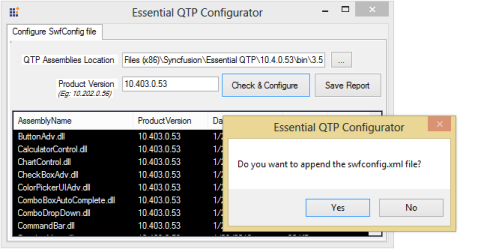
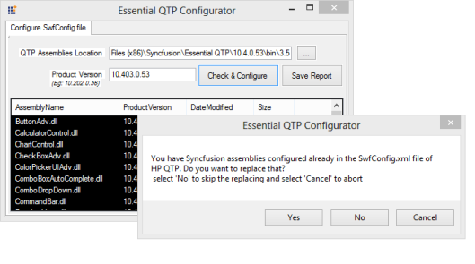
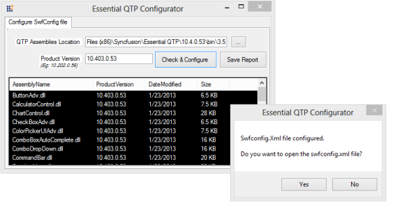

# Utilities

## Configuring the SwfConfig file

An XML file in QTP called SwfConfig is the configuration file located at (Installed location of Essential QuickTest Professional)\Config\<version-2.0, 3.5, or 4.0>\swfconfig, which contains all the mapping information for QTP to recognize Syncfusion controls. Using the SwfConfig utility, users can easily configure the SwfConfig.xml file in HP QTP.

### Steps to Configure the SwfConfig.xml File

1. Open the Syncfusion Essential QTP Configurator located at (Installed location of Essential QuickTest Professional)\Utilities\SwfConfigUtility\SwfConfigUtility.exe. Enter the QTP assemblies’ location in the QTP Assemblies Location textbox and the Essential Studio version with framework in the Product Version textbox. After entering the details, click Check & Configure. It will create the swfconfig.xml file for that particular version. Refer to the following image.
   
   
   
   _Figure_ _29_: Creating the SwfConfig.xml File for Essential Studio 10.3

2. Then Essential QTP Configurator shows the dialog box for appending the swfconfig.xml file. Click Yes to append the swfconfig.xml file in the QTP machine.
   
    
   
   _Figure_ _30_: Appending the SwfConfig File

3. If your system already has a swfconfig.xml file, then another dialog box will appear asking to replace the existing swfconfig.xml. Click Yes to replace the old swfconfig.xml file with the current framework swfconfig.xml file on your machine. If you want to keep both files in the same folder, click No.
   
   
   
   _Figure_ _31_: Replacing the SwfConfig.xml File

4. After generating the swfconfig.xml file, the system will ask whether you want to open it. Click Yes to save and open the new swfconfig.xml file.
   
   
   
   
   _Figure_ _33_: Opening the new SwfConfig.xml File

5. Restart QTP once the SwfConfig.xml file is saved to refresh the mappings to the required controls before starting the test.

