# Digital Gauge in Windows Forms Radial Gauge (Gauge)

[DigitalGauge](https://help.syncfusion.com/cr/windowsforms/Syncfusion.Windows.Forms.Gauge.DigitalGauge.html) control is used to display alphanumeric characters in digital (LED Display) mode. It is used to display a range of values that uses character in combination with numbers.

## Key features

* **Segment spacing** - Provides option to set user defined spacing between segments through a float value.

* **Character type** - Provides option to display characters in different segment styles.

* **Character count** - Provides option to customize the number of characters to be displayed.

* **Customization option** - Supports color and visibility customization of all elements.

* **Visual style** - Supports rich set of visual styles to customize the look and feel.

**Getting started**

This section describes how to add [DigitalGauge](https://help.syncfusion.com/cr/windowsforms/Syncfusion.Windows.Forms.Gauge.DigitalGauge.html) control in a Windows Forms application and overview of its basic functionalities.

## Assembly deployment

Refer [control dependencies](https://help.syncfusion.com/windowsforms/control-dependencies#digital-gauge) section to get the list of assemblies or NuGet package needs to be added as reference to use the control in any application.
 
Please find more details regarding how to install the nuget packages in windows form application in the below link:
 
[How to install nuget packages](https://help.syncfusion.com/windowsforms/visual-studio-integration/nuget-packages)

**Creating simple application with DigitalGauge**

You can create the Windows Forms application with [DigitalGauge](https://help.syncfusion.com/cr/windowsforms/Syncfusion.Windows.Forms.Gauge.DigitalGauge.html) control as follows:

1. [Creating project](#creating-the-project)
2. [Add control via designer](#adding-control-via-designer)
3. [Add control manually using code](#adding-control-manually-using-code)

**Creating the project**

Create a new Windows Forms project in the Visual Studio to display the DigitalGauge with basic functionalities.

## Add control via designer

The [DigitalGauge](https://help.syncfusion.com/cr/windowsforms/Syncfusion.Windows.Forms.Gauge.DigitalGauge.html) control can be added to the application by dragging it from the toolbox and dropping it in a designer view. The following required assembly references will be added automatically:

* Syncfusion.Gauge.Windows.dll
* Syncfusion.Shared.Base.dll

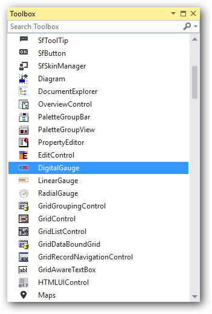

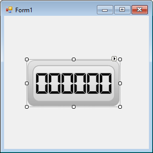

## Add control manually using code

To add control manually in C#, follow the given steps:

**Step 1** : Add the following required assembly references to the project:

* Syncfusion.Gauge.Windows.dll
* Syncfusion.Shared.Base.dll

**Step 2** : Include the namespaces **Syncfusion.Windows.Forms.Gauge**.





using Syncfusion.Windows.Forms.Gauge;





Imports Syncfusion.Windows.Forms.Gauge



 

**Step 3** : Create [DigitalGauge](https://help.syncfusion.com/cr/windowsforms/Syncfusion.Windows.Forms.Gauge.DigitalGauge.html) control instance and add it to the form.





DigitalGauge digitalGauge1 = new DigitalGauge();

this.Controls.Add(digitalGauge1);





Dim digitalGauge1 As DigitalGauge = New DigitalGauge

Me.Controls.Add(digitalGauge1)





##  Concepts and features

This section illustrates the features of the digital gauge with different visual styles and sample code. It contains the following topics:

* Visual styles
* Character Type
* Character Count
* Segment Spacing
* Show Invisible Segments
* Round Corner Radius

### Visual styles

The Gauge control for Windows Forms includes four stunning skins for professional representation of gauges. You can easily modify the look and feel of the gauge component using the [VisualStyle](https://help.syncfusion.com/cr/windowsforms/Syncfusion.Windows.Forms.Gauge.DigitalGauge.html#Syncfusion_Windows_Forms_Gauge_DigitalGauge_VisualStyle) property.

The styles are built-in for all gauges.

* Black
* Silver
* Blue
* Metro
* Office2016White
* Office2016Colorful
* Office2016DarkGray
* Office2016Black
* Custom

**Black**

This option helps to set the Black theme.





this.digitalGauge1.VisualStyle = Syncfusion.Windows.Forms.Gauge.ThemeStyle.Black;





Me.digitalGauge1.VisualStyle = Syncfusion.Windows.Forms.Gauge.ThemeStyle.Black





**Blue**

This option helps to set the Blue theme.





this.digitalGauge1.VisualStyle = Syncfusion.Windows.Forms.Gauge.ThemeStyle.Blue;





Me.digitalGauge1.VisualStyle = Syncfusion.Windows.Forms.Gauge.ThemeStyle.Blue





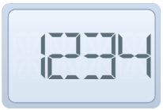

**Silver**

This option helps to set the Silver theme.





this.digitalGauge1.VisualStyle = Syncfusion.Windows.Forms.Gauge.ThemeStyle.Silver;





Me.digitalGauge1.VisualStyle = Syncfusion.Windows.Forms.Gauge.ThemeStyle.Silver





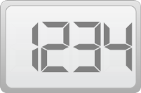

**Metro**

This option helps to set the Metro theme.





this.digitalGauge1.VisualStyle = Syncfusion.Windows.Forms.Gauge.ThemeStyle.Metro;





Me.digitalGauge1.VisualStyle = Syncfusion.Windows.Forms.Gauge.ThemeStyle.Metro





**Office2016White**

This option helps to set the Office2016White theme.





//Office2016White

this.digitalGauge1.VisualStyle = Syncfusion.Windows.Forms.Gauge.ThemeStyle.Office2016White;





'Office2016White

Me.digitalGauge1.VisualStyle = Syncfusion.Windows.Forms.Gauge.ThemeStyle.Office2016White





 

**Office2016Colorful**

This option helps to set the Office2016Colorful theme.





// Office2016Colorful

this.digitalGauge1.VisualStyle = Syncfusion.Windows.Forms.Gauge.ThemeStyle.Office2016Colorful;





'Office2016Colorful

Me.digitalGauge1.VisualStyle = Syncfusion.Windows.Forms.Gauge.ThemeStyle.Office2016Colorful





 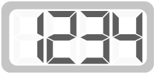

**Office2016DarkGray**

This option helps to set the Office2016DarkGray theme.





//Office2016DarkGray

this.digitalGauge1.VisualStyle = Syncfusion.Windows.Forms.Gauge.ThemeStyle.Office2016DarkGray;





'Office2016DarkGray

Me.digitalGauge1.VisualStyle = Syncfusion.Windows.Forms.Gauge.ThemeStyle.Office2016DarkGray





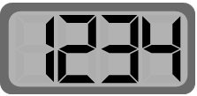

**Office2016Black**

This option helps to set the office2016Black theme.





//Office2016Black

this.digitalGauge1.VisualStyle = Syncfusion.Windows.Forms.Gauge.ThemeStyle.Office2016Black;





'Office2016Black

Me.digitalGauge1.VisualStyle = Syncfusion.Windows.Forms.Gauge.ThemeStyle.Office2016Black





**Custom**

 Gauge also provides an option to end user to create their own custom theme based on the requirement by setting the [VisualStyle](https://help.syncfusion.com/cr/windowsforms/Syncfusion.Windows.Forms.Gauge.DigitalGauge.html#Syncfusion_Windows_Forms_Gauge_DigitalGauge_VisualStyle) property as Custom.

 **Steps to customize the theme in design time**

 **Step 1:**  Need to add DigitalGauge control to Form Designer.

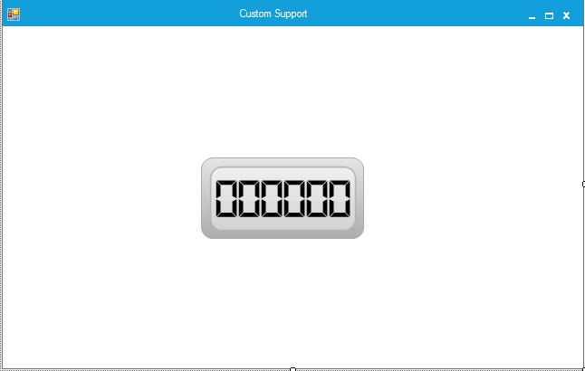

 **Step 2:** Set the VisualStyle as Custom.

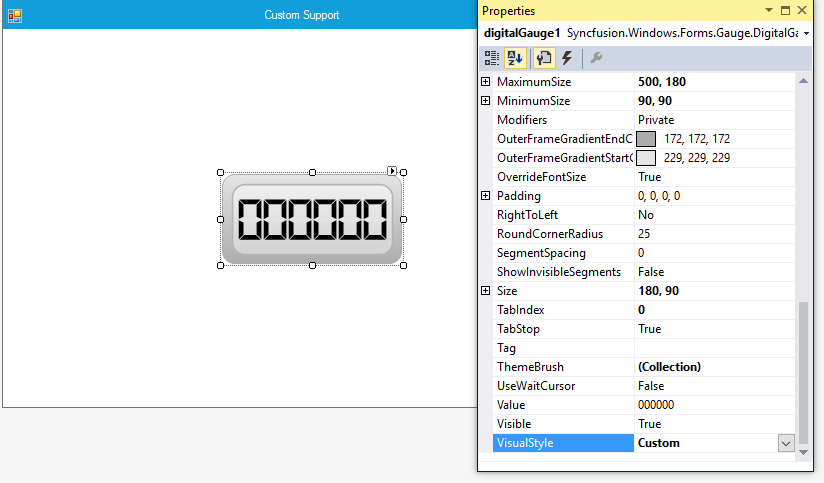

 **Step 3:** Need to add necessary Theme combination in ThemeBrush collection and it will update the Color customization details in DigitalGauge control.

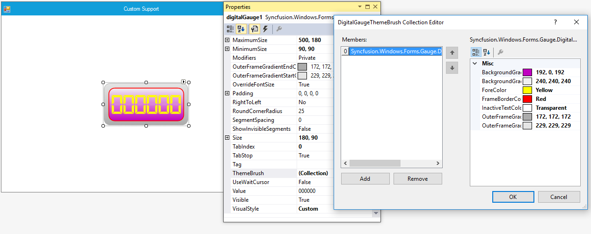





Syncfusion.Windows.Forms.Gauge.DigitalGaugeThemeBrush digitalGaugeThemeBrush1 = new Syncfusion.Windows.Forms.Gauge.DigitalGaugeThemeBrush();
this.digitalGauge1 = new Syncfusion.Windows.Forms.Gauge.DigitalGauge();
this.digitalGauge1.BackgroundGradientEndColor = System.Drawing.Color.FromArgb(((int)(((byte)(192)))), ((int)(((byte)(0)))), ((int)(((byte)(192)))));
this.digitalGauge1.DisplayRecordIndex = 0;
this.digitalGauge1.ForeColor = System.Drawing.Color.Yellow;
this.digitalGauge1.FrameBorderColor = System.Drawing.Color.Red;
this.digitalGauge1.Location = new System.Drawing.Point(201, 106);
this.digitalGauge1.MaximumSize = new System.Drawing.Size(500, 180);
this.digitalGauge1.MinimumSize = new System.Drawing.Size(90, 90);
this.digitalGauge1.Name = "digitalGauge1";
this.digitalGauge1.Size = new System.Drawing.Size(180, 90);
this.digitalGauge1.TabIndex = 0;
digitalGaugeThemeBrush1.BackgroundGradientEndColor = System.Drawing.Color.FromArgb(((int)(((byte)(192)))), ((int)(((byte)(0)))), ((int)(((byte)(192)))));
digitalGaugeThemeBrush1.BackgroundGradientStartColor = System.Drawing.Color.FromArgb(((int)(((byte)(240)))), ((int)(((byte)(240)))), ((int)(((byte)(240)))));
digitalGaugeThemeBrush1.ForeColor = System.Drawing.Color.Yellow;
digitalGaugeThemeBrush1.FrameBorderColor = System.Drawing.Color.Red;
digitalGaugeThemeBrush1.InactiveTextColor = System.Drawing.Color.Transparent;digitalGaugeThemeBrush1.OuterFrameGradientEndColor = System.Drawing.Color.FromArgb(((int)(((byte)(172)))), ((int)(((byte)(172)))), ((int)(((byte)(172)))));
digitalGaugeThemeBrush1.OuterFrameGradientStartColor = System.Drawing.Color.FromArgb(((int)(((byte)(229)))), ((int)(((byte)(229)))), ((int)(((byte)(229)))));
this.digitalGauge1.ThemeBrush.Add(digitalGaugeThemeBrush1);
this.digitalGauge1.VisualStyle = Syncfusion.Windows.Forms.Gauge.ThemeStyle.Custom;





Dim digitalGaugeThemeBrush1 As Syncfusion.Windows.Forms.Gauge.DigitalGaugeThemeBrush =  New Syncfusion.Windows.Forms.Gauge.DigitalGaugeThemeBrush() 
Me.digitalGauge1 = New Syncfusion.Windows.Forms.Gauge.DigitalGauge()
Me.digitalGauge1.BackgroundGradientEndColor = System.Drawing.Color.FromArgb((CType(((CType((192), Byte))), Integer)), (CType(((CType((0), Byte))), Integer)), (CType(((CType((192), Byte))), Integer)))
Me.digitalGauge1.DisplayRecordIndex = 0
Me.digitalGauge1.ForeColor = System.Drawing.Color.Yellow
Me.digitalGauge1.FrameBorderColor = System.Drawing.Color.Red
Me.digitalGauge1.Location = New System.Drawing.Point(201, 106)
Me.digitalGauge1.MaximumSize = New System.Drawing.Size(500, 180)
Me.digitalGauge1.MinimumSize = New System.Drawing.Size(90, 90)
Me.digitalGauge1.Name = "digitalGauge1"
Me.digitalGauge1.Size = New System.Drawing.Size(180, 90)
Me.digitalGauge1.TabIndex = 0
digitalGaugeThemeBrush1.BackgroundGradientEndColor = System.Drawing.Color.FromArgb((CType(((CType((192), Byte))), Integer)), (CType(((CType((0), Byte))), Integer)), (CType(((CType((192), Byte))), Integer)))
digitalGaugeThemeBrush1.BackgroundGradientStartColor = System.Drawing.Color.FromArgb((CType(((CType((240), Byte))), Integer)), (CType(((CType((240), Byte))), Integer)), (CType(((CType((240), Byte))), Integer)))
digitalGaugeThemeBrush1.ForeColor = System.Drawing.Color.Yellow
digitalGaugeThemeBrush1.FrameBorderColor = System.Drawing.Color.Red
digitalGaugeThemeBrush1.InactiveTextColor = System.Drawing.Color.TransparentdigitalGaugeThemeBrush1.OuterFrameGradientEndColor = System.Drawing.Color.FromArgb((CType(((CType((172), Byte))), Integer)), (CType(((CType((172), Byte))), Integer)), (CType(((CType((172), Byte))), Integer)))
digitalGaugeThemeBrush1.OuterFrameGradientStartColor = System.Drawing.Color.FromArgb((CType(((CType((229), Byte))), Integer)), (CType(((CType((229), Byte))), Integer)), (CType(((CType((229), Byte))), Integer)))
Me.digitalGauge1.ThemeBrush.Add(digitalGaugeThemeBrush1)
Me.digitalGauge1.VisualStyle = Syncfusion.Windows.Forms.Gauge.ThemeStyle.Custom





**Output:**

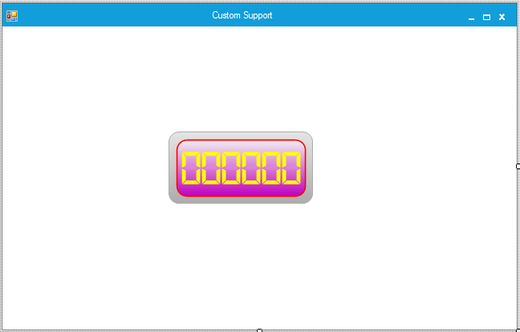

### Character type

Character types are used to customize the digital segments.

#### Customizing scales

You can customize the segments in the digital gauge using the [CharacterType](https://help.syncfusion.com/cr/windowsforms/Syncfusion.Windows.Forms.Gauge.DigitalGauge.html#Syncfusion_Windows_Forms_Gauge_DigitalGauge_CharacterType) property.

Different segments can be applied using the [CharacterType](https://help.syncfusion.com/cr/windowsforms/Syncfusion.Windows.Forms.Gauge.DigitalGauge.html#Syncfusion_Windows_Forms_Gauge_DigitalGauge_CharacterType) property. The digital gauge control contains four segment types:

* Dot matrix
* Seven segments
* Fourteen segments
* Sixteen segments

#### Dot matrix

In a digital gauge, the value can be displayed in dot matrix format by setting the character type as DotMatrixSegment.





this.digitalGauge1.CharacterType = Syncfusion.Windows.Forms.Gauge.CharacterType.DotMatrixSegment;





Me.digitalGauge1.CharacterType = Syncfusion.Windows.Forms.Gauge.CharacterType.DotMatrixSegment





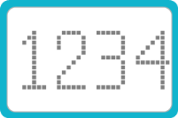

#### Seven segments

In a digital gauge, the value can be displayed in a seven-segment format by setting the character type as SevenSegment.





this.digitalGauge1.CharacterType = Syncfusion.Windows.Forms.Gauge.CharacterType.SevenSegment;





Me.digitalGauge1.CharacterType = Syncfusion.Windows.Forms.Gauge.CharacterType.SevenSegment





#### Fourteen segments

In a digital gauge, the value can be displayed in a fourteen-segment format by setting the character type as FourteenSegment.





this.digitalGauge1.CharacterType = Syncfusion.Windows.Forms.Gauge.CharacterType.FourteenSegment;





Me.digitalGauge1.CharacterType = Syncfusion.Windows.Forms.Gauge.CharacterType.FourteenSegment





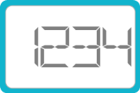

#### Sixteen segments

In a digital gauge, the value can be displayed in a sixteen-segment format by setting the character type as SixteenSegment.





this.digitalGauge1.CharacterType = Syncfusion.Windows.Forms.Gauge.CharacterType.SixteenSegment;





Me.digitalGauge1.CharacterType = Syncfusion.Windows.Forms.Gauge.CharacterType.SixteenSegment





### Character count

The [CharacterCount](https://help.syncfusion.com/cr/windowsforms/Syncfusion.Windows.Forms.Gauge.DigitalGauge.html#Syncfusion_Windows_Forms_Gauge_DigitalGauge_CharacterCount) property can be used to restrict the number of characters that can be displayed in a digital gauge.





this.digitalGauge1.CharacterCount = 4;

this.digitalGauge1.Value = “123456”;





Me.digitalGauge1.CharacterCount = 4
Me.digitalGauge1.Value = 123456





### Segment spacing

The [SegmentSpacing](https://help.syncfusion.com/cr/windowsforms/Syncfusion.Windows.Forms.Gauge.DigitalGauge.html#Syncfusion_Windows_Forms_Gauge_DigitalGauge_SegmentSpacing) property is used to determine the spacing between the characters displayed in the digital gauge.





  this.digitalGauge1.CharacterCount = 2;

  this.digitalGauge1.OverrideFontSize = false;

  this.digitalGauge1.Value = “123456”;





Me.digitalGauge1.CharacterCount = 2

Me.digitalGauge1.OverrideFontSize = false
Me.digitalGauge1.Value = 123456





### Show visible segments

The [ShowInvisibleSegments](https://help.syncfusion.com/cr/windowsforms/Syncfusion.Windows.Forms.Gauge.DigitalGauge.html#Syncfusion_Windows_Forms_Gauge_DigitalGauge_ShowInvisibleSegments) property can be enabled to make the segments that are not drawn visible. This property can be disabled by setting it to `false`.





this.digitalGauge1.ShowInvisibleSegments = true;





 Me.digitalGauge1.ShowInvisibleSegments = true





### RoundCornerRadius

The [RoundCornerRadius](https://help.syncfusion.com/cr/windowsforms/Syncfusion.Windows.Forms.Gauge.DigitalGauge.html#Syncfusion_Windows_Forms_Gauge_DigitalGauge_RoundCornerRadius) property of the digital gauge is used to draw digital gauge with rounded edges.





this.digitalGauge1.RoundCornerRadius = 50;





Me.digitalGauge1.RoundCornerRadius = 50





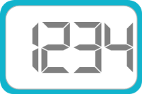

### Data binding

You can bind any data source to the digital gauge and map an index of a record to represent the actual value in the gauge. The [DisplayMember](https://help.syncfusion.com/cr/windowsforms/Syncfusion.Windows.Forms.Gauge.DigitalGauge.html#Syncfusion_Windows_Forms_Gauge_DigitalGauge_DisplayMember) and [DisplayRecordIndex](https://help.syncfusion.com/cr/windowsforms/Syncfusion.Windows.Forms.Gauge.DigitalGauge.html#Syncfusion_Windows_Forms_Gauge_DigitalGauge_DisplayRecordIndex) properties map the DataColumn and DataRow of the bound data source, respectively, to the Gauge control. Data-bound gauges support high frequency data updates.


this.digitalGauge1.DataSource = dataTable;
this.digitalGauge1.DisplayRecordIndex = [Row Index];
this.digitalGauge1.DisplayMember = [column name];


