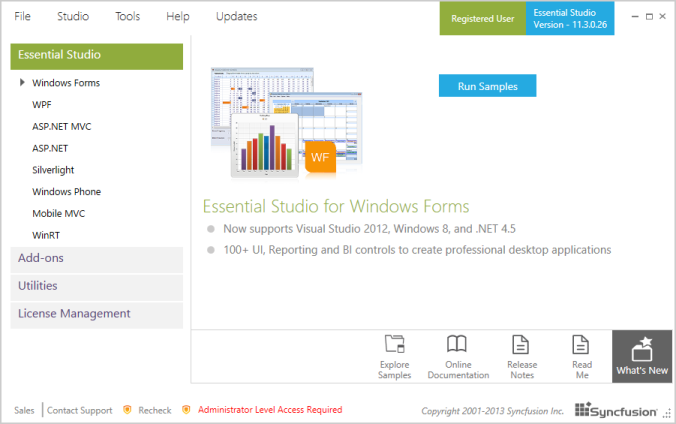
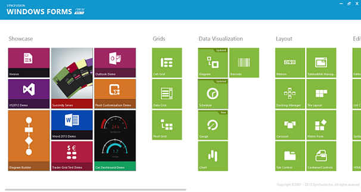
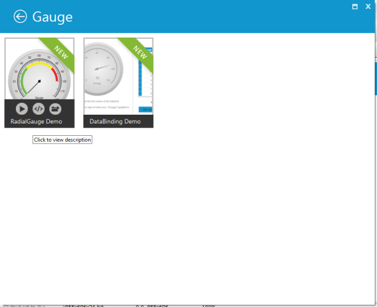

# Installation and deployment in Windows Forms Radial Gauge

This section covers information on installation, the process of viewing samples through the sample browser, and the locations of samples and source code.

## Installation

For step-by-step installation procedure for the installation of Essential Studio, refer to the Installation topic under Installation and Deployment in the Common UG.

* Licensing
* Patches
* Add/Remove Components

## Samples and location

This section covers the location of the installed samples and describes the procedure to run the samples through the Sample Browser and online. It also provides the location of the source code.

### Samples installation location

The Gauge samples are installed in the following location locally on the disk:

#### Windows XP

C:\Syncfusion\Essential Studio<version number>\Windows\Gauge.Windows\Samples

#### Windows 7/Vista

C:\Users\<user name>\AppData\Local\Syncfusion\EssentialStudio\<version number>\Windows\Gauge.Windows\Samples 

#### Viewing samples

Use the following steps to view the samples

1. Click Start > All Programs > Syncfusion > Essential Studio <version number> >Dashboard.

   The Essential Studio Enterprise Edition window will be displayed.

   

2. In the Dashboard window, click Run Samples for Windows Forms under UI Edition. The UI Windows Forms Sample Browser window will be displayed.

   N> You can view the samples in any of the following three ways:
   N>
   N> • Run Samples - Click to view the locally installed samples.
   N>
   N> • Online Samples - Click to view online samples.
   N>
   N> • Explore Samples - Explore the UI for Windows Forms on disk.
   N>
   N> The User Interface Edition panel is displayed by default.

   

3. Click the Gauge tile under Data Visualization. The Gauge samples will be displayed.

   

4. Select any sample and browse through the features.

### Source code location

 The default location of the Windows Forms Gauge control source code is:

C:\Program Files\Syncfusion\Essential Studio\[VersionNumber]\Windows\Gauge.Windows\Src

## Deployment requirements

### Assembly list

While deploying an application that references a Syncfusion Windows Forms Gauge control assembly, the following dependencies must be included in the distribution:

* Syncfusion.Gauge.Windows.dll
* Syncfusion.Shared.base.dll
