# Radial Gauge in Windows Forms Radial Gauge (Gauge)

[RadialGauge](https://help.syncfusion.com/cr/windowsforms/Syncfusion.Windows.Forms.Gauge.RadialGauge.html) enables you to see a single numerical value mapped against a range of colors that may have a particular business meaning or business logic. As the value changes over time, the gauge pointer changes position within this range.

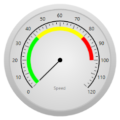

## Key features

* **Scales** - Provides support to customize orientation and appearance of the associated scales.

* **Frame types** - Provides options to specify the radial built-in frame style, such as full circle or half circle.

* **Needle** - Provides support for customize visibility, style and color of the needle.

* **Range** - Provides options to display different ranges in different colors

* **Labels** - Provides support to customize the appearance of gauge values with user-specified colors and alignment.

* **Visual style** - Supports rich set of visual style to modify look and feel of the RadialGauge

* **Customization options** - Supports color and visibility customization of all elements and its appearance can also be customized in any form.

* **Data binding** - Support provided to update value using DataBinding concept. 

**Getting started**

This section describes how to add [RadialGauge](https://help.syncfusion.com/cr/windowsforms/Syncfusion.Windows.Forms.Gauge.RadialGauge.html) control in a Windows Forms application and overview of its basic functionalities.

## Assembly deployment

Refer [control dependencies](https://help.syncfusion.com/windowsforms/control-dependencies#radialgauge) section to get the list of assemblies or NuGet package needs to be added as reference to use the control in any application. 
 
Please find more details regarding how to install the nuget packages in windows form application in the below link:
 
[How to install nuget packages](https://help.syncfusion.com/windowsforms/visual-studio-integration/nuget-packages)

**Creating simple application with RadialGauge**

You can create the Windows Forms application with RadialGauge control as follows:

1. [Creating project](#creating-the-project)
2. [Add control via designer](#adding-control-via-designer)
3. [Add control manually using code](#adding-control-manually-using-code)

**Creating the project**

Create a new Windows Forms project in the Visual Studio to display the RadialGauge with range information.

## Add control via designer

The RadialGauge control can be added to the application by dragging it from the toolbox and dropping it in a designer view. The following required assembly references will be added automatically:

* Syncfusion.Gauge.Windows.dll
* Syncfusion.Shared.Base.dll

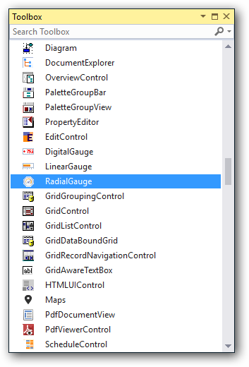

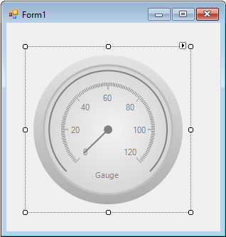 

## Add control manually using code

To add control manually in C#, follow the given steps:

**Step 1** - Add the following required assembly references to the project:

	* Syncfusion.Gauge.Windows.dll
	* Syncfusion.Shared.Base.dll

**Step 2** - Include the namespaces **Syncfusion.Windows.Forms.Gauge**.





using Syncfusion.Windows.Forms.Gauge;





Imports Syncfusion.Windows.Forms.Gauge



 

**Step 3** - Create [RadialGauge](https://help.syncfusion.com/cr/windowsforms/Syncfusion.Windows.Forms.Gauge.RadialGauge.html) control instance and add it to the form.





RadialGauge radialGauge1 = new RadialGauge();

this.radialGauge1.MinorDifference = 5;

this.Controls.Add(radialGauge1);





Dim radialGauge1 As RadialGauge = New RadialGauge

Me.radialGauge1.MinorDifference = 5;

Me.Controls.Add(radialGauge1)





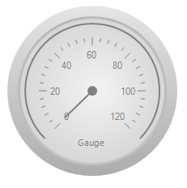

## Elaborate structure of the control

The RadialGauge control includes the following elements: Scale Label, Needle, Gauge Value, and Background Frame. All the elements are optional for displaying the Gauge control.

### Concepts and features

This section illustrates the features of RadialGauge with images and sample code. It contains the following topics:

* RadialGauge Frames
* Scales
* Ticks
* Needles
* Ranges
* Scaling Divisions

#### RadialGauge Frames

This section explains the appearance of the RadialGauge. RadialGauge has four types of frame and it can be applied using the [FrameType](https://help.syncfusion.com/cr/windowsforms/Syncfusion.Windows.Forms.Gauge.RadialGauge.html#Syncfusion_Windows_Forms_Gauge_RadialGauge_FrameType) property. 

* FullCircle
* HalfCircle
* QuarterCircle
* Fill

#### FullCircle

Frame of the RadialGauge will be a Full circle. RadialGauge will be rendered based on the value of Start and Sweep Angle. Default value of the Start and Sweep Angles will be 135 and 270 for FullCircle type of Frame. The following code sample illustrates how to set frame for the RadialGauge control,





this.radialGauge1.FrameType = Syncfusion.Windows.Forms.Gauge.FrameType.FullCircle;





Me.radialGauge1.FrameType = Syncfusion.Windows.Forms.Gauge.FrameType.FullCircle





The following screenshot illustrates the FullCircle Frame of RadialGauge,

#### HalfCircle

Frame of the RadialGauge will be a Half circle. Start and SweepAngle will be 180 always for HalfCircle type of Frame. The following code sample illustrates how to set frame for the RadialGauge control,





this.radialGauge1.FrameType = Syncfusion.Windows.Forms.Gauge.FrameType.HalfCircle;





Me.radialGauge1.FrameType = Syncfusion.Windows.Forms.Gauge.FrameType.HalfCircle





The following screenshot illustrates the HalfCircle Frame of RadialGauge,

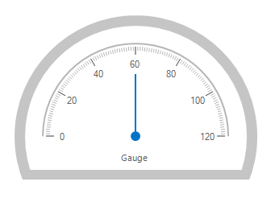

#### QuarterCircle

Frame of the RadialGauge will be a Quarter circle. In this type of frame, RadialGauge will be positioned using StartAngle and the SweepAngle is not changeable. By default, Start and SweepAngle will be 180 and 90 for QuarterCircle frame. 

In QuarterCircle frame, background around the RadialGauge will not be shown and `MajorTickMark`, `MinorTickMark`, `MinorInnerLines` height will be zero by default. `ArcThickness` of the RadialGauge will be 5 for this type of Frame. User can change the TickMarks height and ArcThickness to acquire the desired view of the RadialGauge.





this.radialGauge1.FrameType = Syncfusion.Windows.Forms.Gauge.FrameType.QuarterCircle;





Me.radialGauge1.FrameType = Syncfusion.Windows.Forms.Gauge.FrameType.QuarterCircle





The following screenshot illustrates the HalfCircle Frame of RadialGauge,

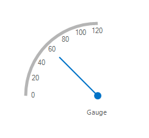

#### FillCircle

Frame of the RadialGauge will be a Full circle and the color which is specified in the `FillColor` will fill the frame as indication of the current value of the gauge. Start and SweepAngle of the RadialGauge is changeable and the Gauge will be rendered based on the value of Start and SweepAngle. Default value of the Start and SweepAngle will be 0 and 360.  Filling of color towards current value will be start from the angle specified in the `StartAngle`. Font settings of the Value label can be changed using `GaugeValueFont` of RadialGauge. 

Needle and tick marks are not supported for fill type frame. Hence, the following properties are not applicable and do not have any effect:

* ShowBackgroundFrame
* BackgroundGradientStartColor
* BackgroundGradientEndColor
* InnerFrameGradientStartColor
* InnerFrameGradientEndColor
* OuterFrameGradientStartColor
* OuterFrameGradientEndColor
* GaugeLableFont
* GaugeLableColor





this.radialGauge1.FrameType = FrameType.Fill;
this.radialGauge1.Value = 50;





Me.radialGauge1.FrameType = Syncfusion.Windows.Forms.Gauge.FrameType.Fill
Me.radialGauge1.Value = 50





The following screenshot illustrates the RadialGauge with Fill FrameType and the value start to fill from angle 0,

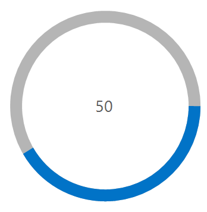





this.radialGauge1.FrameType = FrameType.Fill;
this.radialGauge1.StartAngle = 90;
this.radialGauge1.Value = 50;





Me.radialGauge1.FrameType = Syncfusion.Windows.Forms.Gauge.FrameType.Fill
Me.radialGauge1.StartAngle = 90
Me.radialGauge1.Value = 50




           
The following screenshot illustrates the RadialGauge with Fill FrameType and the value start to fill from angle 90,

The following properties used to customize the appearance of RadialGauge control.

* [ShowBackgroundFrame](https://help.syncfusion.com/cr/windowsforms/Syncfusion.Windows.Forms.Gauge.RadialGauge.html#Syncfusion_Windows_Forms_Gauge_RadialGauge_ShowBackgroundFrame)
* [BackgroundGradientStartColor](https://help.syncfusion.com/cr/windowsforms/Syncfusion.Windows.Forms.Gauge.RadialGauge.html#Syncfusion_Windows_Forms_Gauge_RadialGauge_BackgroundGradientStartColor)
* [BackgroundGradientEndColor](https://help.syncfusion.com/cr/windowsforms/Syncfusion.Windows.Forms.Gauge.RadialGauge.html#Syncfusion_Windows_Forms_Gauge_RadialGauge_BackgroundGradientEndColor)
* [InnerFrameGradientStartColor](https://help.syncfusion.com/cr/windowsforms/Syncfusion.Windows.Forms.Gauge.RadialGauge.html#Syncfusion_Windows_Forms_Gauge_RadialGauge_InnerFrameGradientStartColor)
* [InnerFrameGradientEndColor](https://help.syncfusion.com/cr/windowsforms/Syncfusion.Windows.Forms.Gauge.RadialGauge.html#Syncfusion_Windows_Forms_Gauge_RadialGauge_InnerFrameGradientEndColor)
* [OuterFrameGradientStartColor](https://help.syncfusion.com/cr/windowsforms/Syncfusion.Windows.Forms.Gauge.RadialGauge.html#Syncfusion_Windows_Forms_Gauge_RadialGauge_OuterFrameGradientStartColor)
* [OuterFrameGradientEndColor](https://help.syncfusion.com/cr/windowsforms/Syncfusion.Windows.Forms.Gauge.RadialGauge.html#Syncfusion_Windows_Forms_Gauge_RadialGauge_OuterFrameGradientEndColor)
* [GaugeArcColor](https://help.syncfusion.com/cr/windowsforms/Syncfusion.Windows.Forms.Gauge.RadialGauge.html#Syncfusion_Windows_Forms_Gauge_RadialGauge_GaugeArcColor)
* [GaugeLabelColor](https://help.syncfusion.com/cr/windowsforms/Syncfusion.Windows.Forms.Gauge.RadialGauge.html#Syncfusion_Windows_Forms_Gauge_RadialGauge_GaugeLableColor)
* [GaugeValueColor](https://help.syncfusion.com/cr/windowsforms/Syncfusion.Windows.Forms.Gauge.RadialGauge.html#Syncfusion_Windows_Forms_Gauge_RadialGauge_GaugeValueColor)
* [ShowGaugeValue](https://help.syncfusion.com/cr/windowsforms/Syncfusion.Windows.Forms.Gauge.RadialGauge.html#Syncfusion_Windows_Forms_Gauge_RadialGauge_ShowGaugeValue)

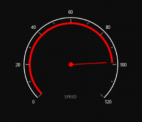



this.radialGauge1.ShowBackgroundFrame = false;


Me.radialGauge1.ShowBackgroundFrame = false;



### Scales

Scales are used to control element placement and value ranges.

#### Customizing scales

You can customize scales added to the RadialGauge using the properties listed in the following table:

* [ShowScaleLabel](https://help.syncfusion.com/cr/windowsforms/Syncfusion.Windows.Forms.Gauge.RadialGauge.html#Syncfusion_Windows_Forms_Gauge_RadialGauge_ShowScaleLabel)
* [ScaleLabelColor](https://help.syncfusion.com/cr/windowsforms/Syncfusion.Windows.Forms.Gauge.RadialGauge.html#Syncfusion_Windows_Forms_Gauge_RadialGauge_ScaleLabelColor)
* [LabelPlacement](https://help.syncfusion.com/cr/windowsforms/Syncfusion.Windows.Forms.Gauge.RadialGauge.html#Syncfusion_Windows_Forms_Gauge_RadialGauge_LabelPlacement)
* [TextOrientation](https://help.syncfusion.com/cr/windowsforms/Syncfusion.Windows.Forms.Gauge.RadialGauge.html#Syncfusion_Windows_Forms_Gauge_RadialGauge_TextOrientation)

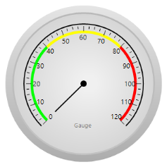

The following code sample illustrates how to place labels in the RadialGauge control.



this.radialGauge1.LabelPlacement = Syncfusion.Windows.Forms.Gauge.LabelPlacement.Outside;
this.radialGauge1.TextOrientation = Syncfusion.Windows.Forms.Gauge.TextOrientation.SlideOver;


Me.radialGauge1.LabelPlacement = Syncfusion.Windows.Forms.Gauge.LabelPlacement.Outside
Me.radialGauge1.TextOrientation = Syncfusion.Windows.Forms.Gauge.TextOrientation.SlideOver



### Ticks

Two types of ticks can be added to the RadialGauge control scale. Major tick marks are the primary scale indicators. Minor tick marks and Inter tick marks are the secondary scale indicators that fall between the major ticks. The ticks can be placed by setting the [TickPlacement](https://help.syncfusion.com/cr/windowsforms/Syncfusion.Windows.Forms.Gauge.RadialGauge.html#Syncfusion_Windows_Forms_Gauge_RadialGauge_TickPlacement) property. Ticks can be placed inside or outside the arc.

The following table lists the important properties that can be used to customize the radial tick marks. This is done to represent the scale with meaningful markers and labels.

* [TickPlacement](https://help.syncfusion.com/cr/windowsforms/Syncfusion.Windows.Forms.Gauge.RadialGauge.html#Syncfusion_Windows_Forms_Gauge_RadialGauge_TickPlacement)
* [MajorTickMarkColor](https://help.syncfusion.com/cr/windowsforms/Syncfusion.Windows.Forms.Gauge.RadialGauge.html#Syncfusion_Windows_Forms_Gauge_RadialGauge_MajorTickMarkColor)
* [MajorTickMarkHeight](https://help.syncfusion.com/cr/windowsforms/Syncfusion.Windows.Forms.Gauge.RadialGauge.html#Syncfusion_Windows_Forms_Gauge_RadialGauge_MajorTickMarkHeight)
* [MinorTickMarkColor](https://help.syncfusion.com/cr/windowsforms/Syncfusion.Windows.Forms.Gauge.RadialGauge.html#Syncfusion_Windows_Forms_Gauge_RadialGauge_MinorTickMarkColor)
* [MinorTickMarkHeight](https://help.syncfusion.com/cr/windowsforms/Syncfusion.Windows.Forms.Gauge.RadialGauge.html#Syncfusion_Windows_Forms_Gauge_RadialGauge_MinorTickMarkHeight)
* [InterLinesColor](https://help.syncfusion.com/cr/windowsforms/Syncfusion.Windows.Forms.Gauge.RadialGauge.html#Syncfusion_Windows_Forms_Gauge_RadialGauge_InterLinesColor)
* [MinorInnerLinesHeight](https://help.syncfusion.com/cr/windowsforms/Syncfusion.Windows.Forms.Gauge.RadialGauge.html#Syncfusion_Windows_Forms_Gauge_RadialGauge_MinorInnerLinesHeight)

The following code example illustrates how to add major and minor ticks to the radial scale.



this.radialGauge1.TickPlacement = Syncfusion.Windows.Forms.Gauge.TickPlacement.OutSide;
this.radialGauge1.MajorTickMarkColor = System.Drawing.Color.White;
this.radialGauge1.MinorTickMarkColor = System.Drawing.Color.White;
this.radialGauge1.InterLinesColor = System.Drawing.Color.White;
this.radialGauge1.MinorTickMarkHeight = 6;
this.radialGauge1.MajorTickMarkHeight = 12;
this.radialGauge1.MinorInnerLinesHeight = 6;


Me.radialGauge1.TickPlacement = Syncfusion.Windows.Forms.Gauge.TickPlacement.OutSide
Me.radialGauge1.MajorTickMarkColor = System.Drawing.Color.White
Me.radialGauge1.MinorTickMarkColor = System.Drawing.Color.White
Me.radialGauge1.InterLinesColor = System.Drawing.Color.White
Me.radialGauge1.MinorTickMarkHeight = 6
Me.radialGauge1.MajorTickMarkHeight = 12
Me.radialGauge1.MinorInnerLinesHeight = 6



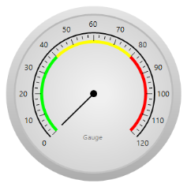

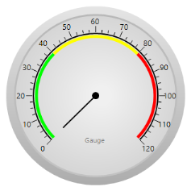

### Needles

You can easily customize the style of the needle and the positions of the sub elements within the RadialGauge through the following enumerations.

* [NeedleColor](https://help.syncfusion.com/cr/windowsforms/Syncfusion.Windows.Forms.Gauge.RadialGauge.html#Syncfusion_Windows_Forms_Gauge_RadialGauge_NeedleColor)
* [NeedleStyle](https://help.syncfusion.com/cr/windowsforms/Syncfusion.Windows.Forms.Gauge.RadialGauge.html#Syncfusion_Windows_Forms_Gauge_RadialGauge_NeedleStyle)
* [ShowNeedle](https://help.syncfusion.com/cr/windowsforms/Syncfusion.Windows.Forms.Gauge.RadialGauge.html#Syncfusion_Windows_Forms_Gauge_RadialGauge_ShowNeedle)



this.radialGauge1.ShowNeedle = true;
this.radialGauge1.NeedleColor = System.Drawing.Color.Black;
this.radialGauge1.NeedleStyle = Syncfusion.Windows.Forms.Gauge.NeedleStyle.Advanced;


Me.radialGauge1.ShowNeedle = True
Me.radialGauge1.NeedleColor = System.Drawing.Color.Black
Me.radialGauge1.NeedleStyle = Syncfusion.Windows.Forms.Gauge.NeedleStyle.Advanced



### Ranges

Ranges are objects that highlight a range of values and can display different ranges in different colors. Ranges can be customized using various attributes such as range placement, height, color of the range, and so on. All the available attributes are listed in the following table:

<table>
<tr>
<th>
Property</th><th>
Type</th><th>
Description</th></tr>
<tr>
<td>
Start value</td><td>
Integer</td><td>
Specify the start value of the range. Default value is set to 0.</td></tr>
<tr>
<td>
End value</td><td>
Integer</td><td>
Specify the end value of the range. Default value is set to 0.</td></tr>
<tr>
<td>
RangePlacement</td><td>
Enum</td><td>
Using this attribute, the range can be positioned in two areas along the radial scale. It includes the following options:
<ul><li> Inside</li>
<li> Outside</li></ul>  The default value is Inside.</td></tr>
<tr>
<td>
Height</td><td>
Integer</td><td>
Specify the height of the range. Default value is set to 5.</td></tr>
<tr>
<td>
Color</td><td>
Color</td><td>
Gets or sets the color of the range.</td></tr>
</table>

The following code sample illustrates how to add ranges to the RadialGauge:





Syncfusion.Windows.Forms.Gauge.Range range1 = new Syncfusion.Windows.Forms.Gauge.Range();

range1.Color = System.Drawing.Color.FromArgb(((int)(((byte)(225)))), ((int)(((byte)(128)))), ((int)(((byte)(128)))));

            range1.EndValue = 0F;

            range1.Height = 5;

            range1.InRange = false;

            range1.Name = "GaugeRange1";

            range1.RangePlacement = Syncfusion.Windows.Forms.Gauge.TickPlacement.Inside;

            range1.StartValue = 0F;

            this.radialGauge1.Ranges.Add(range1);





Dim range1 As New Syncfusion.Windows.Forms.Gauge.Range()

range1.Color = System.Drawing.Color.FromArgb(CInt(CByte(225)), CInt(CByte(128)), CInt(CByte(128)))

range1.EndValue = 0F

range1.Height = 5

range1.InRange = False

range1.Name = "GaugeRange1"

range1.RangePlacement = Syncfusion.Windows.Forms.Gauge.TickPlacement.Inside

range1.StartValue = 0F

Me.radialGauge1.Ranges.Add(range1)





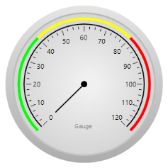

N> EndValue must be defined as first and greater than the StartValue when configuring the Ranges. By default, StartValue and EndValue will be zero and EndValue must be greater than StartValue. Otherwise, StartValue will be reset to zero. 

### Scaling divisions

The Gauge control for Windows Forms includes support for customizing the number of major tick lines and number of minor tick lines using the [MajorDifference](https://help.syncfusion.com/cr/windowsforms/Syncfusion.Windows.Forms.Gauge.RadialGauge.html#Syncfusion_Windows_Forms_Gauge_RadialGauge_MajorDifference) and [MinorDifference](https://help.syncfusion.com/cr/windowsforms/Syncfusion.Windows.Forms.Gauge.RadialGauge.html#Syncfusion_Windows_Forms_Gauge_RadialGauge_MinorDifference). It also provides support to customize the number of tick lines using [MaximumValue](https://help.syncfusion.com/cr/windowsforms/Syncfusion.Windows.Forms.Gauge.RadialGauge.html#Syncfusion_Windows_Forms_Gauge_RadialGauge_MaximumValue) and [MinimumValue](https://help.syncfusion.com/cr/windowsforms/Syncfusion.Windows.Forms.Gauge.RadialGauge.html#Syncfusion_Windows_Forms_Gauge_RadialGauge_MinimumValue).

The following code sample illustrates how to use the above properties in the RadialGauge:





this.radialGauge1.MajorDifference = 20F;

this.radialGauge1.MaximumValue = 120F;

this.radialGauge1.MinimumValue = 0F;

this.radialGauge1.MinorDifference = 2F;





Me.radialGauge1.MajorDifference = 20F

Me.radialGauge1.MaximumValue = 120F

Me.radialGauge1.MinimumValue = 0F

Me.radialGauge1.MinorDifference = 2F





### FrameThickness

The `FrameThickness` property of RadialGauge is used to specify the thickness of the frame. By default, the value of this property is 12. For [Fill frame type](https://help.syncfusion.com/windowsforms/gauge/radial-gauge#fillcircle), the default value of the `FrameThickness` is 20.

The following code and screenshot illustrates the RadialGauge with different FrameThickness,





this.radialGauge1.FrameThickness = 18; 
this.radialGauge1.Value = 60;





Me.radialGauge1.FrameThickness = 18
this.radialGauge1.Value = 60





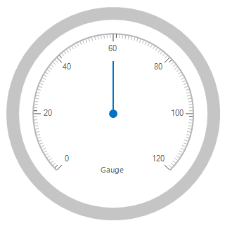

### Label customization

Appearance and text of Scale labels in `FullCircle`, `HalfCircle` and `QuarterCircle` frame types and Value label of `Fill` frame type can customized using `DrawLabelEventArgs` event.

The `DrawLabelEventArgs` provides the following data for the [DrawLabel](https://help.syncfusion.com/cr/windowsforms/Syncfusion.Windows.Forms.Gauge.RadialGauge.html) event of the RadialGauge.

<table>
<tr>
<td>
S.No  </td><td>
Arguments  </td><td>
Description  </td></tr>
<tr>
<td>
1  </td><td>
Font  </td><td>
Font settings which is used to draw the customized label.  </td></tr>
<tr>
<td>
2  </td><td>
ForeColor  </td><td>
Fore color to draw the customized label.  </td></tr>
<tr>
<td>
3  </td><td>
Text  </td><td>
Text which is to be drawn as label   </td></tr>
<tr>
<td>
4  </td><td>
LabelType  </td><td>
Type of label that is being drawn in RadialGauge  </td></tr>
<tr>
<td>
5  </td><td>
LabelAlignment  </td><td>
Alignment of the label when the LabelType is Default or Value
N> Label alignment is not applicable when the LabelType is Scale  </td></tr>
<tr>
<td>
6  </td><td>
Offset  </td><td>
Point to adjust the Label horizontally and vertically based on the value specified in X and Y coordinates  </td></tr>
<tr>
<td>
7  </td><td>
Handled  </td><td>
All the above customizations will work only if the argument is true.  </td></tr>
</table>

The following code example used to customize the scale label of FullCircle Gauge, 





this.radialGauge1.DrawLabel += RadialGauge1_DrawLabel;

private void RadialGauge1_DrawLabel(object sender, 
Syncfusion.Windows.Forms.Gauge.DrawLabelEventArgs e)
{
      e.Handled = true;
            if (e.LabelType == Syncfusion.Windows.Forms.Gauge.LabelType.Scale)
                e.Text += " °C";
            else
            {
                e.Text = "Temperature";
                e.LabelAlignment = Syncfusion.Windows.Forms.Gauge.LabelAlignment.Center;
                e.Offset = new Point(e.Offset.X + 1, e.Offset.Y + 45);
            }
            e.Font = new System.Drawing.Font("Segoe UI", 9F, System.Drawing.FontStyle.Bold, System.Drawing.GraphicsUnit.Point, ((byte)(0)));
}





AddHandler Me.radialGauge1.DrawLabel, AddressOf RadialGauge1_DrawLabel

Private Sub RadialGauge1_DrawLabel(sender As Object, e As Syncfusion.Windows.Forms.Gauge.DrawLabelEventArgs) Handles radialGauge1.DrawLabel
        e.Handled = True
			If e.LabelType = Syncfusion.Windows.Forms.Gauge.LabelType.Scale Then
				e.Text &= " °C"
			Else
				e.Text = "Temperature"
				e.LabelAlignment = Syncfusion.Windows.Forms.Gauge.LabelAlignment.Center
				e.Offset = New Point(e.Offset.X + 1, e.Offset.Y + 45)
			End If
			e.Font = New System.Drawing.Font("Segoe UI", 9F, System.Drawing.FontStyle.Bold, System.Drawing.GraphicsUnit.Point, (CByte(0)))
    End Sub





The following code example used to customize the value label and its position for Fill type RadialGauge,





this.radialGauge1.DrawLabel += RadialGauge1_DrawLabel;

private void RadialGauge1_DrawLabel(object sender, 
Syncfusion.Windows.Forms.Gauge.DrawLabelEventArgs e)
{
      e.Handled = true;
      e.Text += " %";
      e.Font = new System.Drawing.Font("Microsoft Sans Serif", 20F, System.Drawing.FontStyle.Bold, System.Drawing.GraphicsUnit.Point, ((byte)(0)));
      e.HorizontalAlignment = HorizontalAlignment.Right;
}





AddHandler Me.radialGauge1.DrawLabel, AddressOf RadialGauge1_DrawLabel

Private Sub RadialGauge1_DrawLabel(sender As Object, e As Syncfusion.Windows.Forms.Gauge.DrawLabelEventArgs) Handles radialGauge1.DrawLabel
      e.Handled = true
      e.Text += " %"
      e.Font = new System.Drawing.Font("Microsoft Sans Serif", 20F, System.Drawing.FontStyle.Bold, System.Drawing.GraphicsUnit.Point, ((byte)(0)));
      e.HorizontalAlignment = HorizontalAlignment.Right
End Sub





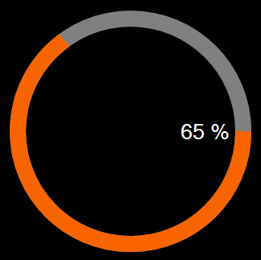

## Visual styles

The Gauge control for Windows Forms includes four stunning skins for professional representation of gauges. You can easily modify the look and feel of the gauge component using the [VisualStyle](https://help.syncfusion.com/cr/windowsforms/Syncfusion.Windows.Forms.Gauge.RadialGauge.html#Syncfusion_Windows_Forms_Gauge_RadialGauge_VisualStyle) property.

The styles are built-in for all gauges.

* Blue
* Black
* Silver
* Metro
* Office2016White
* Office2016Colorful
* Office2016DarkGray
* Office2016Black
* Custom

**Black**

This option helps to set the Black theme.





this.radialGauge1.VisualStyle = Syncfusion.Windows.Forms.Gauge.ThemeStyle.Black;





Me.radialGauge1.VisualStyle = 

Syncfusion.Windows.Forms.Gauge.ThemeStyle.Black





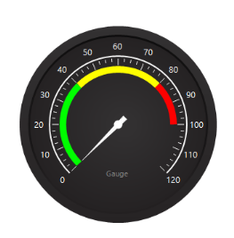

**Blue**

This option helps to set the Blue theme.





this.radialGauge1.VisualStyle = Syncfusion.Windows.Forms.Gauge.ThemeStyle.Blue;





Me.radialGauge1.VisualStyle = 

Syncfusion.Windows.Forms.Gauge.ThemeStyle.Blue





**Silver**

This option helps to set the Silver theme.





this.radialGauge1.VisualStyle = Syncfusion.Windows.Forms.Gauge.ThemeStyle.Silver;





Me.radialGauge1.VisualStyle = 

Syncfusion.Windows.Forms.Gauge.ThemeStyle.Silver





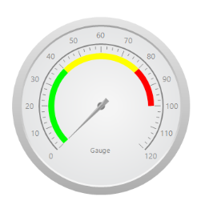

**Metro**

This option helps to set the Metro theme.





this.radialGauge1.VisualStyle = Syncfusion.Windows.Forms.Gauge.ThemeStyle.Metro;





Me.radialGauge1.VisualStyle = 

Syncfusion.Windows.Forms.Gauge.ThemeStyle.Metro





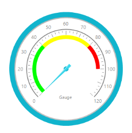

**Office2016White**

This option helps to set the Office2016White theme.





//Office2016White

this.radialGauge1.VisualStyle = Syncfusion.Windows.Forms.Gauge.ThemeStyle.Office2016White;





'Office2016White

Me.radialGauge1.VisualStyle = Syncfusion.Windows.Forms.Gauge.ThemeStyle.Office2016White





 

**Office2016Colorful**

This option helps to set the Office2016Colorful theme.





// Office2016Colorful

this.radialGauge1.VisualStyle = Syncfusion.Windows.Forms.Gauge.ThemeStyle.Office2016Colorful;





'Office2016Colorful

Me.radialGauge1.VisualStyle = Syncfusion.Windows.Forms.Gauge.ThemeStyle.Office2016Colorful





  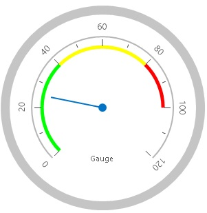

**Office2016DarkGray**

This option helps to set the Office2016DarkGray theme.





//Office2016DarkGray

this.radialGauge1.VisualStyle = Syncfusion.Windows.Forms.Gauge.ThemeStyle.Office2016DarkGray;





'Office2016DarkGray

Me.radialGauge1.VisualStyle = Syncfusion.Windows.Forms.Gauge.ThemeStyle.Office2016DarkGray





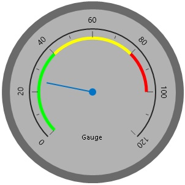

**Office2016Black**

This option helps to set the Office2016Black theme.





//Office2016Black

this.radialGauge1.VisualStyle = Syncfusion.Windows.Forms.Gauge.ThemeStyle.Office2016Black;





'Office2016Black

Me.radialGauge1.VisualStyle = Syncfusion.Windows.Forms.Gauge.ThemeStyle.Office2016Black





 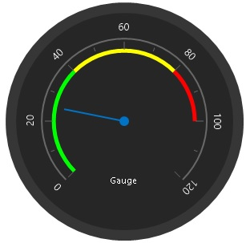

**Custom**

 RadialGauge provides an option to end user to create their own custom theme based on the requirement by setting the [VisualStyle](https://help.syncfusion.com/cr/windowsforms/Syncfusion.Windows.Forms.Gauge.RadialGauge.html#Syncfusion_Windows_Forms_Gauge_RadialGauge_VisualStyle) as **Custom**.

 Steps to Customize the theme in Design time.

 **Step 1:**  Need to add RadialGauge control to Form Designer.

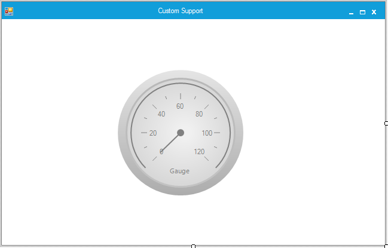

 **Step 2:** Set the VisualStyle as Custom.

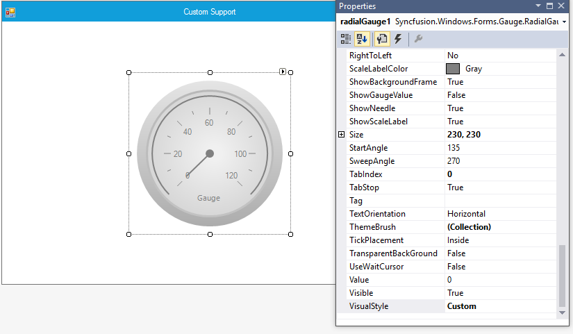

 **Step 3:** Need to add necessary Theme combination in ThemeBrush collection and it will update the Color customization details in RadialGauge control.

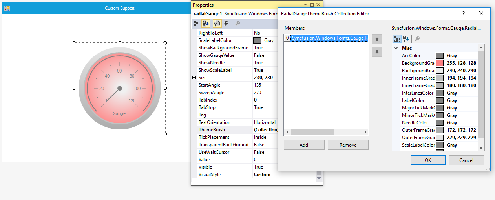





Syncfusion.Windows.Forms.Gauge.RadialGaugeThemeBrush radialGaugeThemeBrush1 = new Syncfusion.Windows.Forms.Gauge.RadialGaugeThemeBrush();
radialGaugeThemeBrush1.ArcColor = System.Drawing.Color.Gray;
radialGaugeThemeBrush1.BackgroundGradientEndColor = System.Drawing.Color.FromArgb(((int)(((byte)(255)))), ((int)(((byte)(128)))), ((int)(((byte)(128)))));
radialGaugeThemeBrush1.BackgroundGradientStartColor = System.Drawing.Color.FromArgb(((int)(((byte)(240)))), ((int)(((byte)(240)))), ((int)(((byte)(240)))));
radialGaugeThemeBrush1.InnerFrameGradientEndColor = System.Drawing.Color.FromArgb(((int)(((byte)(194)))), ((int)(((byte)(194)))), ((int)(((byte)(194)))));
radialGaugeThemeBrush1.InnerFrameGradientStartColor = System.Drawing.Color.FromArgb(((int)(((byte)(180)))), ((int)(((byte)(180)))), ((int)(((byte)(180)))));
radialGaugeThemeBrush1.InterLinesColor = System.Drawing.Color.Gray;
radialGaugeThemeBrush1.LabelColor = System.Drawing.Color.Gray;
radialGaugeThemeBrush1.MajorTickMarkColor = System.Drawing.Color.Gray;
radialGaugeThemeBrush1.MinorTickMarkColor = System.Drawing.Color.Gray;
radialGaugeThemeBrush1.NeedleColor = System.Drawing.Color.Gray;
radialGaugeThemeBrush1.OuterFrameGradientEndColor = System.Drawing.Color.FromArgb(((int)(((byte)(172)))), ((int)(((byte)(172)))), ((int)(((byte)(172)))));
radialGaugeThemeBrush1.OuterFrameGradientStartColor = System.Drawing.Color.FromArgb(((int)(((byte)(229)))), ((int)(((byte)(229)))), ((int)(((byte)(229)))));
radialGaugeThemeBrush1.ScaleLabelColor = System.Drawing.Color.Gray;
radialGaugeThemeBrush1.ValueColor = System.Drawing.Color.Gray;
this.radialGauge1.ThemeBrush.Add(radialGaugeThemeBrush1);
this.radialGauge1.VisualStyle = Syncfusion.Windows.Forms.Gauge.ThemeStyle.Custom;





Dim radialGaugeThemeBrush1 As Syncfusion.Windows.Forms.Gauge.RadialGaugeThemeBrush = New Syncfusion.Windows.Forms.Gauge.RadialGaugeThemeBrush()
radialGaugeThemeBrush1.ArcColor = System.Drawing.Color.Gray
radialGaugeThemeBrush1.BackgroundGradientEndColor = System.Drawing.Color.FromArgb((CType(((CType((255), Byte))), Integer)), (CType(((CType((128), Byte))), Integer)), (CType(((CType((128), Byte))), Integer)))
radialGaugeThemeBrush1.BackgroundGradientStartColor = System.Drawing.Color.FromArgb((CType(((CType((240), Byte))), Integer)), (CType(((CType((240), Byte))), Integer)), (CType(((CType((240), Byte))), Integer)))
radialGaugeThemeBrush1.InnerFrameGradientEndColor = System.Drawing.Color.FromArgb((CType(((CType((194), Byte))), Integer)), (CType(((CType((194), Byte))), Integer)), (CType(((CType((194), Byte))), Integer)))
radialGaugeThemeBrush1.InnerFrameGradientStartColor = System.Drawing.Color.FromArgb((CType(((CType((180), Byte))), Integer)), (CType(((CType((180), Byte))), Integer)), (CType(((CType((180), Byte))), Integer)))
radialGaugeThemeBrush1.InterLinesColor = System.Drawing.Color.Gray
radialGaugeThemeBrush1.LabelColor = System.Drawing.Color.Gray
radialGaugeThemeBrush1.MajorTickMarkColor = System.Drawing.Color.Gray
radialGaugeThemeBrush1.MinorTickMarkColor = System.Drawing.Color.Gray
radialGaugeThemeBrush1.NeedleColor = System.Drawing.Color.Gray
radialGaugeThemeBrush1.OuterFrameGradientEndColor = System.Drawing.Color.FromArgb((CType(((CType((172), Byte))), Integer)), (CType(((CType((172), Byte))), Integer)), (CType(((CType((172), Byte))), Integer)))
radialGaugeThemeBrush1.OuterFrameGradientStartColor = System.Drawing.Color.FromArgb((CType(((CType((229), Byte))), Integer)), (CType(((CType((229), Byte))), Integer)), (CType(((CType((229), Byte))), Integer)))
radialGaugeThemeBrush1.ScaleLabelColor = System.Drawing.Color.Gray
radialGaugeThemeBrush1.ValueColor = System.Drawing.Color.Gray
Me.radialGauge1.ThemeBrush.Add(radialGaugeThemeBrush1)
Me.radialGauge1.VisualStyle = Syncfusion.Windows.Forms.Gauge.ThemeStyle.Custom





**Output**

## Data binding

You can bind any data source to the RadialGauge and map an index of a record to represent the actual value in RadialGauge. The [DisplayMember](https://help.syncfusion.com/cr/windowsforms/Syncfusion.Windows.Forms.Gauge.RadialGauge.html#Syncfusion_Windows_Forms_Gauge_RadialGauge_DisplayMember) and [DisplayRecordIndex](https://help.syncfusion.com/cr/windowsforms/Syncfusion.Windows.Forms.Gauge.RadialGauge.html#Syncfusion_Windows_Forms_Gauge_RadialGauge_DisplayRecordIndex) properties will map the DataColumn and DataRow of the binding source respectively to the Gauge control, which will then support high frequency data updates.

### Example



this.radialGauge1.DataSource = dataTable;

this.radialGauge1.DisplayRecordIndex = [Row Index];

this.radialGauge1.DisplayMember = [column name];



## Custom renderer

The appearance of the RadialGauge is customized by using the [IRadialGaugeRenderer](https://help.syncfusion.com/cr/windowsforms/Syncfusion.Windows.Forms.Gauge.IRadialGaugeRenderer.html). This interface provides few methods to control painting over the [OuterArc](https://help.syncfusion.com/cr/windowsforms/Syncfusion.Windows.Forms.Gauge.IRadialGaugeRenderer.html#Syncfusion_Windows_Forms_Gauge_IRadialGaugeRenderer_DrawOuterArc_System_Drawing_Graphics_System_Int32_System_Int32_System_Drawing_Point_System_Int32_), [Needle](https://help.syncfusion.com/cr/windowsforms/Syncfusion.Windows.Forms.Gauge.IRadialGaugeRenderer.html#Syncfusion_Windows_Forms_Gauge_IRadialGaugeRenderer_DrawNeedle_System_Drawing_Graphics_System_Int32_System_Int32_System_Int32_System_Int32_System_Drawing_Point_), [Major ticks](https://help.syncfusion.com/cr/windowsforms/Syncfusion.Windows.Forms.Gauge.IRadialGaugeRenderer.html#Syncfusion_Windows_Forms_Gauge_IRadialGaugeRenderer_DrawTickMarks_System_Drawing_Graphics_System_Drawing_Drawing2D_GraphicsPath_System_Int32_System_Int32_System_Int32_System_Int32_System_Drawing_Point_System_Int32_), [Minor ticks](https://help.syncfusion.com/cr/windowsforms/Syncfusion.Windows.Forms.Gauge.IRadialGaugeRenderer.html#Syncfusion_Windows_Forms_Gauge_IRadialGaugeRenderer_DrawTickMarks_System_Drawing_Graphics_System_Drawing_Drawing2D_GraphicsPath_System_Int32_System_Int32_System_Int32_System_Int32_System_Drawing_Point_System_Int32_), [Label](https://help.syncfusion.com/cr/windowsforms/Syncfusion.Windows.Forms.Gauge.IRadialGaugeRenderer.html#Syncfusion_Windows_Forms_Gauge_IRadialGaugeRenderer_DrawGaugeLabel_System_Drawing_Graphics_System_Drawing_Point_System_Int32_), [Ranges](https://help.syncfusion.com/cr/windowsforms/Syncfusion.Windows.Forms.Gauge.IRadialGaugeRenderer.html#Syncfusion_Windows_Forms_Gauge_IRadialGaugeRenderer_DrawRanges_System_Drawing_Graphics_System_Drawing_Drawing2D_GraphicsPath_System_Int32_System_Int32_System_Int32_System_Drawing_Point_) etc.

To customize the appearance,

1. Create a new custom renderer class and implement each of the members defined in [IRadialGaugeRenderer](https://help.syncfusion.com/cr/windowsforms/Syncfusion.Windows.Forms.Gauge.IRadialGaugeRenderer.html).
2. Assign instance of your custom renderer to the [Renderer](https://help.syncfusion.com/cr/windowsforms/Syncfusion.Windows.Forms.Gauge.RadialGauge.html#Syncfusion_Windows_Forms_Gauge_RadialGauge_Renderer) property of RadialGauge. By default, RadialGauge is painted by using its default renderer.





CustomRenderer custom1= new CustomRenderer(this.radialGauge1);

radialGauge1.Renderer = custom;





Private custom1 As CustomRenderer  = New CustomRenderer(Me.radialGauge1)

radialGauge1.Renderer = custom





## Frequently asked questions

### How to enable multiple needles to RadialGauge

#### Adding multiple needles to RadialGauge

The RadialGauge control can be used for representing a range of values in circular form. In RadialGauge, you can represent the range of values using multiple needles.

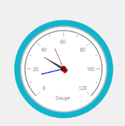

The following code example illustrates you on how to add multiple needles in RadialGauge.





this.RadialGauge1.EnableCustomNeedles = true;

Syncfusion.Windows.Forms.Gauge.Needle needle1 = new Syncfusion.Windows.Forms.Gauge.Needle();

Syncfusion.Windows.Forms.Gauge.Needle needle2 = new Syncfusion.Windows.Forms.Gauge.Needle();

this.RadialGauge1.NeedleCollection.Add(needle1);

this.RadialGauge1.NeedleCollection.Add(needle2);





Me.RadialGauge1.EnableCustomNeedles = True

Dim needle1 As New Syncfusion.Windows.Forms.Gauge.Needle()

Dim needle2 As New Syncfusion.Windows.Forms.Gauge.Needle()

Me.RadialGauge1.NeedleCollection.Add(needle1)

Me.RadialGauge1.NeedleCollection.Add(needle2)





#### Customization of needles in RadialGauge

You can customize the RadialGauge needles using the Needles property.

##### Needle style

RadialGauge supports three needle style. They are

* Default
* Advanced
* Pointer

##### Needle color

You can customize the needle color by using the [NeedleColor](https://help.syncfusion.com/cr/windowsforms/Syncfusion.Windows.Forms.Gauge.RadialGauge.html#Syncfusion_Windows_Forms_Gauge_RadialGauge_NeedleColor) property.

##### Needle values

The Needle values can be assigned using Values property in Needle.

You can customize the needles in RadialGauge by using the following properties.

* [NeedleColor](https://help.syncfusion.com/cr/windowsforms/Syncfusion.Windows.Forms.Gauge.RadialGauge.html#Syncfusion_Windows_Forms_Gauge_RadialGauge_NeedleColor)
* [NeedleStyle](https://help.syncfusion.com/cr/windowsforms/Syncfusion.Windows.Forms.Gauge.RadialGauge.html#Syncfusion_Windows_Forms_Gauge_RadialGauge_NeedleStyle)
* [Value](https://help.syncfusion.com/cr/windowsforms/Syncfusion.Windows.Forms.Gauge.RadialGauge.html#Syncfusion_Windows_Forms_Gauge_RadialGauge_Value)



needle1.NeedleColor = System.Drawing.Color.Gray;
needle1.NeedleStyle = Syncfusion.Windows.Forms.Gauge.NeedleStyle.Advanced;
this.RadialGauge1.NeedleCollection[1].Value = 5;


needle1.NeedleColor = Color.Gray
needle1.NeedleStyle = Syncfusion.Windows.Forms.Gauge.NeedleStyle.Advanced
Me.RadialGauge1.NeedleCollection(0).Value = 5



### How to customize RadialGauge appearance

You can customize the appearance of the RadialGauge by using the [IRadialGaugeRenderer](https://help.syncfusion.com/cr/windowsforms/Syncfusion.Windows.Forms.Gauge.IRadialGaugeRenderer.html).





CustomRenderer custom1= new CustomRenderer(this.radialGauge1);

radialGauge1.Renderer = custom1;

public class CustomRenderer : IRadialGaugeRenderer
    {
        /// 

        /// Gets the radial gauge
        /// 

        private RadialGauge m_RadialGauge;

        /// 

        /// Used to set bounds for the Font
        /// 

        Single fontBoundY1, fontBoundY2;
        
        /// 

        /// Gets the Radial gauge
        /// 

        internal RadialGauge RadialGauge
        {
            get
            {
                return m_RadialGauge;
            }
        }
        
        /// 

        /// Constructor of the Renderer class
        /// 

        /// <param name="radialGauge"></param>
        public CustomRenderer(RadialGauge radialGauge)
        {
            m_RadialGauge = radialGauge;
           
        }
        /// 

        /// Updates the renderer method.
        /// 

        /// <param name="e"></param>
        public void Update(PaintEventArgs e)
        {
            FindFontBounds(e.Graphics, RadialGauge.Font);
            DrawOuterArc(e.Graphics, 135, 270, new Point(140, 140), 115, 105);
            DrawNeedle(e.Graphics, 135, 270, 65, 4, new Point(140, 140));
            DrawLabel(e.Graphics, new Point(140, 140), 105);
            DrawRanges(e.Graphics, new System.Drawing.Drawing2D.GraphicsPath(), 135, 270, 90, new Point(140, 140));
            DrawLines(e.Graphics, new System.Drawing.Drawing2D.GraphicsPath(), 108, 135, 270, 3, new Point(140, 140), 80);
        }
        /// 

        /// Used to calculate the text bounds 
        /// 

        /// <param name="e">Paint event argument</param>
        /// <param name="m_font">Font used in Radial gauge</param>
        public void FindFontBounds(Graphics g, Font m_font)
        {
            //find upper and lower bounds for numeric characters
            Int32 c1;
            Int32 c2;
            Boolean boundFound;
            Bitmap b;
            SolidBrush backBrush = new SolidBrush(Color.White);
            SolidBrush foreBrush = new SolidBrush(Color.Black);
            SizeF boundingBox;

            boundingBox = g.MeasureString("0123456789", m_font, -1, StringFormat.GenericTypographic);
            b = new Bitmap((Int32)(boundingBox.Width), (Int32)(boundingBox.Height));
            g = Graphics.FromImage(b);
            g.FillRectangle(backBrush, 0.0F, 0.0F, boundingBox.Width, boundingBox.Height);
            g.DrawString("0123456789", m_font, foreBrush, 0.0F, 0.0F, StringFormat.GenericTypographic);

            fontBoundY1 = 0;
            fontBoundY2 = 0;
            c1 = 0;
            boundFound = false;
            while ((c1 < b.Height) && (!boundFound))
            {
                c2 = 0;
                while ((c2 < b.Width) && (!boundFound))
                {
                    if (b.GetPixel(c2, c1) != backBrush.Color)
                    {
                        fontBoundY1 = c1;
                        boundFound = true;
                    }
                    c2++;
                }
                c1++;
            }

            c1 = b.Height - 1;
            boundFound = false;
            while ((0 < c1) && (!boundFound))
            {
                c2 = 0;
                while ((c2 < b.Width) && (!boundFound))
                {
                    if (b.GetPixel(c2, c1) != backBrush.Color)
                    {
                        fontBoundY2 = c1;
                        boundFound = true;
                    }
                    c2++;
                }
                c1--;
            }
        }

        /// 

        /// Method used to draw outer arc.
        /// 

        /// <param name="e">Paint event argument</param>
        /// <param name="m_GaugeArcStart">Arc start position</param>
        /// <param name="m_GaugeArcEnd">Arc end position</param>
        /// <param name="m_Center">Center point for gauge</param>
        public void DrawOuterArc(Graphics e, Int32 m_GaugeArcStart, Int32 m_GaugeArcEnd, Point m_Center, Int32 m_GaugeArcRadius, int GaugeRadius)
        {
            e.SmoothingMode = SmoothingMode.AntiAlias;
            e.PixelOffsetMode = PixelOffsetMode.HighQuality;
            GraphicsPath path = new GraphicsPath();
            Color c = this.RadialGauge.Parent != null ? this.RadialGauge.Parent.BackColor : Color.Empty;
            Rectangle r = new Rectangle(0, 0, this.RadialGauge.Width, this.RadialGauge.Height);
            System.Drawing.Drawing2D.GraphicsPath basePath = new System.Drawing.Drawing2D.GraphicsPath();

            int x = this.RadialGauge.Width;
            int y = this.RadialGauge.Height;

            //Define rectangles inside which we will draw circles.

            Rectangle rect = new Rectangle(0 + 10, 0 + 10, (int)x - 20, (int)y - 20);
            Rectangle rector = new Rectangle(0 + 23, 0 + 23, (int)x - 46, (int)y - 46);
            Rectangle inner = new Rectangle(0 + 40, 0 + 40, (int)x - 80, (int)y - 80);

            //OUTER
            LinearGradientBrush graph = new LinearGradientBrush(rect, RadialGauge.OuterFrameGradientStartColor, RadialGauge.OuterFrameGradientEndColor, LinearGradientMode.Vertical);

            path.AddEllipse(rect);
            if (RadialGauge.TransparentBackGround)
                this.RadialGauge.Region = new Region(path);
            PathGradientBrush pg = new PathGradientBrush(path);

            pg.CenterColor = RadialGauge.BackgroundGradientStartColor;

            pg.SurroundColors = new Color[] { RadialGauge.BackgroundGradientEndColor };

            pg.FocusScales = new PointF(0.1f, 0.1f);

            Blend bevelBlend = new Blend();
            bevelBlend.Positions = new float[] { 0.0f, .2f, .4f, .6f, .8f, 1.0f };
            bevelBlend.Factors = new float[] { .2f, .4f, .6f, .6f, 1f, 1f };
            Rectangle lgRect = rect;
            lgRect.Inflate(1, 1);
            LinearGradientBrush innerBevelBrush = new LinearGradientBrush(lgRect,
                                                RadialGauge.InnerFrameGradientStartColor,
                                                RadialGauge.InnerFrameGradientEndColor,
                                                LinearGradientMode.Vertical);

            innerBevelBrush.Blend = bevelBlend;
            if (this.RadialGauge.ShowBackgroundFrame)
            {
                e.FillEllipse(graph, rect);
                e.FillEllipse(innerBevelBrush, rector);
                rector.Inflate(-3, -3);

                e.FillEllipse(pg, rector);
            }

            GraphicsPath gp = new GraphicsPath();

            if (m_GaugeArcRadius > 0)
            {
                e.DrawArc(new Pen(this.RadialGauge.GaugeArcColor, 4), new Rectangle(m_Center.X - GaugeRadius, m_Center.Y - GaugeRadius,
                   2 * GaugeRadius, 2 * GaugeRadius), m_GaugeArcStart, m_GaugeArcEnd);
            }
        }
    
        /// 

        /// Method used to draw customization needle.
        /// 

        /// <param name="graphics">Graphics</param>
        /// <param name="needle">Needle used in the gauge</param>
        /// <param name="m_gaugeArcStart">Arc start position</param>
        /// <param name="m_gaugeArcEnd">Arc end position</param>
        /// <param name="m_NeedleRadius">Needle radius</param>
        /// <param name="m_NeedleWidth">Needle width</param>
        /// <param name="m_center">Center point of the gauge</param>
        public void DrawCustomizationNeedle(Graphics graphics, Needle needle, Int32 m_gaugeArcStart, Int32 m_gaugeArcEnd, Int32 m_NeedleRadius, int m_NeedleWidth, Point m_center)
        {
            needle.Value = Math.Min(Math.Max(needle.Value, RadialGauge.MinimumValue), RadialGauge.MaximumValue);
            Single brushAngle = (Int32)(m_gaugeArcStart + (needle.Value - RadialGauge.MinimumValue) * m_gaugeArcEnd / (RadialGauge.MaximumValue - RadialGauge.MinimumValue)) % 360;
            Double needleAngle = brushAngle * Math.PI / 180;
            Point startPoint = new Point((Int32)(m_center.X - m_NeedleWidth / 8 * Math.Cos(needleAngle)),
                                        (Int32)(m_center.Y - m_NeedleWidth / 8 * Math.Sin(needleAngle)));
            Point endPoint = new Point((Int32)(m_center.X + m_NeedleWidth * Math.Cos(needleAngle)),
                                     (Int32)(m_center.Y + m_NeedleWidth * Math.Sin(needleAngle)));

            graphics.FillEllipse(new SolidBrush(needle.NeedleColor), m_center.X - m_NeedleWidth * 3, m_center.Y - m_NeedleWidth * 3, m_NeedleWidth * 6, m_NeedleWidth * 6);
            graphics.DrawLine(new Pen(needle.NeedleColor, m_NeedleWidth), m_center.X, m_center.Y, endPoint.X, endPoint.Y);
        }

        /// 

        /// Method used to draw needle
        /// 

        /// <param name="graphics">Graphics</param>
        /// <param name="m_GaugeArcStart">Arc start position</param>
        /// <param name="m_GaugeArcEnd">Arc end position</param>
        /// <param name="m_NeedleRadius">Needle radius</param>
        /// <param name="m_NeedleWidth">Needle width</param>
        /// <param name="m_Center">Center point of the gauge</param>
        public void DrawNeedle(Graphics graphics, Int32 m_GaugeArcStart, Int32 m_GaugeArcEnd, Int32 m_NeedleRadius, Int32 m_NeedleWidth, Point m_Center)
        {
            Single brushAngle = (Int32)(m_GaugeArcStart + (RadialGauge.Value - RadialGauge.MinimumValue) * m_GaugeArcEnd / (RadialGauge.MaximumValue - RadialGauge.MinimumValue)) % 360;
            Double needleAngle = brushAngle * Math.PI / 180;
            if (RadialGauge.ShowNeedle)
            {
                Point startPoint = new Point((Int32)(m_Center.X - m_NeedleRadius / 8 * Math.Cos(needleAngle)),
                                            (Int32)(m_Center.Y - m_NeedleRadius / 8 * Math.Sin(needleAngle)));
                Point endPoint = new Point((Int32)(m_Center.X + m_NeedleRadius * Math.Cos(needleAngle)),
                                         (Int32)(m_Center.Y + m_NeedleRadius * Math.Sin(needleAngle)));
                graphics.DrawLine(new Pen(this.RadialGauge.GaugeArcColor, 2), m_Center.X, m_Center.Y, endPoint.X, endPoint.Y);

                graphics.FillEllipse(new SolidBrush(this.RadialGauge.NeedleColor), m_Center.X - m_NeedleWidth * 3, m_Center.Y - m_NeedleWidth * 3, m_NeedleWidth * 6, m_NeedleWidth * 6);
            }
        }

        /// 

        /// Used to draw the  label of the gauge
        /// 

        /// <param name="e">paint event argument</param>
        /// <param name="m_Center">Center point of the gauge</param>
        public void DrawLabel(Graphics e, Point m_Center, int GaugeRadius)
        {
            SolidBrush br = new SolidBrush(this.RadialGauge.GaugeLableColor);
            SizeF s = e.MeasureString(RadialGauge.GaugeLabel, RadialGauge.GaugeLableFont);
            e.DrawString(RadialGauge.GaugeLabel, RadialGauge.GaugeLableFont, br,
                new Point((int)((m_Center.X) - (s.Width / 2)), (int)(m_Center.Y + GaugeRadius / 2) + 15));
            br.Dispose();
        }

        /// 

        /// Used to draw the ranges for the Gauge
        /// 

        /// <param name="gr">Graphics</param>
        /// <param name="gp">Graphics path</param>
        /// <param name="m_GaugeArcStart">Start position of the arc</param>
        /// <param name="m_GaugeArcEnd">End position of the arc</param>
        /// <param name="m_GaugeArcRadius">Radius of the arc</param>
        /// <param name="m_Center">Center of the gauge</param>
        public void DrawRanges(Graphics gr, GraphicsPath gp, Int32 m_GaugeArcStart, Int32 m_GaugeArcEnd, Int32 m_GaugeArcRadius, Point m_Center)
        {
            Single rangeStartAngle;
            Single rangeSweepAngle;

            foreach (Range ptrRange in RadialGauge.Ranges)
            {
                if (ptrRange.EndValue > ptrRange.StartValue)
                {
                    rangeStartAngle = m_GaugeArcStart + (ptrRange.StartValue - RadialGauge.MinimumValue) * m_GaugeArcEnd / (RadialGauge.MaximumValue - RadialGauge.MinimumValue);
                    rangeSweepAngle = (ptrRange.EndValue - ptrRange.StartValue) * m_GaugeArcEnd / (RadialGauge.MaximumValue - RadialGauge.MinimumValue);

                    Int32 line = m_GaugeArcRadius + RadialGauge.MajorTickMarkHeight;
                    gr.SmoothingMode = SmoothingMode.AntiAlias;
                    gr.PixelOffsetMode = PixelOffsetMode.HighQuality;
                    int m_GaugeArcRadius1 = m_GaugeArcRadius + RadialGauge.MajorTickMarkHeight;
                    gr.DrawArc(new Pen(ptrRange.Color, ptrRange.Height), new Rectangle(m_Center.X - m_GaugeArcRadius1, m_Center.Y - m_GaugeArcRadius1, 2 * m_GaugeArcRadius1, 2 * m_GaugeArcRadius1), rangeStartAngle, rangeSweepAngle);
                }
            }
        }

        /// 

        /// Used to draw the tick marks of the gauge
        /// 

        /// <param name="graphics">Graphics</param>
        /// <param name="gp">Graphics Path</param>
        /// <param name="m_GaugeArcRadius">Radius of the arc</param>
        /// <param name="m_GaugeArcStart">Start position of the arc</param>
        /// <param name="m_GaugeArcEnd">End position of the arc</param>
        /// <param name="m_MajorTickMarkWidth">Tick mark width</param>
        /// <param name="m_Center">Center of the gauge</param>
        public void DrawLines(Graphics graphics, GraphicsPath gp, Int32 m_GaugeArcRadius, Int32 m_GaugeArcStart, Int32 m_GaugeArcEnd, Int32 m_MajorTickMarkWidth, Point m_Center, int m_ScaleNumbersRadius)
        {
            String valueText = "";
            SizeF boundingBox;
            Single countValue = 0;
            int TempGaugeArcRadius = m_GaugeArcRadius;
            TempGaugeArcRadius = m_GaugeArcRadius+2;
            graphics.SmoothingMode = System.Drawing.Drawing2D.SmoothingMode.HighQuality;
            while (countValue <= (RadialGauge.MaximumValue - RadialGauge.MinimumValue))
            {
                valueText = (RadialGauge.MinimumValue + countValue).ToString();
                graphics.ResetTransform();
                boundingBox = graphics.MeasureString(valueText, RadialGauge.Font, -1, StringFormat.GenericTypographic);

                Int32 line = TempGaugeArcRadius - RadialGauge.MajorTickMarkHeight;
                Int32 lineMinerValue = TempGaugeArcRadius - RadialGauge.MinorTickMarkHeight;
                Int32 lineMinerInterValue = TempGaugeArcRadius - RadialGauge.MinorInnerLinesHeight;
                gp.Reset();
                gp.AddEllipse(new Rectangle(m_Center.X - TempGaugeArcRadius, m_Center.Y - TempGaugeArcRadius, 2 * TempGaugeArcRadius, 2 * TempGaugeArcRadius));
                gp.Reverse();
                gp.AddEllipse(new Rectangle(m_Center.X - line, m_Center.Y - line, 2 * line, 2 * line));
                gp.Reverse();
                graphics.SetClip(gp);

                graphics.DrawLine(new Pen(this.RadialGauge.MajorTickMarkColor, m_MajorTickMarkWidth),
                               (Single)(m_Center.X),
                               (Single)(m_Center.Y),
                               (Single)(m_Center.X + 2 * lineMinerValue * Math.Cos((m_GaugeArcStart + countValue * m_GaugeArcEnd / (RadialGauge.MaximumValue - RadialGauge.MinimumValue)) * Math.PI / 180.0)),
                               (Single)(m_Center.Y + 2 * lineMinerValue * Math.Sin((m_GaugeArcStart + countValue * m_GaugeArcEnd / (RadialGauge.MaximumValue - RadialGauge.MinimumValue)) * Math.PI / 180.0)));

                gp.Reset();
                
                    gp.AddEllipse(new Rectangle(m_Center.X - TempGaugeArcRadius, m_Center.Y - TempGaugeArcRadius, 2 * TempGaugeArcRadius, 2 * TempGaugeArcRadius));
                    gp.Reverse();
                    gp.AddEllipse(new Rectangle(m_Center.X - lineMinerValue, m_Center.Y - lineMinerValue, 2 * lineMinerValue, 2 * lineMinerValue));
               
                gp.Reverse();
                graphics.SetClip(gp);
                graphics.SetClip(RadialGauge.ClientRectangle);

                if (RadialGauge.ShowScaleLabel)
                {
                    if (this.RadialGauge.TextOrientation != TextOrientation.Horizontal)
                    {
                        graphics.TextRenderingHint = System.Drawing.Text.TextRenderingHint.AntiAlias;
                        graphics.RotateTransform(90.0F + m_GaugeArcStart + countValue * m_GaugeArcEnd / (RadialGauge.MaximumValue - RadialGauge.MinimumValue));
                    }

                    graphics.TranslateTransform((Single)(m_Center.X + m_ScaleNumbersRadius * Math.Cos((m_GaugeArcStart + countValue * m_GaugeArcEnd / (RadialGauge.MaximumValue - RadialGauge.MinimumValue)) * Math.PI / 180.0f)),
                                           (Single)(m_Center.Y + m_ScaleNumbersRadius * Math.Sin((m_GaugeArcStart + countValue * m_GaugeArcEnd / (RadialGauge.MaximumValue - RadialGauge.MinimumValue)) * Math.PI / 180.0f)),
                                           System.Drawing.Drawing2D.MatrixOrder.Append);

                    graphics.DrawString(valueText, RadialGauge.Font, new SolidBrush(this.RadialGauge.ScaleLabelColor), -boundingBox.Width/2, -fontBoundY1 - (fontBoundY2 - fontBoundY1 + 1) / 2, StringFormat.GenericTypographic);
                }

                countValue += RadialGauge.MajorDifference;
            }
        }
       
        #endregion
    }





Private custom1 As CustomRenderer  = New CustomRenderer(Me.radialGauge1)

radialGauge1.Renderer = custom

Public Class CustomRenderer
		Implements IRadialGaugeRenderer
				''' 

		''' Gets the radial gauge
		''' 

		Private m_RadialGauge As RadialGauge

		''' 

		''' Used to set bounds for the Font
		''' 

		Private fontBoundY1, fontBoundY2 As Single
		
		''' 

		''' Gets the Radial gauge
		''' 

		Friend ReadOnly Property RadialGauge() As RadialGauge
			Get
				Return m_RadialGauge
			End Get
		End Property
		
		''' 

		''' Constructor of the Renderer class
		''' 

		''' <param name="radialGauge"></param>
		Public Sub New(ByVal radialGauge As RadialGauge)
			m_RadialGauge = radialGauge

		End Sub
		

		''' 

		''' Updates the renderer method.
		''' 

		''' <param name="e"></param>
		Public Sub Update(ByVal e As PaintEventArgs)
			FindFontBounds(e.Graphics, RadialGauge.Font)
			DrawOuterArc(e.Graphics, 135, 270, New Point(140, 140), 115, 105)
			DrawNeedle(e.Graphics, 135, 270, 65, 4, New Point(140, 140))
			DrawLabel(e.Graphics, New Point(140, 140), 105)
			DrawRanges(e.Graphics, New System.Drawing.Drawing2D.GraphicsPath(), 135, 270, 90, New Point(140, 140))
			DrawLines(e.Graphics, New System.Drawing.Drawing2D.GraphicsPath(), 108, 135, 270, 3, New Point(140, 140), 80)
		End Sub
		''' 

		''' Used to calculate the text bounds 
		''' 

		''' <param name="e">Paint event argument</param>
		''' <param name="m_font">Font used in Radial gauge</param>
		Public Sub FindFontBounds(ByVal g As Graphics, ByVal m_font As Font)
			'find upper and lower bounds for numeric characters
			Dim c1 As Int32
			Dim c2 As Int32
			Dim boundFound As Boolean
			Dim b As Bitmap
			Dim backBrush As New SolidBrush(Color.White)
			Dim foreBrush As New SolidBrush(Color.Black)
			Dim boundingBox As SizeF

			boundingBox = g.MeasureString("0123456789", m_font, -1, StringFormat.GenericTypographic)
			b = New Bitmap(CInt(Fix(boundingBox.Width)), CInt(Fix(boundingBox.Height)))
			g = Graphics.FromImage(b)
			g.FillRectangle(backBrush, 0.0F, 0.0F, boundingBox.Width, boundingBox.Height)
			g.DrawString("0123456789", m_font, foreBrush, 0.0F, 0.0F, StringFormat.GenericTypographic)

			fontBoundY1 = 0
			fontBoundY2 = 0
			c1 = 0
			boundFound = False
			Do While (c1 < b.Height) AndAlso ((Not boundFound))
				c2 = 0
				Do While (c2 < b.Width) AndAlso ((Not boundFound))
					If b.GetPixel(c2, c1) <> backBrush.Color Then
						fontBoundY1 = c1
						boundFound = True
					End If
					c2 += 1
				Loop
				c1 += 1
			Loop

			c1 = b.Height - 1
			boundFound = False
			Do While (0 < c1) AndAlso ((Not boundFound))
				c2 = 0
				Do While (c2 < b.Width) AndAlso ((Not boundFound))
					If b.GetPixel(c2, c1) <> backBrush.Color Then
						fontBoundY2 = c1
						boundFound = True
					End If
					c2 += 1
				Loop
				c1 -= 1
			Loop
		End Sub

		''' 

		''' Method used to draw outer arc.
		''' 

		''' <param name="e">Paint event argument</param>
		''' <param name="m_GaugeArcStart">Arc start position</param>
		''' <param name="m_GaugeArcEnd">Arc end position</param>
		''' <param name="m_Center">Center point for gauge</param>
		Public Sub DrawOuterArc(ByVal e As Graphics, ByVal m_GaugeArcStart As Int32, ByVal m_GaugeArcEnd As Int32, ByVal m_Center As Point, ByVal m_GaugeArcRadius As Int32, ByVal GaugeRadius As Integer)
			e.SmoothingMode = SmoothingMode.AntiAlias
			e.PixelOffsetMode = PixelOffsetMode.HighQuality
			Dim path As New GraphicsPath()
			Dim c As Color = If(Me.RadialGauge.Parent IsNot Nothing, Me.RadialGauge.Parent.BackColor, Color.Empty)
			Dim r As New Rectangle(0, 0, Me.RadialGauge.Width, Me.RadialGauge.Height)
			Dim basePath As New System.Drawing.Drawing2D.GraphicsPath()

			Dim x As Integer = Me.RadialGauge.Width
			Dim y As Integer = Me.RadialGauge.Height

			'Define rectangles inside which we will draw circles.

			Dim rect As New Rectangle(0 + 10, 0 + 10, CInt(Fix(x)) - 20, CInt(Fix(y)) - 20)
			Dim rector As New Rectangle(0 + 23, 0 + 23, CInt(Fix(x)) - 46, CInt(Fix(y)) - 46)
			Dim inner As New Rectangle(0 + 40, 0 + 40, CInt(Fix(x)) - 80, CInt(Fix(y)) - 80)

			'OUTER
			Dim graph As New LinearGradientBrush(rect, RadialGauge.OuterFrameGradientStartColor, RadialGauge.OuterFrameGradientEndColor, LinearGradientMode.Vertical)

			path.AddEllipse(rect)
			If RadialGauge.TransparentBackGround Then
				Me.RadialGauge.Region = New Region(path)
			End If
			Dim pg As New PathGradientBrush(path)

			pg.CenterColor = RadialGauge.BackgroundGradientStartColor

			pg.SurroundColors = New Color() { RadialGauge.BackgroundGradientEndColor }

			pg.FocusScales = New PointF(0.1f, 0.1f)

			Dim bevelBlend As New Blend()
			bevelBlend.Positions = New Single() { 0.0f,.2f,.4f,.6f,.8f, 1.0f }
			bevelBlend.Factors = New Single() {.2f,.4f,.6f,.6f, 1f, 1f }
			Dim lgRect As Rectangle = rect
			lgRect.Inflate(1, 1)
			Dim innerBevelBrush As New LinearGradientBrush(graphRect, RadialGauge.InnerFrameGradientStartColor, RadialGauge.InnerFrameGradientEndColor, LinearGradientMode.Vertical)

			innerBevelBrush.Blend = bevelBlend
			If Me.RadialGauge.ShowBackgroundFrame Then
				e.FillEllipse(graph, rect)
				e.FillEllipse(innerBevelBrush, rector)
				rector.Inflate(-3, -3)

				e.FillEllipse(pg, rector)
			End If

			Dim gp As New GraphicsPath()

			If m_GaugeArcRadius > 0 Then
				e.DrawArc(New Pen(Me.RadialGauge.GaugeArcColor, 4), New Rectangle(m_Center.X - GaugeRadius, m_Center.Y - GaugeRadius, 2 * GaugeRadius, 2 * GaugeRadius), m_GaugeArcStart, m_GaugeArcEnd)
			End If
		End Sub

		''' 

		''' Method used to draw customization needle.
		''' 

		''' <param name="graphics">Graphics</param>
		''' <param name="needle">Needle used in the gauge</param>
		''' <param name="m_gaugeArcStart">Arc start position</param>
		''' <param name="m_gaugeArcEnd">Arc end position</param>
		''' <param name="m_NeedleRadius">Needle radius</param>
		''' <param name="m_NeedleWidth">Needle width</param>
		''' <param name="m_center">Center point of the gauge</param>
		Public Sub DrawCustomizationNeedle(ByVal graphics As Graphics, ByVal needle As Needle, ByVal m_gaugeArcStart As Int32, ByVal m_gaugeArcEnd As Int32, ByVal m_NeedleRadius As Int32, ByVal m_NeedleWidth As Integer, ByVal m_center As Point)
			needle.Value = Math.Min(Math.Max(needle.Value, RadialGauge.MinimumValue), RadialGauge.MaximumValue)
			Dim brushAngle As Single = CInt(Fix(m_gaugeArcStart + (needle.Value - RadialGauge.MinimumValue) * m_gaugeArcEnd / (RadialGauge.MaximumValue - RadialGauge.MinimumValue))) Mod 360
			Dim needleAngle As Double = brushAngle * Math.PI / 180
			Dim startPoint As New Point(CInt(Fix(m_center.X - m_NeedleWidth \ 8 * Math.Cos(needleAngle))), CInt(Fix(m_center.Y - m_NeedleWidth \ 8 * Math.Sin(needleAngle))))
			Dim endPoint As New Point(CInt(Fix(m_center.X + m_NeedleWidth * Math.Cos(needleAngle))), CInt(Fix(m_center.Y + m_NeedleWidth * Math.Sin(needleAngle))))

			graphics.FillEllipse(New SolidBrush(needle.NeedleColor), m_center.X - m_NeedleWidth * 3, m_center.Y - m_NeedleWidth * 3, m_NeedleWidth * 6, m_NeedleWidth * 6)
			graphics.DrawLine(New Pen(needle.NeedleColor, m_NeedleWidth), m_center.X, m_center.Y, endPoint.X, endPoint.Y)
		End Sub

		''' 

		''' Method used to draw needle
		''' 

		''' <param name="graphics">Graphics</param>
		''' <param name="m_GaugeArcStart">Arc start position</param>
		''' <param name="m_GaugeArcEnd">Arc end position</param>
		''' <param name="m_NeedleRadius">Needle radius</param>
		''' <param name="m_NeedleWidth">Needle width</param>
		''' <param name="m_Center">Center point of the gauge</param>
		Public Sub DrawNeedle(ByVal graphics As Graphics, ByVal m_GaugeArcStart As Int32, ByVal m_GaugeArcEnd As Int32, ByVal m_NeedleRadius As Int32, ByVal m_NeedleWidth As Int32, ByVal m_Center As Point)
			Dim brushAngle As Single = CInt(Fix(m_GaugeArcStart + (RadialGauge.Value - RadialGauge.MinimumValue) * m_GaugeArcEnd / (RadialGauge.MaximumValue - RadialGauge.MinimumValue))) Mod 360
			Dim needleAngle As Double = brushAngle * Math.PI / 180
			If RadialGauge.ShowNeedle Then
				Dim startPoint As New Point(CInt(Fix(m_Center.X - m_NeedleRadius \ 8 * Math.Cos(needleAngle))), CInt(Fix(m_Center.Y - m_NeedleRadius \ 8 * Math.Sin(needleAngle))))
				Dim endPoint As New Point(CInt(Fix(m_Center.X + m_NeedleRadius * Math.Cos(needleAngle))), CInt(Fix(m_Center.Y + m_NeedleRadius * Math.Sin(needleAngle))))
				graphics.DrawLine(New Pen(Me.RadialGauge.GaugeArcColor, 2), m_Center.X, m_Center.Y, endPoint.X, endPoint.Y)

				graphics.FillEllipse(New SolidBrush(Me.RadialGauge.NeedleColor), m_Center.X - m_NeedleWidth * 3, m_Center.Y - m_NeedleWidth * 3, m_NeedleWidth * 6, m_NeedleWidth * 6)
			End If
		End Sub

		''' 

		''' Used to draw the  label of the gauge
		''' 

		''' <param name="e">paint event argument</param>
		''' <param name="m_Center">Center point of the gauge</param>
		Public Sub DrawLabel(ByVal e As Graphics, ByVal m_Center As Point, ByVal GaugeRadius As Integer)
			Dim br As New SolidBrush(Me.RadialGauge.GaugeLableColor)
			Dim s As SizeF = e.MeasureString(RadialGauge.GaugeLabel, RadialGauge.GaugeLableFont)
			e.DrawString(RadialGauge.GaugeLabel, RadialGauge.GaugeLableFont, br, New Point(CInt(Fix((m_Center.X) - (s.Width \ 2))), CInt(Fix(m_Center.Y + GaugeRadius \ 2)) + 15))
			br.Dispose()
		End Sub

		''' 

		''' Used to draw the ranges for the Gauge
		''' 

		''' <param name="gr">Graphics</param>
		''' <param name="gp">Graphics path</param>
		''' <param name="m_GaugeArcStart">Start position of the arc</param>
		''' <param name="m_GaugeArcEnd">End position of the arc</param>
		''' <param name="m_GaugeArcRadius">Radius of the arc</param>
		''' <param name="m_Center">Center of the gauge</param>
		Public Sub DrawRanges(ByVal gr As Graphics, ByVal gp As GraphicsPath, ByVal m_GaugeArcStart As Int32, ByVal m_GaugeArcEnd As Int32, ByVal m_GaugeArcRadius As Int32, ByVal m_Center As Point)
			Dim rangeStartAngle As Single
			Dim rangeSweepAngle As Single

			For Each ptrRange As Range In RadialGauge.Ranges
				If ptrRange.EndValue > ptrRange.StartValue Then
					rangeStartAngle = m_GaugeArcStart + (ptrRange.StartValue - RadialGauge.MinimumValue) * m_GaugeArcEnd / (RadialGauge.MaximumValue - RadialGauge.MinimumValue)
					rangeSweepAngle = (ptrRange.EndValue - ptrRange.StartValue) * m_GaugeArcEnd / (RadialGauge.MaximumValue - RadialGauge.MinimumValue)

					Dim line As Int32 = m_GaugeArcRadius + RadialGauge.MajorTickMarkHeight
					gr.SmoothingMode = SmoothingMode.AntiAlias
					gr.PixelOffsetMode = PixelOffsetMode.HighQuality
					Dim m_GaugeArcRadius1 As Integer = m_GaugeArcRadius + RadialGauge.MajorTickMarkHeight
					gr.DrawArc(New Pen(ptrRange.Color, ptrRange.Height), New Rectangle(m_Center.X - m_GaugeArcRadius1, m_Center.Y - m_GaugeArcRadius1, 2 * m_GaugeArcRadius1, 2 * m_GaugeArcRadius1), rangeStartAngle, rangeSweepAngle)
				End If
			Next ptrRange
		End Sub

		''' 

		''' Used to draw the tick marks of the gauge
		''' 

		''' <param name="graphics">Graphics</param>
		''' <param name="gp">Graphics Path</param>
		''' <param name="m_GaugeArcRadius">Radius of the arc</param>
		''' <param name="m_GaugeArcStart">Start position of the arc</param>
		''' <param name="m_GaugeArcEnd">End position of the arc</param>
		''' <param name="m_MajorTickMarkWidth">Tick mark width</param>
		''' <param name="m_Center">Center of the gauge</param>
		Public Sub DrawLines(ByVal graphics As Graphics, ByVal gp As GraphicsPath, ByVal m_GaugeArcRadius As Int32, ByVal m_GaugeArcStart As Int32, ByVal m_GaugeArcEnd As Int32, ByVal m_MajorTickMarkWidth As Int32, ByVal m_Center As Point, ByVal m_ScaleNumbersRadius As Integer)
			Dim valueText As String = ""
			Dim boundingBox As SizeF
			Dim countValue As Single = 0
			Dim TempGaugeArcRadius As Integer = m_GaugeArcRadius
			TempGaugeArcRadius = m_GaugeArcRadius+2
			graphics.SmoothingMode = System.Drawing.Drawing2D.SmoothingMode.HighQuality
			Do While countValue <= (RadialGauge.MaximumValue - RadialGauge.MinimumValue)
				valueText = (RadialGauge.MinimumValue + countValue).ToString()
				graphics.ResetTransform()
				boundingBox = graphics.MeasureString(valueText, RadialGauge.Font, -1, StringFormat.GenericTypographic)

				Dim line As Int32 = TempGaugeArcRadius - RadialGauge.MajorTickMarkHeight
				Dim lineMinerValue As Int32 = TempGaugeArcRadius - RadialGauge.MinorTickMarkHeight
				Dim lineMinerInterValue As Int32 = TempGaugeArcRadius - RadialGauge.MinorInnerLinesHeight
				gp.Reset()
				gp.AddEllipse(New Rectangle(m_Center.X - TempGaugeArcRadius, m_Center.Y - TempGaugeArcRadius, 2 * TempGaugeArcRadius, 2 * TempGaugeArcRadius))
				gp.Reverse()
				gp.AddEllipse(New Rectangle(m_Center.X - line, m_Center.Y - line, 2 * line, 2 * line))
				gp.Reverse()
				graphics.SetClip(gp)

				graphics.DrawLine(New Pen(Me.RadialGauge.MajorTickMarkColor, m_MajorTickMarkWidth), CType(m_Center.X, Single), CType(m_Center.Y, Single), CType(m_Center.X + 2 * lineMinerValue * Math.Cos((m_GaugeArcStart + countValue * m_GaugeArcEnd / (RadialGauge.MaximumValue - RadialGauge.MinimumValue)) * Math.PI / 180.0), Single), CType(m_Center.Y + 2 * lineMinerValue * Math.Sin((m_GaugeArcStart + countValue * m_GaugeArcEnd / (RadialGauge.MaximumValue - RadialGauge.MinimumValue)) * Math.PI / 180.0), Single))

				gp.Reset()

					gp.AddEllipse(New Rectangle(m_Center.X - TempGaugeArcRadius, m_Center.Y - TempGaugeArcRadius, 2 * TempGaugeArcRadius, 2 * TempGaugeArcRadius))
					gp.Reverse()
					gp.AddEllipse(New Rectangle(m_Center.X - lineMinerValue, m_Center.Y - lineMinerValue, 2 * lineMinerValue, 2 * lineMinerValue))

				gp.Reverse()
				graphics.SetClip(gp)
				graphics.SetClip(RadialGauge.ClientRectangle)

				If RadialGauge.ShowScaleLabel Then
					If Me.RadialGauge.TextOrientation <> TextOrientation.Horizontal Then
						graphics.TextRenderingHint = System.Drawing.Text.TextRenderingHint.AntiAlias
						graphics.RotateTransform(90.0F + m_GaugeArcStart + countValue * m_GaugeArcEnd / (RadialGauge.MaximumValue - RadialGauge.MinimumValue))
					End If

					graphics.TranslateTransform(CType(m_Center.X + m_ScaleNumbersRadius * Math.Cos((m_GaugeArcStart + countValue * m_GaugeArcEnd / (RadialGauge.MaximumValue - RadialGauge.MinimumValue)) * Math.PI / 180.0f), Single), CType(m_Center.Y + m_ScaleNumbersRadius * Math.Sin((m_GaugeArcStart + countValue * m_GaugeArcEnd / (RadialGauge.MaximumValue - RadialGauge.MinimumValue)) * Math.PI / 180.0f), Single), System.Drawing.Drawing2D.MatrixOrder.Append)

					graphics.DrawString(valueText, RadialGauge.Font, New SolidBrush(Me.RadialGauge.ScaleLabelColor), -boundingBox.Width\2, -fontBoundY1 - (fontBoundY2 - fontBoundY1 + 1) / 2, StringFormat.GenericTypographic)
				End If

				countValue += RadialGauge.MajorDifference
			Loop
		End Sub

		End Class





### How to customize the start angle and sweep angle of the arc in RadialGauge

It can be customized by using its properties named [StartAngle](https://help.syncfusion.com/cr/windowsforms/Syncfusion.Windows.Forms.Gauge.RadialGauge.html#Syncfusion_Windows_Forms_Gauge_RadialGauge_StartAngle) and [SweepAngle](https://help.syncfusion.com/cr/windowsforms/Syncfusion.Windows.Forms.Gauge.RadialGauge.html#Syncfusion_Windows_Forms_Gauge_RadialGauge_SweepAngle).





// Specifies the StartAngle of the arc.

this.radialGauge1.StartAngle = 150;

// Specifies the length of the arc.

this.radialGauge1.SweepAngle = 200;





' Specifies the StartAngle of the arc.

Me.radialGauge1.StartAngle = 150

' Specifies the length of the arc.

Me.radialGauge1.SweepAngle = 200





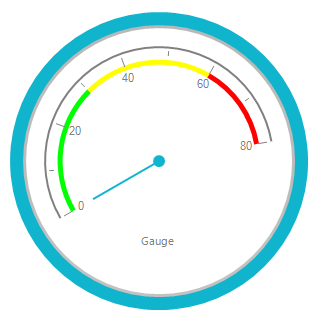
