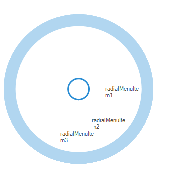

# Getting Started with Windows Forms Radial Menu

>**Important**
Starting with v16.2.0.x, if you refer to Syncfusion assemblies from trial setup or from the NuGet feed, include a license key in your projects. Refer to this [link](https://help.syncfusion.com/common/essential-studio/licensing/license-key) to learn about registering Syncfusion license key in your Windows Forms application to use our components.

This section describes how to add a `RadialMenu` control in a Windows Forms application and overview of its basic functionalities.

## Assembly deployment

Refer [control dependencies](https://help.syncfusion.com/windowsforms/control-dependencies#radialmenu) section to get the list of assemblies or NuGet package needs to be added as reference to use the control in any application.
 
Please find more details regarding how to install the nuget packages in windows form application in the below link:
 
[How to install nuget packages](https://help.syncfusion.com/windowsforms/installation/install-nuget-packages)

## Creating simple application with RadialMenu

You can create the Windows Forms application with RadialMenu control as follows:

1. [Creating project](#creating-the-project)
2. [Adding control via designer](#adding-control-via-designer)
3. [Adding control manually using code](#adding-control-manually-using-code)

### Creating the project

Create a new Windows Forms project in the Visual Studio to display the RadialMenu with basic information.

## Adding control via designer

RadialMenu control can be added to the application by dragging it from the toolbox and dropping it in a designer view. The following required assembly references will be added automatically:

* Syncfusion.Grid.Base.dll
* Syncfusion.Grid.Windows.dll
* Syncfusion.Shared.Base.dll
* Syncfusion.Shared.Windows.dll
* Syncfusion.Tools.Base.dll
* Syncfusion.Tools.Windows.dll

 

**Adding Menu Items**

Menu items can be added into RadialMenu using `Items` collection in Smart Tags of RadialMenu in design view.

 

## Adding control manually using code

To add control manually in C#, follow the given steps:

**Step 1:** Add the following required assembly references to the project:

 * Syncfusion.Tools.Base.dll
 * Syncfusion.Tools.Windows.dll
 * Syncfusion.Shared.Base.dll
 * Syncfusion.Shared.Windows.dll
 * Syncfusion.Grid.Base.dll
 * Syncfusion.Grid.Windows.dll

**Step 2:** Include the namespaces **Syncfusion.Windows.Forms.Tools**.





using Syncfusion.Windows.Forms.Tools;





Imports Syncfusion.Windows.Forms.Tools





**Step 3:** Create `RadialMenu` control instance and add it to the form. RadialMenu `Visible` property should be set `true` to make it visible initially.





RadialMenu radialMenu1 = new RadialMenu();

this.radialMenu1.Visible = true;

this.radialMenu1.Style = RadialMenuStyle.Office2016Colorful;

this.Controls.Add(radialMenu1);





Dim radialMenu1 As RadialMenu = New RadialMenu

Me.radialMenu1.Visible = True

Me.radialMenu1.Style = RadialMenuStyle.Office2016Colorful

Me.Controls.Add(radialMenu1)





 

**Adding menu items**

To add menu items, create an instance for the required menu item and add it to `Items` collection property in RadialMenu.





RadialMenuItem radialMenuItem1 = new RadialMenuItem();
RadialMenuItem radialMenuItem2 = new RadialMenuItem();
RadialMenuItem radialMenuItem3 = new RadialMenuItem();

this.radialMenuItem1.Text = "radialMenuItem1";
this.radialMenuItem2.Text = "radialMenuItem2";
this.radialMenuItem3.Text = "radialMenuItem3";

this.radialMenu1.Items.Add(this.radialMenuItem1);
this.radialMenu1.Items.Add(this.radialMenuItem2);
this.radialMenu1.Items.Add(this.radialMenuItem3);





Dim radialMenuItem1 As RadialMenuItem = New RadialMenuItem
Dim radialMenuItem2 As RadialMenuItem = New RadialMenuItem
Dim radialMenuItem3 As RadialMenuItem = New RadialMenuItem

Me.radialMenu1.Text = "radialMenuItem1"
Me.radialMenu2.Text = "radialMenuItem2"
Me.radialMenu3.Text = "radialMenuItem3"

Me.radialMenu1.Items.Add(this.radialMenuItem1)
Me.radialMenu2.Items.Add(this.radialMenuItem2)
Me.radialMenu3.Items.Add(this.radialMenuItem3)





 