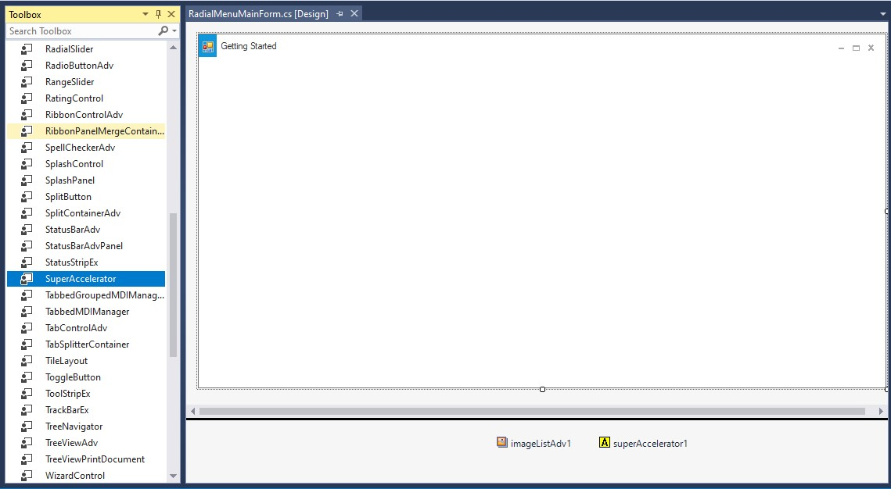
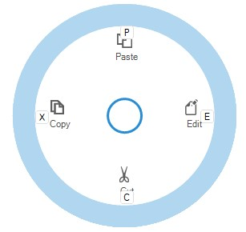

# Keyboard Support in Windows Forms RadialMenu

The RadialMenu control supports key tips for radial menu items, letting users quickly access radial menu items in a few keystrokes. When a user presses the Alt key, key tips for radial menu items are displayed. Pressing a key indicated in the key tip invokes the click event of the corresponding radial menu item.

## Add Super Accelerator

Follow the steps below to add the [`SuperAccelerator`](https://help.syncfusion.com/cr/windowsforms/Syncfusion.Windows.Forms.Tools.SuperAccelerator.html)

1. Drag-and-drop the `SuperAccelerator` on your form or creating the `SuperAccelerator` instance through code.

**Through Coding**




    SuperAccelerator superAccelerator1 = new SuperAccelerator(this);





2. To set a `SuperAccelerator` on use a SetAccelerator method to set the string value in radial menu item.

**Through Coding**




    this.superAccelerator1.SetAccelerator(radialMenuItem1, "E");

    this.superAccelerator1.SetAccelerator(radialMenuItem2, "C");

    this.superAccelerator1.SetAccelerator(radialMenuItem3, "X");

    this.superAccelerator1.SetAccelerator(radialMenuItem4, "P");





3. To accelerate the item’s click event at run time, Press the ALT key. All the specified accelerator strings will be displayed below the items.

4. Press the string in the keyboard and the corresponding item’s click event will be triggered. (Eg. If the accelerator string of Copy is X key, Press ALT key. Once all the accelerator strings are displayed, press X key the Copy item event will be triggered.)

> Note: Do not set same string value to multiple radial menu items.

## SuperAccelerator appearance

This section discusses the appearance settings of a `SuperAccelerator`. customizing a `SuperAccelerator` using a property of [`BackColor`](https://help.syncfusion.com/cr/windowsforms/Syncfusion.Windows.Forms.Tools.SuperAccelerator.html#Syncfusion_Windows_Forms_Tools_SuperAccelerator_BackColor),[`Font`](https://help.syncfusion.com/cr/windowsforms/Syncfusion.Windows.Forms.Tools.SuperAccelerator.html#Syncfusion_Windows_Forms_Tools_SuperAccelerator_Font) and [`ForeColor`](https://help.syncfusion.com/cr/windowsforms/Syncfusion.Windows.Forms.Tools.SuperAccelerator.html#Syncfusion_Windows_Forms_Tools_SuperAccelerator_ForeColor).





this.superAccelerator1.BackColor = Color.Red;
this.superAccelerator1.ForeColor = Color.White;
this.superAccelerator1.Font = new System.Drawing.Font("Arial", 8F, FontStyle.Italic);





### Style

SuperAccelerator supports visual styles such as Default, Office2016. The style can be set using `Appearance` property.

*	Default
*	Advanced
*	Office2016Colorful
*	Office2016White
*	Office2016DarkGray
*	Office2016Black





this.superAccelerator1.Appearance = Syncfusion.Windows.Forms.Tools.Appearance.Office2016Colorful;




