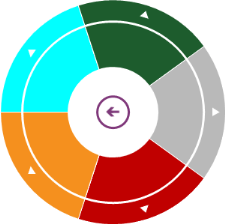
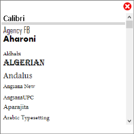
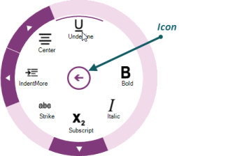

# Menu Elements in Windows Forms Radial Menu

## Radial Menu items

Radial Menu items are populated with the business object collection. Each menu item can be checked.

### Check mode

The CheckMode of a Radial Menu Item is defined with the following options:

* None - When the CheckMode is set to None, item can not be checked.
* CheckBox - When the CheckMode is set to CheckBox, you can check more than one item in the same level.
* RadioButton - When the CheckMode is set to RadioButton, you can check only one item in the same level.

### Grouping

Using Grouping functionality, you can group multiple items in the same level. This property is used when the [CheckMode](https://help.syncfusion.com/cr/windowsforms/Syncfusion.Windows.Forms.Tools.RadialMenuItem.html#Syncfusion_Windows_Forms_Tools_RadialMenuItem_CheckMode) property is set to Option.





this.radialMenuItem1.CheckMode = CheckMode.Check;

this.radialMenuItem2.CheckMode = CheckMode.Check;

this.radialMenuItem5.GroupName = "group1";

this.radialMenuItem5.CheckMode = CheckMode.Option;

this.radialMenuItem4.GroupName = "group1";

this.radialMenuItem4.CheckMode = CheckMode.Option;

this.radialMenuItem3.GroupName = "group1";

this.radialMenuItem3.CheckMode = CheckMode.Option;





Me.radialMenuItem1.CheckMode = CheckMode.Check
Me.radialMenuItem2.CheckMode = CheckMode.Check

Me.radialMenuItem5.GroupName = "group1"

Me.radialMenuItem5.CheckMode = CheckMode.Option
Me.radialMenuItem4.GroupName = "group1"

Me.radialMenuItem4.CheckMode = CheckMode.Option
Me.radialMenuItem3.GroupName "group1"

Me.radialMenuItem3.CheckMode = CheckMode.Option





## Radial color palette

[Radial Color Palette](https://help.syncfusion.com/cr/windowsforms/Syncfusion.Windows.Forms.Tools.RadialColorPalette.html) is formed in Radial Menu with the Radial Color Items and it is used to update the color.

## Radial font list box

[Radial Font List Box](https://help.syncfusion.com/cr/windowsforms/Syncfusion.Windows.Forms.Tools.RadialFontListBox.html) is formed in Radial Menu with installed font family and it is used to update the font style.

## Radial Menu Slider

[Radial Menu Slider](https://help.syncfusion.com/cr/windowsforms/Syncfusion.Windows.Forms.Tools.RadialMenuSlider.html) is formed in Radial Menu with minimum and maximum value and it is used to update the size.

## Icon

The Icon property of Radial Menu is used to customize the icon displayed in the center of Radial Menu circle. Icon is not displayed if it is not loaded.

