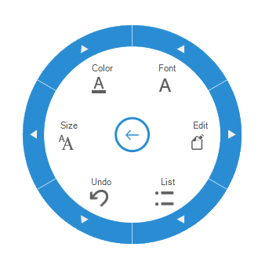
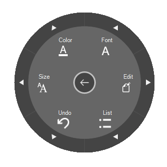

# Style in Windows Forms Radial Menu

The RadialMenu control has rich set of themes for professional representation. You can easily modify the look and feel of the RadialMenu using the built-in themes using the [Style](https://help.syncfusion.com/cr/windowsforms/Syncfusion.Windows.Forms.Tools.RadialMenu.html#Syncfusion_Windows_Forms_Tools_RadialMenu_Style) property of RadialMenu.

It has the below themes.

    •	Default

    •	Office2016Colorful

    •	Office2016White

    •	Office2016DarkGray

    •	Office2016Black

The following code example allows you to set the style for the RadialMenu.

## Default 

This option helps to set the Default theme.





this.radialMenu1.Style = Syncfusion.Windows.Forms.Tools.RadialMenuStyle.Default; 

 



Me.RadialMenu1.Style = Syncfusion.Windows.Forms.Tools.RadialMenuStyle.Default





## Office2016Colorful 

This option helps to set the Office2016Colorful theme.





this.radialMenu1.Style = Syncfusion.Windows.Forms.Tools.RadialMenuStyle.Office2016Colorful; 

 



Me.RadialMenu1.Style = Syncfusion.Windows.Forms.Tools.RadialMenuStyle.Office2016Colorful





## Office2016White 

This option helps to set the Office2016White theme.





this.radialMenu1.Style = Syncfusion.Windows.Forms.Tools.RadialMenuStyle.Office2016White; 

 



Me.RadialMenu1.Style = Syncfusion.Windows.Forms.Tools.RadialMenuStyle.Office2016White





## Office2016DarkGray

This option helps to set the Office2016DarkGray theme.





this.radialMenu1.Style = Syncfusion.Windows.Forms.Tools.RadialMenuStyle.Office2016DarkGray; 

 



Me.RadialMenu1.Style = Syncfusion.Windows.Forms.Tools.RadialMenuStyle.Office2016DarkGray





## Office2016Black

This option helps to set the Office2016Black theme.





this.radialMenu1.Style = Syncfusion.Windows.Forms.Tools.RadialMenuStyle.Office2016Black; 

 



Me.RadialMenu1.Style = Syncfusion.Windows.Forms.Tools.RadialMenuStyle.Office2016Black





