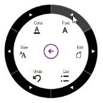
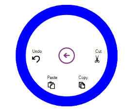
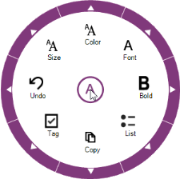
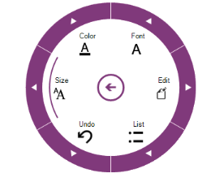
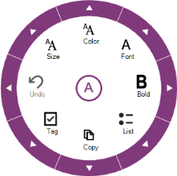
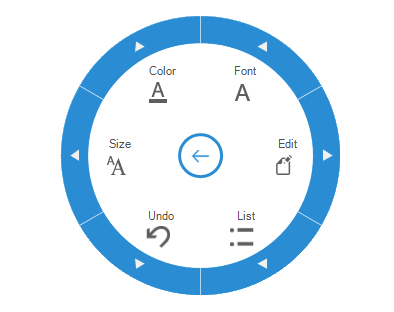
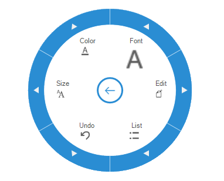

# Styling and Customization in Windows Forms Radial Menu

## Drill region

### Default state

[OuterArcColor](https://help.syncfusion.com/cr/windowsforms/Syncfusion.Windows.Forms.Tools.RadialMenu.html#Syncfusion_Windows_Forms_Tools_RadialMenu_OuterArcColor) is used to fill the drill-down region in the normal state.





// DrillDown color 
this.radialMenu1.OuterArcColor= Color.Black; 

 



' DrillDown color
Me.RadialMenu1.OuterArcColor = Color.Black





[OuterArcHighLightedColor](https://help.syncfusion.com/cr/windowsforms/Syncfusion.Windows.Forms.Tools.RadialMenu.html#Syncfusion_Windows_Forms_Tools_RadialMenu_OuterArcHighLightedColor) property is used to fill the drilldown region while hovering.





// DrillDown hover color
this.radialMenu1.OuterArcHighLightedColor = System.Drawing.Color.FromArgb(((int)(((byte)(64)))), ((int)(((byte)(64)))), ((int)(((byte)(64)))));</td></tr>





' DrillDown hover color
Me.radialMenu1.OuterArcHighLightedColor = System.Drawing.Color.FromArgb(((int)(((byte)(64)))), ((int)(((byte)(64)))), ((int)(((byte)(64)))))





## Outer rim (static region)

Outer edge is customized by using the [RimBackground](https://help.syncfusion.com/cr/windowsforms/Syncfusion.Windows.Forms.Tools.RadialMenu.html#Syncfusion_Windows_Forms_Tools_RadialMenu_RimBackground) and [OuterRimThickness](https://help.syncfusion.com/cr/windowsforms/Syncfusion.Windows.Forms.Tools.RadialMenu.html#Syncfusion_Windows_Forms_Tools_RadialMenu_OuterRimThickness) properties.

### Background

Outer Edge Background is customized using the following code example.





// OuterRim color

this.radialMenu1.RimBackground = Color.Blue;





' OuterRim color

 Me.radialMenu1.RimBackground = Color.Blue





## Thickness

The Thickness of the outer edge is set using the following code example.





// Rim thickness

this.radialMenu1.OuterRimThickness = 20;





' Rim thickness

Me.RadialMenu1.OuterRimThickness = 20





## Arc gap

The gap between highlighted Arc and Drilldown region is defined using the following code example.





//Gap between OuterRim and HoverArc

this.radialMenu1.OuterArcGap = 50;





' Gap between OuterRim and HoverArc

Me.RadialMenu1.OuterArcGap = 50





## Display style

The Display style of Radial Menu items is customized using different options. They are

* text above the image
* text below the image
* text or image only





// Display style of the text and image.

  this.radialMenu1.DisplayStyle = Syncfusion.Windows.Forms.Tools.DisplayStyle.ImageAboveText;





'Display style of the text and image.

Me.radialMenu1.DisplayStyle = Syncfusion.Windows.Forms.Tools.DisplayStyle. ImageAboveText





## Image Size

* `RadialMenu` control allows to change the size of the radial menu items images. The `MenuItemImageSize` property is used to change the image size of all radial menu items.





private RadialMenu radialMenu;

RadialMenuItem radialMenuItem1 = new RadialMenuItem();
RadialMenuItem radialMenuItem2 = new RadialMenuItem();
RadialMenuItem radialMenuItem3 = new RadialMenuItem();
RadialMenuItem radialMenuItem4 = new RadialMenuItem();
RadialMenuItem radialMenuItem5 = new RadialMenuItem();
RadialMenuItem radialMenuItem6 = new RadialMenuItem();

this.radialMenu.Style =RadialMenuStyle.Office2016Colorful;
this.radialMenu.DisplayStyle = DisplayStyle.ImageAboveText;
this.radialMenu.WedgeCount = 4;

this.radialMenuItem1.ImageIndex = 7;
this.radialMenuItem1.Text = "Edit";

this.radialMenuItem2.ImageIndex = 2;
this.radialMenuItem2.Text = "Cut";

this.radialMenuItem3.ImageIndex = 1;
this.radialMenuItem3.Text = "Copy";

this.radialMenuItem4.ImageIndex = 4;
this.radialMenuItem4.Text = "Paste";

this.radialMenu.Items.Add(this.radialMenuItem1);
this.radialMenu.Items.Add(this.radialMenuItem2);
this.radialMenu.Items.Add(this.radialMenuItem3);
this.radialMenu.Items.Add(this.radialMenuItem4);
this.radialMenu.Items.Add(this.radialMenuItem5);

// Customize all the image size of radialMenu items
this.radialMenu.MenuItemImageSize = new Size(24, 24);

this.radialMenu.Icon = global::GettingStartedDemo.Properties.Resources.A_Colorful;
this.radialMenu.MenuIcon = global::GettingStartedDemo.Properties.Resources.Arrow_Colorful;
this.radialMenu.Size = new System.Drawing.Size(280, 280);
this.radialMenu.Location = new System.Drawing.Point(339, 97);
this.radialMenu.OuterRimThickness = 28;
this.radialMenu.Visible = true;
this.Controls.Add(this.radialMenu);





* The `ImageSize` property is used to change the image size of each radial menu item.





private RadialMenu radialMenu;

RadialMenuItem radialMenuItem1 = new RadialMenuItem();
RadialMenuItem radialMenuItem2 = new RadialMenuItem();
RadialMenuItem radialMenuItem3 = new RadialMenuItem();
RadialMenuItem radialMenuItem4 = new RadialMenuItem();
RadialMenuItem radialMenuItem5 = new RadialMenuItem();
RadialMenuItem radialMenuItem6 = new RadialMenuItem();

this.radialMenu.Style =RadialMenuStyle.Office2016Colorful;
this.radialMenu.DisplayStyle = DisplayStyle.ImageAboveText;
this.radialMenu.WedgeCount = 4;

this.radialMenuItem1.ImageIndex = 7;
this.radialMenuItem1.Text = "Edit";

this.radialMenuItem2.ImageIndex = 2;
this.radialMenuItem2.Text = "Cut";

this.radialMenuItem3.ImageIndex = 1;
this.radialMenuItem3.Text = "Copy";

this.radialMenuItem4.ImageIndex = 4;
this.radialMenuItem4.Text = "Paste";

this.radialMenu.Items.Add(this.radialMenuItem1);
this.radialMenu.Items.Add(this.radialMenuItem2);
this.radialMenu.Items.Add(this.radialMenuItem3);
this.radialMenu.Items.Add(this.radialMenuItem4);
this.radialMenu.Items.Add(this.radialMenuItem5);

// Customize the image size of individual radialMenu item
this.radialMenuItem3.ImageSize = new Size(44, 44);

this.radialMenu.Icon = global::GettingStartedDemo.Properties.Resources.A_Colorful;
this.radialMenu.MenuIcon = global::GettingStartedDemo.Properties.Resources.Arrow_Colorful;
this.radialMenu.Size = new System.Drawing.Size(280, 280);
this.radialMenu.Location = new System.Drawing.Point(339, 97);
this.radialMenu.OuterRimThickness = 28;
this.radialMenu.Visible = true;
this.Controls.Add(this.radialMenu);





N> If the `ImageSize` is defined, setting the `MenuItemImageSize` property has no effect for particular radial menu item.

