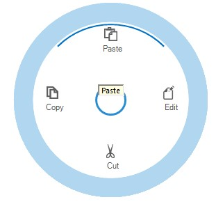

# Tooltip in Windows Forms RadialMenu

ToolTip is a small popup box that appears when the user moves the pointer over an element. By enabling [`ShowTooltip`](https://help.syncfusion.com/cr/windowsforms/Syncfusion.Windows.Forms.Tools.RadialMenu.html#Syncfusion_Windows_Forms_Tools_RadialMenu_ShowToolTip) property of RadialMenu, tooltip will display while hovering on radial menu items. It will display the exact text set in the `Text` property of each radial menu item.

The below code snippet will explain how to set tooltip for radial menu items.




RadialMenu radialMenu1 = new RadialMenu();

this.radialMenu1.Visible = true;

this.radialMenu1.Style = RadialMenuStyle.Office2016Colorful;

RadialMenuItem radialMenuItem1 = new RadialMenuItem();

RadialMenuItem radialMenuItem2 = new RadialMenuItem();

RadialMenuItem radialMenuItem3 = new RadialMenuItem();

RadialMenuItem radialMenuItem4 = new RadialMenuItem();

this.radialMenuItem1.Text = "Edit";

this.radialMenuItem2.Text = "Cut";

this.radialMenuItem3.Text = "Copy";

this.radialMenuItem4.Text = "Paste";

 this.radialMenu1.Items.Add(this.radialMenuItem1);

 this.radialMenu1.Items.Add(this.radialMenuItem2);

 this.radialMenu1.Items.Add(this.radialMenuItem3);

 this.radialMenu1.Items.Add(this.radialMenuItem4);

 this.radialMenu1.Items.Add(this.radialMenuItem5);

 this.Controls.Add(radialMenu1);





 Dim radialMenu1 As RadialMenu = New RadialMenu()

Me.radialMenu1.Visible = True

Me.radialMenu1.Style = RadialMenuStyle.Office2016Colorful

Dim radialMenuItem1 As RadialMenuItem = New RadialMenuItem()

Dim radialMenuItem2 As RadialMenuItem = New RadialMenuItem()

Dim radialMenuItem3 As RadialMenuItem = New RadialMenuItem()

Dim radialMenuItem4 As RadialMenuItem = New RadialMenuItem()

Me.radialMenuItem1.Text = "Edit"

Me.radialMenuItem2.Text = "Cut"

Me.radialMenuItem3.Text = "Copy"

Me.radialMenuItem4.Text = "Paste"

Me.radialMenu1.Items.Add(Me.radialMenuItem1)

Me.radialMenu1.Items.Add(Me.radialMenuItem2)

Me.radialMenu1.Items.Add(Me.radialMenuItem3)

Me.radialMenu1.Items.Add(Me.radialMenuItem4)

Me.radialMenu1.Items.Add(Me.radialMenuItem5)

Me.Controls.Add(radialMenu1)




