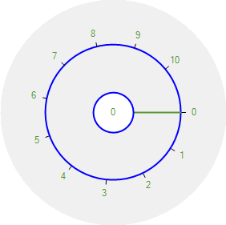
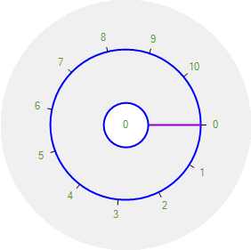
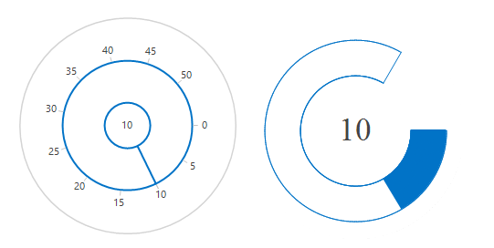
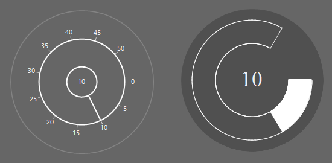

# Slider Customization in Windows Forms Radial Slider

## Slider background color

The background color for the radial slider can be customized using the [BackgroundColor](https://help.syncfusion.com/cr/windowsforms/Syncfusion.Windows.Forms.Tools.RadialSlider.html#Syncfusion_Windows_Forms_Tools_RadialSlider_BackgroundColor).





radialSlider1.BackgroundColor = System.Drawing.SystemColors.Navy;





radialSlider1.BackgroundColor = System.Drawing.SystemColors.Navy





## Circle color

The circle color of the [RadialSlider](https://help.syncfusion.com/cr/windowsforms/Syncfusion.Windows.Forms.Tools.RadialSlider.html) can be customized using the [InnerCircleColor](https://help.syncfusion.com/cr/windowsforms/Syncfusion.Windows.Forms.Tools.RadialSlider.html#Syncfusion_Windows_Forms_Tools_RadialSlider_InnerCircleColor) and [OuterCircleColor](https://help.syncfusion.com/cr/windowsforms/Syncfusion.Windows.Forms.Tools.RadialSlider.html#Syncfusion_Windows_Forms_Tools_RadialSlider_OuterCircleColor) properties.





radialSlider1.InnerCircleColor = System.Drawing.Color.Blue;
radialSlider1.OuterCircleColor = System.Drawing.Color.Blue;





radialSlider1.InnerCircleColor = System.Drawing.Color.Blue
radialSlider1.OuterCircleColor = System.Drawing.Color.Blue





## Needle color

The needle color of the **RadialSlider** can be customized using the [SliderNeedleColor](https://help.syncfusion.com/cr/windowsforms/Syncfusion.Windows.Forms.Tools.RadialSlider.html#Syncfusion_Windows_Forms_Tools_RadialSlider_SliderNeedleColor) property.





radialSlider1.SliderNeedleColor = System.Drawing.Color.DarkViolet;





radialSlider1.SliderNeedleColor = System.Drawing.Color.DarkViolet





## Fore color

The foreground color of the **RadialSlider** can be customized using the [ForeColor](https://learn.microsoft.com/en-us/dotnet/api/system.windows.forms.control.forecolor?view=netframework-4.7.2) property.





radialSlider1.ForeColor = System.Drawing.Color.BlueViolet;





radialSlider1.ForeColor = System.Drawing.Color.BlueViolet





## Needle type

The needle type of the **RadialSlider** can be customized using the [NeedleType](https://help.syncfusion.com/cr/windowsforms/Syncfusion.Windows.Forms.Tools.RadialSlider.html#Syncfusion_Windows_Forms_Tools_RadialSlider_NeedleType) enumeration. Available needle types in the RadialSlider are:

* Straight Line (Default)
* Dotted Line





radialSlider1.NeedleType = Syncfusion.Windows.Forms.Tools.SliderNeedleType.DottedLine;





radialSlider1.NeedleType = Syncfusion.Windows.Forms.Tools.SliderNeedleType.DottedLine





## Visual Style

The **RadialSlider** control contains a rich set of themes for professional representation. You can easily modify the look and feel of the RadialSlider using built-in themes.

The following options are available in RadialSlider:

* Default
* Office2016Colorful
* Office2016White
* Office2016DarkGray
* Office2016Black

### Default

This option helps to set the default theme.





radialSlider1.Style = Syncfusion.Windows.Forms.Tools.RadialSliderStyle.Default;





radialSlider1.Style = Syncfusion.Windows.Forms.Tools.RadialSliderStyle.Default





 

### Office2016Colorful

This option helps to set the Office2016Colorful theme.





radialSlider1.Style = Syncfusion.Windows.Forms.Tools.RadialSliderStyle.Office2016Colorful;





radialSlider1.Style = Syncfusion.Windows.Forms.Tools.RadialSliderStyle.Office2016Colorful





### Office2016White

This option helps to set the Office2016White theme.





radialSlider1.Style = Syncfusion.Windows.Forms.Tools.RadialSliderStyle.Office2016White;





radialSlider1.Style = Syncfusion.Windows.Forms.Tools.RadialSliderStyle.Office2016White





### Office2016DarkGray

This option helps to set the Office2016DarkGray theme.





radialSlider1.Style = Syncfusion.Windows.Forms.Tools.RadialSliderStyle.Office2016DarkGray;





radialSlider1.Style = Syncfusion.Windows.Forms.Tools.RadialSliderStyle.Office2016DarkGray





 

### Office2016Black

This option helps to set the Office2016Black theme.





radialSlider1.Style = Syncfusion.Windows.Forms.Tools.RadialSliderStyle.Office2016Black;





radialSlider1.Style = Syncfusion.Windows.Forms.Tools.RadialSliderStyle.Office2016Black





