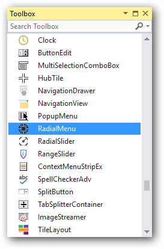
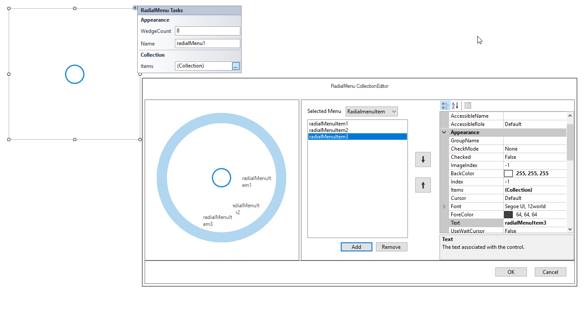

# Getting started

This section describes how to add a `RadialMenu` control in a Windows Forms application and overview of its basic functionalities.

## Assembly deployment

The following list of assemblies should be added as reference to use the RadialMenu in any application:

<table>
<tr>
<td>
{{'**Required assemblies**'| markdownify }}
</td>
<td>
{{'**Description**'| markdownify }}
</td>
</tr>
<tr>
<td>
Syncfusion.Grid.Base.dll
</td>
<td>
Syncfusion.Grid.Base contains classes that contains fundamentals and base classes of GridControl.
</td>
</tr>
<tr>
<td>
Syncfusion.Grid.Windows.dll
</td>
<td>
Syncfusion.Grid.Windows contains classes that handles all UI operations, fundamentals and base classes of GridControl which are used in the RadialMenu control.
</td>
</tr>
<tr>
<td>
Syncfusion.Shared.Base.dll
</td>
<td>
Syncfusion.Shared.Base contains style related properties of RadialMenu and various editor controls.
</td>
</tr>
<tr>
<td>
Syncfusion.Shared.Windows.dll
</td>
<td>
Syncfusion.Shared.Windows contains style related properties of RadialMenu and various editor controls.
</td>
</tr>
<tr>
<td>
Syncfusion.Tools.Base.dll
</td>
<td>
Syncfusion.Tools.Base contains base class which used for RadialMenu control.
</td>
</tr>
<tr>
<td>
Syncfusion.Tools.Windows.dll
</td>
<td>
Syncfusion.Tools.Windows contains the class that handles all UI operations and contains helper class of RadialMenu control.
</td>
</tr>
</table>

## Installing NuGet Packages

To use RadialMenu control in Windows Forms application via nuget, the following packages should be installed.
 
<table>
<tr>
<td>{{'**S.No**'| markdownify }}
</td>
<td>{{'**Framework version**'| markdownify }}
</td>
<td>{{'**NuGet Packages**'| markdownify }}
</td>
</tr>
<tr>
<td> 1
</td>
<td> 2.0
</td>
<td> Syncfusion.Tools.Windows20
</td>
</tr>
<tr>
<td> 2
</td>
<td> 3.5
</td>
<td> Syncfusion.Tools.Windows35
</td>
</tr>
<tr>
<td> 3
</td>
<td> 4.0
</td>
<td> Syncfusion.Tools.Windows40
</td>
</tr>
<tr>
<td> 4
</td>
<td> 4.5
</td>
<td> Syncfusion.Tools.Windows45
</td>
</tr>
<tr>
<td> 5
</td>
<td> 4.5.1
</td>
<td>Syncfusion.Tools.Windows451
</td>
</tr>
<tr>
<td> 6
</td>
<td> 4.6
</td>
<td>Syncfusion.Tools.Windows46
</td>
</tr>
</table>
 
Please find more details regarding how to install the nuget packages in windows form application in the below link:
 
[How to install nuget packages](https://help.syncfusion.com/windowsforms/nuget-packages)

# Creating simple application with RadialMenu

You can create the Windows Forms application with RadialMenu control as follows:

1. [Creating project](#creating-the-project)
2. [Adding control via Designer](#adding-control-via-designer)
3. [Adding control manually in code](#adding-control-manually-in-code)

### Creating the project

Create a new Windows Forms project in the Visual Studio to display the RadialMenu with basic information.

## Adding control via designer

RadialMenu control can be added to the application by dragging it from the toolbox and dropping it in a designer view. The following required assembly references will be added automatically:

* Syncfusion.Grid.Base.dll
* Syncfusion.Grid.Windows.dll
* Syncfusion.Shared.Base.dll
* Syncfusion.Shared.Windows.dll
* Syncfusion.Tools.Base.dll
* Syncfusion.Tools.Windows.dll

 

**Adding Menu Items**

Menu items can be added into RadialMenu using `Items` collection in Samrt Tags of RadialMenu in design view.

 

## Adding control manually in code

To add control manually in C#, follow the given steps:

**Step 1:** Add the following required assembly references to the project:

 * Syncfusion.Tools.Base.dll
 * Syncfusion.Tools.Windows.dll
 * Syncfusion.Shared.Base.dll
 * Syncfusion.Shared.Windows.dll
 * Syncfusion.Grid.Base.dll
 * Syncfusion.Grid.Windows.dll

**Step 2:** Include the namespaces **Syncfusion.Windows.Forms.Tools**.





using Syncfusion.Windows.Forms.Tools;





Imports Syncfusion.Windows.Forms.Tools





**Step 3:** Create `RadialMenu` control instance and add it to the form. RadialMenu `Visible` property should be set `true` to make it visible initially.





RadialMenu radialMenu1 = new RadialMenu();

this.radialMenu1.Visible = true;

this.radialMenu1.Style = RadialMenuStyle.Office2016Colorful;

this.Controls.Add(radialMenu1);





Dim radialMenu1 As RadialMenu = New RadialMenu

Me.radialMenu1.Visible = True

Me.radialMenu1.Style = RadialMenuStyle.Office2016Colorful

Me.Controls.Add(radialMenu1)





 

**Adding Menu Items**

To add menu items, create an instance for the required menu item and add it to `Items` collection property in RadialMenu.





RadialMenuItem radialMenuItem1 = new RadialMenuItem();
RadialMenuItem radialMenuItem2 = new RadialMenuItem();
RadialMenuItem radialMenuItem3 = new RadialMenuItem();

this.radialMenuItem1.Text = "radialMenuItem1";
this.radialMenuItem2.Text = "radialMenuItem2";
this.radialMenuItem3.Text = "radialMenuItem3";

this.radialMenu1.Items.Add(this.radialMenuItem1);
this.radialMenu1.Items.Add(this.radialMenuItem2);
this.radialMenu1.Items.Add(this.radialMenuItem3);





Dim radialMenuItem1 As RadialMenuItem = New RadialMenuItem
Dim radialMenuItem2 As RadialMenuItem = New RadialMenuItem
Dim radialMenuItem3 As RadialMenuItem = New RadialMenuItem

Me.radialMenu1.Text = "radialMenuItem1"
Me.radialMenu2.Text = "radialMenuItem2"
Me.radialMenu3.Text = "radialMenuItem3"

Me.radialMenu1.Items.Add(this.radialMenuItem1)
Me.radialMenu2.Items.Add(this.radialMenuItem2)
Me.radialMenu3.Items.Add(this.radialMenuItem3)





 