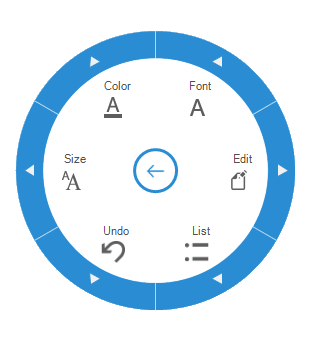

# Overview

The `RadialMenu` comprises a hierarchical menu in a circular layout. It is used as a context menu and configured with familiar items for quick access.

### Key features

* **Configurable MenuItems** - Provides options to set completely customizable menu items and submenu items.

* **RadialMenuSlider** - Provides options to get numerical inputs values within a maximum and minimum range.

* **RadialColorPalette** - Provides options to get color inputs with optional customizable palette support.

* **RadialFontListBox** - Provides option to get font style from the numerous built-in font list.

* **Display style** - Provides options to set DisplayStyle such as Text, Image, TextAboveImage or ImageAboveText.

* **Image settings** - Provides options to set menu centre icon as well as images for menu items.

