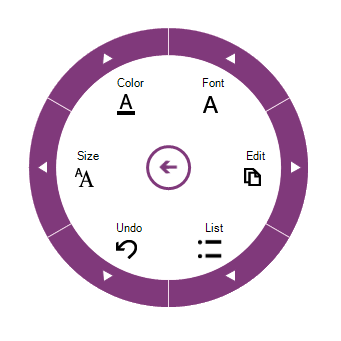
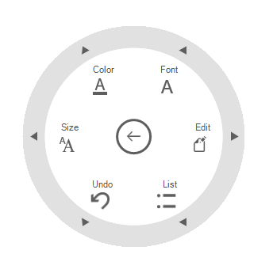
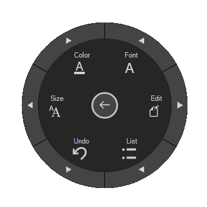

# Style

The RadialMenu control has rich set of themes for professional representation. You can easily modify the look and feel of the RadialMenu using the built-in themes.

It has the below themes.

•	Default

•	Office2016Colorful

•	Office2016White

•	Office2016DarkGray

•	Office2016Black

The following code example allows you to set the style for the RadialMenu.

## Default 

This option helps to set the Default theme.





this.radialMenu1.Style = Syncfusion.Windows.Forms.Tools.RadialMenuStyle.Default; 

 



Me.RadialMenu1.Style = Syncfusion.Windows.Forms.Tools.RadialMenuStyle.Default





## Office2016Colorful 

This option helps to set the Office2016Colorful theme.





this.radialMenu1.Style = Syncfusion.Windows.Forms.Tools.RadialMenuStyle.Office2016Colorful; 

 



Me.RadialMenu1.Style = Syncfusion.Windows.Forms.Tools.RadialMenuStyle.Office2016Colorful





## Office2016White 

This option helps to set the Office2016White theme.





this.radialMenu1.Style = Syncfusion.Windows.Forms.Tools.RadialMenuStyle.Office2016White; 

 



Me.RadialMenu1.Style = Syncfusion.Windows.Forms.Tools.RadialMenuStyle.Office2016White





## Office2016DarkGray

This option helps to set the Office2016DarkGray theme.





this.radialMenu1.Style = Syncfusion.Windows.Forms.Tools.RadialMenuStyle.Office2016DarkGray; 

 



Me.RadialMenu1.Style = Syncfusion.Windows.Forms.Tools.RadialMenuStyle.Office2016DarkGray





## Office2016Black

This option helps to set the Office2016Black theme.





this.radialMenu1.Style = Syncfusion.Windows.Forms.Tools.RadialMenuStyle.Office2016Black; 

 



Me.RadialMenu1.Style = Syncfusion.Windows.Forms.Tools.RadialMenuStyle.Office2016Black





