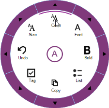

# Styling and Customization

## Drill Region

### Default State

OuterArcColor is used to fill the drilldown region in the normal state.



// DrillDown 
colorthis.radialMenu1.OuterArcColor= Color.Black; 

 



' DrillDown 
colorMe.RadialMenu1.OuterArcColor = Color.Black



OuterArcHighLightedColor property is used to fill the drilldown region while hovering.



// DrillDown hover color
this.radialMenu1.OuterArcHighLightedColor = System.Drawing.Color.FromArgb(((int)(((byte)(64)))), ((int)(((byte)(64)))), ((int)(((byte)(64)))));</td></tr>





' DrillDown hover color
Me.radialMenu1.OuterArcHighLightedColor = System.Drawing.Color.FromArgb(((int)(((byte)(64)))), ((int)(((byte)(64)))), ((int)(((byte)(64)))))



## Outer Rim (Static Region)

Outer edge is customized by using the RimBackground and OuterRimThickness properties.

### Background

Outer Edge Background is customized using the following code example.



// OuterRim color

this.radialMenu1.RimBackground = Color.Blue;





' OuterRim color

 Me.radialMenu1.RimBackground = Color.Blue



## Thickness

The Thickness of the outer edge is set using the following code example.



// Rim thickness

this.radialMenu1.OuterRimThickness = 20;





' Rim thickness

Me.RadialMenu1.OuterRimThickness = 20



## Arc Gap

The gap between highlighted Arc and Drilldown region is defined using the following code example.



//Gap between OuterRim and HoverArc

this.radialMenu1.OuterArcGap = 50;





' Gap between OuterRim and HoverArc

Me.RadialMenu1.OuterArcGap = 50



## Display Style

The Display style of Radial Menu items is customized using different options. They are

* text above the image 
* text below the image
* text or image only 



// Display style of the text and image.

  this.radialMenu1.DisplayStyle = Syncfusion.Windows.Forms.Tools.DisplayStyle.ImageAboveText;





'Display style of the text and image.

Me.radialMenu1.DisplayStyle = Syncfusion.Windows.Forms.Tools.DisplayStyle. ImageAboveText



