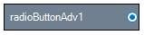

# Alignment Settings in Windows Forms Radio Button (RadioButtonAdv)

This section discusses the alignment settings of the RadioButtonAdv.

## Text alignment

Text in the RadioButtonAdv can be aligned to the desired location as given below.

<table>
<tr>
<th>
RadioButtonAdv Properties</th><th>
Description</th></tr>
<tr>
<td>
TextContentAlignment</td><td>
Indicates the alignment of the text. The default value is set to 'MiddleLeft'.The options included are as follows.{{ '_TopLeft,_' | markdownify }} {{ '_TopCenter,_' | markdownify }} {{ '_TopRight,_' | markdownify }} {{ '_MiddleLeft,_' | markdownify }} {{ '_MiddleCenter,_' | markdownify }} {{ '_MiddleRight,_' | markdownify }} {{ '_BottomLeft,_' | markdownify }} {{ '_BottomCenter and_' | markdownify }} {{ '_BottomRight._' | markdownify }} WrapText property must be set to 'False'. Refer {{'[Text Settings](https://help.syncfusion.com/windowsforms/radiobuttonadv/text-settings)' | markdownify }}.</td></tr>
</table>




this.radioButtonAdv1.TextContentAlignment = System.Drawing.ContentAlignment.MiddleCenter;





Me.radioButtonAdv1.TextContentAlignment = System.Drawing.ContentAlignment.MiddleCenter




 

## RadioButton alignment

The RadioButton itself can be aligned to any desired location that can be chosen from the options given in the following property.

<table>
<tr>
<th>
RadioButtonAdv Properties</th><th>
Description</th></tr>
<tr>
<td>
CheckAlign</td><td>
Indicates the alignment of the RadioButton. The default value is set to 'MiddleLeft'.The options included are as follows.{{ '_TopLeft,_' | markdownify }} {{ '_TopCenter,_' | markdownify }} {{ '_TopRight,_' | markdownify }} {{ '_MiddleLeft,_' | markdownify }} {{ '_MiddleCenter,_' | markdownify }} {{ '_MiddleRight,_' | markdownify }} {{ '_BottomLeft,_' | markdownify }} {{ '_BottomCenter and_' | markdownify }} {{ '_BottomRight._' | markdownify }}</td></tr>
</table>




this.radioButtonAdv1.CheckAlign = System.Drawing.ContentAlignment.MiddleRight;





Me.radioButtonAdv1.CheckAlign = System.Drawing.ContentAlignment.MiddleRight




