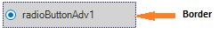
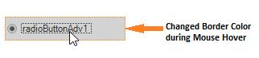

# Border Settings in Windows Forms Radio Button (RadioButtonAdv)

Color and Styles can be applied to the border of the RadioButtonAdv as discussed below.

<table>
<tr>
<th>
RadioButtonAdv Properties</th><th>
Description</th></tr>
<tr>
<td>
Border3DStyle</td><td>
Indicates the style of the 3D border. The options included are as follows.{{ '_RaisedOuter,_' | markdownify }} {{ '_SunkenOuter,_' | markdownify }} {{ '_RaisedInner,_' | markdownify }} {{ '_SunkenInner,_' | markdownify }} {{ '_Raised,_' | markdownify }} {{ '_Etched,_' | markdownify }} {{ '_Bump,_' | markdownify }} {{ '_Sunken,_' | markdownify }} {{ '_Adjust and_' | markdownify }} {{ '_Flat._' | markdownify }} The default value is set to 'Sunken'.</td></tr>
<tr>
<td>
BorderColor</td><td>
Specifies the color of the 2D border.</td></tr>
<tr>
<td>
BorderSingle</td><td>
Indicates the 2D border style. The options included are as follows.{{ '_Dotted,_' | markdownify }} {{ '_Dashed,_' | markdownify }} {{ '_Solid,_' | markdownify }} {{ '_Inset,_' | markdownify }} {{ '_Outset and_' | markdownify }} {{ '_None._' | markdownify }} The BorderStyle property should be set to 'FixedSingle'.</td></tr>
<tr>
<td>
BorderStyle</td><td>
Indicates whether the panel should have a border. The options included are given below.{{ '_FixedSingle,_' | markdownify }} {{ '_Fixed3D and_' | markdownify }} {{ '_None._' | markdownify }}</td></tr>
<tr>
<td>
HotBorderColor</td><td>
Specifies the color of the FixedSingle border when MouseOver.</td></tr>
</table>




this.radioButtonAdv1.BorderColor = System.Drawing.Color.Fuchsia;
this.radioButtonAdv1.BorderStyle = System.Windows.Forms.BorderStyle.FixedSingle;
this.radioButtonAdv1.BorderSingle = System.Windows.Forms.ButtonBorderStyle.Dotted;
this.radioButtonAdv1.Border3DStyle = System.Windows.Forms.Border3DStyle.RaisedInner;

// BorderStyle must be set to 'FixedSingle'.

this.radioButtonAdv1.HotBorderColor = System.Drawing.Color.DarkOrange; 





Me.radioButtonAdv1.BorderColor = System.Drawing.Color.Fuchsia
Me.radioButtonAdv1.BorderStyle = System.Windows.Forms.BorderStyle.FixedSingle
Me.radioButtonAdv1.BorderSingle = System.Windows.Forms.ButtonBorderStyle.Dotted
Me.radioButtonAdv1.Border3DStyle = System.Windows.Forms.Border3DStyle.RaisedInner

' BorderStyle must be set to 'FixedSingle'.
Me.radioButtonAdv1.HotBorderColor = System.Drawing.Color.DarkOrange




  

  
