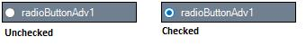

# RadioButtonAdv Settings in Windows Forms Radio Button (RadioButtonAdv)

This section discusses the various states of the RadioButtonAdv control and the method of associating values with the states.

## RadioButtonAdv states

The RadioButtonAdv can be displayed in two different states which have been described below.

<table>
<tr>
<th>
RadioButtonAdv Property</th><th>
Description</th></tr>
<tr>
<td>
Checked</td><td>
Gets / sets the check state of the RadioButton.</td></tr>
</table>




this.radioButtonAdv1.Checked = true;





Me.radioButtonAdv1.Checked = True




 

## RadioButtonAdv values

This section discusses how values can be associated with the various check states.

Both integer and string values can be associated with the check states as follows.

<table>
<tr>
<th>
RadioButtonAdv Properties</th><th>
Description</th></tr>
<tr>
<td>
CheckedInt</td><td>
Specifies the integer value when checked. </td></tr>
<tr>
<td>
CheckedString</td><td>
Specifies the string value when checked.</td></tr>
<tr>
<td>
UncheckedInt</td><td>
Specifies the integer value when Unchecked.</td></tr>
<tr>
<td>
UncheckedString</td><td>
Specifies the string value when Unchecked.</td></tr>
<tr>
<td>
IntValue</td><td>
Gets / sets checked RadioButtonAdv in current container according to the TabIndex.</td></tr>
</table>




this.radioButtonAdv1.CheckedInt = 3;
this.radioButtonAdv1.CheckedString = "RadioButtonAdv is Checked";
this.radioButtonAdv1.UncheckedInt = 3;
this.radioButtonAdv1.UncheckedString = "RadioButtonAdv is Unchecked";
this.radioButtonAdv1.IntValue = 5;





Me.radioButtonAdv1.CheckedInt = 3
Me.radioButtonAdv1.CheckedString = "RadioButtonAdv is Checked"
Me.radioButtonAdv1.UncheckedInt = 3
Me.radioButtonAdv1.UncheckedString = "RadioButtonAdv is Unchecked"
Me.radioButtonAdv1.IntValue = 5



