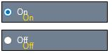

# Text Settings in Windows Forms Radio Button

This section discusses the text settings of the Radio Button.

Text in the Radio Button can be shadowed and wrapped as illustrated below.

<table>
<tr>
<th>
Radio Button Properties</th><th>
Description</th></tr>
<tr>
<td>
TextShadow</td><td>
Determines if the text shadow is visible.</td></tr>
<tr>
<td>
ShadowColor</td><td>
Specifies the color of the text shadow.</td></tr>
<tr>
<td>
ShadowOffset</td><td>
Specifies the offset of the text shadow.</td></tr>
<tr>
<td>
WrapText</td><td>
Determines if the text in the CheckBoxAdv is wrapped.</td></tr>
</table>




this.radioButtonAdv1.TextShadow = true;
this.radioButtonAdv1.ShadowColor = System.Drawing.Color.Gold;
this.radioButtonAdv1.ShadowOffset = new System.Drawing.Point(8, 8);





Me.radioButtonAdv1.TextShadow = True
Me.radioButtonAdv1.ShadowColor = System.Drawing.Color.Gold
Me.radioButtonAdv1.ShadowOffset = New System.Drawing.Point(8, 8)




