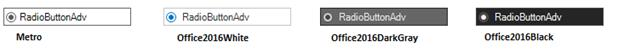

# Themes and Visual Styles of RadioButtonAdv in Windows Forms Radio Button (RadioButtonAdv)

This section discusses the themes and visual style settings that are supported by the RadioButtonAdv control.

## Themes

The RadioButtonAdv can be provided with a themed appearance using the below given property.

<table>
<tr>
<th>
RadioButtonAdv Property</th><th>
Description</th></tr>
<tr>
<td>
ThemesEnabled</td><td>
Specifies whether themes are enabled for RadioButtonAdv.</td></tr>
</table>




this.radioButtonAdv1.ThemesEnabled = true;





Me.radioButtonAdv1.ThemesEnabled = True




 

### Visual styles

The appearance of the CheckBoxAdv control can be customized using the various options provided by the following properties.

<table>
<tr>
<th>
RadioButtonAdv Properties</th><th>
Description</th></tr>
<tr>
<td>
Style</td><td>
Gets or sets an advanced appearance for the RadioButtonAdv.The options included are as follows.

* {{ '_Default_' | markdownify }}
* {{ '_Office2007_' | markdownify }}
* {{ '_Metro_' | markdownify }}
* {{ '_Office2016Colorful_' | markdownify }}
* {{ '_Office2016White_' | markdownify }}
* {{ '_Office2016Black_' | markdownify }}
* {{ '_Office2016DarkGray_' | markdownify }}

</td></tr>
<tr>
<td>
Office2007ColorScheme</td><td>
Gets or sets Office 2007 color scheme.The options included are as follows.{{ '_Managed,_' | markdownify }} {{ '_Blue,_' | markdownify }} {{ '_Silver and_' | markdownify }} {{ '_Black._' | markdownify }} The Style property should be set to "Office2007".</td></tr>
</table>




this.radioButtonAdv1.Style = Syncfusion.Windows.Forms.Tools.RadioButtonAdvStyle.Office2016Colorful;





Me.radioButtonAdv1.Style = Syncfusion.Windows.Forms.Tools.RadioButtonAdvStyle.Office2016Colorful




  

When the Office2007ColorScheme property is set to 'Managed', the RadioButton in the RadioButtonAdv can be displayed using custom colors supported by the control.

This can be done programmatically as follows.




this.radioButtonAdv1.Style = Syncfusion.Windows.Forms.Tools.RadioButtonAdvStyle.Office2007;
this.radioButtonAdv1.Office2007ColorScheme = Syncfusion.Windows.Forms.Office2007Theme.Managed;
Office2007Colors.ApplyManagedColors(this, Color.Red);





Me.radioButtonAdv1.Style = Syncfusion.Windows.Forms.Tools.RadioButtonAdvStyle.Office2007
Me.radioButtonAdv1.Office2007ColorScheme = Syncfusion.Windows.Forms.Office2007Theme.Managed
Office2007Colors.ApplyManagedColors(Me, Color.Red)




 
