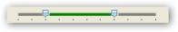
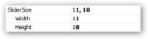

# Interactive Features in Windows Forms Range Slider

The following are the key interactive features of the Range Slider:

* [Range](https://help.syncfusion.com/cr/windowsforms/Syncfusion.Windows.Forms.Tools.RangeSlider.html#Syncfusion_Windows_Forms_Tools_RangeSlider_Range)-Specifies the Range of the control, generally indicated by a Start and End value.
* [TickFrequency](https://help.syncfusion.com/cr/windowsforms/Syncfusion.Windows.Forms.Tools.RangeSlider.html#Syncfusion_Windows_Forms_Tools_RangeSlider_TickFrequency)-Specifies the frequency at which Ticks are to be placed.
* [Minimum](https://help.syncfusion.com/cr/windowsforms/Syncfusion.Windows.Forms.Tools.RangeSlider.html#Syncfusion_Windows_Forms_Tools_RangeSlider_Minimum)-Specifies the Minimum value of the Range Slider.
* [Maximum](https://help.syncfusion.com/cr/windowsforms/Syncfusion.Windows.Forms.Tools.RangeSlider.html#Syncfusion_Windows_Forms_Tools_RangeSlider_Maximum)-Specifies the Maximum value of the Range Slider.
* [ChannelColor](https://help.syncfusion.com/cr/windowsforms/Syncfusion.Windows.Forms.Tools.RangeSlider.html#Syncfusion_Windows_Forms_Tools_RangeSlider_ChannelColor)-Specifies the color for the channel.
* [ChannelHeight](https://help.syncfusion.com/cr/windowsforms/Syncfusion.Windows.Forms.Tools.RangeSlider.html#Syncfusion_Windows_Forms_Tools_RangeSlider_ChannelHeight)-Specifies the height for the channel.
* [RangeColor](https://help.syncfusion.com/cr/windowsforms/Syncfusion.Windows.Forms.Tools.RangeSlider.html#Syncfusion_Windows_Forms_Tools_RangeSlider_RangeColor)-Specifies the color for the range.
* [RightToLeft](https://learn.microsoft.com/en-us/dotnet/api/system.windows.forms.control.righttoleft?redirectedfrom=MSDN&view=netframework-4.7.2#System_Windows_Forms_Control_RightToLeft)-Allows reversal of the RangeSlider.
* [SliderSize](https://help.syncfusion.com/cr/windowsforms/Syncfusion.Windows.Forms.Tools.RangeSlider.html#Syncfusion_Windows_Forms_Tools_RangeSlider_SliderSize)- Specifies the size of the slider.
* [ThumbColor](https://help.syncfusion.com/cr/windowsforms/Syncfusion.Windows.Forms.Tools.RangeSlider.html#Syncfusion_Windows_Forms_Tools_RangeSlider_ThumbColor)- Specifies the color of the thumb.
* [ShowTicks](https://help.syncfusion.com/cr/windowsforms/Syncfusion.Windows.Forms.Tools.RangeSlider.html#Syncfusion_Windows_Forms_Tools_RangeSlider_ShowTicks)- Specifies the visibility of the thumb.
* [TickFrequency](https://help.syncfusion.com/cr/windowsforms/Syncfusion.Windows.Forms.Tools.RangeSlider.html#Syncfusion_Windows_Forms_Tools_RangeSlider_TickFrequency)- Specifies the frequency of ticks.
* [Orientation](https://help.syncfusion.com/cr/windowsforms/Syncfusion.Windows.Forms.Tools.RangeSlider.html#Syncfusion_Windows_Forms_Tools_RangeSlider_Orientation)- Specifies the orientation of the RangeSlider.
* [SliderMin](https://help.syncfusion.com/cr/windowsforms/Syncfusion.Windows.Forms.Tools.RangeSlider.html#Syncfusion_Windows_Forms_Tools_RangeSlider_SliderMin) and [SliderMax](https://help.syncfusion.com/cr/windowsforms/Syncfusion.Windows.Forms.Tools.RangeSlider.html#Syncfusion_Windows_Forms_Tools_RangeSlider_SliderMax)- Specifies the position of right and left thumb.

This section discusses the concepts of Range Slider in the below topics:

## Setting channel color

You can set the required color for the channel over which the slider moves using [ChannelColor](https://help.syncfusion.com/cr/windowsforms/Syncfusion.Windows.Forms.Tools.RangeSlider.html#Syncfusion_Windows_Forms_Tools_RangeSlider_ChannelColor) property. It contains the highlight when a range is selected. In the following example, the channel color is set to Gray.





rangeSlider.ChannelColor = Color.DarkGray;





Output

## Setting channel height

You can set the required height of the channel over which the slider moves using the [ChannelHeight](https://help.syncfusion.com/cr/windowsforms/Syncfusion.Windows.Forms.Tools.RangeSlider.html#Syncfusion_Windows_Forms_Tools_RangeSlider_ChannelHeight) property. In the following example illustrates the change in height of the channel from 4 to 6. It is measured in pixels.

1. When the Channel height is set to 4 pixels.
   
   
   

   

		rangeSlider.ChannelHeight = 4;

   

   
   
   {{ codesnippet1 | OrderList_Indent_Level_1 }}

   

 
   

2. When the Channel height is set to 6 pixels.

  
  

   

		rangeSlider.ChannelHeight = 6;

  

   
   
   {{ codesnippet2 | OrderList_Indent_Level_1 }}

## Setting range color

You can set the required color for a range in the slider using the [RangeColor](https://help.syncfusion.com/cr/windowsforms/Syncfusion.Windows.Forms.Tools.RangeSlider.html#Syncfusion_Windows_Forms_Tools_RangeSlider_RangeColor) property. The selected range is highlighted with color chosen. In the following example, the range color is set to Green.





rangeSlider.RangeColor = Color.DarkGreen;





## Reversing RangeSlider

The position of the thumbs on the RangeSlider can be reversed by setting the [RightToLeft](https://learn.microsoft.com/en-us/dotnet/api/system.windows.forms.control.righttoleft?redirectedfrom=MSDN&view=netframework-4.7.2#System_Windows_Forms_Control_RightToLeft) property to Yes.

1. When the property is set to No.

   
   

   

		rangeSlider.RightToLeft=RightToLeft.No;

   

   
   
   {{ codesnippet3 | OrderList_Indent_Level_1 }}

   

   

2. When the property is set to Yes.

   
   

   

		rangeSlider.RightToLeft=RightToLeft.Yes;

   

   
   
   {{ codesnippet4 | OrderList_Indent_Level_1 }}

    

    

## Setting slider size

You can set the required size for the slider using the [SliderSize](https://help.syncfusion.com/cr/windowsforms/Syncfusion.Windows.Forms.Tools.RangeSlider.html#Syncfusion_Windows_Forms_Tools_RangeSlider_SliderSize) property. The height and the width of the control can be set.

1. When the slider is set to 11, 14.
   
   
   

   

		rangeSlider.SliderSize = new Size(11,14);

   

   
   
   {{ codesnippet5 | OrderList_Indent_Level_1 }}

   

   

2. When the slider is set to 11,18.

   
   

   

		rangeSlider.SliderSize = new Size(11,18);

   

   
   
   {{ codesnippet6 | OrderList_Indent_Level_1 }}

## Setting thumb color

You can set the required color for the both the thumbs on the Channel using the [ThumbColor](https://help.syncfusion.com/cr/windowsforms/Syncfusion.Windows.Forms.Tools.RangeSlider.html#Syncfusion_Windows_Forms_Tools_RangeSlider_ThumbColor) property.

In the following example, the thumb is set to Teal.





		rangeSlider.ThumbColor = Color.Teal;





Background Settings

## Displaying ticks

Ticks are indicators placed at regular intervals on the slider for a range defined by the maximum and minimum scale. You can display ticks below the channel by setting the [ShowTicks](https://help.syncfusion.com/cr/windowsforms/Syncfusion.Windows.Forms.Tools.RangeSlider.html#Syncfusion_Windows_Forms_Tools_RangeSlider_ShowTicks) property to `true`.

1. When the [ShowTicks](https://help.syncfusion.com/cr/windowsforms/Syncfusion.Windows.Forms.Tools.RangeSlider.html#Syncfusion_Windows_Forms_Tools_RangeSlider_ShowTicks) property is set to `true`.
   
   
   

   

		rangeSlider.ShowTicks = True;

   
   
   
    
   {{ codesnippet7 | OrderList_Indent_Level_1 }}

   

   

2. When the [ShowTicks](https://help.syncfusion.com/cr/windowsforms/Syncfusion.Windows.Forms.Tools.RangeSlider.html#Syncfusion_Windows_Forms_Tools_RangeSlider_ShowTicks) property is set to `false`.

   
   

   

		rangeSlider.ShowTicks = False;

   

   
   
   {{ codesnippet8 | OrderList_Indent_Level_1 }}

## Setting tick frequency

The ticks can be placed at required intervals by setting the [TickFrequency](https://help.syncfusion.com/cr/windowsforms/Syncfusion.Windows.Forms.Tools.RangeSlider.html#Syncfusion_Windows_Forms_Tools_RangeSlider_TickFrequency) property to required number. For example, if the range is set from 0-100, where minimum is set to 0 and maximum is set to 100, and the [TickFrequency](https://help.syncfusion.com/cr/windowsforms/Syncfusion.Windows.Forms.Tools.RangeSlider.html#Syncfusion_Windows_Forms_Tools_RangeSlider_TickFrequency) is set to 20, then Ticks will be placed at positions 0,20,40,..,100.





rangeSlider.TickFrequency = 3;





## Setting orientation

The layout of the range slider can be defined using the [Orientation](https://help.syncfusion.com/cr/windowsforms/Syncfusion.Windows.Forms.Tools.RangeSlider.html#Syncfusion_Windows_Forms_Tools_RangeSlider_Orientation) property. The orientation of the control can either be vertical or horizontal.

1. When Orientation is set to Horizontal.

   
   

   

		rangeSlider.Orientation=Orientation.Horizontal;

   

   
   
   {{ codesnippet9 | OrderList_Indent_Level_1 }}

   

   

2. When Orientation is set to vertical.

   
   

   

		rangeSlider.Orientation=Orientation.Vertical;

   

   
   
   {{ codesnippet10 | OrderList_Indent_Level_1 }}

## Setting SliderMin and SliderMax

This position of the right and left thumb can be set using the [SliderMin](https://help.syncfusion.com/cr/windowsforms/Syncfusion.Windows.Forms.Tools.RangeSlider.html#Syncfusion_Windows_Forms_Tools_RangeSlider_SliderMin) and [SliderMax](https://help.syncfusion.com/cr/windowsforms/Syncfusion.Windows.Forms.Tools.RangeSlider.html#Syncfusion_Windows_Forms_Tools_RangeSlider_SliderMax) properties.

In the following example, the position of the right and left thumbs is set to 7,2.





rangeSlider.SliderMax = 7;

rangeSlider.SliderMin = 2;





## Setting minimum and maximum values

These properties specify the [Minimum](https://help.syncfusion.com/cr/windowsforms/Syncfusion.Windows.Forms.Tools.RangeSlider.html#Syncfusion_Windows_Forms_Tools_RangeSlider_Minimum) and [Maximum](https://help.syncfusion.com/cr/windowsforms/Syncfusion.Windows.Forms.Tools.RangeSlider.html#Syncfusion_Windows_Forms_Tools_RangeSlider_Maximum) bounds of the RangeSlider control till which the channel extends.

In the following example the maximum bound is set to 10.





rangeSlider.Maximum = 20;

rangeSlider.Minimum = 0;





## Events

* [Scroll event](https://help.syncfusion.com/cr/windowsforms/Syncfusion.Windows.Forms.Tools.RangeSlider.html)

Occurs when the mouse moves any of the thumb over the channel.

EventHandler for Scroll event





rangeSlider.Scroll += new EventHandler( rangeSlider1_Scroll);

private void rangeSlider1_Scroll(object sender, EventArgs e)

{

//Code to handle the event

}





* [ValueChanged event](https://help.syncfusion.com/cr/windowsforms/Syncfusion.Windows.Forms.Tools.RangeSlider.html)

Occurs when the value of SliderMin or SliderMax changes.

EventHandler for ValueChanged event





rangeSlider.ValueChanged += new EventHandler( rangeSlider1_ValueChanged);

private void rangeSlider1_ValueChanged(object sender, EventArgs e)

{

//Code to handle the event

}




