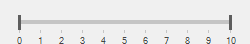

# About Syncfusion® Windows Forms RangeSlider Control

The [RangeSlider](https://help.syncfusion.com/cr/windowsforms/Syncfusion.Windows.Forms.Tools.RangeSlider.html) is a flexible UI component that allows value-range selection. It lets the user select from a range of values by moving thumb controls along a Track.

 

## Key features

**Color customization** - Provides options to customize channel, thumb, and selected range colors.

**Orientation** - Provides options to set vertical and horizontal orientation.

**Value settings** - Provides options to set minimum and maximum value of the RangeSlider.

**Visual style** - Provides a rich set of visual styles to customize the look and feel of the RangeSlider.
