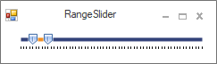
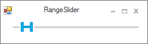

# Style Settings

Range Slider supports different visual styles for its appearance through the enumeration RangeSliderStyle. Some of the available VisualStyles are as follows:

* Default
* Metro
* Office2016Colorful
* Office2016White
* Office2016DarkGray
* Office2016Black

**Default**

This option helps to set the Default theme.

#####  Code Sample





// Default

this.rangeSlider.VisualStyle = RangeSlider.RangeSliderStyle.Default;





'Default

Me.rangeSlider.VisualStyle = RangeSlider.RangeSliderStyle.Default





**Metro**

This option helps to set the Metro theme.

#####  Code Sample





// Metro

this.rangeSlider.VisualStyle = RangeSlider.RangeSliderStyle.Metro;





'Metro

Me.rangeSlider.VisualStyle = RangeSlider.RangeSliderStyle.Metro;





**Office2016Colorful**

This option helps to set the Office2016Colorful theme.

#####  Code Sample





// Office2016Colorful

this.rangeSlider.VisualStyle = RangeSlider.RangeSliderStyle.Office2016Colorful;





'Office2016Colorful

Me.rangeSlider.VisualStyle = RangeSlider.RangeSliderStyle.Office2016Colorful





**Office2016White**

This option helps to set the Office2016White theme.

#####  Code Sample





// Office2016White

this.rangeSlider.VisualStyle = RangeSlider.RangeSliderStyle.Office2016White;





'Office2016White

Me.rangeSlider.VisualStyle = RangeSlider.RangeSliderStyle.Office2016White





**Office2016DarkGray**

This option helps to set the Office2016DarkGray theme.

#####  Code Sample





// Office2016DarkGray

 this.rangeSlider.VisualStyle = RangeSlider.RangeSliderStyle.Office2016DarkGray;





'Office2016DarkGray

Me.rangeSlider.VisualStyle = RangeSlider.RangeSliderStyle.Office2016DarkGray





**Office2016Black**

This option helps to set the Office2016Black theme.

#####  Code Sample





// Office2016Black

this.rangeSlider.VisualStyle = RangeSlider.RangeSliderStyle.Office2016Black;





'Office2016Black

Me.rangeSlider.VisualStyle = RangeSlider.RangeSliderStyle.Office2016Black





