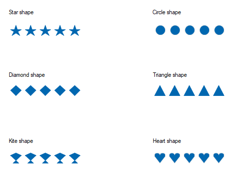

# Getting Started with Windows Forms Rating Control (Rating)

## Assembly deployment

Refer to the [Control dependencies](https://help.syncfusion.com/windowsforms/control-dependencies#ratingcontrol) section to get the list of assemblies or details of NuGet package that needs to be added as a reference to use the control in any application.

Click [NuGet Packages](https://help.syncfusion.com/windowsforms/installation/install-nuget-packages) to learn how to install nuget packages in a Windows Forms application.

## Adding Rating control via designer

1. Create a new Windows Forms project in Visual Studio to display the Rating Control with different shapes.

2. The [Rating](https://help.syncfusion.com/cr/windowsforms/Syncfusion.Windows.Forms.Tools.RatingControl.html) control can be added to an application by dragging it from the toolbox to a designer view. The following dependent assemblies will be added automatically:

* Syncfusion.Grid.Base
* Syncfusion.Grid.Windows
* Syncfusion.Shared.Base
* Syncfusion.Shared.Windows
* Syncfusion.Tools.Base
* Syncfusion.Tools.Windows

## Adding Rating control via code

To add the control manually in C#, follow the given steps:

1. Create a C# or VB application using Visual Studio.

2. Add the following assembly references to the project:

* Syncfusion.Grid.Base
* Syncfusion.Grid.Windows
* Syncfusion.Shared.Base
* Syncfusion.Shared.Windows
* Syncfusion.Tools.Base
* Syncfusion.Tools.Windows

3. Include the required namespaces.





using Syncfusion.Windows.Forms.Tools;




Imports Syncfusion.Windows.Forms.Tools


 

{{ codesnippet1 | OrderList_Indent_Level_1 }}

4. Create an instance of the [Rating](https://help.syncfusion.com/cr/windowsforms/Syncfusion.Windows.Forms.Tools.RatingControl.html) control, and add it to the form.





RatingControl ratingControl1 = new RatingControl ();
this.Controls.Add(ratingControl1);




Dim  ratingControl1 As RatingControl = New RatingControl
Me.Controls.Add(ratingControl1)




{{ codesnippet2 | OrderList_Indent_Level_1 }}

5. Set the rating value using the [Value](https://help.syncfusion.com/cr/windowsforms/Syncfusion.Windows.Forms.Tools.RatingControl.html#Syncfusion_Windows_Forms_Tools_RatingControl_Value) property.





ratingControl2.Value = 3;




ratingControl2.Value = 3




{{ codesnippet3 | OrderList_Indent_Level_1 }}

## Built-in shapes for rating

The following six predefined shapes are available in the Rating Control for customization:

* Star
* Circle
* Triangle
* Heart
* Diamond
* Kite

You can customize the shapes of the RatingControl using the [Shape](https://help.syncfusion.com/cr/windowsforms/Syncfusion.Windows.Forms.Tools.RatingControl.html#Syncfusion_Windows_Forms_Tools_RatingControl_Shape) property. 



//Setting shape
this.ratingControl1.Shape = Syncfusion.Windows.Forms.Tools.Shapes.Heart;


‘Setting shape
Me.ratingControl1.Shape = Syncfusion.Windows.Forms.Tools.Shapes.Heart



