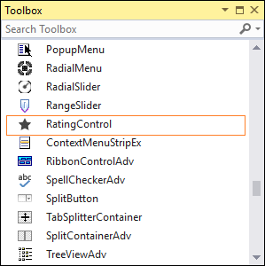
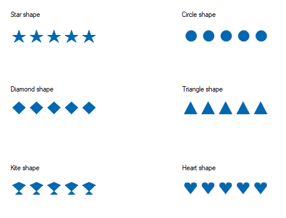

# Getting Started with Windows Forms Rating

## Assembly deployment

Refer to the [Control dependencies](https://help.syncfusion.com/windowsforms/control-dependencies#ratingcontrol) section to get the list of assemblies or details of the NuGet package that needs to be added as a reference to use the control in any application.

Click [NuGet Packages](https://help.syncfusion.com/windowsforms/installation/install-nuget-packages) to learn how to install NuGet packages in a Windows Forms application.

```powershell
Install-Package Syncfusion.Tools.Windows
```

## Adding Rating control via designer

1. Create a new Windows Forms project in Visual Studio to display the Rating Control with different shapes.

2. The [Rating](https://help.syncfusion.com/cr/windowsforms/Syncfusion.Windows.Forms.Tools.RatingControl.html) control can be added to an application by dragging it from the toolbox to a designer view. The following dependent assemblies will be added automatically:

* Syncfusion.Grid.Base
* Syncfusion.Grid.Windows
* Syncfusion.Shared.Base
* Syncfusion.Shared.Windows
* Syncfusion.Tools.Base
* Syncfusion.Tools.Windows



## Adding Rating control via code

To add the control manually in C#, follow the given steps:

1. Create a new C# or VB Windows Forms application in Visual Studio.

2. Add the following assembly references to the project:

* Syncfusion.Grid.Base
* Syncfusion.Grid.Windows
* Syncfusion.Shared.Base
* Syncfusion.Shared.Windows
* Syncfusion.Tools.Base
* Syncfusion.Tools.Windows

3. Include the required namespaces.





using Syncfusion.Windows.Forms.Tools;




Imports Syncfusion.Windows.Forms.Tools


 

{{ codesnippet1 | OrderList_Indent_Level_1 }}

4. Create an instance of the [Rating](https://help.syncfusion.com/cr/windowsforms/Syncfusion.Windows.Forms.Tools.RatingControl.html) control, and add it to the form.





RatingControl ratingControl1 = new RatingControl ();
this.Controls.Add(ratingControl1);




Dim  ratingControl1 As RatingControl = New RatingControl
Me.Controls.Add(ratingControl1)




{{ codesnippet2 | OrderList_Indent_Level_1 }}


5. Set the rating value using the [Value](https://help.syncfusion.com/cr/windowsforms/Syncfusion.Windows.Forms.Tools.RatingControl.html#Syncfusion_Windows_Forms_Tools_RatingControl_Value) property.





ratingControl1.Value = 3;




ratingControl1.Value = 3




{{ codesnippet3 | OrderList_Indent_Level_1 }}


## Built-in shapes for rating

The following six predefined shapes are available in the Rating Control for customization:

* Star
* Circle
* Triangle
* Heart
* Diamond
* Kite

You can customize the shapes of the RatingControl using the [Shape](https://help.syncfusion.com/cr/windowsforms/Syncfusion.Windows.Forms.Tools.RatingControl.html#Syncfusion_Windows_Forms_Tools_RatingControl_Shape) property. 




//Setting shape
this.ratingControl1.Shape = Syncfusion.Windows.Forms.Tools.Shapes.Heart;



' Setting shape

Me.ratingControl1.Shape = Syncfusion.Windows.Forms.Tools.Shapes.Heart






## Complete code sample

The following examples show the full code required to add a `RatingControl` to a Windows Forms application, set its value, and apply a built-in shape.




using System.Drawing;
using System.Windows.Forms;
using Syncfusion.Windows.Forms.Tools;

namespace RatingControlGettingStarted
{
    public partial class Form1 : Form
    {
        private Syncfusion.Windows.Forms.Tools.RatingControl ratingControl1;

        public Form1()
        {
            InitializeComponent();
            this.ClientSize = new Size(400, 200);
            ratingControl1 = new RatingControl();
            ratingControl1.Location = new Point(20, 20);
            ratingControl1.Size = new Size(200, 40);
            ratingControl1.Value = 3;            // Set the rating value.
            ratingControl1.Shape = Shapes.Heart; // Apply the Heart shape.
            ratingControl1.ItemsCount = 5;        // Number of items (default is 5).
            this.Controls.Add(ratingControl1);
        }
    }
}




Imports System.Drawing
Imports System.Windows.Forms
Imports Syncfusion.Windows.Forms.Tools

Public Class Form1

    Private ratingControl1 As RatingControl

    Public Sub New()
        InitializeComponent()
        Me.ClientSize = New Size(400, 200)
        ratingControl1 = New RatingControl()
        ratingControl1.Location = New Point(20, 20)
        ratingControl1.Size = New Size(200, 40)
        ratingControl1.Value = 3            ' Set the rating value.
        ratingControl1.Shape = Shapes.Heart ' Apply the Heart shape.
        ratingControl1.ItemsCount = 5        ' Number of items (default is 5).
        Me.Controls.Add(ratingControl1)
    End Sub
End Class



