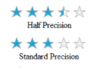

# Precision in Windows Forms Rating Control (Rating)

In Rating, [Precision](https://help.syncfusion.com/cr/windowsforms/Syncfusion.Windows.Forms.Tools.RatingControl.html#Syncfusion_Windows_Forms_Tools_RatingControl_Precision) can be set either as Standard or as Half, based on user requirement.




this.ratingControl1.Precision = Syncfusion.Windows.Forms.Tools.PrecisionMode.Half;





Me.ratingControl1.Precision = Syncfusion.Windows.Forms.Tools.PrecisionMode.Half




