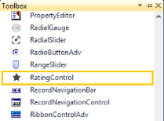

# Getting Started 

This section briefly describes how to design a Rating control in a Windows Forms Application.

## Add rating control

1. Create a new Windows Forms Application Project in VS IDE through New Project Wizard.
2. Drop a RatingControl on the Form.

## Configure rating control

The most commonly used settings of Rating Control can be configured either by a Designer using the Smart tag or by the Properties window or by code.

