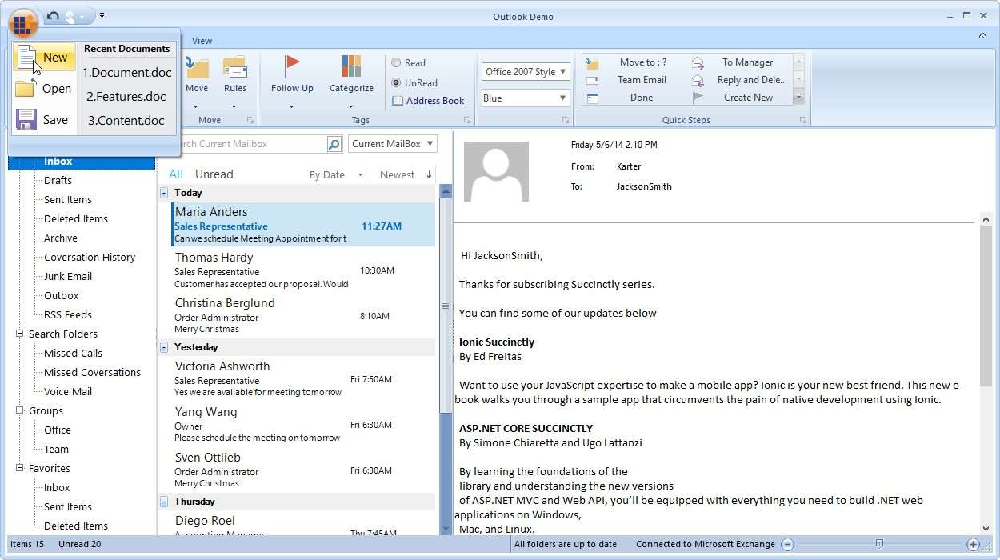
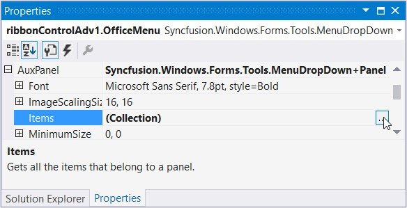
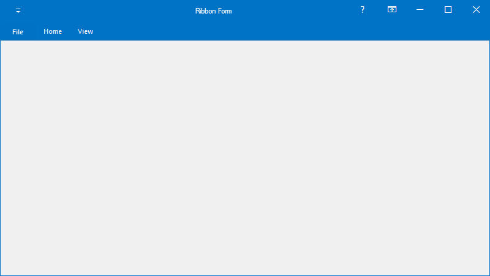
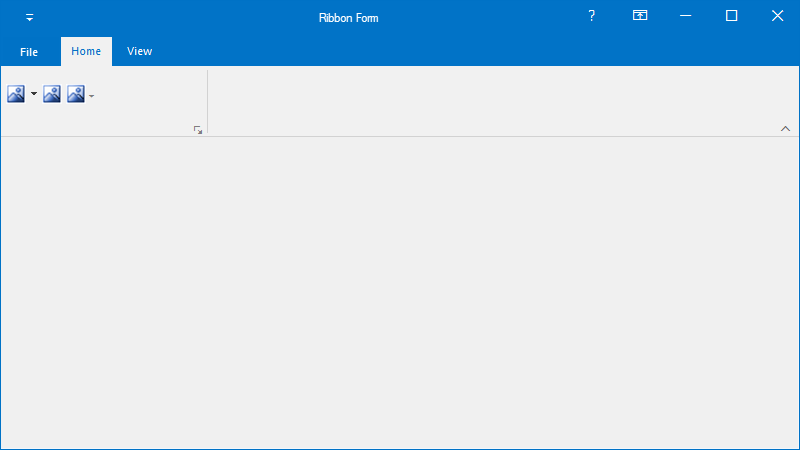

# Application Menu in Windows Forms Ribbon (RibbonControlAdv)

The RibbonControlAdv has the office menu button at the top left corner of the form. Controls can be added to the panels of the office menu button dropdown through designer without a single piece of code.

## Open ApplicationMenu

When the OfficeMenuButton is clicked, Application will be displayed. This dropdown can be customized through designer as well as through code.
RibbonControlAdv lets you add customized ToolStrip items in the OfficeMenu button dropdown with the help of the menu panels.

The panels are:

*	Aux Panel
*	Main Panel
*	System Panel

### Adding Items to Aux panel

Items to Aux panel can be added through Items property which invokes Item Collection Editor and items can be added to the panel.

### Adding Items to Main Panel

Items to Main panel can be added through Items property which invokes Item Collection Editor and items can be added to the panel.(As explained in AUX panel)

### System Panel

System panel will be located below the Aux and Main panel and items can be added to it through the items property which invokes Items Collection Editor and items can be added to it. (As explained in AUX panel)

## Restrict Application Menu Opening

To restrict application menu from opening, set the ribbon property [MenuButtonEnabled](https://help.syncfusion.com/cr/windowsforms/Syncfusion.Windows.Forms.Tools.RibbonControlAdv.html#Syncfusion_Windows_Forms_Tools_RibbonControlAdv_MenuButtonEnabled) as `false`.





this.ribbonControlAdv1.MenuButtonEnabled = false;





Me.ribbonControlAdv1.MenuButtonEnabled = False





## Minimize the menu bar panel

You can hide or minimize the menu bar panel by setting the [MinimizePanel](https://help.syncfusion.com/cr/windowsforms/Syncfusion.Windows.Forms.Tools.RibbonControlAdv.html#Syncfusion_Windows_Forms_Tools_RibbonControlAdv_MinimizePanel) property to `true` in the RibbonControlAdv. The default value is `false`.





this.ribbonControlAdv1.MinimizePanel = true;





Me.ribbonControlAdv1.MinimizePanel = True





When setting the `MinimizePanel` property as `true`, the image will be displayed as follows,

When setting the `MinimizePanel` property as `false`, the image will be displayed as follows,

