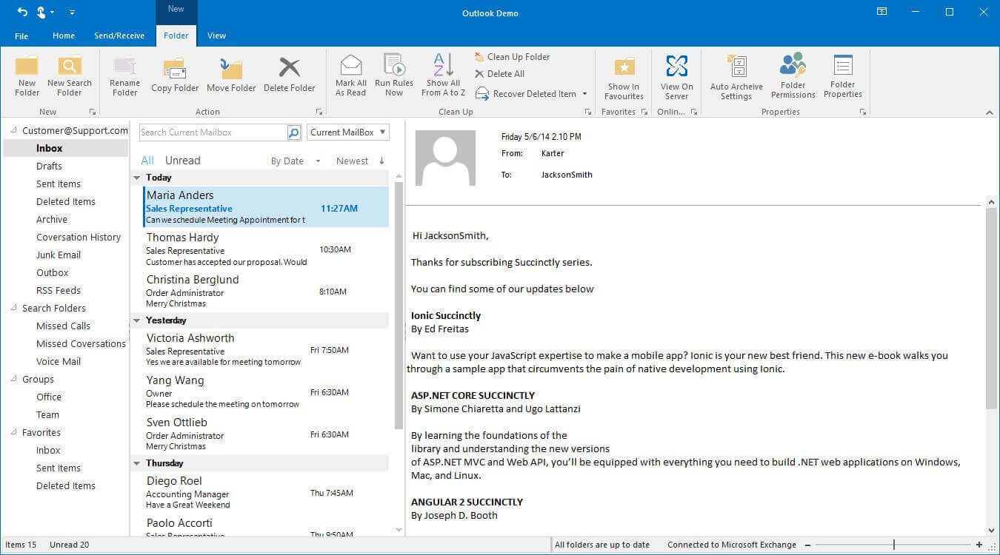
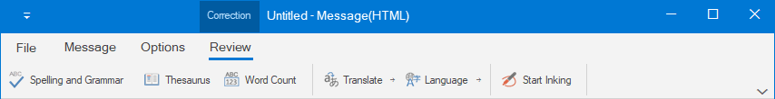
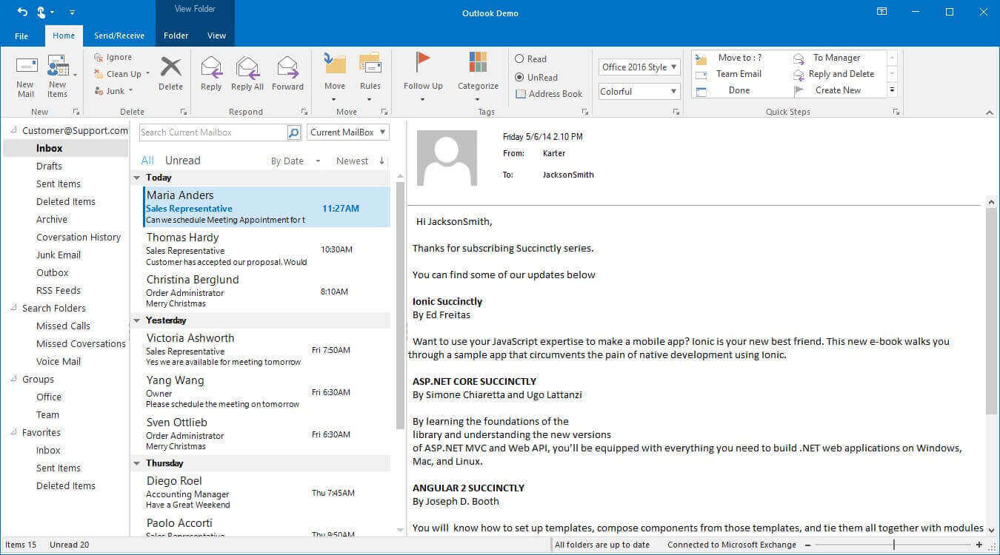
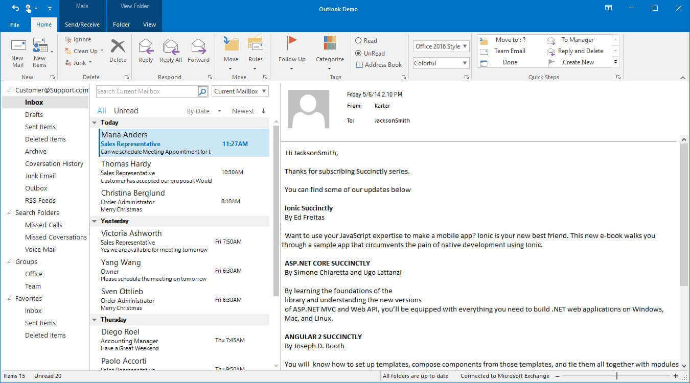

# Contextual Tab Group in Windows Forms Ribbon (RibbonControlAdv)

Use a contextual tab to display a collection of commands that are relevant only when users select an object type, they are displayed only when a particular object type is selected.

## Creating Context Tab Group

### Through Designer 

*	Click the `TabGroup` property of the RibbonControlAdv, TabGroup collection editor is opened. Add the tab group using the editor

*	Now create a ToolStripTabItem using the smart tag of the Ribbon.

*	Click the `TabGroup` property in the ToolStripTabItem and select the tab group from the available list.

## ContextTabGroup in simplified layout

When the simplified layout is enabled, the ContextTabGroup will display its items in a single line as shown below. To know more about the simplified layout, refer [here](https://help.syncfusion.com/windowsforms/ribbon/simplifiedlayout).

## Tab Arrangement

If tabs are placed consecutively and both tabs are assigned with same tag group, the tab group portion will be combined.

## Arrange more Contextual Tab Group

More contextual tab groups can be created by creating more tab groups and assigning those tab groups to the ToolStripTab items.

