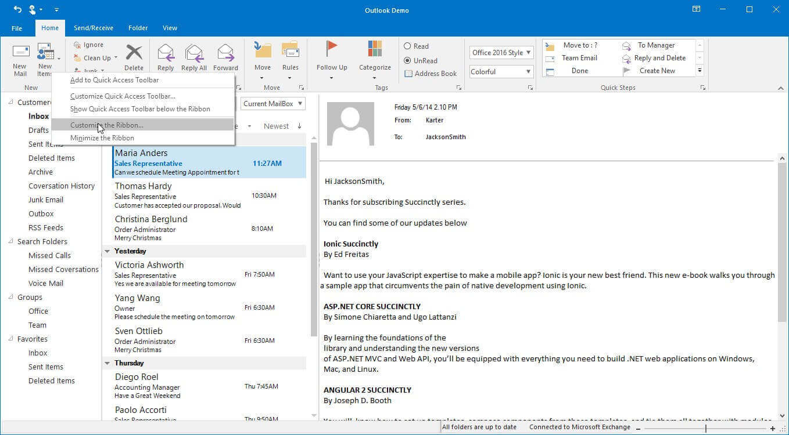
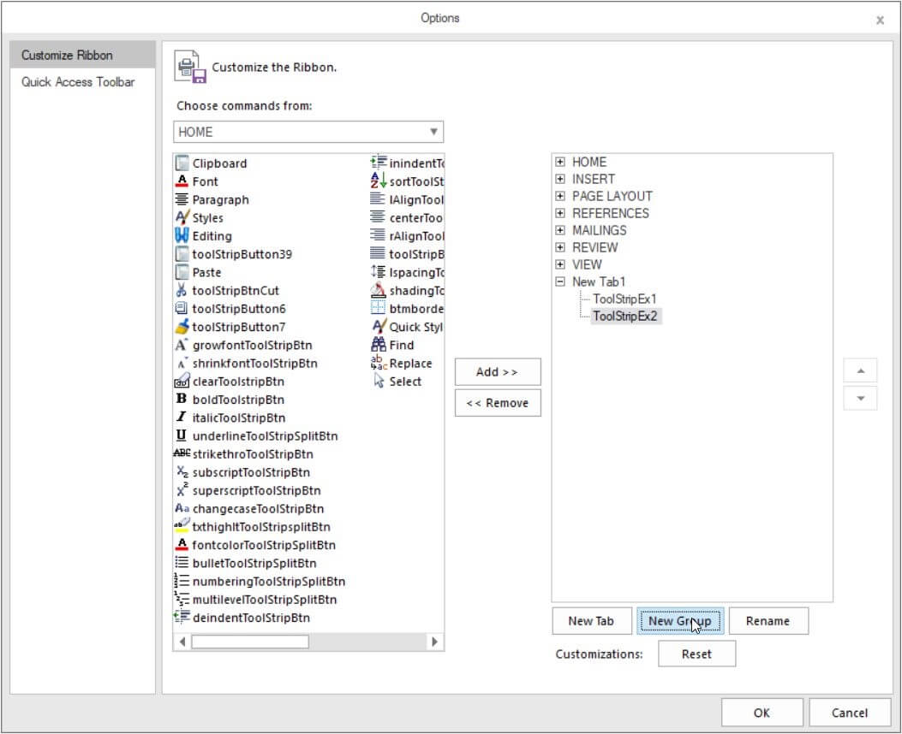
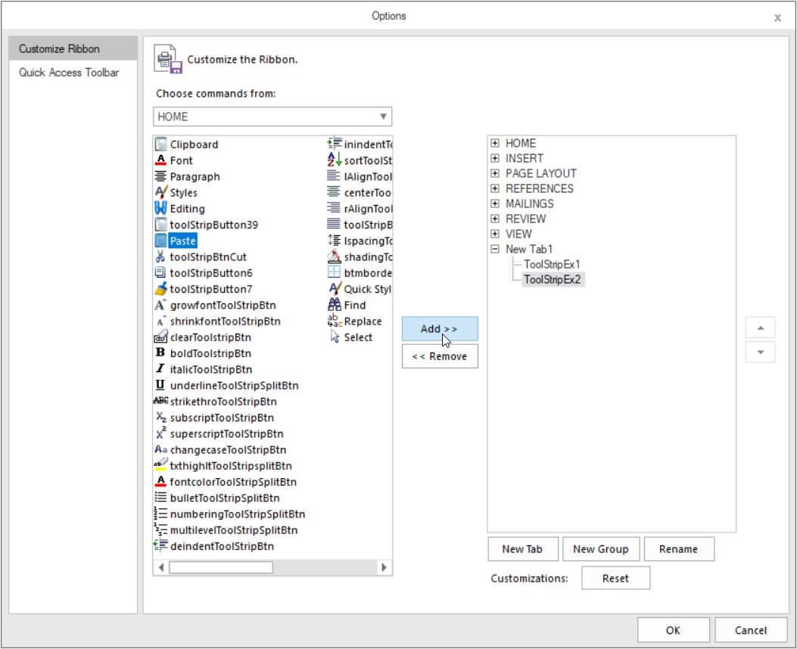
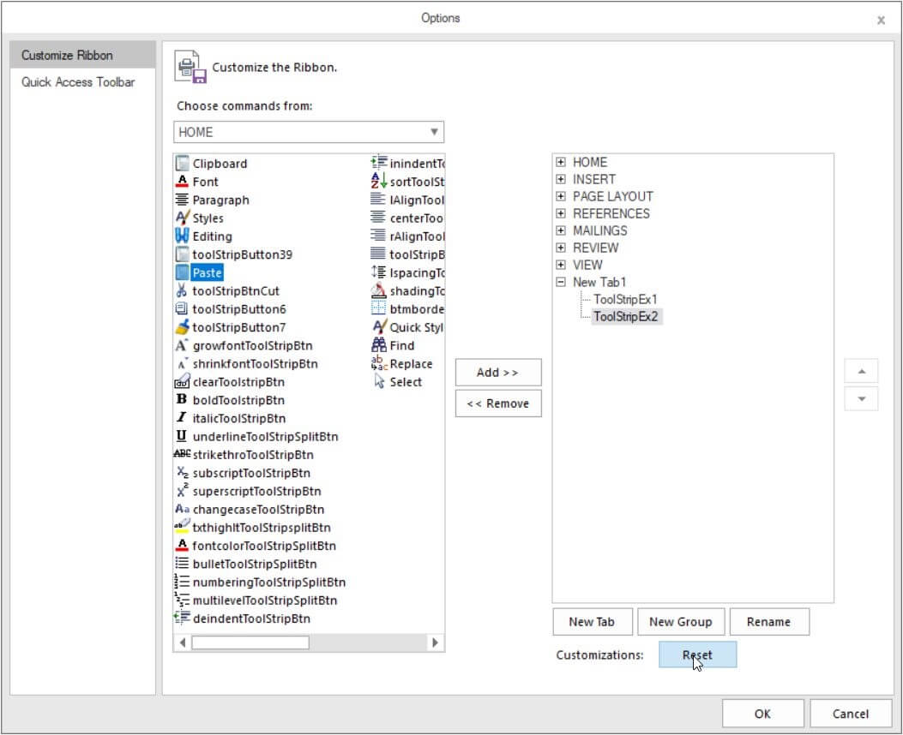
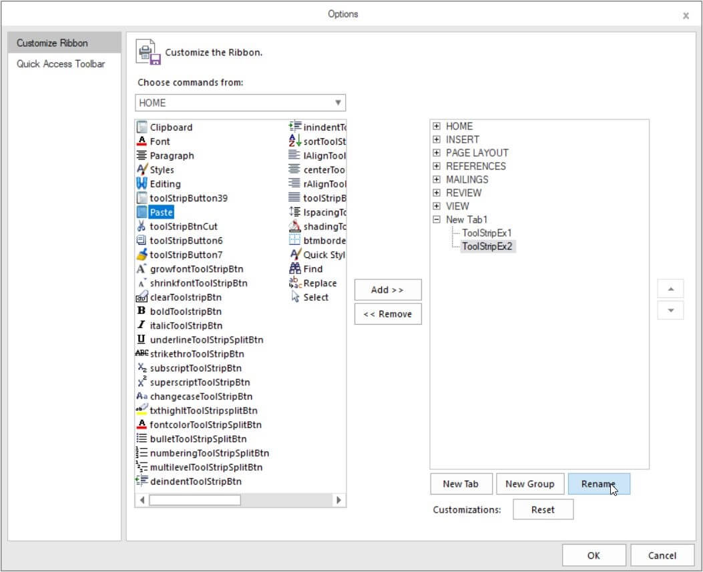
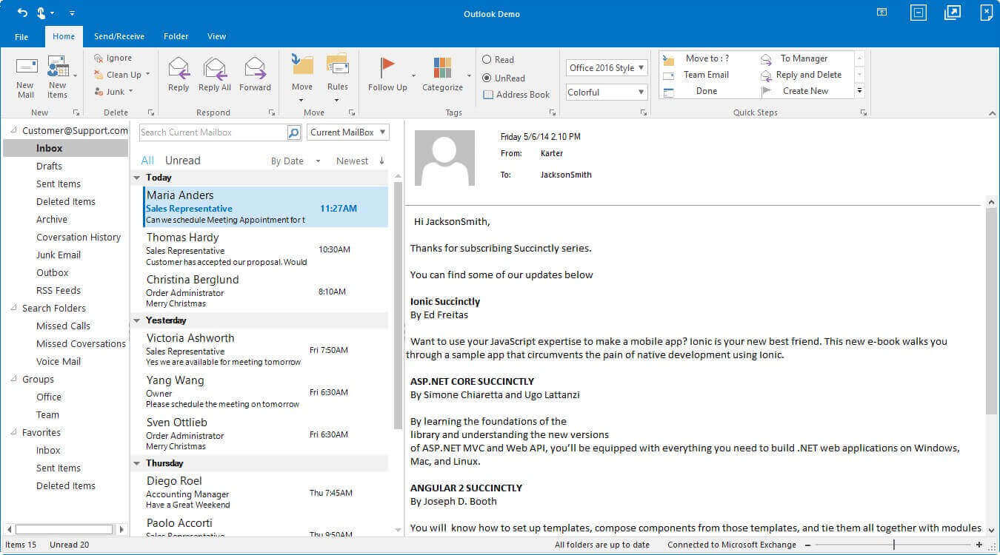

# Customization Support in Windows Forms Ribbon (RibbonControlAdv)

RibbonControlAdv allows to customize the Ribbon and quick access toolbar with the support to add and remove different items to QAT and to add new tabs and change the location of existing tabs and items in ribbon.

## QAT customization

For customization of QAT, please refer `Quick Access Toolbar`.

## Ribbon Customization

### Accessing Customize Window

RibbonControlAdv Tab and TabItems can customized in run time using Ribbon Customization window. Ribbon Customization window can be opened by right clicking on the Ribbon or by clicking the dropdown button in Quick Access Toolbar and selecting `Customize the Ribbon`.

### Create New Tab

Add New `ToolStripTabItem`

### Create New Group	

Add New ToolStripEx

Add Items to the ToolStripEx

### Reset Customization

Resets the customization and the default view will be applied.

### Rename Tab and Group

Rename Existing tab or group

### Hide Ribbon Customization Window

To hide Ribbon customization window, change the `EnableRibbonCustomization` as false.
This will restrict the user from opening the ribbon customization window.

Use this code snippet.





this.ribbonControlAdv1.EnableRibbonCustomization = false;





Me.ribbonControlAdv1.EnableRibbonCustomization = False





## Customizing Ribbon in simplified layout

The RibbonControlAdv allows to customize the Ribbon and Ribbon items through the QAT window, where user can add the Ribbon items to a new [`ToolStripTabItem`](https://help.syncfusion.com/cr/windowsforms/Syncfusion.Windows.Forms.Tools.ToolStripTabItem.html) or [`ToolStripEx`](https://help.syncfusion.com/cr/windowsforms/Syncfusion.Windows.Forms.Tools.ToolStripEx.html). The newly added [`ToolStripTabItem`](https://help.syncfusion.com/cr/windowsforms/Syncfusion.Windows.Forms.Tools.ToolStripTabItem.html) or [`ToolStripEx`](https://help.syncfusion.com/cr/windowsforms/Syncfusion.Windows.Forms.Tools.ToolStripEx.html) will only be visible in the respective layout in which items were added originally. To know more about the simplified layout, refer [here](https://help.syncfusion.com/windowsforms/ribbon/simplifiedlayout).

## Customize System Button

Customizations can be done to Close, minimize, restore and maximize button through coding.
The customizations include changing of hover color, image and `ToolTipText`.

Refer the code below for customizing





//Instance to create custom button
RibbonTitleButton button1 = new RibbonTitleButton();
// Sets the image for the Custom button
button1.Image = Image.FromFile("..//..//Resources/Minus.png");
// Sets the tooltip text for the custom button 
button1.ToolTipText = "Minimize form";
// Sets the Hover backcolor for the custom button
button1.HoverBackColor = Color.Green;
// Assigns the button to the RibbonControlAdv.
this.ribbonControlAdv1.MinimizeButton = button1;

//Instance to create custom button
RibbonTitleButton button2 = new RibbonTitleButton();
// Sets the image for the Custom button
button2.Image = Image.FromFile("..//..//Resources/Maximize1.png");
// Sets the tooltip text for the custom button 
button2.ToolTipText = "Max form";
// Sets the Hover backcolor for the custom button
button2.HoverBackColor = Color.Blue;
// Assigns the button to the RibbonControlAdv.
this.ribbonControlAdv1.MaximizeButton = button2;

//Instance to create custom button
RibbonTitleButton button3 = new RibbonTitleButton();
// Sets the image for the Custom button
button3.Image = Image.FromFile("..//..//Resources/Restore-02.png");
// Sets the tooltip text for the custom button 
button3.ToolTipText = "Restore form";
// Sets the Hover backcolor for the custom button
button3.HoverBackColor = Color.Blue;
// Assigns the button to the RibbonControlAdv.
this.ribbonControlAdv1.RestoreButton = button3;

//Instance to create custom button
RibbonTitleButton button4 = new RibbonTitleButton();
// Sets the image for the Custom button
button4.Image = Image.FromFile("..//..//Resources/CrossClose.png");
// Sets the tooltip text for the custom button 
button4.ToolTipText = "Close form";
// Sets the Hover backcolor for the custom button
button4.HoverBackColor = Color.Red;
// Assigns the button to the RibbonControlAdv.
this.ribbonControlAdv1.CloseButton = button4;





Dim button1 As RibbonTitleButton = New RibbonTitleButton()
button1.Image = Image.FromFile("..//..//Resources/Minus.png")
button1.ToolTipText = "Minimize form"
button1.HoverBackColor = Color.Green
Me.ribbonControlAdv1.MinimizeButton = button1

Dim button2 As RibbonTitleButton = New RibbonTitleButton()
button2.Image = Image.FromFile("..//..//Resources/Maximize1.png")
button2.ToolTipText = "Max form"
button2.HoverBackColor = Color.Blue
Me.ribbonControlAdv1.MaximizeButton = button2

Dim button3 As RibbonTitleButton = New RibbonTitleButton()
button3.Image = Image.FromFile("..//..//Resources/Restore-02.png")
button3.ToolTipText = "Restore form"
button3.HoverBackColor = Color.Blue
Me.ribbonControlAdv1.RestoreButton = button3

Dim button4 As RibbonTitleButton = New RibbonTitleButton()
button4.Image = Image.FromFile("..//..//Resources/CrossClose.png")
button4.ToolTipText = "Close form"
button4.HoverBackColor = Color.Red
Me.ribbonControlAdv1.CloseButton = button4





The size of the System button can be customized using the following code snippet.





// Sets the size of the System buttons.
this.ribbonControlAdv1.RibbonTitleButtonSize = new Size(30, 30);





Me.ribbonControlAdv1.RibbonTitleButtonSize = New Size(30, 30)





## Remove Application Icon

To hide the application icon, change the form property `ShowApplicationIcon` as false.





//hides the Application icon
this.ShowApplicationIcon = false;





Me.ShowApplicationIcon = False





Even the application icon can be changed with the `Icon` property in the form.

## Events

<table>
<tr>
<th>
Events</th><th>
Description</th><th>
EventArgs</th></tr>

<tr>
<td>
QATCustomizationMenuClicked</td><td>
This event will be triggered when the Customize Quick Access Toolbar is clicked from the Ribbon Context Menu.</td><td>
BeforeQATEventArgs</td></tr>
<tr>
<td>
RibbonCustomizationMenuClicked</td><td>
This event will be triggered when the Customize the Ribbon is clicked from the Ribbon Context Menu.</td><td>
BeforeCustomizeRibbonEventArgs</td></tr>
</table>
