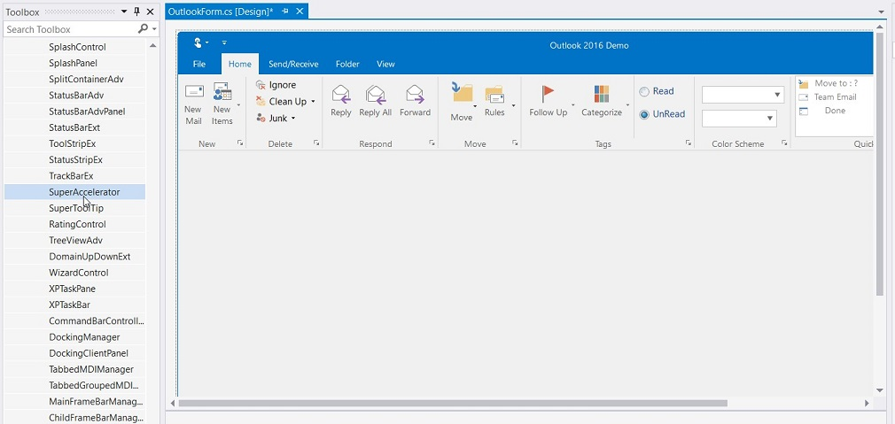
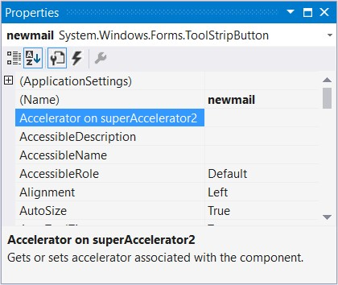
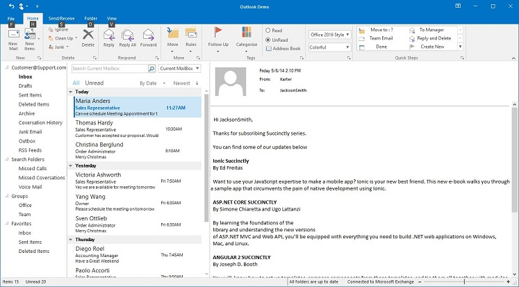
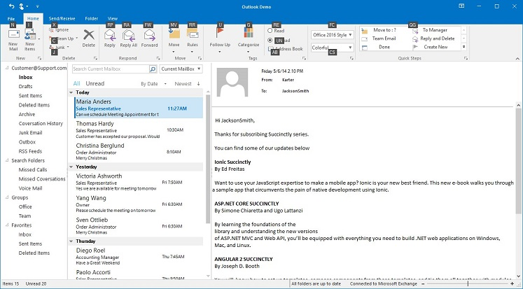

# Keyboard Support in Windows Forms Ribbon (RibbonControlAdv)

To invoke any command using KeyBoard, RibbonControlAdv provides KeyTip support through Super Accelerator. On pressing Alt key, KeyTips for the corresponding RibbonItem gets displayed.

## Add Super Accelerator

Follow the steps below to add Super accelerator

1.	Drag-and-drop the SuperAccelerator on your form.

2.	When the SuperAccelerator component is added to a form, an extended property will be added to the properties of every item in the RibbonControlAdv.

3.	In the appropriate item, use the Accelerator on SuperAccelerator property to set the string value.

4.	To accelerate the item’s click event at run time, Press the ALT key. All the specified accelerator strings will be displayed below the items.

5.	Press the string of any Tab and all the strings for the items in that tab will be displayed.

6.	Press the string in the keyboard and the corresponding item’s click event will be triggered. (Eg. If the accelerator string of Cut is X key, Press ALT key. Once all the accelerator strings are displayed, press X key the Cut item event will be triggered.)

**Through Coding**




this.SuperAccelerator1.SetAccelerator(this.newMail, "N");





Me.SuperAccelerator1.SetAccelerator(Me.newMail, "N")





## Rule to set Accelerator

*	Do not set same string value to multiple items

## Super Accelerator Appearance

This section discusses the appearance settings of a Super Accelerator.

<table>
<tr>
<th>
Property</th><th>
Description</th></tr>
<tr>
<td>
BackColor</td><td>
Gets / sets the back color for the accelerator key.</td></tr>
<tr>
<td>
Font</td><td>
Sets the Font Style for the accelerator key.</td></tr>
<tr>
<td>
ForeColor</td><td>
Sets the ForeColor for the accelerator key.</td></tr>
</table>





this.superAccelerator1.BackColor = Color.Red;
this.superAccelerator1.ForeColor = Color.White;
this.superAccelerator1.Font = new System.Drawing.Font("Arial", 8F, FontStyle.Italic);





Me.superAccelerator1.BackColor = Color.Red
Me.superAccelerator1.ForeColor = Color.White
Me.superAccelerator1.Font = New System.Drawing.Font("Arial", 8F, FontStyle.Italic)





## Style

SuperAccelerator supports visual styles such as Default, Office2016. The style can be set using `Appearance` property.

*	Default
*	Advanced
*	Office2016Colorful
*	Office2016White
*	Office2016DarkGray
*	Office2016Black





this.superAccelerator1.Appearance = Syncfusion.Windows.Forms.Tools.Appearance.Office2016Colorful;





Me.superAccelerator1.Appearance = Syncfusion.Windows.Forms.Tools.Appearance.Office2016Colorful





