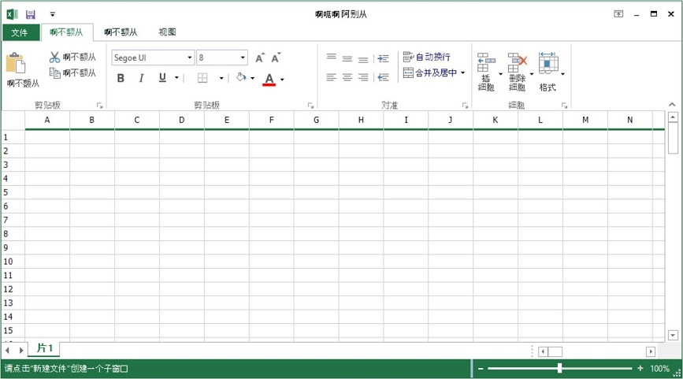
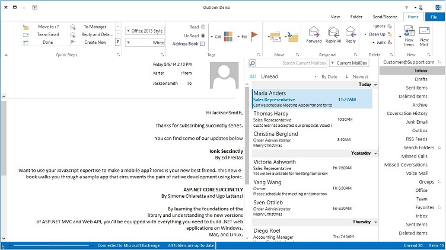

# Localization Support in Windows Forms Ribbon (RibbonControlAdv)

RibbonControlAdv now supports adaptation of its controls and its details to meet different languages and cultural requirements. This involves configuring the ribbon to a specific language.

## Adding ILocalizationProvider

1. Include the required namespaces at the beginning of the source file.

2. Create a class that implements the `ILocalizationProvider` interface defined in the Syncfusion.Windows.Forms namespace in the Syncfusion.Shared.Base.dll.

3. Return the localized versions of the strings corresponding to the string identifiers.

4. String identifiers are defined in the `ToolsResourceIdentifier` classes in Syncfusion.Tools.Windows

​




using Syncfusion.Windows.Forms.Tools;





Imports Syncfusion.Windows.Forms.Tools





{{ codesnippet1 | OrderList_Indent_Level_1 }}

5. Leave an empty string for the rest of the identifiers that are not involved in the localization. These identifiers are loaded with a default value.

6. Assign this instance to the Provider property of the LocalizationProvider class before the InitializeComponent call in the constructor of the application.

​




LocalizationProvider.Provider = new localization();





LocalizationProvider.Provider = New localization()





{{ codesnippet2 | OrderList_Indent_Level_1 }}

7. The Following is an example for localization





class localization : ILocalizationProvider
    {

        public string GetLocalizedString(System.Globalization.CultureInfo culture, string stringname, object obj)
        {

            switch (stringname)
            {

                case ToolsResourceIdentifiers.CustomizeRibbonDialogButtonAdd:
                    return "添加";
                case ToolsResourceIdentifiers.CustomizeRibbonDialogButtonRemove:
                    return "移除";
                case ToolsResourceIdentifiers.CustomizeRibbonDialogButtonCancel:
                    return "取消";
                case ToolsResourceIdentifiers.CustomizeRibbonDialogButtonOk:
                    return "确定";
                case ToolsResourceIdentifiers.CustomizeRibbonDialogButtonReset:
                    return "重置";
                case ToolsResourceIdentifiers.CustomizeRibbonDialogLabel:
                    return "自定义功能区";
                case ToolsResourceIdentifiers.CustomizeRibbonDialogChooseCommands:
                    return "选择命令";
                case ToolsResourceIdentifiers.CustomizeRibbonDialogMainTab:
                    return "主选项卡";
                case ToolsResourceIdentifiers.CustomizeRibbonDialogButtonNewGroup:
                    return "新建组";
                case ToolsResourceIdentifiers.CustomizeRibbonDialogButtonNewTab:
                    return "新建选项卡";
                case ToolsResourceIdentifiers.CustomizeRibbonDialogButtonRename:
                    return "重命名";
                case ToolsResourceIdentifiers.CustomizeRibbonDialogCustomizationLabel:
                    return "自定义选项";
                case ToolsResourceIdentifiers.CustomizeRibbonDialogCaption:
                    return "自定义功能区";
                case ToolsResourceIdentifiers.CustomizeQuickAccessLabel:
                    return "快速访问工具栏";
                case ToolsResourceIdentifiers.QuickAccessCustomizeMenu:
                    return "自定义快速访问工具栏";
                case ToolsResourceIdentifiers.QuickAccessAddItem:
                    return "添加项目";

                case ToolsResourceIdentifiers.QuickAccessDialogButtonAdd:
                    return "添加";
                case ToolsResourceIdentifiers.QuickAccessDialogButtonCancel:
                    return "取消";
                case ToolsResourceIdentifiers.QuickAccessDialogButtonOk:
                    return "确定";
                case ToolsResourceIdentifiers.QuickAccessDialogButtonReset:
                    return "重置";
                case ToolsResourceIdentifiers.QuickAccessDialogButtonRemove:
                    return "移除";
                case ToolsResourceIdentifiers.QuickAccessMinimizeTheRibbon:
                    return "最小化功能区";
                case ToolsResourceIdentifiers.QuickAccessPlaceAboveRibbon:
                    return "放置于功能区上方";
                case ToolsResourceIdentifiers.QuickAccessPlaceBelowRibbon:
                    return "放置于功能区下方";
                case ToolsResourceIdentifiers.QuickAccessToolBarLabel:
                    return "快速访问工具栏";

                case ToolsResourceIdentifiers.CustomizeRibbonDialogRenameCancelButton:
                    return "取消";
                case ToolsResourceIdentifiers.CustomizeRibbonDialogRenameCaption:
                    return "重命名";
                case ToolsResourceIdentifiers.CustomizeRibbonDialogRenameOkButton:
                    return "确定";
                case ToolsResourceIdentifiers.CustomizeRibbonRenameDisplayLabel:
                    return "显示名称";

                case ToolsResourceIdentifiers.CustomizationLabel:
                    return "自定义";
                case ToolsResourceIdentifiers.CustomizeMenu:
                    return "自定义";
                case ToolsResourceIdentifiers.QuickAccessDialogDropDownName:
                    return "快速访问下拉菜单";
                case ToolsResourceIdentifiers.QuickAccessCustomizeCaption:
                    return "快速访问工具栏";
                case ToolsResourceIdentifiers.QuickAccessDialogCommands:
                    return "命令";
                case ToolsResourceIdentifiers.CustomizeRibbonDialogColumnHeader:
                    return "列标题";

                case ToolsResourceIdentifiers.CustomMenu:
                    return "自定义菜单";
                case ToolsResourceIdentifiers.QuickAccessDialogCustomizeRibbon:
                    return "自定义功能区";
                
                default:
                    return string.Empty;

            }
        }
    }





Class localization
    Inherits ILocalizationProvider

    Public Function GetLocalizedString(ByVal culture As System.Globalization.CultureInfo, ByVal stringname As String, ByVal obj As Object) As String
        Select Case stringname
            Case ToolsResourceIdentifiers.CustomizeRibbonDialogButtonAdd
                Return "添加"
            Case ToolsResourceIdentifiers.CustomizeRibbonDialogButtonRemove
                Return "移除"
            Case ToolsResourceIdentifiers.CustomizeRibbonDialogButtonCancel
                Return "取消"
            Case ToolsResourceIdentifiers.CustomizeRibbonDialogButtonOk
                Return "确定"
            Case ToolsResourceIdentifiers.CustomizeRibbonDialogButtonReset
                Return "重置"
            Case ToolsResourceIdentifiers.CustomizeRibbonDialogLabel
                Return "自定义功能区"
            Case ToolsResourceIdentifiers.CustomizeRibbonDialogChooseCommands
                Return "选择命令"
            Case ToolsResourceIdentifiers.CustomizeRibbonDialogMainTab
                Return "主选项卡"
            Case ToolsResourceIdentifiers.CustomizeRibbonDialogButtonNewGroup
                Return "新建组"
            Case ToolsResourceIdentifiers.CustomizeRibbonDialogButtonNewTab
                Return "新建选项卡"
            Case ToolsResourceIdentifiers.CustomizeRibbonDialogButtonRename
                Return "重命名"
            Case ToolsResourceIdentifiers.CustomizeRibbonDialogCustomizationLabel
                Return "自定义选项"
            Case ToolsResourceIdentifiers.CustomizeRibbonDialogCaption
                Return "自定义功能区"
            Case ToolsResourceIdentifiers.CustomizeQuickAccessLabel
                Return "快速访问工具栏"
            Case ToolsResourceIdentifiers.QuickAccessCustomizeMenu
                Return "自定义快速访问工具栏"
            Case ToolsResourceIdentifiers.QuickAccessAddItem
                Return "添加项目"
            Case ToolsResourceIdentifiers.QuickAccessDialogButtonAdd
                Return "添加"
            Case ToolsResourceIdentifiers.QuickAccessDialogButtonCancel
                Return "取消"
            Case ToolsResourceIdentifiers.QuickAccessDialogButtonOk
                Return "确定"
            Case ToolsResourceIdentifiers.QuickAccessDialogButtonReset
                Return "重置"
            Case ToolsResourceIdentifiers.QuickAccessDialogButtonRemove
                Return "移除"
            Case ToolsResourceIdentifiers.QuickAccessMinimizeTheRibbon
                Return "最小化功能区"
            Case ToolsResourceIdentifiers.QuickAccessPlaceAboveRibbon
                Return "放置于功能区上方"
            Case ToolsResourceIdentifiers.QuickAccessPlaceBelowRibbon
                Return "放置于功能区下方"
            Case ToolsResourceIdentifiers.QuickAccessToolBarLabel
                Return "快速访问工具栏"
            Case ToolsResourceIdentifiers.CustomizeRibbonDialogRenameCancelButton
                Return "取消"
            Case ToolsResourceIdentifiers.CustomizeRibbonDialogRenameCaption
                Return "重命名"
            Case ToolsResourceIdentifiers.CustomizeRibbonDialogRenameOkButton
                Return "确定"
            Case ToolsResourceIdentifiers.CustomizeRibbonRenameDisplayLabel
                Return "显示名称"
            Case ToolsResourceIdentifiers.CustomizationLabel
                Return "自定义"
            Case ToolsResourceIdentifiers.CustomizeMenu
                Return "自定义"
            Case ToolsResourceIdentifiers.QuickAccessDialogDropDownName
                Return "快速访问下拉菜单"
            Case ToolsResourceIdentifiers.QuickAccessCustomizeCaption
                Return "快速访问工具栏"
            Case ToolsResourceIdentifiers.QuickAccessDialogCommands
                Return "命令"
            Case ToolsResourceIdentifiers.CustomizeRibbonDialogColumnHeader
                Return "列标题"
            Case ToolsResourceIdentifiers.CustomMenu
                Return "自定义菜单"
            Case ToolsResourceIdentifiers.QuickAccessDialogCustomizeRibbon
                Return "自定义功能区"
            Case Else
                Return String.Empty
        End Select
    End Function
End Class





## Ribbon Resource Identifier

<table>
<tr>
<th>
String  </th><th>
Description  </th></tr>
<tr>
<td>
CustomizeRibbonDialogButtonAdd  </td><td>
`Add` button to add selected item in Customize Ribbon window  </td></tr>
<tr>
<td>
CustomizeRibbonDialogButtonRemove  </td><td>
`Remove` button to remove selected item in Customize Ribbon window  </td></tr>
<tr>
<td>
CustomizeRibbonDialogButtonCancel  </td><td>
`Cancel` button to cancel the changes in Customize Ribbon window  </td></tr>
<tr>
<td>
CustomizeRibbonDialogButtonOk  </td><td>
`Ok` button to save the changes in Customize Ribbon window  </td></tr>
<tr>
<td>
CustomizeRibbonDialogButtonReset  </td><td>
`Reset` button to reset all the customizations in Customize Ribbon window  </td></tr>
<tr>
<td>
CustomizeRibbonDialogLabel  </td><td>
Main `Customize the Ribbon` label in Customize Ribbon window  </td></tr>
<tr>
<td>
CustomizeRibbonDialogChooseCommands  </td><td>
`Choose Commands from` combo box header  </td></tr>
<tr>
<td>
CustomizeRibbonDialogMainTab  </td><td>
`Customize Ribbon` tab header in left panel in Customize window  </td></tr>
<tr>
<td>
CustomizeRibbonDialogButtonNewGroup  </td><td>
`New Group` button to add new group in Customize Ribbon window  </td></tr>
<tr>
<td>
CustomizeRibbonDialogButtonNewTab  </td><td>
`New Tab` button to add new tab in Customize Ribbon window  </td></tr>
<tr>
<td>
CustomizeRibbonDialogButtonRename  </td><td>
`Rename` button to rename selected item in customize Ribbon window  </td></tr>
<tr>
<td>
CustomizeRibbonDialogCustomizationLabel  </td><td>
`Customizations` label in customize ribbon window  </td></tr>
<tr>
<td>
CustomizeRibbonDialogCaption  </td><td>
Caption in customize ribbon window  </td></tr>
<tr>
<td>
CustomizeQuickAccessLabel  </td><td>
Main label in customize QAT  </td></tr>
<tr>
<td>
QuickAccessCustomizeMenu  </td><td>
Customize menu in quick access  </td></tr>
<tr>
<td>
QuickAccessAddItem  </td><td>
Add Item label in quick access  </td></tr>
<tr>
<td>
QuickAccessDialogButtonAdd  </td><td>
`Add` button to add selected item in Customize QAT window  </td></tr>
<tr>
<td>
QuickAccessDialogButtonCancel  </td><td>
`Cancel` button to cancel the changes in Customize QAT window  </td></tr>
<tr>
<td>
QuickAccessDialogButtonOk  </td><td>
`Ok` button to save the changes in Customize QAT window  </td></tr>
<tr>
<td>
QuickAccessDialogButtonReset  </td><td>
`Reset` button to reset all the customizations in Customize QAT window  </td></tr>
<tr>
<td>
QuickAccessDialogButtonRemove  </td><td>
`Remove` button to remove selected item in Customize QAT window  </td></tr>
<tr>
<td>
QuickAccessMinimizeTheRibbon  </td><td>
MinimizeTheRibbon option in quick access  </td></tr>
<tr>
<td>
QuickAccessPlaceAboveRibbon  </td><td>
PlaceAboveRibbon option in quick access  </td></tr>
<tr>
<td>
QuickAccessPlaceBelowRibbon  </td><td>
PlaceBelowRibbon option in quick access  </td></tr>
<tr>
<td>
QuickAccessToolBarLabel  </td><td>
QAT label  </td></tr>
<tr>
<td>
CustomizeRibbonDialogRenameCancelButton  </td><td>
`Cancel’ button in Rename popup window  </td></tr>
<tr>
<td>
CustomizeRibbonDialogRenameCaption  </td><td>
Rename caption in rename popup window  </td></tr>
<tr>
<td>
CustomizeRibbonDialogRenameOkButton  </td><td>
`Ok` button in rename popup window  </td></tr>
<tr>
<td>
CustomizeRibbonRenameDisplayLabel  </td><td>
Display Name label in rename popup window  </td></tr>
<tr>
<td>
CustomizationLabel  </td><td>
Customization label in window  </td></tr>
<tr>
<td>
CustomizeMenu  </td><td>
Customize menu option  </td></tr>
<tr>
<td>
QuickAccessDialogDropDownName  </td><td>
Drop down name in quick access dialog  </td></tr>
<tr>
<td>
QuickAccessCustomizeCaption  </td><td>
Customize caption in customizing QAT.  </td></tr>
<tr>
<td>
QuickAccessDialogCommands  </td><td>
Commands dialog in quick access  </td></tr>
<tr>
<td>
CustomizeRibbonDialogColumnHeader  </td><td>
Column header in Customize ribbon   </td></tr>
<tr>
<td>
CustomMenu  </td><td>
Custom menu label  </td></tr>
<tr>
<td>
QuickAccessDialogCustomizeRibbon  </td><td>
Quick access dialog in customize ribbon window  </td></tr>
</table>

## Right To Left

In Right To Left support, RibbonControlAdv aligns all its controls from right To left when the ribbon property `RightToLeft’ is set to Yes.





this.ribbonControlAdv1.RightToLeft = RightToLeft.Yes;





this.ribbonControlAdv1.RightToLeft = RightToLeft.Yes;





