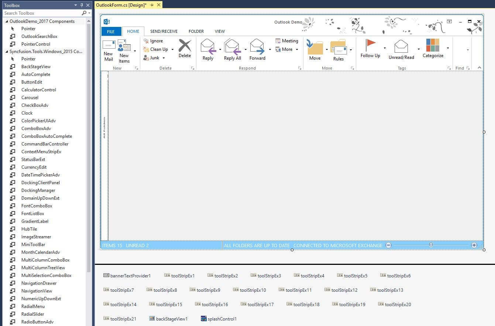
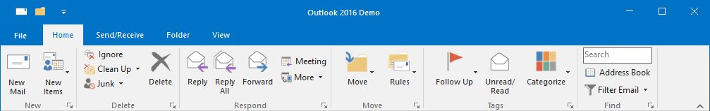
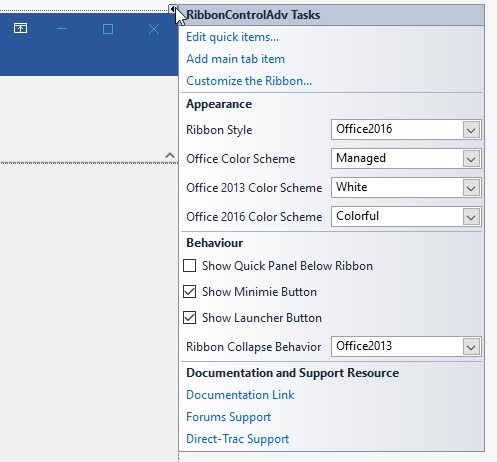
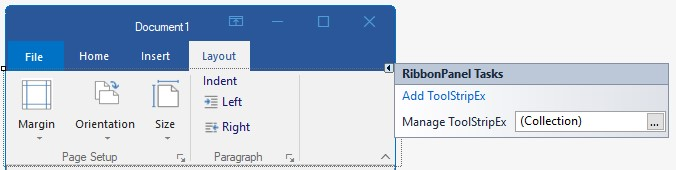
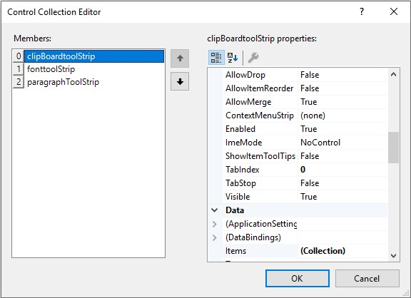
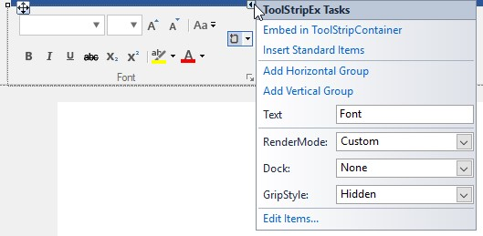

# Ribbon Designer in Windows Forms Ribbon (RibbonControlAdv)

Ribbon designer is the visual designer for the Ribbon control. It is used to add custom tabs, control and groups to the Ribbon without running the application.

Image shows toolbox on the left side and designer on the right top and controls below the designer.

## AutoLayoutToolStrip

The `AutoLayoutToolStrip` property enables standard size and layout for RibbonControlAdv and its items. The default value of the `AutoLayoutToolStrip` is false. The ToolStripItems can be arranged in the RibbonControlAdv in the following three different sizes:

**Large:** ToolStripItem’s `DisplayStyle` is ImageAndText and `TextImageRelation` is ImageAboveText/ ImageBelowText.

**Small:** ToolStripItem’s `DisplayStyle` is ImageAndText and `TextImageRelation` is ImageBeforeText/ ImageAfterText.

**Extra Small:** ToolStripItem’s `DisplayStyle` is Image. 

**Margin and Padding:** ToolStripItem’s Margin and Padding are defined internally to maintain equal spacing for all items either in single or double line arrangement.

**Image Scaling:** Images used inside RibbonControlAdv have been scaled internally for different screen resolution. The following defined image size has been used for the different item sizes.

<table>
<tr>
<th>
Size Form</th><th>
Image Size</th></tr> 

<tr>
<td>
Large Size form</td><td>
32*32</td></tr>
<tr>
<td>
Small and Extra Small size form</td><td>
16*16</td></tr>
</table>

**RibbonControlAdv Height:** RibbonControlAdv’s height is defined internally to accommodate the items and maintain in three rows with standard height in scaling.





this.ribbonControlAdv1.AutoLayoutToolStrip = true;





Me.ribbonControlAdv1.AutoLayoutToolStrip = True





## Smart Tag support

The Smart Tag feature allows you quickly access the most commonly used properties and options and perform tasks without leaving the control’s design surface (resembles a right-pointing arrow).

In Ribbon Smart Tag, the frequently used properties related to the appearance and behavior and links to access documentation and support resources of Ribbon have been added.

In `RibbonPanel` Smart Tag, we can add `ToolStripEx` using `Add ToolStripEx` to the RibbonPanel and also rearrange them using the `Manage ToolStripEx` collection editor.

In `ToolStripEx` Smart Tag, we can set the Text for the ToolStripEx and add Horizontal and Vertical Layout ToolStripPanelItem.

