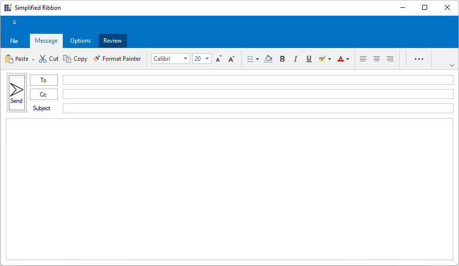
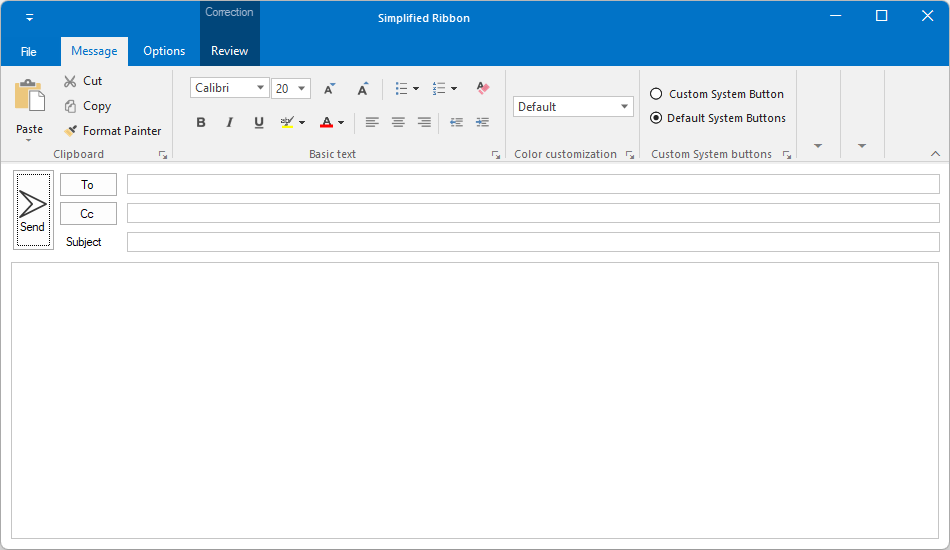
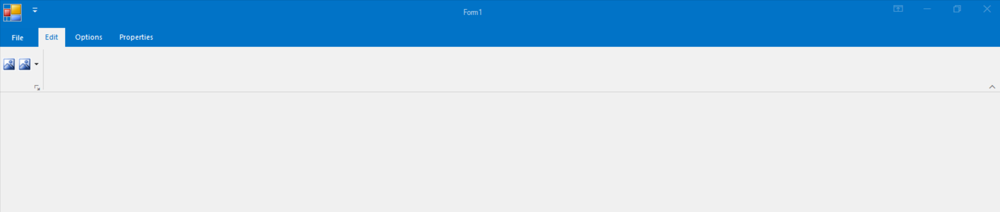
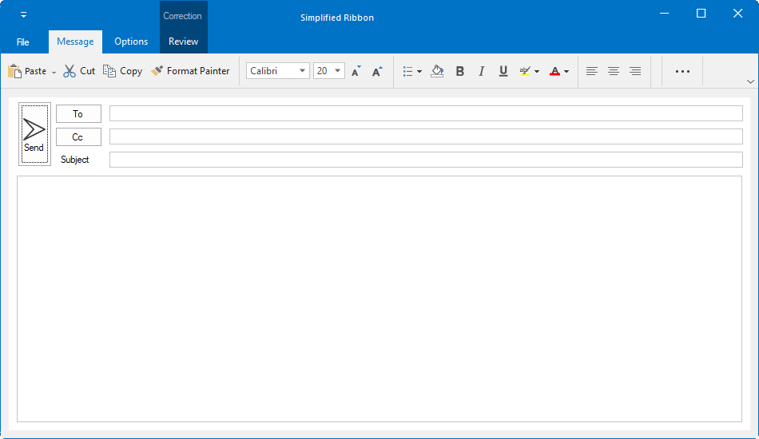
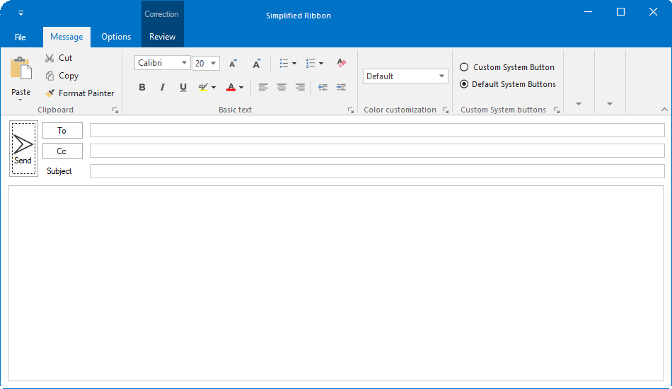
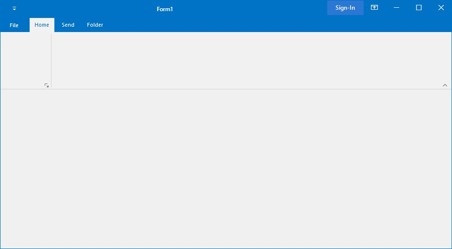

# Ribbon Form in Windows Forms Ribbon (RibbonControlAdv)

`RibbonForm` is an extension that replaces the default form to enable different Visual styles to the ribbon. This RibbonForm now gives similar look and feel of Microsoft office, to its controls.

## Appearance Settings

<table>
<tr>
<th>
Property</th><th>
Description</th></tr>
<tr>
<td>
Appearance</td><td>
Sets the appearance of the form. The values are Normal and Office2007</td></tr>
<tr>
<td>
ColorScheme</td><td>
Specifies the office color scheme of the Ribbon form. The color schemes are, Blue, Black, Silver and Managed (Default).</td></tr>
<tr>
<td>
EnableAeroTheme</td><td>
Specifies the Aero theme of the Ribbon form. </td></tr>
<tr>
<td>
Font</td><td>
Gets or sets the RibbonControlAdv Font.</td></tr>
</table>





//Specifies the appearance of the form
this.Appearance = AppearanceType.Office2007;

//Specifies the color scheme for the form
this.ColorScheme = ColorSchemeType.Blue;

//Specifies the Aero theme
this.EnableAeroTheme = true;





Me.Appearance = AppearanceType.Office2007

Me.ColorScheme = ColorSchemeType.Blue

Me.EnableAeroTheme = True





`Appearance` property can be used to remove the form title bar and replace it with the RibbonControlAdv built-in system buttons.

*	Normal

*	Office2007

N>[View sample in GitHub](https://github.com/SyncfusionExamples/How-to-customize-the-appearance-of-the-RibbonForm)

## IconSize

You can customize the icon size between 16 to 32 using the `IconSize` property. By default the icon rendered with a size of 16x16 pixels.





this.IconSize = new Size(32,32);





Me.IconSize = New Size(32, 32)





## Customization

The property which lets you set borders for the Office2007Style form is as follows.

<table>
<tr>
<th>
Property</th><th>
Description</th></tr>
<tr>
<td>
Borders</td><td>
Gets/sets the border values of an Office 2007 style form. Sets borders for Left, Top, Right and Bottom sides of the form.</td></tr>
</table>



this.Borders = new System.Windows.Forms.Padding(10);





Me.Borders = New System.Windows.Forms.Padding(10)



### Customizing the Top Left Edge

This TopLeftRadius property gets/sets the curved radius of the top left edge of the form. Default is 8.



this.TopLeftRadius = 20;





Me.TopLeftRadius = 20



N> The Borders and TopLeftRadius reflect in UI when the EnableAeroTheme is set to false and Appearance to Normal.

## Adding user control to the title bar

The [`RibbonForm`](https://help.syncfusion.com/cr/windowsforms/Syncfusion.Windows.Forms.Tools.RibbonForm.html) allows to load any user control into the right side of the title bar by using the [`HeaderItem`](https://help.syncfusion.com/cr/windowsforms/Syncfusion.Windows.Forms.Tools.RibbonForm.html#Syncfusion_Windows_Forms_Tools_RibbonForm_HeaderItem) property.

The following code example illustrates how to add the header item in title bar of the RibbonForm.





this.button = new SfButton();
this.button.ForeColor = Color.White;
this.button.Font = Font = new System.Drawing.Font("Segoe UI Semibold", 9F);
this.button.Size = new System.Drawing.Size(75, 50);
this.button.Text = "Sign-In";
this.button.Style.BackColor = System.Drawing.Color.FromArgb(((int)(((byte)(42)))), ((int)(((byte)(120)))), ((int)(((byte)(212)))));
this.button.Style.HoverBackColor = System.Drawing.Color.FromArgb(((int)(((byte)(42)))), ((int)(((byte)(141)))), ((int)(((byte)(212)))));
this.button.Style.FocusedBackColor = System.Drawing.Color.FromArgb(((int)(((byte)(42)))), ((int)(((byte)(87)))), ((int)(((byte)(154)))));
this.button.Style.PressedBackColor = System.Drawing.Color.FromArgb(((int)(((byte)(42)))), ((int)(((byte)(87)))), ((int)(((byte)(154)))));
this.button.Style.PressedForeColor = Color.White;
this.button.Style.HoverForeColor = Color.White;
this.button.Style.FocusedForeColor = Color.White;

this.HeaderItem = button;





N>[View sample in GitHub](https://github.com/SyncfusionExamples/How-to-load-user-control-to-titlebar-of-RibbonForm)
