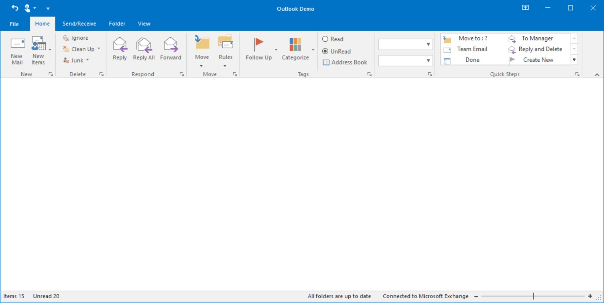

# Ribbon Form

`RibbonForm` is an extension that replaces the default form to enable different Visual styles to the ribbon. This RibbonForm now gives similar look and feel of Microsoft office, to its controls.

## Appearance Settings

<table>
<tr>
<th>
Property</th><th>
Description</th></tr>
<tr>
<td>
Appearance</td><td>
Sets the appearance of the form. The values are,Normal andOffice2007 (Default)Office 2010</td></tr>
<tr>
<td>
ColorScheme</td><td>
Specifies the office color scheme of the Ribbon form. The color schemes are, Blue, Black, Silver and Managed (Default).</td></tr>
<tr>
<td>
EnableAeroTheme</td><td>
Specifies the Aero theme of the Ribbon form. </td></tr>
<tr>
<td>
Font</td><td>
Gets or sets the RibbonControlAdv Font.</td></tr>
</table>





//Specifies the appearance of the form
this.Appearance = AppearanceType.Office2007;

//Specifies the color scheme for the form
this.ColorScheme = ColorSchemeType.Blue;

//Specifies the Aero theme
this.EnableAeroTheme = true;





Me.Appearance = AppearanceType.Office2007

Me.ColorScheme = ColorSchemeType.Blue

Me.EnableAeroTheme = True





`IsFormManager` property can be used to remove the form title bar and replace it with the RibbonControlAdv built-in system buttons.

*	Default Theme

*	Aero Theme

## Customization

The property which lets you set borders for the Office2007Style form is as follows.

<table>
<tr>
<th>
Property</th><th>
Description</th></tr>
<tr>
<td>
Borders</td><td>
Gets/sets the border values of an Office 2007 style form. Sets borders for Left, Top, Right and Bottom sides of the form.</td></tr>
</table>



this.Borders = new System.Windows.Forms.Padding(10);





Me.Borders = New System.Windows.Forms.Padding(10)



### Customizing the Top Left Edge

This TopLeftRadius property gets/sets the curved radius of the top left edge of the form. Default is 8.



this.TopLeftRadius = 20;





Me.TopLeftRadius = 20



## Adding user control to the title bar

The `RibbonForm` allows you to load any user control into the title bar using the `HeaderItem` property. 

The following code example illustrates how to add the header item in title bar of the RibbonForm.





using Syncfusion.Windows.Forms.Tools;
using Syncfusion.WinForms.Controls;

public partial class Form1 : RibbonForm
{
    private Syncfusion.Windows.Forms.Tools.RibbonControlAdv ribbonControlAdv1;
    private Syncfusion.Windows.Forms.Tools.ToolStripTabItem homeTabItem;
    private Syncfusion.Windows.Forms.Tools.ToolStripTabItem sendTabItem;
    private Syncfusion.Windows.Forms.Tools.ToolStripTabItem folderTabItem;
    private Syncfusion.Windows.Forms.Tools.ToolStripEx newToolStripEx;
    private Syncfusion.Windows.Forms.BackStageView backStageView1;
    private Syncfusion.Windows.Forms.BackStage backStage1;
    private Syncfusion.Windows.Forms.BackStageTab openExportBackStageTab;
    private Syncfusion.Windows.Forms.BackStageTab saveAttachmentsBackStageTab;
    private Syncfusion.Windows.Forms.BackStageTab openBackStageTab;
    private Syncfusion.Windows.Forms.BackStageTab officeAccountsBackStageTab;
    private Syncfusion.Windows.Forms.BackStageSeparator backStageSeparator;
    private Syncfusion.Windows.Forms.BackStageTab printBackStageTab;
    private Syncfusion.Windows.Forms.BackStageButton closeBackStageButton;
    private Syncfusion.WinForms.Controls.SfButton button;

    public Form1()
    {
        InitializeComponent();
        this.ribbonControlAdv1 = new Syncfusion.Windows.Forms.Tools.RibbonControlAdv();
        this.homeTabItem = new Syncfusion.Windows.Forms.Tools.ToolStripTabItem();
        this.sendTabItem = new Syncfusion.Windows.Forms.Tools.ToolStripTabItem();
        this.folderTabItem = new Syncfusion.Windows.Forms.Tools.ToolStripTabItem();
        this.newToolStripEx = new Syncfusion.Windows.Forms.Tools.ToolStripEx();
        this.backStageView1 = new Syncfusion.Windows.Forms.BackStageView(this.components);
        this.backStage1 = new Syncfusion.Windows.Forms.BackStage();
        this.openExportBackStageTab = new Syncfusion.Windows.Forms.BackStageTab();
        this.saveAttachmentsBackStageTab = new Syncfusion.Windows.Forms.BackStageTab();
        this.openBackStageTab = new Syncfusion.Windows.Forms.BackStageTab();
        this.officeAccountsBackStageTab = new Syncfusion.Windows.Forms.BackStageTab();
        this.backStageSeparator = new Syncfusion.Windows.Forms.BackStageSeparator();
        this.printBackStageTab = new Syncfusion.Windows.Forms.BackStageTab();
        this.closeBackStageButton = new Syncfusion.Windows.Forms.BackStageButton();

        this.ribbonControlAdv1.BackStageView = this.backStageView1;
        this.ribbonControlAdv1.MenuButtonText = "File";
        this.ribbonControlAdv1.Size = new System.Drawing.Size(1036, 160);
        this.ribbonControlAdv1.RibbonStyle = RibbonStyle.Office2016;
        this.Controls.Add(ribbonControlAdv1);

        this.homeTabItem.Text = "Home";
        this.sendTabItem.Text = "Send";
        this.folderTabItem.Text = "Folder";

        this.ribbonControlAdv1.Header.AddMainItem(this.homeTabItem);
        this.ribbonControlAdv1.Header.AddMainItem(this.sendTabItem);
        this.ribbonControlAdv1.Header.AddMainItem(this.folderTabItem);

        this.newToolStripEx.GripStyle = System.Windows.Forms.ToolStripGripStyle.Hidden;
        this.homeTabItem.Panel.Controls.Add(newToolStripEx);

        this.button = new SfButton();
        this.button.ForeColor = Color.White;
        this.button.Font = Font = new System.Drawing.Font("Segoe UI Semibold", 9F);
        this.button.Size = new System.Drawing.Size(75, 50);
        this.button.Text = "Sign-In";
        this.button.Style.BackColor = System.Drawing.Color.FromArgb(((int)(((byte)(42)))), ((int)(((byte)(120)))), ((int)(((byte)(212)))));
        this.button.Style.HoverBackColor = System.Drawing.Color.FromArgb(((int)(((byte)(42)))), ((int)(((byte)(141)))), ((int)(((byte)(212)))));
        this.button.Style.FocusedBackColor = System.Drawing.Color.FromArgb(((int)(((byte)(42)))), ((int)(((byte)(87)))), ((int)(((byte)(154)))));
        this.button.Style.PressedBackColor = System.Drawing.Color.FromArgb(((int)(((byte)(42)))), ((int)(((byte)(87)))), ((int)(((byte)(154)))));
        this.button.Style.PressedForeColor = Color.White;
        this.button.Style.HoverForeColor = Color.White;
        this.button.Style.FocusedForeColor = Color.White;
        this.HeaderItem = button;

        this.backStageView1.BackStage = this.backStage1;
        this.backStageView1.HostControl = null;
        this.backStageView1.HostForm = this;

        this.openExportBackStageTab.Text = "Open/Export";
        this.saveAttachmentsBackStageTab.Text = "Save Attachments";
        this.openBackStageTab.Text = "Open";
        this.officeAccountsBackStageTab.Text = "Office Accounts";
        this.printBackStageTab.Text = "Print";
        this.closeBackStageButton.Text = "Close";

        this.backStage1.Controls.Add(openExportBackStageTab);
        this.backStage1.Controls.Add(saveAttachmentsBackStageTab);
        this.backStage1.Controls.Add(openBackStageTab);
        this.backStage1.Controls.Add(officeAccountsBackStageTab);
        this.backStage1.Controls.Add(backStageSeparator);
        this.backStage1.Controls.Add(printBackStageTab);
        this.backStage1.Controls.Add(closeBackStageButton);
    }
}





N>[View sample in GitHub]()