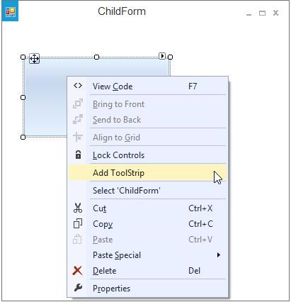
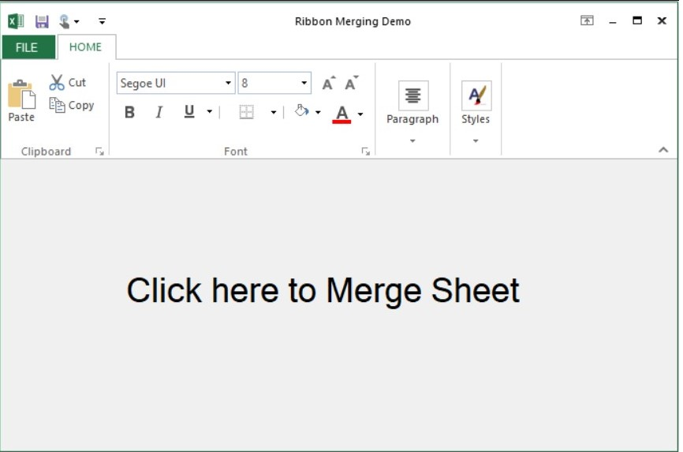
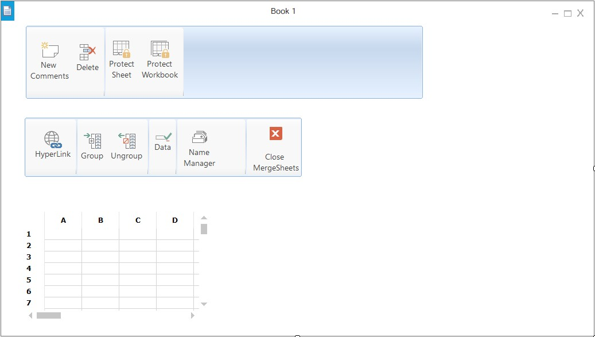
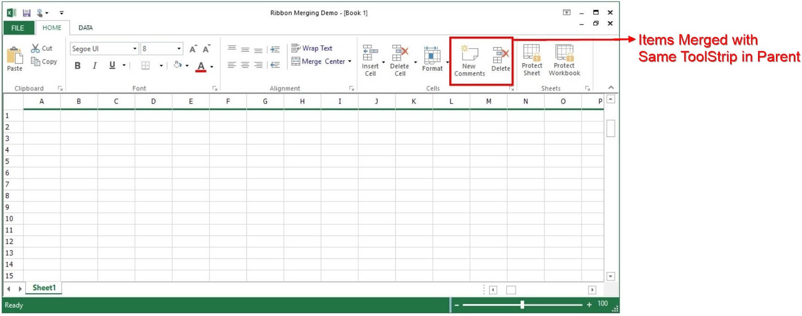
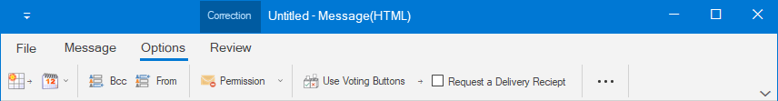

# Ribbon Merge Support in Windows Forms Ribbon (RibbonControlAdv)

RibbonControlAdv allows merging of RibbonPanel in a child form to the RibbonPanel of the parent form.
`RibbonPanelMergeContainer` is the container of TabItems and ToolStripEx items for the child form, when merged, the items present in this container will be merged with parent form.

To merge the RibbonPanel in the ChildForm with the RibbonPanel in the parent form, follow the below given steps.

In a Ribbon form, add a RibbonControlAdv control and the required ToolStripTabItems and the ToolStripEx items.

## Creating Ribbon Panel Merge Container

From the ToolBox, add a RibbonPanelMergeContainer to the ChildForm. ToolStripEx can be added into this by right Clicking on it.

## Assign Merge Container to Ribbon

Now add this ChildForm to the RibbonForm that is the MDIParent of the ChildForm in the default manner.





ChildForm frm = new ChildForm(); 

frm.MdiParent = this; 

frm.Show();





Dim frm As ChildForm = New ChildForm()

frm.MdiParent = Me

frm.Show()





* Parent Form

* Child Form

* Parent form after merging, the extra tabs from child form (Data and View) are merged with the main form Ribbon control.

## Merge ToolStrip with existing Tab

While merging the RibbonPanel in the ChildForm to the Parent form, if the RibbonPanelMergeContainer has the same text (i.e. Text for ToolstripTabItem), then the ToolstripEx inside the ChildForm’s RibbonPanel will be merged with the Parent form ToolstripTabItem.





this.ribbonPanelMergeContainer2.Text = "HOME";





Me.ribbonPanelMergeContainer2.Text = "HOME"





* The new ToolStripEx (Comments and Sheets) from child form are merged with parent form.

## Merge ToolStrip Items with existing ToolStrip

Also, when the ToolstripEx has same ToolstripTabItem text and same ToolstripEx text then the ToolStripItem in the ToolstripEx in ChildForm will be merged with the ToolstripEx in the Parent form.





this.ribbonPanelMergeContainer1.Text = "HOME";
this.toolStripEx1.Text = "Cells";





Me.ribbonPanelMergeContainer1.Text = "HOME"
Me.toolStripEx1.Text = "Cells"





*	The controls in ToolStripEx with the name **Cells** in child form has been merged with the ToolstripEx with the same name in parent form.

## Tab Positioning

While merging the RibbonPanel in the ChildForm with the RibbonPanel in the parent form, position can be set for the newly added `ToolstripTabItem` using the `RibbonMergeManager`.

Now the Edit and Field ToolStripTabItem will be placed as given in the above code example.





// Initializes the RibbonMergeManager class with the corresponding RibbonPanelMergeContainer should be passed.
RibbonMergeManager merge = new RibbonMergeManager(this.ViewToolStripEx);

// Sets the index of the tab with the RibbonPanelMergeContainer text.
merge.SetTabIndex(this.ViewToolStripEx.Text, 0);





Dim merge As RibbonMergeManager = New RibbonMergeManager(Me.ViewToolStripEx)
merge.SetTabIndex(Me.ViewToolStripEx.Text, 0)





*	Now the View Tab has been moved to zeroth position as mentioned in the code

## Merged items in simplified layout

When the simplified layout is enabled in the Ribbon control, the merged items will be displayed in a single line as shown below. To know more about the simplified layout, refer [here](https://help.syncfusion.com/windowsforms/ribbon/simplifiedlayout).

