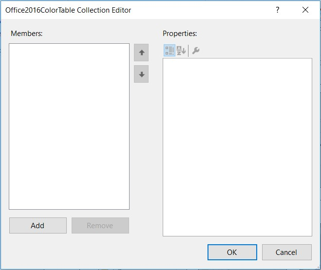

# Working with Tabs in Windows Forms Ribbon (RibbonControlAdv)

Ribbon panels are represented as Tabs(ToolStripTabItem) with tab name above the panel, these panels are split into groups which are ‘ToolStripEx’, this ToolStripEx accepts to display various items like buttons, gallery items, labels and panels.

The following image shows four tabs (**Home**, **Send/Receive**, **Folder** and **View**). The Home tab which is selected consists of six ‘ToolStripEx’ (**New**, **Delete**, **Respond**, **Move**, **Tags** and **Quick Steps** ).

## Tab Selection

`Check` property of Tab allows to select the tab when application runs.

The below code snippet will explain how to change the selected tab.





//Changes the sendTabItem as selected tab
this.sendTabItem.Checked = true;





Me.sendTabItem.Checked = True





## Tab Appearance

Appearance of a tab can be customized using color table in Office 2016 theme.
Follow the steps below to customize the tab using color table.

*	In the property window of the Ribbon, click the Office2016ColorTable property. The following window will be shown

*	Click Add button to customize the RibbonControlAdv with the Office2016ColorTable property.

*	Set the required colors for customizing the Tabs.

**Through code**





//Creating instance of color table
Office2016ColorTable color = new Office2016ColorTable();

//To set the Selected TabColor
// color.SelectedTabColor = ColorTranslator.FromHtml("#2a8ad4");
color.SelectedTabColor = Color.LightGray;

//To set the Hover Tab Fore Color
color.HoverTabForeColor = Color.CadetBlue;

//To set the Checked Tab Color
color.CheckedTabColor = Color.Gray;

//To set the Checked Tab Fore Color
color.CheckedTabForeColor = Color.LightBlue;

// To set the TabItem fore color
color.TabForeColor = Color.White;

//To set the TabItem back color
color.TabBackColor = ColorTranslator.FromHtml("#0173c7");

// Adds the color table instance to the ColorTable

this.ribbonControlAdv1.Office2016ColorTable.Add(color);





    Dim color As Office2016ColorTable = New Office2016ColorTable()

    color.SelectedTabColor = Color.LightGray
    color.HoverTabForeColor = Color.CadetBlue
    color.CheckedTabColor = Color.Gray
    color.CheckedTabForeColor = Color.LightBlue
    color.TabForeColor = Color.White
    color.TabBackColor = ColorTranslator.FromHtml("#0173c7")

    Me.ribbonControlAdv1.Office2016ColorTable.Add(color)





For Customization of all the remaining items in ribbon, please refer `Office2016 Color Table`.

## RibbonTab Navigation

To switch between ToolStripTabItems or change to a particular tab item, use the mouse scroll wheel. Just place the mouse cursor on a tab item and then scroll up or down and switching happens between the tabs. 

## Events

<table>
<tr>
<th>
Events</th><th>
Description</th><th>
EventArgs</th></tr>

<tr>
<td>
RibbonControlAdv1.SelectedTabItemChanged</td><td>
Occurs when selected ToolStripTabItem has changed.</td><td>
SelectedTabChangedEventArgs</td></tr>
<tr>
<td>
RibbonControlAdv1.Header.MainItems.BeforeAddItem</td><td>
Occurs before a ToolStripItem is added to the collection.</td><td>
RibbonItemEventArgs</td></tr>
<tr>
<td>
RibbonControlAdv1.Header.MainItems.BeforeRemoveItem</td><td>
Occurs before a ToolStripItem is removed from the collection.</td><td>
RibbonItemEventArgs</td></tr>
</table>
