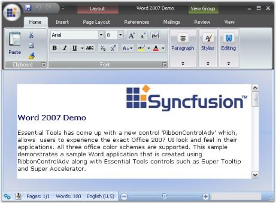

# Appearance Settings

The appearance settings of the RibbonControlAdv are discussed under the below sections:

## OfficeColorSchemes

The Ribbon Control Adv has come up with the same visual style of Office 2007. The users can choose between three colors Blue, Silver and Black which, can be set through the OfficeColorScheme property of the RibbonControlAdv class.



this.ribbonControlAdv1.OfficeColorScheme = Syncfusion.Windows.Forms.Tools.ToolStripEx.ColorScheme.Blue;





Me.ribbonControlAdv1.OfficeColorScheme = Syncfusion.Windows.Forms.Tools.ToolStripEx.ColorScheme.Blue



## Custom Color Scheme 

To set custom colors, set the ColorScheme as Managed. Then set the desired color using the  Syncfusion.Windows.Forms.Tools.Office12ColorTable.ApplyManagedColors method. 



//set the custom color to the form and RibbonControlAdv 

this.ColorScheme = ColorSchemeType.Managed;

this.ribbonControlAdv1.OfficeColorScheme = ToolStripEx.ColorScheme.Managed;

Office12ColorTable.ApplyManagedColors(this, Color.Red); 





'set the custom color to the form and RibbonControlAdv 

Me.ColorScheme = ColorSchemeType.Managed

Me.ribbonControlAdv1.OfficeColorScheme = ToolStripEx.ColorScheme.Managed

Office12ColorTable.ApplyManagedColors(Me, Color.Red)



## Caption ForeColor

Title color of the RibbonControlAdv can be set with the TitleColor property.



this.ribbonControlAdv1.TitleColor = Color.Green;





  Me.ribbonControlAdv1.TitleColor = Color.Green;

