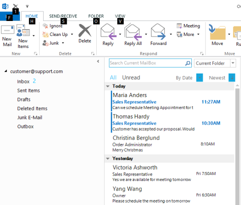

# How to customize the look of SuperAccelerator as like in MS Office2013?

SuperAccelerator can now be customized as like in Office 2013. Appearance property in SuperAccelerator can be used to get the customized look. 

The appearance types of SuperAccelerator are as follows.

* Default
* Advanced

The following code example allows you to customize the SuperAccelerator.



this.superAccelerator1.Appearance = Syncfusion.Windows.Forms.Tools.Appearance.Advanced;





Me.superAccelerator1.Appearance = Syncfusion.Windows.Forms.Tools.Appearance.Advanced



