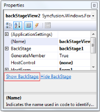
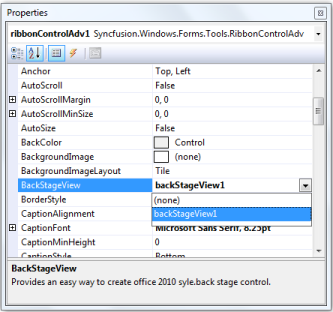

# Office 2010 Style Ribbon

This feature provides Office 2010 like theme for your ribbon. You can give Office 2010 like look and feel for your application. Essential Tools supports the three themes found in Office 2010. They are: 

* Blue
* Black 
* Silver

Essential Tools also enables you to create a BackStageView. You can open the BackStageView by clicking the File tab. This enables you to use the features that fall outside the Ribbon. Ribbon enables you to work in the document and Backstage enables you to work with the document. Using this you can alter contents and provide end-user options that are related to specific solution requirements.

N> Backstageview can be accessed only when Ribbon style is set to Office 2010.

You can apply Office 2010 Style Ribbon and create BackStageView in two methods. They are:

* Through Designer
* Programmatically

## Through Designer

### Apply Theme for Ribbon

The following are steps to apply Office 2010 style for the Ribbon:

1. Create a Windows Form application in Visual Studio. 
2. Drag and drop the RibbonControlAdv from the Toolbox.

   

3. In the Property grid, set RibbonStyle to Office2010.

   

4. Office 2010 Ribbon will be applied for Ribbon.

   

### Creating BackStageView

The following are steps to create a BackStageView:

1. Drag and drop the BackStageView from the Toolbox.

   

2. In the Property grid, click the ShowBackstage.

   

3. Empty BackStage will be displayed.

   

4. To add a BackStageButton, click the Add BackStage Button.

   

5. To add BackStageTab, click the Add BackStage Tab.

   

6. Set BackStageView to RibbonControlAdv.

   

7. Back Stage will be created with a BackStage Button and a BackStage Tab

   

## Programmatically 

### Apply Theme for Ribbon

The following code illustrates how to apply the Office2010 theme to the ribbon:



   this.ribbonControlAdv1.RibbonStyle = Syncfusion.Windows.Forms.Tools.RibbonStyle.Office2010;





Me.ribbonControlAdv1.RibbonStyle = Syncfusion.Windows.Forms.Tools.RibbonStyle.Office2010



### Creating BackStageView

The following code illustrates how to create a backstage with a BackStageButtom and a BackStageTab:



using Syncfusion.Windows.Forms;

BackStageView backStageView1 = new BackStageView(this.components);

BackStage backStage1 = new BackStage();

BackStageTab backStageTab1 = new BackStageTab();

BackStageButton backStageButton1 = new BackStageButton();

// backStageView1

backStageView1.BackStage = backStage1;

backStageView1.HostControl = null;

backStageView1.HostForm = this;

// backStage1

backStage1.Controls.Add(backStageTab1);

backStage1.Controls.Add(backStageButton1);

backStage1.Dock = System.Windows.Forms.DockStyle.Fill;

// backStageTab1

backStageTab1.Text = "backStageTab1";

// backStageButton1

backStageButton1.Text = "backStageButton1";

// ribbonControlAdv1

ribbonControlAdv1.BackStageView = backStageView1;

//Add BackStage to RibbonControlAdv 

ribbonControlAdv1.BackStageView =backStageView1;

//Add BackStage and RibbonControlAdv to form

this.Controls.Add(backStage1);

this.Controls.Add(this.ribbonControlAdv1);   





Imports Syncfusion.Windows.Forms

Dim backStageView1 As New BackStageView(Me.components)

Dim backStage1 As New BackStage()

Dim backStageTab1 As New BackStageTab()

Dim backStageButton1 As New BackStageButton()

' backStageView1

backStageView1.BackStage = backStage1

backStageView1.HostControl = Nothing

backStageView1.HostForm = Me

' backStage1

backStage1.Controls.Add(backStageTab1)

backStage1.Controls.Add(backStageButton1)

backStage1.Dock = System.Windows.Forms.DockStyle.Fill

' backStageTab1

backStageTab1.Text = "backStageTab1"

' backStageButton1

backStageButton1.Text = "backStageButton1"

' ribbonControlAdv1

ribbonControlAdv1.BackStageView = backStageView1

'Add BackStage to RibbonControlAdv 

ribbonControlAdv1.BackStageView =backStageView1

'Add BackStage and RibbonControlAdv to form

Me.Controls.Add(backStage1)

Me.Controls.Add(Me.ribbonControlAdv1)



Refer to:

Appearance Setting