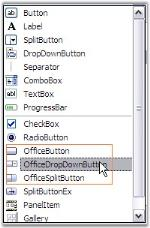
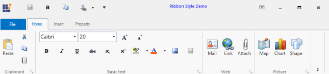
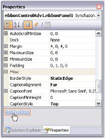
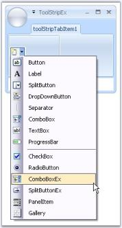
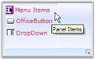
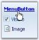
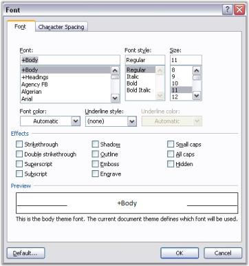

# Ribbon Control Items

This section discusses the following Ribbon Control Items.

## Office Menu Button

The RibbonControlAdv has the office menu button at the top left corner of the form. Controls can be added to the panels of the office menu button dropdown through designer without a single piece of code.

### MenuButton Drop Down

When the OfficeMenuButton is clicked, ToolStripDropDown is displayed. This dropdown can be customized through designer as well as through code. 

#### Through Designer Using Menu Panels

RibbonControlAdv lets you add customized ToolStrip items in the OfficeMenu button dropdown with the help of the menu panels. 

The panels are:

* Aux Panel
* Main Panel
* System Panel

#### Adding ToolStrip Items to the Panels

Each Panel has Items property which invokes the Items Collection Editor. Using this editor you can add the toolstrip items easily.

_Table_ _685_: _Property Table_

<table>
<tr>
<th>
Property</th><th>
Description</th></tr>
<tr>
<td>
Items</td><td>
Lets you open Items Collection Editor using which you can add items to the panel.</td></tr>
</table>

#### Programmatically Adding a ToolStripDropDown

ToolStripDropDown can be added programmatically using ToolStripDropDown class and then assigning it to the RibbonControlAdv.MenuDropDownButton property as follows.

_Table_ _686_: _Property Table_

<table>
<tr>
<th>
Property</th><th>
Description</th></tr>
<tr>
<td>
MenuButtonDropDown</td><td>
Gets / Sets ToolStripDropDown to be displayed, when the OfficeMenuButton is clicked.</td></tr>
</table>



// Initialize a ToolStripDropDown button.

ToolStripDropDown dropDown = new ToolStripDropDown();

//Initialize the controls that are to be added in the panel.

ToolStripButton newBtn = new ToolStripButton("&New");

ToolStripButton openBtn = new ToolStripButton("&Open");

ToolStripButton saveBtn = new ToolStripButton("&Save");

ToolStripButton closeBtn = new ToolStripButton("&Close");

// Initialize a new panel (Panel 1)

ToolStripPanelItem panel1 = new ToolStripPanelItem();

panel1.Items.Add(newBtn);

panel1.Items.Add(openBtn);

panel1.Items.Add(saveBtn);

panel1.Items.Add(closeBtn);

// Set the row count.

panel1.RowCount = 9;

//Settings for the buttons

foreach (ToolStripButton btn in panel1.Items)

{

    btn.AutoSize = false;

    btn.Size = new Size(170, 35);

    btn.ImageAlign = ContentAlignment.MiddleLeft;

    btn.TextAlign = ContentAlignment.MiddleLeft;

    btn.ImageScaling = ToolStripItemImageScaling.None;

}

// Add the panel into the items of the ToolStripDropDown.

dropDown.Items.Add(panel1);

// Set the MenuButtonDropDown property of the RibbonControlAdv.

this.ribbonControlAdv1.MenuButtonDropDown = dropDown;





' Initialize a ToolStripDropDown button. 

Dim dropDown As New ToolStripDropDown()

'Initialize the controls that are to be added in the panel. 

Dim newBtn As New ToolStripButton("&New")

Dim openBtn As New ToolStripButton("&Open")

Dim saveBtn As New ToolStripButton("&Save")

Dim closeBtn As New ToolStripButton("&Close")

' Initialize a new panel (Panel 1) 

Dim panel1 As New ToolStripPanelItem()

panel1.Items.Add(newBtn) 

panel1.Items.Add(openBtn) 

panel1.Items.Add(saveBtn) 

panel1.Items.Add(closeBtn) 

' Set the row count. 

panel1.RowCount = 9 

'Settings for the buttons 

For Each btn As ToolStripButton In panel1.Items 

    btn.AutoSize = False 

    btn.Size = New Size(170, 35) 

    btn.ImageAlign = ContentAlignment.MiddleLeft 

    btn.TextAlign = ContentAlignment.MiddleLeft 

    btn.ImageScaling = ToolStripItemImageScaling.None 

Next 

' Add the panel into the items of the ToolStripDropDown. 

dropDown.Items.Add(panel1) 

' Set the MenuButtonDropDown property of the RibbonControlAdv. 

Me.ribbonControlAdv1.MenuButtonDropDown = dropDown



### Adding ContextMenuStripEx as OfficeMenuDropDown

You can also display a ContextMenuStrip in the OfficeMenu button dropdown. This can be done by assigning a custom ContextMenuStrip to the RibbonControlAdv.MenuButtonDropDown property.



this.ribbonControlAdv1.MenuButtonDropDown = this.contextMenuStripEx1;





Me.ribbonControlAdv1.MenuButtonDropDown = Me.contextMenuStripEx1



#### Properties

Panel Text

Text for the MenuButtonDropDown panels and its font style can be specified using the below properties.

_Table_ _687_: _Property Table_

<table>
<tr>
<th>
Property</th><th>
Description</th></tr>
<tr>
<td>
Text</td><td>
Sets text for the panel.</td></tr>
<tr>
<td>
Font</td><td>
Sets the Font style for the text.</td></tr>
</table>



this.ribbonControlAdv1.OfficeMenu.AuxPanel.Text = "Recent Documents";

this.ribbonControlAdv1.OfficeMenu.AuxPanel.Font = new System.Drawing.Font("Verdana", 8.25F);





Me.ribbonControlAdv1.OfficeMenu.AuxPanel.Text = "Recent Documents" 

Me.ribbonControlAdv1.OfficeMenu.AuxPanel.Font = New System.Drawing.Font("Verdana", 8.25F)



#### Adding Separator and Minimum Size Settings

The property which adds a line separator between the toolstrip items and the property which sets the minimum size for the panels is as follows.

_Table_ _688_: _Property Table_

<table>
<tr>
<th>
Property</th><th>
Description</th></tr>
<tr>
<td>
SeparatorIndent</td><td>
Inserts a line separator between the menu items.</td></tr>
<tr>
<td>
MinimumSize</td><td>
Specifies minimum size for the panels.</td></tr>
</table>



this.ribbonControlAdv1.OfficeMenu.MainPanel.SeparatorIndent = 15;

this.ribbonControlAdv1.OfficeMenu.AuxPanel.MinimumSize = new System.Drawing.Size(30, 30);





Me.ribbonControlAdv1.OfficeMenu.MainPanel.SeparatorIndent = 15

Me.ribbonControlAdv1.OfficeMenu.AuxPanel.MinimumSize = New System.Drawing.Size(30, 30)



#### Adding Items to the Dropdown

The ToolStrip Items which can be added to the Menu Panels, using the Panel's Items Collection Editor dialog are as follows.

* Button – Adds button to the panel.
* Label – Adds label to the panel.
* SplitButton – Adds a button with a split appearance.
* DropDownButton – Adds drop down button.
* Separator – Adds a line separator in the panel.
* ComboBox – Adds a combo box.
* Textbox – Adds a textbox.
* ProgressBar – Adds a progress bar to the panel.
* CheckBox – Added a checkbox.
* RadioButton – Adds a radio button.
* OfficeButton – Adds an office button.
* OfficeDropDownButton – Adds a office dropdown button.
* OfficeSplitButton – Adds a Office split button.
* SplitButtonEx – Adds SplitButtonEx control item.
* PanelItem - Adds panel items.
* Gallery – Add Gallery item.

The properties of ToolStripItems are available in Items Collection Editor which lets you customize the appearance of the items.

#### OfficeButton Properties

This section discusses the properties of Office button toolstrip items.

Common Properties for the Office buttons

_Table_ _689_: _Property Table_

<table>
<tr>
<th>
Property</th><th>
Description</th></tr>
<tr>
<td>
Text</td><td>
Sets the text for the item.</td></tr>
<tr>
<td>
TextAlign</td><td>
Specifies the alignment of the text in the item.</td></tr>
<tr>
<td>
TextDirection</td><td>
Sets the direction of the text in the item. The options are,Horizontal,Vertical90 andVertical270.</td></tr>
<tr>
<td>
TextImageRelation</td><td>
Represents image and text relation.</td></tr>
<tr>
<td>
DisplayStyle</td><td>
Sets the display style of the item. The options are,{{ '_Text_' | markdownify }} - Displays only text,{{ '_Image_' | markdownify }} - Displays only image,{{ '_ImageAndText_' | markdownify }} - Displays image and the text in the office button.</td></tr>
<tr>
<td>
Font</td><td>
Sets the font style for the text in the item.</td></tr>
<tr>
<td>
ForeColor</td><td>
Sets the forecolor for the display text.</td></tr>
<tr>
<td>
Image</td><td>
Sets the image for the item.</td></tr>
<tr>
<td>
ImageAlign</td><td>
Sets the alignment of the image.</td></tr>
<tr>
<td>
ImageScaling</td><td>
Specifies the scaling of the image whether SizeToFit or None.</td></tr>
<tr>
<td>
ImageTransparentColor</td><td>
Represents the transparent color for the image.</td></tr>
<tr>
<td>
Visible</td><td>
Sets the visibility of the toolstrip item.</td></tr>
<tr>
<td>
AutoTooltip</td><td>
Lets you to specify whether the tooltip text is taken from the Text property or the ToolTipText property. {{ '_True_' | markdownify }} - Tooltip text is taken from the Text property,{{ '_False_'  | markdownify }}- Tooltip text is taken from the ToolTipText property.OfficeMenu.ShowItemToolTips should be true for this setting to be effective.</td></tr>
<tr>
<td>
ToolTipText</td><td>
Sets the tooltip text when AutoTooltip is false and ShowItemToolTips is true.</td></tr>
<tr>
<td>
Enabled</td><td>
Enables / Disables the item.</td></tr>
<tr>
<td>
Alignment</td><td>
Sets the alignment for the ToolStrip item.</td></tr>
</table>

Office Button

_Table_ _690_: _Property Table_

<table>
<tr>
<th>
Property</th><th>
Description</th></tr>
<tr>
<td>
Checked</td><td>
Specifies whether the Office button should be checked, when the application loads.</td></tr>
<tr>
<td>
CheckState</td><td>
Specifies the check state, whether checked, unchecked or indeterminate.</td></tr>
<tr>
<td>
CheckOnClick</td><td>
Indicates whether the button should be checked on a mouse click.</td></tr>
</table>
OfficeSplitButton

The following properties are specific to OfficeSplitButton.

_Table_ _691_: _Property Table_

<table>
<tr>
<th>
Property</th><th>
Description</th></tr>
<tr>
<td>
DropDownFont</td><td>
Sets the font for the dropdown.</td></tr>
<tr>
<td>
DropDownText</td><td>
Sets the dropdown text.</td></tr>
<tr>
<td>
DropDownItems</td><td>
Specifies the drop down items.</td></tr>
<tr>
<td>
DropDownWidth</td><td>
Shows / hides the dropdown arrow.</td></tr>
</table>

In OfficeSplitButton, the image and the text together will look split from the arrow as shown in the image below.

#### OfficeDropDownButton

The following properties are specific to OfficeDropDownButton.

_Table_ _692_: _Property Table_

<table>
<tr>
<td>
Property</td><td>
Description</td></tr>
<tr>
<td>
DropDownFont</td><td>
Sets the font for the dropdown.</td></tr>
<tr>
<td>
DropDownText</td><td>
Sets the dropdown text.</td></tr>
<tr>
<td>
DropDownItems</td><td>
Specifies the drop down items.</td></tr>
<tr>
<td>
ShowDropDownArrow</td><td>
Shows / hides the dropdown arrow.</td></tr>
</table>

#### Tooltips

OfficeMenuButton can show a SuperToolTip at run time. It can be added using RibbonControlAdv.MenuButtonToolTip on SuperToolTip1 property through Designer or by calling the SetMenuButtonToolTip method of the SuperToolTip control.

N> The above extended property will be available only when your application has a SuperToolTip control.



this.superToolTip1.SetMenuButtonToolTip(this.ribbonControlAdv1, toolTipInfo1);





Me.superToolTip1.SetMenuButtonToolTip(Me.ribbonControlAdv1, toolTipInfo1)



#### ToolTips for ToolStrip Items in DropDown

Tooltips for the items can be enabled using ShowItemToolTips property. 

Text for the tooltips can be specified in ToolTipText property of the respective ToolStrip items.



//Enabling Tooltips for the menu items

this.ribbonControlAdv1.OfficeMenu.ShowItemToolTips = true;

//Setting ToolTip text for ToolStripButton1

this.toolStripButton1.ToolTipText = "Open";





'Enabling Tooltips for the menu items

Me.ribbonControlAdv1.OfficeMenu.ShowItemToolTips = True

'Setting ToolTip text for ToolStripButton1

Me.toolStripButton1.ToolTipText = "Open"





[ToolStripItems](/windowsforms/ribboncontroladv/ribbon-control-items#toolstripitems)



### MenuButton Settings 

The following properties controls the appearance of the Menu button.

_Table_ _693_: _Property Table_

<table>
<tr>
<th>
Property</th><th>
Description</th></tr>
<tr>
<td>
MenuButtonVisible</td><td>
Sets the visibility of the OfficeMenuButton.</td></tr>
<tr>
<td>
MenuButtonImage</td><td>
Gets or sets the image for the OfficeMenuButton.</td></tr>
<tr>
<td>
MenuButtonWidth</td><td>
Specifies the width of the menu button.</td></tr>
</table>



//Sets the visibility of the Menu Button

this.ribbonControlAdv1.MenuButtonVisible = true;

//Sets image for the Menu Button

Image img = Image.FromFile(Application.StartupPath + @"\image.png");

this.ribbonControlAdv1.MenuButtonImage = img;

//Sets width of the Menu Button

this.ribbonControlAdv1.MenuButtonWidth = 50;





'Sets the visibility of the Menu Button

Me.ribbonControlAdv1.MenuButtonVisible = True

'Sets image for the Menu Button

Dim img As Image =  Image.FromFile(Application.StartupPath + "\image.png") 

Me.ribbonControlAdv1.MenuButtonImage = img

'Sets width of the Menu Button

Me.ribbonControlAdv1.MenuButtonWidth = 50



  

 
#### MenuButtonAccelerator

When the SuperAccelerator component is added to the form, an extender property MenuButtonAccelerator on superAccelerator will be added to the RibbonControlAdv properties, where the user can add the key for MenuButton. 



this.superAccelerator1.SetMenuButtonAccelerator(this.ribbonControlAdv1, "F"); 





Me.superAccelerator1.SetMenuButtonAccelerator(Me.ribbonControlAdv1, "F")



At run time when you press Alt key, the menu button will display "F" key as shown in the image.

 

## Office-Like Super Accelerator Support

### Description

The RibbonControlAdv now supports the SuperAccelerator functionality. This allows the user to access the RibbonControlAdv and its components through the keyboard shortcuts as in MS Office.

The SuperAccelerator can be wired to the RibbonControlAdv through the designer and through code.

#### Through Designer

To add the SuperAccelerator key to the RibbonControlAdv, the control must be wired with a SuperAccelerator component as shown in the following image:

The SuperAccelerator key value for a RibbonControlAdv child element can be assigned from the form designer as shown in the following image:

#### Through Code

Using the following code, the SuperAccelerator can be assigned to the RibbonControlAdv. Once SuperAccelerator is assigned, its child items can be assigned with SuperAccelerator key values.

#### Code Sample



SuperAccelerator superAccelerator1 = new SuperAccelerator();

this.ribbonControlAdv1.SuperAccelerator = this.superAccelerator1;



With the following code sample, the SuperAccelerator key value can be assigned to a ToolStripTabItem (named Home in the sample). By specifying controls and accelerator keys in arguments, the SuperAccelerator key will be assigned to the appropriate controls and enable users to select particular controls by pressing the assigned SuperAccelerator keys values on the keyboard.

#### Code Sample



this.superAccelerator1.SetAccelerator(this.Home, "A");



The following image shows SuperAccelerator key visibility in the RibbonControlAdv:

### BackStageView

Like in RibbonControlAdv, SuperAccelerators has been implemented in BackStageView. Accelerators can be assigned to BackStageView as shown in following images:

#### Through Designer

The following image demonstrates how SuperAccelerator key values can be assigned to BackStage child elements:

#### Through Code 

Using the following code sample, the SuperAccelerator can be assigned to BackStageView. Once SuperAccelerator is assigned to BackStageView, accelerator keys can be specified for its child elements

#### Code Sample



this.backStage1.SuperAccelerator = this.superAccelerator1;



Using the following code sample, SuperAccelerator can be assigned to BackStage child elements through code.

#### Code Sample



this.saveButton.Accelerator = "S";



#### SuperAccelerator in BackStageView

The following image visualizes the SuperAccelerarator in BackStage:

The following image visualizes the SuperAccelerator in BackStageTab child elements:

### Backstage Splitter for RibbonControlAdv 2013

#### Adding Separators

The Backstage view lets users add separators between the backstage tabs or buttons.

Separators for Backstage view Through Code

Adding Separator Indices for BackStageView



private Syncfusion.Windows.Forms.BackStageSeparator backStageSeparator1;            

this.backStageSeparator1 = new Syncfusion.Windows.Forms.BackStageSeparator();

this.backStage1.Controls.Add(this.backStageSeparator1);

   // 

   // backStageSeparator1

   // 

this.backStageSeparator1.BackColor = System.Drawing.Color.FromArgb(((int)(((byte)(100)))), ((int)(((byte)(189)))), ((int)(((byte)(255)))));

this.backStageSeparator1.Location = new System.Drawing.Point(19, 60);

this.backStageSeparator1.Name = "backStageSeparator1";

this.backStageSeparator1.Size = new System.Drawing.Size(100, 1);

this.backStageSeparator1.TabIndex = 4;

this.backStageSeparator1.Text = "backStageSeparator1";





Dim backStageSeparator1 As Syncfusion.Windows.Forms.BackStageSeparator
Me.backStageSeparator1 = New Syncfusion.Windows.Forms.BackStageSeparator
Me.backStage1.Controls.Add(Me.backStageSeparator1)
' 
' backStageSeparator1
' 
Me.backStageSeparator1.BackColor = System.Drawing.Color.FromArgb(CType(CType(100,Byte),Integer), CType(CType(189,Byte),Integer), CType(CType(255,Byte),Integer))
Me.backStageSeparator1.Location = New System.Drawing.Point(19, 60)
Me.backStageSeparator1.Name = "backStageSeparator1"
Me.backStageSeparator1.Size = New System.Drawing.Size(100, 1)
Me.backStageSeparator1.TabIndex = 4
Me.backStageSeparator1.Text = "backStageSeparator1"



## ToolStripTabItem

RibbonControlAdv lets you to create ToolStripTabItems easily using the smart tag. It also adds a RibbonPanel to which ToolStripItems can be added.

A new TabItem can be added to the RibbonControlAdv programmatically using the AddMainItem method. Create a ToolStripTabItem and then add it to the RibbonControlAdv using the below method.



// Adding a new Tab Item

//Declare and initialize a ToolStripTabItem

private Syncfusion.Windows.Forms.Tools.ToolStripTabItem toolStripTabItem1;

this.toolStripTabItem1 = new Syncfusion.Windows.Forms.Tools.ToolStripTabItem();

//Add the tab item to the RibbonControlAdv

this.ribbonControlAdv1.Header.AddMainItem(this.toolStripTabItem1);





'Adding a new Tab Item

'Declare and initialize a ToolStripTabItem

Private toolStripTabItem1 As Syncfusion.Windows.Forms.Tools.ToolStripTabItem

Me.toolStripTabItem1 = New Syncfusion.Windows.Forms.Tools.ToolStripTabItem 

'Add the tab item to the RibbonControlAdv

Me.ribbonControlAdv1.Header.AddMainItem(Me.toolStripTabItem1)



The following sections discusses various appearance and behavior settings for the ToolStripTabItem. 

* Foreground Settings
* Image Settings
* Ribbon Panel
* Keyboard Shortcut
* Appearance and Behavior Settings

### Foreground Settings 

#### Text Settings

The following properties lets you to edit and control the behavior of the text in the ToolStripTabItem.

_Table_ _694_: _Property Table_

<table>
<tr>
<th>
Property</th><th>
Description</th></tr>
<tr>
<td>
Text</td><td>
Text for the ToolStripTabItem.</td></tr>
<tr>
<td>
TextAlign</td><td>
Alignment of the text in a ToolStripTabItem. The different content alignments are,{{ '_BottomCenter_' | markdownify }} - Vertically aligned at bottom, horizontally aligned at center.{{ '_BottomLeft_' | markdownify }} - Vertically aligned at bottom, horizontally aligned at left.{{ '_BottomRight_' | markdownify }} - Vertically aligned at bottom, horizontally aligned at Right.{{ '_MiddleCenter_' | markdownify }} - Vertically aligned at Middle, horizontally aligned at Center. (Default){{ '_MiddleLeft_' | markdownify }} - Vertically aligned at Middle, horizontally aligned at Left.{{ '_MiddleRight_' | markdownify }} - Vertically aligned at Middle, horizontally aligned at Right.{{ '_TopCenter_' | markdownify }} - Vertically aligned at Top, horizontally aligned at Center.{{ '_TopLeft_' | markdownify }} - Vertically aligned at Top, horizontally aligned at Left.{{ '_TopRight_' | markdownify }} - Vertically aligned at Top, horizontally aligned at Right.</td></tr>
<tr>
<td>
TextDirection</td><td>
Direction of drawing the text. {{ '_Horizontal_' | markdownify }} - specifies horizontal text orientation; (Default){{ '_Inherit_' | markdownify }} - specifies that the text direction is inherited from the parent control; {{ '_Vertical270_' | markdownify }} - specifies that the text is rotated 270 degrees; {{ '_Vertical90_' | markdownify }} - specifies that the text is rotated 90 degrees.</td></tr>
<tr>
<td>
TextImageRelation</td><td>
Relative location of the image to the text in the ToolStripTabItem. See Image Settings.The various options available are,{{ '_Overlay_'  | markdownify }}{{ '_ImageAboveText, (Default)_' | markdownify }}{{ '_TextAboveImage,_'  | markdownify }}{{ '_ImageBeforeText and_'  | markdownify }}{{ '_TextBeforeImage._' | markdownify }}</td></tr>
<tr>
<td>
DisplayStyle</td><td>
Specifies whether image and text are rendered. The options are,Text,Image and ImageAndText.(Default)</td></tr>
</table>



this.toolStripTabItem1.Text = "Features";

this.toolStripTabItem1.TextAlign = System.Drawing.ContentAlignment.MiddleLeft;

this.toolStripTabItem1.TextDirection = System.Windows.Forms.ToolStripTextDirection.Horizontal;

this.toolStripTabItem1.TextImageRelation = System.Windows.Forms.TextImageRelation.ImageBeforeText;

this.toolStripTabItem1.DisplayStyle = ToolStripItemDisplayStyle.ImageAndText;





Me.toolStripTabItem1.Text = "Features"

Me.toolStripTabItem1.TextAlign = System.Drawing.ContentAlignment.MiddleLeft

Me.toolStripTabItem1.TextDirection = System.Windows.Forms.ToolStripTextDirection.Horizontal

Me.toolStripTabItem1.TextImageRelation = System.Windows.Forms.TextImageRelation.ImageBeforeText

Me.toolStripTabItem1.DisplayStyle = ToolStripItemDisplayStyle.ImageAndText



The appearance of the text can be controlled using the below properties.

_Table_ _695_: _Property Table_

<table>
<tr>
<th>
Property</th><th>
Description</th></tr>
<tr>
<td>
Font</td><td>
Set Font Style for the text.</td></tr>
<tr>
<td>
ForeColor</td><td>
Sets fore color for the text.</td></tr>
</table>



this.toolStripTabItem1.Font = new System.Drawing.Font("Verdana", 8.25F, System.Drawing.FontStyle.Bold);

this.toolStripTabItem1.ForeColor = System.Drawing.Color.SteelBlue;





Me.toolStripTabItem1.Font = New System.Drawing.Font("Verdana", 8.25F, System.Drawing.FontStyle.Bold)

Me.toolStripTabItem1.ForeColor = System.Drawing.Color.SteelBlue





[Image Settings](#image-settings)

RibbonPanel

[Appearance and Behavior Settings](#appearance-and-behavior-settings)



### Image Settings 

The below properties controls the image settings for the ToolStripTabItem.

_Table_ _696_: _Property Table_

<table>
<tr>
<th>
Property</th><th>
Description</th></tr>
<tr>
<td>
Image</td><td>
Sets the image for the Tab item.</td></tr>
<tr>
<td>
ImageAlign</td><td>
Specifies alignment of the image.</td></tr>
<tr>
<td>
ImageScaling</td><td>
Specifies whether the image on the item will size to fit on the Toolstrip.</td></tr>
<tr>
<td>
ImageTransparentColor</td><td>
Sets the transparent color on the items image.</td></tr>
</table>



//Settings image properties

this.toolStripTabItem1.Image = ((System.Drawing.Image)(resources.GetObject("toolStripTabItem1.Image")));

this.toolStripTabItem1.ImageAlign = System.Drawing.ContentAlignment.MiddleRight;

this.toolStripTabItem1.ImageScaling = System.Windows.Forms.ToolStripItemImageScaling.None;

this.toolStripTabItem1.ImageTransparentColor = System.Drawing.Color.FloralWhite;





'Settings image properties

Me.toolStripTabItem1.Image = ((System.Drawing.Image)(resources.GetObject("toolStripTabItem1.Image")))

Me.toolStripTabItem1.ImageAlign = System.Drawing.ContentAlignment.MiddleRight

Me.toolStripTabItem1.ImageScaling = System.Windows.Forms.ToolStripItemImageScaling.None

Me.toolStripTabItem1.ImageTransparentColor = System.Drawing.Color.FloralWhite



 



[Foreground Settings](#foreground-settings)

[Ribbon Panel](#ribbon-panel)

[Keyboard Shortcut](#keyboard-shortcut)

[Appearance and Behavior Settings](#appearance-and-behavior-settings)



### Appearance and Behavior Settings 

#### Appearance Settings

The Padding property specifies the internal padding within the ToolStripTabItem.



this.toolStripTabItem2.Padding = new System.Windows.Forms.Padding(4);





Me.toolStripTabItem2.Padding = New System.Windows.Forms.Padding(4)



#### Behavior Settings

The below properties illustrates the behavior settings.

_Table_ _697_: _Property Table_

<table>
<tr>
<th>
Property</th><th>
Description</th></tr>
<tr>
<td>
Enabled</td><td>
Enables the Tab item.</td></tr>
<tr>
<td>
AutoSize</td><td>
If set to true, ToolStripTabItem will automatically size itself based on the image and text. Default values is true.</td></tr>
<tr>
<td>
DoubleClickEnabled</td><td>
Specifies whether the ToolStripTabItem can be activated by double clicking the tab item. This raises the DoubleClick event.</td></tr>
<tr>
<td>
Visible</td><td>
Sets the visibility of the tab item.</td></tr>
</table>

### ToolTips

AutoToolTip and ToolTipText properties are used for this purpose.

_Table_ _698_: _Property Table_

<table>
<tr>
<th>
Property</th><th>
Description</th></tr>
<tr>
<td>
AutoToolTip</td><td>
When set to false will display the text set in ToolTipText. When set to true will display the tab item text.</td></tr>
<tr>
<td>
ToolTipText</td><td>
Sets the Tooltip text.</td></tr>
</table>

### Ribbon Panel

A ribbon panel is automatically added when you add a ToolStripTabItem. ToolStripEx can be added to the Ribbon panel using its smart tag.



[How to prevent the RibbonPanel of the RibbonControlAdv from collapsing](/windowsforms/ribboncontroladv/frequently-asked-questions/ribbon-panel/how-to-prevent-the-ribbonpanel-of-the-ribboncontro)



### OfficeColorScheme

The ribbon panel supports all the three office color schemes. Blue, black and silver schemes.



this.toolStripTabItem2.Panel.OfficeColorScheme = Syncfusion.Windows.Forms.Tools.ToolStripEx.ColorScheme.Blue;





Me.toolStripTabItem2.Panel.OfficeColorScheme = Syncfusion.Windows.Forms.Tools.ToolStripEx.ColorScheme.Blue



## Office 2013 Color Schemes

The RibbonControlAdv includes new color schemes as available in the Office 2013 suite to provide a more personalized experience with the RibbonControlAdv.

RibbonControlAdv now supports three themes: White, LightGray, and DarkGray. These themes can be set through the Office2013ColorScheme property to tone down the bright white background of the ribbon. 

The following code sample illustrates how to set the DarkGray theme for the Office 2013 style RibbonControl.



 this.ribbonControlAdv1.Office2013ColorScheme = Office2013ColorScheme.DarkGray;





  Me.ribbonControlAdv1.Office2013ColorScheme = Office2013ColorScheme.DarkGray
  


## Touch Mode behavior for RibbonControlAdv

### Enabling Touch Mode 

 You can control touch mode settings of RibbonControlAdv control using the following property.

_Table_ _699_: _Property Table_

<table>
<tr>
<th>
Property</th><th>
Type</th><th>
Description</th></tr>
<tr>
<td>
RibbonTouchModeEnabled</td><td>
Boolean</td><td>
Enabling the RibbonTouchModeEnabled property in RibbonContolAdv, increases the size according to Microsoft touch mode size. Disabling the property retains its original size.</td></tr>
</table>



 //Enables touch mode for the RibbonControlAdv control

this.ribbonControlAdv1. RibbonTouchModeEnabled = true;





 'Enables touch mode for the RibbonControlAdv control

Me.ribbonControlAdv1. RibbonTouchModeEnabled = True



_Figure_ _1194_: _RibbonControlAdv Style Demo_

## Designer Support

### Designer property

The Office2013ColorScheme Designer property enables the user to set the color schemes for the Ribbon2013 Style in the design view.

_Table_ _700_: _Property Table_

<table>
<tr>
<th>
Property</th><th>
Description</th></tr>
<tr>
<td>
Office2013ColorScheme</td><td>
Gets or sets the value for the following color schemes:WhiteDark GrayLight Gray</td></tr>
</table>

### Customizing ToolStripEx

RibbonControl has the following properties which customizes the ToolStripEx added to the Ribbon Panel.

#### Caption Settings

_Table_ _701_: _Property Table_

<table>
<tr>
<th>
Property</th><th>
Description</th></tr>
<tr>
<td>
ShowCaption</td><td>
Sets the visibility of the caption.</td></tr>
<tr>
<td>
CaptionAlignment</td><td>
Sets the alignment of the caption in the control.</td></tr>
<tr>
<td>
CaptionFont</td><td>
Sets the font style for the caption.</td></tr>
<tr>
<td>
CaptionMinHeight</td><td>
Sets the minimum height of the caption.</td></tr>
<tr>
<td>
CaptionStyle</td><td>
The caption can be placed at the top or bottom of the ToolStripEx using this property. The values are:TopBottom</td></tr>
<tr>
<td>
CaptionTextStyle</td><td>
Sets the text style for caption. The options are:Plain ShadowEtched</td></tr>
</table>

#### Style Settings

_Table_ _702_: _Property Table_

<table>
<tr>
<th>
Property</th><th>
Description</th></tr>
<tr>
<td>
ShowLauncher</td><td>
Sets the visibility of the launcher.</td></tr>
<tr>
<td>
BorderStyle</td><td>
Sets the border style for the ToolStripEx. The options are,None,StaticEdge andEtched (Default).</td></tr>
<tr>
<td>
LauncherStyle</td><td>
Sets the style of the Launcher button. The options are,Office2007 andOffice12.</td></tr>
</table>

N> These caption and style settings can be overridden by the individual ToolStripEx's _caption_ and style settings.



[ToolStripEx](#toolstripex)



## KeyBoard Shortcut 

We can also set keyboard shortcut keys for RibbonControl components using SetShortcut method. To get the keyboard shortcut for a particular component, use GetShortcut method.

_Table_ _703_: _Property Table_

<table>
<tr>
<th>
Property</th><th>
Description</th></tr>
<tr>
<td>
SetShortcut</td><td>
Sets shortcut key. The parameters are,{{ '_Component_' | markdownify }} - Component of the RibbonForm.{{ '_Value_' | markdownify }} - Represents the shortcut key for the component specified.</td></tr>
<tr>
<td>
GetShortcut</td><td>
Gets shortcut key. The parameter is,{{ '_Component_' | markdownify }} - Component of the RibbonForm.</td></tr>
</table>



//Sets shortcut for toolstriptabitem1

this.SetShortcut(this.toolStripTabItem1, Keys.T);

//Gets shortcut for toolstriptabitem1

this.GetShortcut(this.toolStripTabItem1);





'Sets shortcut for toolstriptabitem1

Me.SetShortcut(Me.toolStripTabItem1, Keys.T)

'Gets shortcut for toolstriptabitem1

Me.GetShortcut(Me.toolStripTabItem1)



## ToolStripEx

The ToolStrip family of controls provides common interfaces for producing user interface elements for Windows Forms. Essential Tools has come up with ToolStripEx which, exhibits advanced features.

Using the smart tag of the Ribbon panel or using "Add ToolStrip" verb in the property grid, we can add ToolStripEx controls. ToolStrip items can be added to this ToolStripEx easily.

N> It is also possible to add ToolStripEx directly from the toolbox as it is also an individual control.

### Adding Controls to ToolStripEx

To add controls to the ToolStripEx, click the icon in it, as in the image below.

You can also add the items through Items Collection Editor using the Edit Items verb in the properties grid or in the context menu of the control at design time or using Items Property.

 

### Adding Standard Items

ToolStripEx comes with standard toolstrip items that can be added to the control through "Insert Standard Items" option in the smart tag. You can even add the items through context menu at design time.

#### Adding ToolStrip Items Programmatically

The ToolStripEx allows you to add standard ToolStripItems and other user interface elements such as labels, splitbutton, dropdownbutton, separator, combobox, textbox, progressbar and PanelItem.



// Declare and initialize a ToolStripEx.

ToolStripEx paraToolStrip = new ToolStripEx();

// Set the size.

paraToolStrip.AutoSize = false;

paraToolStrip.Size = new Size(100, 25);

// Set the layout style.

paraToolStrip.LayoutStyle = ToolStripLayoutStyle.HorizontalStackWithOverflow;

// Add the items to the ToolStripEx.

paraToolStrip.Items.Add(new ToolStripButton());

paraToolStrip.Items.Add(new ToolStripDropDownButton());

paraToolStrip.Items.Add(new ToolStripSplitButton());

paraToolStrip.GroupedButtons = true;

// Set the text of the ToolStripEx.

paraToolStrip.Text = "Paragraph";

// Add the ToolStripEx to the ToolStripTabItem.

this.toolStripTabItem1.Panel.Controls.Add(paraToolStrip);





' Declare and initialize a ToolStripEx.

Dim paraToolStrip As ToolStripEx =  New ToolStripEx() 

' Set the size.

paraToolStrip.AutoSize = False

paraToolStrip.Size = New Size(100, 25)

' Set the layout style.

paraToolStrip.LayoutStyle = ToolStripLayoutStyle.HorizontalStackWithOverflow

' Add the items to the ToolStripEx.

paraToolStrip.Items.Add(New ToolStripButton())

paraToolStrip.Items.Add(New ToolStripDropDownButton())

paraToolStrip.Items.Add(New ToolStripSplitButton())

paraToolStrip.GroupedButtons = True

' Set the text of the ToolStripEx.

paraToolStrip.Text = "Paragraph"

' Add the ToolStripEx to the ToolStripTabItem.

Me.toolStripTabItem1.Panel.Controls.Add(paraToolStrip)



#### ToolStripItems

The following ToolStripItems can be added to a ToolStripEx through Designer, using Items Collection Editor.

#### PanelItem

ToolStripPanelItem provides support for aligning the controls in multiple lines. It supports nesting of panels without any limitation on the level of nesting. Not only controls but, any number of panels can be added to a panel.

Using the RowCount property of ToolStripPanelItem, controls can be arranged in any number of rows inside a ToolStripPanelItem.

#### Adding Controls to Panel Item

Accessing ToolStripPanelItem.Items property, Items Collection Editor dialog pops-up. The item can be added and customized using this dialog.

A simple code snippet which adds ToolStripItems in three rows.



this.toolStripPanelItem1.Items.AddRange(new System.Windows.Forms.ToolStripItem[] {

this.toolStripLabel1,

this.toolStripLabel2,

this.toolStripButton2});

this.toolStripPanelItem1.RowCount = 3;





Dim System.Windows.Forms.ToolStripItem() As Me.toolStripPanelItem1.Items.AddRange(New{

Me.toolStripLabel1,

Me.toolStripLabel2,

Me.toolStripButton2})

Me.toolStripPanelItem1.RowCount = 3



A complex arrangement of controls like in the below image, can be achieved using the ToolStripPanelItem.



[Customizing Panel Item](#customizing-panel-item)



#### Customizing Panel Item

Foreground Settings

_Table_ _704_: _Property Table_

<table>
<tr>
<th>
Property</th><th>
Description</th></tr>
<tr>
<td>
Font</td><td>
Set Font Style for the display text in the control.</td></tr>
<tr>
<td>
ForeColor</td><td>
Sets fore color for the display text in the panel.</td></tr>
<tr>
<td>
Text</td><td>
Sets the text for the ToolStripPanelItem.</td></tr>
</table>



this.toolStripPanelItem12.Font = new System.Drawing.Font("Verdana", 8.25F, System.Drawing.FontStyle.Bold);

this.toolStripPanelItem12.ForeColor = System.Drawing.Color.Crimson;





Me.toolStripPanelItem12.Font = New System.Drawing.Font("Verdana", 8.25F, System.Drawing.FontStyle.Bold)

Me.toolStripPanelItem12.ForeColor = System.Drawing.Color.Crimson



Tooltip Settings

_Table_ _705_: _Property Table_

<table>
<tr>
<th>
Property</th><th>
Description</th></tr>
<tr>
<td>
ShowItemToolTips</td><td>
Specifies whether to set tooltips or not.</td></tr>
<tr>
<td>
AutoToolTip</td><td>
When set to true, will display the text set in the Text property as the item's tooltip.When set to false, will display the text set in the ToolTipText property.</td></tr>
<tr>
<td>
ToolTipText</td><td>
Sets the text for the tooltip when AutoToolTip is set to false.</td></tr>
</table>



this.toolStripPanelItem1.ShowItemToolTips = true;

this.toolStripPanelItem1.AutoToolTip = true;

this.toolStripPanelItem1.ToolTipText = "New tooltip";





Me.toolStripPanelItem1.ShowItemToolTips = True

Me.toolStripPanelItem1.AutoToolTip = True

Me.toolStripPanelItem1.ToolTipText = "New tooltip"



Layout of the Panel items

_Table_ _706_: _Property Table_

<table>
<tr>
<th>
Property</th><th>
Description</th></tr>
<tr>
<td>
Alignment</td><td>
Sets the alignment of the Panel item. The options are,Left andRight.</td></tr>
<tr>
<td>
LayoutStyle</td><td>
Sets the layout style for the items. The options are,{{ '_Flow_' | markdownify }} - Items flow horizontally or vertically as necessary.{{ '_HorizontalStackWithOverflow_' | markdownify }} - Items are laid out horizontally and overflow as necessary.{{ '_StackWithOverFlow_' | markdownify }} - Items are laid out automatically.{{ '_Table_' | markdownify }} - Items are laid out flush left.{{ '_VerticalStackWithOverflow_' | markdownify }} - Items are laid out vertically and overflow as necessary.</td></tr>
</table>

#### Border Settings

_Table_ _707_: _Property Table_

<table>
<tr>
<th>
Property</th><th>
Description</th></tr>
<tr>
<td>
BorderStyle</td><td>
Sets the border style for the panel items.Etched andStaticEdge.</td></tr>
</table>

#### RTL Support

_Table_ _708_: _Property Table_

<table>
<tr>
<th>
Property</th><th>
Description</th></tr>
<tr>
<td>
RightToLeft</td><td>
Indicates whether the item should right to left for RTL languages.</td></tr>
<tr>
<td>
RightToLeftAutoMirrorImage</td><td>
Specifies whether image should mirror when RightToLeft is enabled for the item.</td></tr>
</table>

#### Gallery

Essential Tools RibbonControlAdv provides options to add a collection of items and store them into a gallery. A gallery can be added to a ToolStripTabItem using Items Collection Editor. Select the Gallery item in the dropdown and add it to the control.

#### Adding Controls to the Gallery

Using the Gallery.Item property, Items Collection Editor opens, which lets you add items to the gallery.



this.toolStripGallery1.Items.Add(toolStripGalleryItem1);

this.toolStripGallery1.Items.Add(toolStripGalleryItem2);

this.toolStripGallery1.Items.Add(toolStripGalleryItem3);





Me.toolStripGallery1.Items.Add(toolStripGalleryItem1)

Me.toolStripGallery1.Items.Add(toolStripGalleryItem2)

Me.toolStripGallery1.Items.Add(toolStripGalleryItem3)



#### Appearance Settings

The ToolStripItems can be aligned to right or left using Alignment property.



this.toolStripGallery1.Alignment = System.Windows.Forms.ToolStripItemAlignment.Right;





Me.toolStripGallery1.Alignment = System.Windows.Forms.ToolStripItemAlignment.Right



#### Border Settings

_Table_ _709_: _Property Table_

<table>
<tr>
<th>
Property</th><th>
Description</th></tr>
<tr>
<td>
BorderStyle</td><td>
Sets the border style for the ToolStripGallery. The options are,None (default) andSingle.</td></tr>
</table>



this.toolStripGallery1.BorderStyle = Syncfusion.Windows.Forms.Tools.ToolstripGalleryBorderStyle.Single;





this.toolStripGallery1.BorderStyle = Syncfusion.Windows.Forms.Tools.ToolstripGalleryBorderStyle.Single;



#### Foreground Settings

_Table_ _710_: _Property Table_

<table>
<tr>
<th>
Property</th><th>
Description</th></tr>
<tr>
<td>
Font</td><td>
Sets the font style for the display text.</td></tr>
<tr>
<td>
ForeColor</td><td>
Sets the fore color for the display text.</td></tr>
</table>

#### Scroller Settings

_Table_ _711_: _Property Table_

<table>
<tr>
<th>
Property</th><th>
Description</th></tr>
<tr>
<td>
ScrollerType</td><td>
Sets the scroller type for the Gallery. The types available are,StandardType andCompactType.</td></tr>
</table>

The below image displays a gallery item display with both types of ScrollerType and with Caption text, BackColor, ItemDisplayStyle properties set.

#### RTL Support

_Table_ _712_: _Property Table_

<table>
<tr>
<th>
Property</th><th>
Description</th></tr>
<tr>
<td>
RightToLeft</td><td>
Indicates whether the item should right to left for RTL languages.</td></tr>
<tr>
<td>
RightToLeftAutoMirrorImage</td><td>
Specifies whether image should mirror when RightToLeft is enabled for the item.</td></tr>
</table>



[Caption Settings](#caption-settings)

[Item Customization](#item-customization)

[ToolTips](#tooltips)

[GalleryItemClick Event](#galleryitemclicked-event)



#### Caption Settings

Caption for a ToolStripGallery can be visible by settings the ShowCaption property to true.

_Table_ _713_: _Property Table_

<table>
<tr>
<th>
Property</th><th>
Description</th></tr>
<tr>
<td>
ShowCaption</td><td>
Sets the visibility of the caption.</td></tr>
<tr>
<td>
CaptionText</td><td>
Sets the caption text.</td></tr>
</table>



this.toolStripGallery1.CaptionText = "Buttons Gallery";

this.toolStripGallery1.ShowCaption = true;





Me.toolStripGallery1.CaptionText = "Buttons Gallery" 

Me.toolStripGallery1.ShowCaption = True





[Appearance Settings](#appearance-settings)

[Item Customization](#item-customization)

[ToolTips](#tooltips)

[GalleryItemClick Event](#galleryitemclicked-event)



#### Item Customization

ToolStripGallery lets you customize the ToolStrip items added to the Gallery using the below properties. 

####  Appearance Settings

_Table_ _714_: _Property Table_

<table>
<tr>
<th>
Property</th><th>
Description</th></tr>
<tr>
<td>
ItemBackColor</td><td>
Sets the back color for the items.</td></tr>
</table>

#### Style Settings

_Table_ _715_: _Property Table_

<table>
<tr>
<th>
Property</th><th>
Description</th></tr>
<tr>
<td>
ItemDisplayStyle</td><td>
Sets the display style of the items. The options are,Text, Image and ImageAndText.</td></tr>
<tr>
<td>
ItemTextImageRelation</td><td>
Sets the text image relation of the items. The options are,Overlay, ImageAboveText, TextAboveImage, ImageBeforeText andTextBeforeImage.</td></tr>
<tr>
<td>
ItemImageSize</td><td>
Sets the image size for the items.</td></tr>
<tr>
<td>
ItemMargin</td><td>
Sets margin for the items.</td></tr>
<tr>
<td>
ItemPadding</td><td>
Sets padding between the items.</td></tr>
<tr>
<td>
ItemSize</td><td>
Sets the Item size.</td></tr>
</table>



this.toolStripGallery1.ItemBackColor = System.Drawing.Color.SteelBlue;

this.toolStripGallery1.ItemDisplayStyle = System.Windows.Forms.ToolStripItemDisplayStyle.Image;

this.toolStripGallery1.ItemImageSize = new System.Drawing.Size(25, 25);

this.toolStripGallery1.ItemMargin = new System.Windows.Forms.Padding(2);

this.toolStripGallery1.ItemPadding = new System.Windows.Forms.Padding(5);

this.toolStripGallery1.ItemSize = new System.Drawing.Size(80, 46);





Me.toolStripGallery1.ItemBackColor = System.Drawing.Color.SteelBlue

Me.toolStripGallery1.ItemDisplayStyle = System.Windows.Forms.ToolStripItemDisplayStyle.Image 

Me.toolStripGallery1.ItemImageSize = New System.Drawing.Size(25, 25) 

Me.toolStripGallery1.ItemMargin = New System.Windows.Forms.Padding(2) 

Me.toolStripGallery1.ItemPadding = New System.Windows.Forms.Padding(5) 

Me.toolStripGallery1.ItemSize = New System.Drawing.Size(80, 46)





[Appearance Settings](#appearance-settings)

[Caption Settings](#caption-settings)

[ToolTips](#tooltips)

[GalleryItemClick Event](#galleryitemclicked-event)



#### ToolTips 

The Gallery can display a tooltip when the mouse is moved over the Gallery at runtime. This is enabled through AutoToolTip property. A default text will be displayed, which can be modified by providing the text in ToolTipText property. 



//Enabling and setting the tooltip

this.toolStripGallery1.AutoToolTip = true;

this.toolStripGallery1.ToolTipText = "New ToolStrip text";





'Enabling and setting the tooltip

Me.toolStripGallery1.AutoToolTip = True

Me.toolStripGallery1.ToolTipText = "New ToolStrip text"





[Appearance Settings](#appearance-settings)

[Caption Settings](#caption-settings)

[Item Customization](#item-customization)

[GalleryItemClick Event](#galleryitemclicked-event)



#### GalleryItemClicked Event

GalleryItemClicked event will be triggered when a gallery item is clicked.

#### Event Data

The ToolStripGalleryItemEventHandler receives an argument of type ToolStripGalleryItemEventArgs containing data related to this event. The following ToolStripGalleryItemEventArgs member provide information specific to this event.

_Table_ _716_: _Member Table_

<table>
<tr>
<th>
Member</th><th>
Description</th></tr>
<tr>
<td>
GalleryItem</td><td>
Indicates the gallery item.</td></tr>
</table>



this.toolStripGallery2.GalleryItemClicked += new Syncfusion.Windows.Forms.Tools.ToolStripGalleryItemEventHandler(toolStripGallery2_GalleryItemClicked);

private void toolStripGallery2_GalleryItemClicked(object sender, Syncfusion.Windows.Forms.Tools.ToolStripGalleryItemEventArgs arg)

{

// You can see the below line in output window during runtime.

Console.WriteLine("GalleryItemClicked event is raised");

//Display the GalleryItem

Console.WriteLine("GalleryItem : " + arg.GalleryItem.ToString());

}





Private Sub toolStripGallery2_GalleryItemClicked(ByVal sender As Object, ByVal arg As Syncfusion.Windows.Forms.Tools.ToolStripGalleryItemEventHandler)

'You can see the below line in output window during runtime.

Console.WriteLine("GalleryItemClicked event is raised")

'Display the GalleryItem

Console.WriteLine("GalleryItem : " + arg.GalleryItem.ToString)

End Sub





[Appearance Settings](#appearance-settings)

[Caption Settings](#caption-settings)

[Item Customization](#item-customization)

[ToolTips](#tooltips)



#### Show ToolTips for individual Gallery Items 

RibbonControlAdv now supports showing ToolTips for individual Gallery Item when moving the mouse over them. Earlier ToolTips were not supported for individual gallery items. Now you can specify the ToolTipText for individual Gallery Items on the ToolTipText property of the respective toolStripGallery Item.



//Add tooltip.

this.toolStripGallery1.Items[0].ToolTipText = "No spacing";

this.toolStripGallery1.Items[1].ToolTipText = "Heading 1";





'Add tooltip.

Me.toolStripGallery1.Items(0).ToolTipText = "No spacing"

Me.toolStripGallery1.Items(1).ToolTipText = "Heading 1"



#### SplitButtonEx

ToolStripSplitButtonEx can be added to a ToolStripEx directly or through a panel. 

Programmatically, ToolStripSplitButtonEx can be added as follows.



private ToolStripSplitButtonEx toolStripSplitButtonEx1;

this.toolStripSplitButtonEx1 = new Syncfusion.Windows.Forms.Tools.ToolStripSplitButtonEx();

this.toolStripEx1.Items.AddRange(new System.Windows.Forms.ToolStripItem[] {

this.toolStripSplitButtonEx1});





Private toolStripSplitButtonEx1 As ToolStripSplitButtonEx

Me.toolStripSplitButtonEx1 = New Syncfusion.Windows.Forms.Tools.ToolStripSplitButtonEx() 

Me.toolStripEx1.Items.AddRange(New System.Windows.Forms.ToolStripItem() {Me.toolStripSplitButtonEx1}) 



The properties of SplitButtonEx is similar to Split Button except DropDownButtonWidth property which is not available for SplitButtonEx control.

#### ComboBoxEx

ToolStripComboBoxEx can be added to a ToolStripEx directly or through a panel. 

Programmatically adding ToolStripComboBoxEx,



private ToolStripComboBoxEx toolStripComboBoxEx1;

this.toolStripComboBoxEx1 = new Syncfusion.Windows.Forms.Tools.ToolStripComboBoxEx();

this.toolStripComboBoxEx2.Items.AddRange(new object[] {"ComboBoxEx", "PanelItem", "SplitButton", "Gallery", 

            "Label"});

this.toolStripEx2.Items.AddRange(new System.Windows.Forms.ToolStripItem[] {

this.toolStripComboBoxEx2});





Private toolStripComboBoxEx1 As ToolStripComboBoxEx 

Me.toolStripComboBoxEx1 = New Syncfusion.Windows.Forms.Tools.ToolStripComboBoxEx() 

Me.toolStripComboBoxEx2.Items.AddRange(New Object() {"ComboBoxEx", "PanelItem", "SplitButton", "Gallery", "Label"}) 

Me.toolStripEx2.Items.AddRange(New System.Windows.Forms.ToolStripItem() {Me.toolStripComboBoxEx2}) 

DropDown Features at run time

The ComboBoxEx item by default comes with Office2007 look and feel. The items can be added to the dropdown popup using Items property similar to Windows ComboBox control. We can adjust the height of the dropdown at run time, by just moving the adjustable bar at the bottom of the popup. Automatic scrollbars will appear if all the dropdown items are not visible.



N> We can set banner text for the ComboBoxEx control. Refer _BannerTextProvider Component_ topic for more details.

#### Button

ToolStripButton can be added to a ToolStripEx directly or through a panel. 

The below properties controls the appearance and behavior of the ToolStripButton.

Foreground Settings

_Table_ _717_:  _Property Table_

<table>
<tr>
<th>
Property</th><th>
Description</th></tr>
<tr>
<td>
Text</td><td>
Sets the Text for the ToolStripButton. This text will be displayed, only if the DisplayStyle is Text or ImageAndText.</td></tr>
<tr>
<td>
Font</td><td>
Sets the font style for the display text.</td></tr>
<tr>
<td>
ForeColor</td><td>
Sets the fore color for the display text.</td></tr>
<tr>
<td>
TextAlign</td><td>
Specifies the alignment of the text in the item. The options are,TopLeft,TopCenter, TopRight,MiddleLeft,MiddleCenter, MiddleRight,BottomLeft, BottomCenter and BottomRight.</td></tr>
<tr>
<td>
TextDirection</td><td>
Specifies the direction of drawing the text. The direction are,{{ '_Horizontal_' | markdownify }} - Text is placed horizontally,{{ '_Vertical90_' | markdownify }} - Text is placed vertically and {{ '_Vertical270_' | markdownify }} - Text is placed vertically at 270 degrees.</td></tr>
<tr>
<td>
TextImageRelation</td><td>
Specifies the relative location of the image to the text on the item. The options are,{{ '_Overlay_' | markdownify }} - Image and text shares the same space in the control,{{ '_ImageAboveText_' | markdownify }} - Image will be placed above the text,{{ '_TextAboveImage_' | markdownify }} - Text will be placed above the image,{{ '_ImageBeforeText_' | markdownify }} - Image will be placed before the text and {{ '_TextBeforeImage_' | markdownify }} - Text will be placed before the image.</td></tr>
</table>
Image Settings

_Table_ _718_:  _Property Table_

<table>
<tr>
<th>
Property</th><th>
Description</th></tr>
<tr>
<td>
Image</td><td>
Sets the image for the item.</td></tr>
<tr>
<td>
ImageAlign</td><td>
Specifies the alignment of the image. The options are,TopLeft, TopCenter, TopRight,MiddleLeft,MiddleCenter, MiddleRight,BottomLeft, BottomCenter andBottomRight.</td></tr>
<tr>
<td>
ImageScaling</td><td>
Specifies whether the image on the item will size to fit on the ToolStrip.</td></tr>
<tr>
<td>
ImageTransparentColor</td><td>
Sets the transparent color on the image, that supports transparency.</td></tr>
</table>
Style Settings

_Table_ _719_:  _Property Table_

<table>
<tr>
<th>
Property</th><th>
Description</th></tr>
<tr>
<td>
DisplayStyle</td><td>
Specifies how the image and text are rendered. The styles are,{{ '_Text_' | markdownify }} - Displays only text,{{ '_Image_' | markdownify }} - Displays only image,{{ '_ImageAndText_' | markdownify }} - Displays image and text.</td></tr>
<tr>
<td>
Checked</td><td>
Indicates whether button is checked when the application loads.</td></tr>
<tr>
<td>
CheckState</td><td>
Specifies the check state. The different check states are,Checked,Unchecked and Indeterminate.</td></tr>
<tr>
<td>
CheckOnClick</td><td>
Indicates whether the item should change its selected state when clicked.</td></tr>
<tr>
<td>
Enabled</td><td>
Specifies whether the item is enabled.</td></tr>
<tr>
<td>
Visible</td><td>
Specifies whether the item is visible.</td></tr>
<tr>
<td>
Alignment</td><td>
Sets the alignment of the item within the ToolStripEx. They can be set to beginning (Left) or end (Right) of the ToolStripEx control.</td></tr>
<tr>
<td>
AutoSize</td><td>
Specifies whether the item should size itself based on its image and text.</td></tr>
</table>
ToolTip Settings

_Table_ _720_:  _Property Table_

<table>
<tr>
<th>
Property</th><th>
Description</th></tr>
<tr>
<td>
AutoToolTip</td><td>
When set to true, will display the text set in the Text property as the item's tooltip.When set to false, will display the text set in the ToolTipText property.</td></tr>
<tr>
<td>
ToolTipText</td><td>
Sets the text for the tooltip when AutoToolTip is set to false.</td></tr>
</table>
RTL Support

_Table_ _721_:  _Property Table_

<table>
<tr>
<th>
Property</th><th>
Description</th></tr>
<tr>
<td>
RightToLeft</td><td>
Indicates whether the item should draw right to left for RTL languages.</td></tr>
<tr>
<td>
RightToLeftAutoMirrorImage</td><td>
Specifies whether image should mirror when RightToLeft is enabled for the item.</td></tr>
</table>

#### Label

ToolStripLabel can be added to a ToolStripEx directly or through a panel. 

The below properties controls the appearance and behavior of the ToolStripLabel.

Foreground Settings

_Table_ _722_:  _Property Table_

<table>
<tr>
<th>
Property</th><th>
Description</th></tr>
<tr>
<td>
Text</td><td>
Sets the Text for the ToolStripLabel. This text will be displayed, only if the DisplayStyle is Text or ImageAndText.</td></tr>
<tr>
<td>
Font</td><td>
Sets the font style for the display text.</td></tr>
<tr>
<td>
ForeColor</td><td>
Sets the fore color for the display text.</td></tr>
<tr>
<td>
TextAlign</td><td>
Specifies the alignment of the text in the item. The options are,TopLeft, TopCenter, TopRight,MiddleLeft, MiddleCenter, MiddleRight,BottomLeft, BottomCenter andBottomRight.</td></tr>
<tr>
<td>
TextDirection</td><td>
Specifies the direction of drawing the text. The direction are,{{ '_Horizontal_' | markdownify }} - Text is placed horizontally,{{ '_Vertical90_' | markdownify }} - Text is placed vertically and {{ '_Vertical270_' | markdownify }} - Text is placed vertically at 270 degrees.</td></tr>
<tr>
<td>
TextImageRelation</td><td>
Specifies the relative location of the image to the text on the item. The options are,{{ '_Overlay_' | markdownify }} - Image and text shares the same space in the control,{{ '_ImageAboveText_' | markdownify }} - Image will be placed above the text,{{ '_TextAboveImage_' | markdownify }} - Text will be placed above the image,{{ '_ImageBeforeText_' | markdownify }} - Image will be placed before the text and {{ '_TextBeforeImage_' | markdownify }} - Text will be placed before the image.</td></tr>
</table>
Image Settings

_Table_ _723_:  _Property Table_

<table>
<tr>
<th>
Property</th><th>
Description</th></tr>
<tr>
<td>
Image</td><td>
Sets the image for the item.</td></tr>
<tr>
<td>
ImageAlign</td><td>
Specifies the alignment of the image. The options are,TopLeft, TopCenter, TopRight,MiddleLeft, MiddleCenter, MiddleRight,BottomLeft, BottomCenter andBottomRight.</td></tr>
<tr>
<td>
ImageScaling</td><td>
Specifies whether the image on the item will size to fit on the ToolStrip.</td></tr>
<tr>
<td>
ImageTransparentColor</td><td>
Sets the transparent color on the image, that supports transparency.</td></tr>
</table>
Link Settings

A ToolStripLabel can behave as a link at run time. The below properties controls the appearance and behavior of the links.

_Table_ _724_:  _Property Table_

<table>
<tr>
<th>
Property</th><th>
Description</th></tr>
<tr>
<td>
IsLink</td><td>
Sets whether the label should behave like a link.</td></tr>
<tr>
<td>
LinkColor</td><td>
Sets the color of the link.</td></tr>
<tr>
<td>
ActiveLinkColor</td><td>
Sets the color of the active link.</td></tr>
<tr>
<td>
LinkVisited</td><td>
Specifies whether the hyperlink should be rendered as visited when the application loads.</td></tr>
<tr>
<td>
VisitedLinkColor</td><td>
Sets the color of the link that is visited.</td></tr>
<tr>
<td>
LinkBehavior</td><td>
Specifies the underlining behavior of the link. The options are,{{ '_SystemDefault_' | markdownify }} - Based on the system settings for the links,{{ '_AlwaysUnderline_' | markdownify }} - Underlines the link always,{{ '_HoverUnderline_' | markdownify }} - Underlines the link when hovering over it and{{ '_NeverUnderline_' | markdownify }} - Never underlines the links.</td></tr>
</table>



this.toolStripLabel26.IsLink = true;

this.toolStripLabel26.LinkBehavior = System.Windows.Forms.LinkBehavior.HoverUnderline;

this.toolStripLabel26.LinkColor = Color.Blue;





Me.toolStripLabel26.IsLink = True

Me.toolStripLabel26.LinkBehavior = System.Windows.Forms.LinkBehavior.HoverUnderline

Me.toolStripLabel26.LinkColor = Color.Blue



#### Style Settings

_Table_ _725_:  _Property Table_

<table>
<tr>
<th>
Property</th><th>
Description</th></tr>
<tr>
<td>
DisplayStyle</td><td>
Specifies how the image and text are rendered. The styles are,{{ '_Text_' | markdownify }} - Displays only text,{{ '_Image_' | markdownify }} - Displays only image,{{ '_ImageAndText_' | markdownify }} - Displays image and text.</td></tr>
<tr>
<td>
Enabled</td><td>
Specifies whether the item is enabled.</td></tr>
<tr>
<td>
Visible</td><td>
Specifies whether the item is visible.</td></tr>
<tr>
<td>
Alignment</td><td>
Sets the alignment of the item within the ToolStripEx. They can be set to beginning (Left) or end (Right) of the ToolStripEx control.</td></tr>
<tr>
<td>
AutoSize</td><td>
Specifies whether the item should size itself based on its image and text.</td></tr>
</table>
ToolTip Settings

The TooStripLabel can show tooltips during runtime, using the below properties.

_Table_ _726_:  _Property Table_

<table>
<tr>
<th>
Property</th><th>
Description</th></tr>
<tr>
<td>
AutoToolTip</td><td>
When set to true, will display the text set in the Text property as the item's tooltip.When set to false, will display the text set in the ToolTipText property.</td></tr>
<tr>
<td>
ToolTipText</td><td>
Sets the text for the tooltip when AutoToolTip is set to false.</td></tr>
</table>
RTL Support

_Table_ _727_:  _Property Table_

<table>
<tr>
<th>
Property</th><th>
Description</th></tr>
<tr>
<td>
RightToLeft</td><td>
Indicates whether the item should draw right to left for RTL languages.</td></tr>
<tr>
<td>
RightToLeftAutoMirrorImage</td><td>
Specifies whether image should mirror when RightToLeft is enabled for the item.</td></tr>
</table>

#### Split Button

ToolStripSplitButton can be added to a ToolStripEx directly or through a panel. 

Programmatically adding ToolStripSplitButton to ToolStripEx control,



private ToolStripLabel toolStripLabel1;

this.toolStripLabel1 = new System.Windows.Forms.ToolStripLabel();

this.toolStripEx1.Items.AddRange(new System.Windows.Forms.ToolStripItem[] {

this.toolStripLabel1});





Private toolStripLabel1 As ToolStripLabel

Me.toolStripLabel1 = New System.Windows.Forms.ToolStripLabel() 

Me.toolStripEx1.Items.AddRange(New System.Windows.Forms.ToolStripItem() {Me.toolStripLabel1}) 



The below properties controls the appearance and behavior of the ToolStripSplitButton.

Foreground Settings

_Table_ _728_:  _Property Table_

<table>
<tr>
<th>
Property</th><th>
Description</th></tr>
<tr>
<td>
Text</td><td>
Sets the Text for the ToolStripSplitButton. This text will be displayed, only if the DisplayStyle is Text or ImageAndText.</td></tr>
<tr>
<td>
Font</td><td>
Sets the font style for the display text.</td></tr>
<tr>
<td>
ForeColor</td><td>
Sets the fore color for the display text.</td></tr>
<tr>
<td>
TextAlign</td><td>
Specifies the alignment of the text in the item. The options are,TopLeft, TopCenter, TopRight,MiddleLeft, MiddleCenter, MiddleRight,BottomLeft, BottomCenter andBottomRight.</td></tr>
<tr>
<td>
TextDirection</td><td>
Specifies the direction of drawing the text. The direction are,{{ '_Horizontal_' | markdownify }} - Text is placed horizontally,{{ '_Vertical90_' | markdownify }} - Text is placed vertically and {{ '_Vertical270_' | markdownify }} - Text is placed vertically at 270 degrees.</td></tr>
<tr>
<td>
TextImageRelation</td><td>
Specifies the relative location of the image to the text on the item. The options are,{{ '_Overlay_' | markdownify }} - Image and text shares the same space in the control,{{ '_ImageAboveText_' | markdownify }} - Image will be placed above the text,{{ '_TextAboveImage_' | markdownify }} - Text will be placed above the image,{{ '_ImageBeforeText_' | markdownify }} - Image will be placed before the text and {{ '_TextBeforeImage_' | markdownify }} - Text will be placed before the image.</td></tr>
</table>
Image Settings

_Table_ _729_:  _Property Table_

<table>
<tr>
<th>
Property</th><th>
Description</th></tr>
<tr>
<td>
Image</td><td>
Sets the image for the item.</td></tr>
<tr>
<td>
ImageAlign</td><td>
Specifies the alignment of the image. The options are,TopLeft,TopCenter,TopRight,MiddleLeft, MiddleCenter, MiddleRight,BottomLeft, BottomCenter andBottomRight.</td></tr>
<tr>
<td>
ImageScaling</td><td>
Specifies whether the image on the item will size to fit on the ToolStrip.</td></tr>
<tr>
<td>
ImageTransparentColor</td><td>
Sets the transparent color on the image, that supports transparency.</td></tr>
</table>
Style Settings

_Table_ _730_:  _Property Table_

<table>
<tr>
<th>
Property</th><th>
Description</th></tr>
<tr>
<td>
DisplayStyle</td><td>
Specifies how the image and text are rendered. The styles are,{{ '_Text_' | markdownify }} - Displays only text,{{ '_Image_' | markdownify }} - Displays only image,{{ '_ImageAndText_' | markdownify }} - Displays image and text.</td></tr>
<tr>
<td>
Enabled</td><td>
Specifies whether the item is enabled.</td></tr>
<tr>
<td>
Visible</td><td>
Specifies whether the item is visible.</td></tr>
<tr>
<td>
Alignment</td><td>
Sets the alignment of the item within the ToolStripEx. They can be set to beginning (Left) or end (Right) of the ToolStripEx control.</td></tr>
<tr>
<td>
AutoSize</td><td>
Specifies whether the item should size itself based on its image and text.</td></tr>
</table>
ToolTip Settings

_Table_ _731_:  _Property Table_

<table>
<tr>
<th>
Property</th><th>
Description</th></tr>
<tr>
<td>
AutoToolTip</td><td>
When set to true, will display the text set in the Text property as the item's tooltip.When set to false, will display the text set in the ToolTipText property.</td></tr>
<tr>
<td>
ToolTipText</td><td>
Sets the text for the tooltip when AutoToolTip is set to false.</td></tr>
</table>
RTL Support

_Table_ _732_:  _Property Table_

<table>
<tr>
<th>
Property</th><th>
Description</th></tr>
<tr>
<td>
RightToLeft</td><td>
Indicates whether the item should draw right to left for RTL languages.</td></tr>
<tr>
<td>
RightToLeftAutoMirrorImage</td><td>
Specifies whether image should mirror when RightToLeft is enabled for the item.</td></tr>
</table>
DropDown settings

_Table_ _733_:  _Property Table_

<table>
<tr>
<th>
Property</th><th>
Description</th></tr>
<tr>
<td>
DropDown</td><td>
Specifies the ToolStripDropDown to be shown when the item is clicked.</td></tr>
<tr>
<td>
DropDownItems</td><td>
Invokes the Items Collection Editor and lets you add ToolStripItems to be displayed when the item is clicked.</td></tr>
<tr>
<td>
DropDownButtonWidth</td><td>
Specifies the width for the drop down.</td></tr>
</table>

#### DropDownButton

ToolStripDropDownButton can be added to a ToolStripEx directly or through a panel. 

The below properties controls the appearance and behavior of the ToolStripDropDownButton.

Foreground Settings

_Table_ _734_:  _Property Table_

<table>
<tr>
<th>
Property</th><th colspan = "2">
Description</th></tr>
<tr>
<td>
Text</td><td colspan = "2">
Sets the Text for the ToolStripDropDownButton. This text will be displayed, only if the DisplayStyle is Text or ImageAndText.</td></tr>
<tr>
<td>
Font</td><td colspan = "2">
Sets the font style for the display text.</td></tr>
<tr>
<td>
ForeColor</td><td colspan = "2">
Sets the fore color for the display text.</td></tr>
<tr>
<td>
TextAlign</td><td colspan = "2">
Specifies the alignment of the text in the item. The options are,TopLeft, TopCenter, TopRight,MiddleLeft, MiddleCenter, MiddleRight,BottomLeft, BottomCenter andBottomRight.</td></tr>
<tr>
<td>
TextDirection</td><td colspan = "2">
Specifies the direction of drawing the text. The direction are,{{ '_Horizontal_' | markdownify }} - Text is placed horizontally,{{ '_Vertical90_' | markdownify }} - Text is placed vertically and {{ '_Vertical270_' | markdownify }} - Text is placed vertically at 270 degrees.</td></tr>
<tr>
<td colspan = "2">
TextImageRelation</td><td colspan = "2">
Specifies the relative location of the image to the text on the item. The options are,{{ '_Overlay_' | markdownify }} - Image and text shares the same space in the control,{{ '_ImageAboveText_' | markdownify }} - Image will be placed above the text,{{ '_TextAboveImage_' | markdownify }} - Text will be placed above the image,{{ '_ImageBeforeText_' | markdownify }} - Image will be placed before the text and {{ '_TextBeforeImage_' | markdownify }} - Text will be placed before the image.</td></tr>
</table>

Image Settings

_Table_ _735_: _Property Table_

<table>
<tr>
<th>
Property</th><th>
Description</th></tr>
<tr>
<td>
Image</td><td>
Sets the image for the item.</td></tr>
<tr>
<td>
ImageAlign</td><td>
Specifies the alignment of the image. The options are,TopLeft, TopCenter, TopRight,MiddleLeft, MiddleCenter, MiddleRight,BottomLeft, BottomCenter andBottomRight.</td></tr>
<tr>
<td>
ImageScaling</td><td>
Specifies whether the image on the item will size to fit on the ToolStrip.</td></tr>
<tr>
<td>
ImageTransparentColor</td><td>
Sets the transparent color on the image, that supports transparency.</td></tr>
</table>

Style Settings

_Table_ _736_:  _Property Table_

<table>
<tr>
<th>
Property</th><th>
Description</th></tr>
<tr>
<td>
DisplayStyle</td><td>
Specifies how the image and text are rendered. The styles are,{{ '_Text_' | markdownify }} - Displays only text,{{ '_Image_' | markdownify }} - Displays only image,{{ '_ImageAndText_' | markdownify }} - Displays image and text.</td></tr>
<tr>
<td>
Enabled</td><td>
Specifies whether the item is enabled.</td></tr>
<tr>
<td>
Visible</td><td>
Specifies whether the item is visible.</td></tr>
<tr>
<td>
Alignment</td><td>
Sets the alignment of the item within the ToolStrip. They can be set to beginning (Left) or end (Right) of the ToolStripEx control.</td></tr>
<tr>
<td>
AutoSize</td><td>
Specifies whether the item should size itself based on its image and text.</td></tr>
</table>
ToolTip Settings

_Table_ _737_:  _Property Table_

<table>
<tr>
<th>
Property</th><th>
Description</th></tr>
<tr>
<td>
AutoToolTip</td><td>
When set to true, will display the text set in the Text property as the item's tooltip.When set to false, will display the text set in the ToolTipText property.</td></tr>
<tr>
<td>
ToolTipText</td><td>
Sets the text for the tooltip when AutoToolTip is set to false.</td></tr>
</table>

RTL Support

_Table_ _738_:  _Property Table_

<table>
<tr>
<th>
Property</th><th>
Description</th></tr>
<tr>
<td>
RightToLeft</td><td>
Indicates whether the item should draw right to left for RTL languages.</td></tr>
<tr>
<td>
RightToLeftAutoMirrorImage</td><td>
Specifies whether image should mirror when RightToLeft is enabled for the item.</td></tr>
</table>

DropDown settings

_Table_ _739_:  _Property Table_

<table>
<tr>
<th>
Property</th><th>
Description</th></tr>
<tr>
<td>
DropDown</td><td>
Specifies the ToolStripDropDown to be shown when the item is clicked.</td></tr>
<tr>
<td>
DropDownItems</td><td>
Invokes the Items Collection Editor and lets you add ToolStripItems to be displayed when the item is clicked.</td></tr>
<tr>
<td>
ShowDropDownArrow</td><td>
Specifies whether or not to show the drop down arrow on the ToolStripDropDown button.</td></tr>
</table>

#### ComboBox

ToolStripComboBox can be added to a ToolStripEx directly or through a panel. 

The below properties controls the appearance and behavior of the ToolStripComboBox.

Foreground Settings

_Table_ _740_:  _Property Table_

<table>
<tr>
<th>
Property</th><th>
Description</th></tr>
<tr>
<td>
BackColor</td><td>
Sets the back color for the combo box item.</td></tr>
<tr>
<td>
Font</td><td>
Sets the font style for the display text.</td></tr>
<tr>
<td>
ForeColor</td><td>
Sets the fore color for the display text.</td></tr>
<tr>
<td>
Text</td><td>
Sets the text for the ComboBox item.</td></tr>
</table>
Style Settings

_Table_ _741_:  _Property Table_

<table>
<tr>
<th>
Property</th><th>
Description</th></tr>
<tr>
<td>
Enabled</td><td>
Specifies whether the item is enabled.</td></tr>
<tr>
<td>
Visible</td><td>
Specifies whether the item is visible.</td></tr>
<tr>
<td>
Alignment</td><td>
Sets the alignment of the item within the ToolStrip. They can be set to beginning (Left) or end (Right) of the ToolStripEx control.</td></tr>
<tr>
<td>
AutoSize</td><td>
Specifies whether the item should size itself based on its image and text.</td></tr>
<tr>
<td>
DropDownStyle</td><td>
Specifies the dropdown style. The styles are,Simple,DropDown and DropDownList.</td></tr>
<tr>
<td>
FlatStyle</td><td>
Sets the display style of the combobox. The styles are,Flat,Popup,Standard and System.</td></tr>
</table>
ToolTip Settings

_Table_ _742_:  _Property Table_

<table>
<tr>
<th>
Property</th><th>
Description</th></tr>
<tr>
<td>
AutoToolTip</td><td>
When set to true, will display the text set in the Text property as the item's tooltip.When set to false, will display the text set in the ToolTipText property.</td></tr>
<tr>
<td>
ToolTipText</td><td>
Sets the text for the tooltip when AutoToolTip is set to false.</td></tr>
</table>
RTL Support

_Table_ _743_:  _Property Table_

<table>
<tr>
<th>
Property</th><th>
Description</th></tr>
<tr>
<td>
RightToLeft</td><td>
Indicates whether the item should draw right to left for RTL languages.</td></tr>
</table>
DropDown settings

_Table_ _744_:  _Property Table_

<table>
<tr>
<th>
Property</th><th>
Description</th></tr>
<tr>
<td>
Items</td><td>
Invokes String Collection Editor which lets you add strings list to be displayed in the combobox.</td></tr>
<tr>
<td>
MaxDropDownItems</td><td>
Sets the maximum number of strings that should be displayed in the dropdown.</td></tr>
<tr>
<td>
MaxLength</td><td>
Specifies the maximum characters that can be entered into the combobox.</td></tr>
<tr>
<td>
DropDownHeight</td><td>
Sets the height for the DropDown.</td></tr>
<tr>
<td>
DropDownWidth</td><td>
Sets the width for the DropDown.</td></tr>
<tr>
<td>
IntegralHeight</td><td>
Indicate whether the combobox should resize to avoid showing partial items.</td></tr>
<tr>
<td>
Sorted</td><td>
Specifies whether the dropdown list should be sorted.</td></tr>
<tr>
<td>
AutoCompleteCustomSource</td><td>
Represents the custom source of string collection for the autocomplete feature, when AutoCompleteSource property is set to CustomSource.</td></tr>
<tr>
<td>
AutoCompleteSource</td><td>
Represents the source of strings used for autocompletion. The sources can be,FileSystem,AllSystemSources, (Default)AllUrl,CustomSource,FileSystemDirectories,HistoryList,ListItems,RecentlyUsedList and None.</td></tr>
<tr>
<td>
AutoCompleteMode</td><td>
Indicates text completion behavior of the combo box. The modes are,{{ '_Suggest_' | markdownify }} - Displays the drop down list associated with the EditControl. This dropdown list is populated with one or more suggested completion strings,{{ '_Append_' | markdownify }} - Appends the reminder of the most likely candidate string to the existing character, highlighting the appended character, and {{ '_SuggestAppend_' | markdownify }} - Displays the drop down, also appends the highlighted string.</td></tr>
<tr>
<td>
ShortCut on Form1</td><td>
Specifies the Keyboard shortcut to be used at run time to access this combobox.</td></tr>
</table>

N> We can set banner text for the ComboBox control. Refer _BannerTextProvider Component_ topic for more details.

#### TextBox

ToolStripTextBox item can be added to a ToolStripEx directly or through a panel. 

The below properties controls the appearance and behavior of the ToolStripTextBox Item.

Foreground Settings

_Table_ _745_:  _Property Table_

<table>
<tr>
<td>
Property</td><td>
Description</td></tr>
<tr>
<td>
BackColor</td><td>
Sets the back color for the textbox.</td></tr>
<tr>
<td>
BorderStyle</td><td>
Specifies the border style for the textbox. The options are as follows,FixedSingle,Fixed3D andNone.</td></tr>
<tr>
<td>
Text</td><td>
Sets the Text for the ToolStripTextBox. </td></tr>
<tr>
<td>
Lines</td><td>
Lets you open a String Collection Editor, using which multiline text can be entered.</td></tr>
<tr>
<td>
Font</td><td>
Sets the font style for the display text.</td></tr>
<tr>
<td>
ForeColor</td><td>
Sets the fore color for the display text.</td></tr>
<tr>
<td>
TextBoxTextAlign</td><td>
Specifies the alignment of the text in the item. The options are,Left,Right and Center.</td></tr>
</table>
Style Settings

_Table_ _746_:  _Property Table_

<table>
<tr>
<th>
Property</th><th>
Description</th></tr>
<tr>
<td>
Enabled</td><td>
Specifies whether the item is enabled.</td></tr>
<tr>
<td>
Visible</td><td>
Specifies whether the item is visible.</td></tr>
<tr>
<td>
Alignment</td><td>
Sets the alignment of the item within the ToolStrip. They can be set to beginning (Left) or end (Right) of the ToolStripEx control.</td></tr>
<tr>
<td>
AutoSize</td><td>
Specifies whether the item should size itself based on its image and text.</td></tr>
</table>

#### ToolTip Settings

_Table_ _747_:  _Property Table_

<table>
<tr>
<th>
Property</th><th>
Description</th></tr>
<tr>
<td>
AutoToolTip</td><td>
When set to true, will display the text set in the Text property as the item's tooltip.When set to false, will display the text set in the ToolTipText property.</td></tr>
<tr>
<td>
ToolTipText</td><td>
Sets the text for the tooltip when AutoToolTip is set to false.</td></tr>
</table>
RTL Support

_Table_ _748_:  _Property Table_

<table>
<tr>
<th>
Property</th><th>
Description</th></tr>
<tr>
<td>
RightToLeft</td><td>
Indicates whether the item should right to left for RTL languages.</td></tr>
</table>
Behavior Settings

_Table_ _749_:  _Property Table_

<table>
<tr>
<th>
Property</th><th>
Description</th></tr>
<tr>
<td>
AcceptsReturn</td><td>
Indicates if return characters are accepted as input.</td></tr>
<tr>
<td>
AcceptsTab</td><td>
Indicates if tab characters are accepted as input.</td></tr>
<tr>
<td>
CharacterCasing</td><td>
Indicates if the characters should be Normal or in Upper Case or in Lower Case.</td></tr>
<tr>
<td>
HideSelection</td><td>
Indicates whether the selection should be hidden when the control loses focus.</td></tr>
<tr>
<td>
MaxLength</td><td>
Maximum number of characters that can be entered into the control. </td></tr>
<tr>
<td>
ReadOnly</td><td>
Indicates whether the text in the textbox is read-only.</td></tr>
<tr>
<td>
ShortCutsEnabled</td><td>
Specifies whether the keyboard shortcut can be specified for this textbox item.</td></tr>
<tr>
<td>
ShortCut on Form1</td><td>
Specifies the Keyboard shortcut to be used at run time to access this combobox.</td></tr>
</table>
AutoComplete Settings

_Table_ _750_:  _Property Table_

<table>
<tr>
<th colspan = "2">
Property</th><th colspan = "2">
Description</th></tr>
<tr>
<td colspan = "2">
AutoCompleteCustomSource</td><td colspan = "2">
Represents the custom source of string collection for the autocomplete feature, when AutoCompleteSource property is set to CustomSource.</td></tr>
<tr>
<td colspan = "2">
AutoCompleteSource</td><td colspan = "2">
Represents the source of strings used for autocompletion. The sources can be,FileSystem,AllSystemSources, (Default)AllUrl,CustomSource,FileSystemDirectories,HistoryList,ListItems,RecentlyUsedList,None.</td></tr>
<tr>
<td>
AutoCompleteMode</td><td colspan = "2">
Indicates text completion behavior of the combo box. The modes are,{{ '_Suggest_' | markdownify }} - Displays the drop down list associated with the EditControl. This dropdown list is populated with one or more suggested completion strings,{{ '_Append_' | markdownify }} - Appends the reminder of the most likely candidate string to the existing character, highlighting the appended character, and {{ '_SuggestAppend_' | markdownify }} - Displays the drop down, also appends the highlighted string.</td></tr>
</table>

N> We can set banner text for the TextBox control. Refer _BannerTextProvider Component_ topic for more details.

#### ProgressBar

ToolStripProgressBar item can be added to a ToolStripEx directly or through a panel. 

The below properties controls the appearance and behavior of the ToolStripProgressBar Item.

Foreground Settings

_Table_ _751_:  _Property Table_

<table>
<tr>
<th>
Property</th><th>
Description</th></tr>
<tr>
<td>
Font</td><td>
Sets the font style for the display text.</td></tr>
<tr>
<td>
ForeColor</td><td>
Sets the fore color for the display text.</td></tr>
</table>
Style Settings

_Table_ _752_:  _Property Table_

<table>
<tr>
<th>
Property</th><th>
Description</th></tr>
<tr>
<td>
Style</td><td>
Specifies the style for ProgressBar. The style are,Blocks - Indicates the progress, by increasing the number of segmented blocks in a ProgressBar,Continuous - Indicates the progress, by increasing the size of a smooth continuous bar,Marquee - Indicates the progress, by continuously scrolling a block across the ProgressBar in a Marque fashion.</td></tr>
<tr>
<td>
Enabled</td><td>
Specifies whether the item is enabled.</td></tr>
<tr>
<td>
Visible</td><td>
Specifies whether the item is visible.</td></tr>
<tr>
<td>
Alignment</td><td>
Sets the alignment of the item within the ToolStripEx. They can be set to beginning (Left) or end (Right) of the ToolStripEx control.</td></tr>
<tr>
<td>
AutoSize</td><td>
Specifies whether the item should size itself based on its image and text.</td></tr>
<tr>
<td>
MarqueeAnimationSpeed</td><td>
Specifies the speed of the marquee animation in milliseconds. The default value is 100 Milliseconds.</td></tr>
<tr>
<td>
Maximum</td><td>
UpperBound Range of the ProgressBar. Default value is 100.</td></tr>
<tr>
<td>
Minimum</td><td>
LowerBound Range of the ProgressBar. Default value is 0.</td></tr>
<tr>
<td>
Step</td><td>
The amount to increment the current value of the control when PerformStep() method is called. Default value is 10.</td></tr>
<tr>
<td>
Value</td><td>
The current value for the ProgressBar, in the range specified by the minimum and maximum properties. Default value is 0.</td></tr>
</table>

_Table_ _753_: _Method Table_

<table>
<tr>
<th>
Method</th><th>
Description</th></tr>
<tr>
<td>
PerformStep()</td><td>
Advances the current position of the progressbar by the value specified in ToolStripProgressBar.Step property.</td></tr>
</table>

ToolTip Settings

_Table_ _754_:  _Property Table_

<table>
<tr>
<th>
Property</th><th>
Description</th></tr>
<tr>
<td>
AutoToolTip</td><td>
When set to true, will display the text set in the Text property as the item's tooltip.When set to false, will display the text set in the ToolTipText property.</td></tr>
<tr>
<td>
ToolTipText</td><td>
Sets the text for the tooltip when AutoToolTip is set to false.</td></tr>
</table>

RTL Support

_Table_ _755_:  _Property Table_

<table>
<tr>
<th>
Property</th><th>
Description</th></tr>
<tr>
<td>
RightToLeft</td><td>
Indicates whether the item should draw right to left for RTL languages.</td></tr>
<tr>
<td>
RightToLeftLayout</td><td>
Indicates whether the control layout is right to left.</td></tr>
</table>

#### CheckBox

ToolStripCheckBox can be added to a ToolStripEx directly or through a panel. 

The below properties controls the appearance and behavior of the ToolStripCheckBox item.

Foreground Settings

_Table_ _756_:  _Property Table_

<table>
<tr>
<th>
Property</th><th>
Description</th></tr>
<tr>
<td>
Font</td><td>
Sets the font style for the display text.</td></tr>
<tr>
<td>
Text</td><td>
Sets the Text for the ToolStrip item.</td></tr>
<tr>
<td>
TextAlign</td><td>
Specifies the alignment of the text in the item. The options are,TopLeft, TopCenter, TopRight,MiddleLeft, MiddleCenter, MiddleRight,BottomLeft, BottomCenter andBottomRight.</td></tr>
</table>
Style Settings

_Table_ _757_:  _Property Table_

<table>
<tr>
<th>
Property</th><th>
Description</th></tr>
<tr>
<td>
Checked</td><td>
Indicates whether button is checked when the application loads.</td></tr>
<tr>
<td>
CheckAlign</td><td>
Gets or sets the horizontal and vertical alignment of the check mark on a ToolStripCheckBox item. The options are,TopLeft, TopCenter, TopRight,MiddleLeft, MiddleCenter, MiddleRight,BottomLeft, BottomCenter andBottomRight.</td></tr>
<tr>
<td>
CheckState</td><td>
Specifies the check state. The different check states are,Checked,Unchecked and Indeterminate.</td></tr>
<tr>
<td>
ThreeState</td><td>
Indicates whether the check box can display all the three check states. i.e, Checked, Unchecked and Indeterminate.</td></tr>
<tr>
<td>
Enabled</td><td>
Specifies whether the item is enabled.</td></tr>
<tr>
<td>
Visible</td><td>
Specifies whether the item is visible.</td></tr>
<tr>
<td>
Alignment</td><td>
Sets the alignment of the item within the ToolStripEx. They can be set to beginning (Left) or end (Right) of the ToolStripEx control.</td></tr>
<tr>
<td>
AutoSize</td><td>
Specifies whether the item should size itself based on its image and text.</td></tr>
</table>
ToolTip Settings

_Table_ _758_:  _Property Table_

<table>
<tr>
<th>
Property</th><th>
Description</th></tr>
<tr>
<td>
AutoToolTip</td><td>
When set to true, will display the text set in the Text property as the item's tooltip.When set to false, will display the text set in the ToolTipText property.</td></tr>
<tr>
<td>
ToolTipText</td><td>
Sets the text for the tooltip when AutoToolTip is set to false.</td></tr>
</table>

#### RTL Support

_Table_ _759_:  _Property Table_

<table>
<tr>
<th>
Property</th><th>
Description</th></tr>
<tr>
<td>
RightToLeft</td><td>
Indicates whether the item should draw right to left for RTL languages.</td></tr>
</table>

#### Radio Button

ToolStripRadioButton can be added to a ToolStripEx directly or through a panel. 

The below properties controls the appearance and behavior of the ToolStripRadioButton item.

#### Foreground Settings

_Table_ _760_:  _Property Table_

<table>
<tr>
<th>
Property</th><th>
Description</th></tr>
<tr>
<td>
Font</td><td>
Sets the font style for the display text.</td></tr>
<tr>
<td>
Text</td><td>
Sets the Text for the ToolStripRadioButton item.</td></tr>
<tr>
<td>
TextAlign</td><td>
Specifies the alignment of the text in the item. The options are,TopLeft, TopCenter, TopRight,MiddleLeft, MiddleCenter, MiddleRight,BottomLeft, BottomCenter andBottomRight.</td></tr>
</table>
Style Settings

_Table_ _761_:  _Property Table_

<table>
<tr>
<th>
Property</th><th>
Description</th></tr>
<tr>
<td>
Checked</td><td>
Indicates whether button is checked when the application loads.</td></tr>
<tr>
<td>
CheckAlign</td><td>
Gets or sets the horizontal and vertical alignment of the check mark on a ToolStripRadioButton item. The options are,TopLeft, TopCenter, TopRight,MiddleLeft, MiddleCenter, MiddleRight,BottomLeft, BottomCenter andBottomRight.</td></tr>
<tr>
<td>
Enabled</td><td>
Specifies whether the item is enabled.</td></tr>
<tr>
<td>
Visible</td><td>
Specifies whether the item is visible.</td></tr>
<tr>
<td>
Alignment</td><td>
Sets the alignment of the item within the ToolStrip. They can be set to beginning (Left) or end (Right) of the ToolStripEx control.</td></tr>
<tr>
<td>
AutoSize</td><td>
Specifies whether the item should size itself based on its image and text.</td></tr>
<tr>
<td>
GroupID</td><td>
Gets or Sets Group indicator which is used to create groups of ToolStripRadioButton controls on the same parent.</td></tr>
</table>
ToolTip Settings

_Table_ _762_:  _Property Table_

<table>
<tr>
<th>
Property</th><th>
Description</th></tr>
<tr>
<td>
AutoToolTip</td><td>
When set to true, will display the text set in the Text property as the item's tooltip.When set to false, will display the text set in the ToolTipText property.</td></tr>
<tr>
<td>
ToolTipText</td><td>
Sets the text for the tooltip when AutoToolTip is set to false.</td></tr>
</table>
RTL Support

_Table_ _763_:  _Property Table_

<table>
<tr>
<th>
Property</th><th>
Description</th></tr>
<tr>
<td>
RightToLeft</td><td>
Indicates whether the item should draw right to left for RTL languages.</td></tr>
</table>

#### Style Settings

This section will discuss the style settings available for the ToolStripEx.

Border Settings

_Table_ _764_:  _Property Table_

<table>
<tr>
<th>
Property</th><th>
Description</th></tr>
<tr>
<td>
BorderStyle</td><td>
Sets the border style for the control. The options are,None,Etched and StaticEdge.</td></tr>
</table>



this.toolStripEx1.BorderStyle = ToolStripBorderStyle.Etched;





Me.toolStripEx1.BorderStyle = ToolStripBorderStyle.Etched



LauncherStyle

The below properties deals with the launcher settings.

_Table_ _765_:  _Property Table_

<table>
<tr>
<th>
Property</th><th>
Description</th></tr>
<tr>
<td>
ShowLauncher</td><td>
Specifies the visibility of the Launcher in the control.</td></tr>
<tr>
<td>
LauncherStyle</td><td>
Sets the Style for the launcher. The styles are,Office12,Office2007</td></tr>
</table>



this.toolStripEx1.ShowLauncher = true;

this.toolStripEx1.LauncherStyle = LauncherStyle.Office2007;





Me.toolStripEx1.ShowLauncher = True

Me.toolStripEx1.LauncherStyle = LauncherStyle.Office2007



Grip Style

The toolstrip can hold a grip, which can be visible by setting the GripStyle property. We can enable GripStyle easily, using the smart tag of the ToolStripEx control.

_Table_ _766_:  _Property Table_

<table>
<tr>
<th>
Property</th><th>
Description</th></tr>
<tr>
<td>
GripStyle</td><td>
Specifies whether or not to show the Gripper for the control. It can be hidden (default) or visible.</td></tr>
<tr>
<td>
GripMargin</td><td>
Specifies the margin for the Gripper. Default is 2.</td></tr>
</table>



this.toolStripEx1.GripStyle = System.Windows.Forms.ToolStripGripStyle.Visible;

this.toolStripEx1.GripMargin = new System.Windows.Forms.Padding(5);





Me.toolStripEx1.GripStyle = System.Windows.Forms.ToolStripGripStyle.Visible

Me.toolStripEx1.GripMargin = new System.Windows.Forms.Padding(5)





[Appearance Settings](#appearance-settings)

[DesignTime Features](#designtime-features)

[Caption Settings](#caption-settings)

[Item Customization](#item-customization)

[ToolTips](#tooltips)

[GalleryItemClick Event](#galleryitemclicked-event)

[Grouping Items](#grouping-items)

[Collapsed State Settings](#collapsed-state-settings)



### Appearance Settings 

#### Office12Mode

ToolStripEx now supports Office12 modes in Ribbon. The properties which applies this mode are as follows.

_Table_ _767_:  _Property Table_

<table>
<tr>
<th>
Property</th><th>
Description</th></tr>
<tr>
<td>
Office12Mode</td><td>
When set to true, Office12Mode will be applied to the control.When set to false, Office2007 mode will be applied to the control. (Default)</td></tr>
<tr>
<td>
RenderMode</td><td>
Specifies the painting style of the ToolStripEx. Options are,System,Professional andManagerRenderMode.(Default)</td></tr>
</table>

N> These properties can be easily set through Smart tag of the ToolStripEx. See SmartTag Options in DesignTime Features.



this.toolStripEx1.Office12Mode = true;

this.toolStripEx1.RenderMode = System.Windows.Forms.ToolStripRenderMode.ManagerRenderMode;





Me.toolStripEx1.Office12Mode = True

Me.toolStripEx1.RenderMode = System.Windows.Forms.ToolStripRenderMode.ManagerRenderMode



#### Office2007 Mode

Disabling the Office12Mode property will automatically give the Ribbon control, Office2007 look and feel.

_Table_ _768_:  _Property Table_

<table>
<tr>
<th>
Property</th><th>
Description</th></tr>
<tr>
<td>
OfficeColorScheme</td><td>
Sets the office color schemes for the control. Blue, Black and Silver schemes can be applied. </td></tr>
</table>

N> This settings will overwrite the Panel.OfficeColorScheme property.



this.toolStripEx1.OfficeColorScheme = Syncfusion.Windows.Forms.Tools.ToolStripEx.ColorScheme.Silver;



Interactive Features



Me.toolStripEx1.OfficeColorScheme = Syncfusion.Windows.Forms.Tools.ToolStripEx.ColorScheme.Silver



#### AutoSizing of ToolStripEx

By enabling the AutoSize property of ToolStripEx, the toolstrip width will be resized automatically while adding controls to the toolstrip in the designer.

_Table_ _769_:  _Property Table_

<table>
<tr>
<th>
Property</th><th>
Description</th></tr>
<tr>
<td>
AutoSize</td><td>
Setting this to true, will automatically resize the toolstrip as the controls gets added.</td></tr>
</table>



this.toolStripEx1.AutoSize = true;





Me.toolStripEx1.AutoSize = True





[Style Settings](#style-settings)

[Caption Settings](#caption-settings)

[Collapsed State Settings](#collapsed-state-settings)



#### ToolStripEx Alignment

The ToolStripLayoutStyle property is used to specify the alignment for the ToolStripEx items. The following table lists the possible alignments.

_Table_ _770_:  _Constraints Table_

<table>
<tr>
<th>
Constraint</th><th>
Description</th></tr>
<tr>
<td>
Flow</td><td>
Specifies that items flow horizontally or vertically as necessary.

_Note: The Alignment property is ignored under this Layout Style._</td></tr>
<tr>
<td>
HorizontalStackWithOverflow</td><td>
Specifies that items are laid out horizontally and overflow as necessary.</td></tr>
<tr>
<td>
StackOverflow</td><td>
Specifies that items are laid out automatically.</td></tr>
<tr>
<td>
Table</td><td>
Specifies that items are laid out flush left.

_Note: The Alignment property is ignored under this Layout Style._</td></tr>
<tr>
<td>
VerticalStackWithOverflow</td><td>
Specifies that items are laid out vertically, are centered within the control, and overflow as necessary.</td></tr>
</table>

The default value for ToolStripLayoutStyle property is _HorizontalStackWithOverflow_.

The following code sample illustrates how to use the ToolStripLayoutStyle property.



this.toolStripEx1.LayoutStyle = System.Windows.Forms.ToolStripLayoutStyle.HorizontalStackWithOverflow;



#### ToolTips 

We can show tooltips over the ToolStrip items, by enabling the ToolStripEx.ShowItemToolTips property.



this.toolStripEx2.ShowItemToolTips = true;





Me.toolStripEx2.ShowItemToolTips = True



N> ToolTip text for the ToolStrip items can be specified using the respective &lt;Control&gt;.TooltipText properties. Ex, toolStripGallery1.ToolTipText property sets the tooltip for gallery item.



[ToolStripItems](#toolstripitems)



#### DesignTime Features 

Smart Tag

Smart Tag of the ToolStripEx opens the Task Windows which lets you to set some important properties easily.

* Embed in ToolStripContainer - Lets you embed the ToolStrip in the ToolStripContainer.
* Insert Standard Items - Inserts standard items into the control.
* RenderMode - Lets you set the rendering mode. 
* Dock - Docks the control.
* GripStyle - Sets the grip style for the control.
* EditItems - Opens the Items Collection Editor.
* Office12Mode - Enables or Disables the Office12Mode.

Context Menu

The context menu on a toolstrip item provides advanced options which minimizes your time in customizing the ToolStrip container.

* Set Image - This options lets you to modify the image for the particular toolstrip item.
* Enabled - Specifies whether the item is enabled or not.
* Alignment - Aligns the item to Left or Right.
* DisplayStyle - Specifies the display style, whether None, Image, Text or ImageAndText.
* ConvertTo - Provides options to convert the select item to another item.

* Insert - Lets you to insert ToolStripItems.
* Select - Facilitates you to select a particular control.

#### Caption Settings 

Caption for a ToolStripEx can be enabled using ShowCaption property. Text for the Caption is set using Text property.



this.toolStripEx1.ShowCaption = true;

this.toolStripEx1.Text = "Standard Items";





Me.toolStripEx1.ShowCaption = True

Me.toolStripEx1.Text = "Standard Items"



Customizing the Caption

The below properties lets you customize caption for the control.

_Table_ _771_:  _Property Table_

<table>
<tr>
<th>
Property</th><th>
Description</th></tr>
<tr>
<td>
CaptionFont</td><td>
Sets the FontStyle for the caption.</td></tr>
<tr>
<td>
CaptionTextStyle</td><td>
Sets the text style for the caption. The options are, Plain, Etched and Shadow.</td></tr>
<tr>
<td>
CaptionAlignment</td><td>
Sets the alignment of the caption. The Alignment can be,Near, Center and Far.</td></tr>
<tr>
<td>
CaptionStyle</td><td>
Specifies whether to align the caption text to the top or bottom of the ToolStripEx.Default alignment is Top.</td></tr>
<tr>
<td>
CaptionMinHeight</td><td>
Sets the minimum height for the caption.</td></tr>
</table>



this.toolStripEx1.CaptionFont = new Font("Verdana", 8);

this.toolStripEx1.CaptionTextStyle = CaptionTextStyle.Shadow;

this.toolStripEx1.CaptionAlignment = CaptionAlignment.Center;

this.toolStripEx1.CaptionStyle = CaptionStyle.Bottom;

this.ribbonControlAdv1.CaptionMinHeight = 20;





Me.toolStripEx1.CaptionFont = New Font("Verdana", 8)

Me.toolStripEx1.CaptionTextStyle = CaptionTextStyle.Shadow

Me.toolStripEx1.CaptionAlignment = CaptionAlignment.Center

Me.toolStripEx1.CaptionStyle = CaptionStyle.Bottom

Me.ribbonControlAdv1.CaptionMinHeight = 20





[Style Settings](style-settings)

[Appearance Settings](#appearance-settings)



### Grouping Items

ToolStripItems can be grouped inside a ToolStripEx using the GroupedButtons property.



this.toolStripEx1.GroupedButtons = true;





Me.toolStripEx1.GroupedButtons = True



### Collapsed State Settings 

When the ToolStripEx is collapsed at run time, it will collapse all the items and display a dropdown button like the image given below.

Instead of showing a blank ToolStripEx when collapsed, we can display a text and an image using the below properties.

_Table_ _772_:  _Property Table_

<table>
<tr>
<th>
Property</th><th>
Description</th></tr>
<tr>
<td>
CollapsedDropDownButtonImage</td><td>
Gets/sets the image of the collapsed state drop down button.</td></tr>
<tr>
<td>
CollapsedDropDownButtonText</td><td>
Gets/sets the text of the collapsed state drop down button.</td></tr>
</table>



Image img = Image.FromFile(Application.StartupPath +@"\image.png");

this.toolStripEx1.CollapsedDropDownButtonImage = img;

this.toolStripEx1.CollapsedDropDownButtonText = "Clipboard Items";





Dim img As Image =  Image.FromFile(Application.StartupPath +"\image.png") 

Me.toolStripEx1.CollapsedDropDownButtonImage = img

Me.toolStripEx1.CollapsedDropDownButtonText = "Clipboard Items"



### Events

LauncherClick

This event is raised when the launcher button is clicked.



private void toolStripEx1_LauncherClick(object sender, EventArgs e)

{

     Form fontDialog = new Form2();

     fontDialog.ShowDialog();

}





Private  Sub toolStripEx1_LauncherClick(ByVal sender As Object, ByVal e As EventArgs)

     Dim fontDialog As Form =  New Form2() 

     fontDialog.ShowDialog()

End Sub





[ItemClicked Event](/windowsforms/ribboncontroladv/minitoolbar#itemclicked-event)



## Quick Access Toolbar

The quick access toolbar provides easy access to the controls that are used in the Office 2007 controls. The visibility of this toolbar can be controlled using RibbonControlAdv.QuickPanelVisible property. 



this.ribbonControlAdv1.QuickPanelVisible = true;





Me.ribbonControlAdv1.QuickPanelVisible = True



### Adding Controls to QuickAccessToolbar

Items / controls can be added to the QuickAccessToolbar by clicking on the Edit quick items Button link in the smart tag of the RibbonControlAdv control. This opens Customize Quick Access Toolbar Dialog which displays the existing toolstrip items. You can add the required items to the Quick Access Toolbar. 

The dialog comes with Office2007 look and feel.

N> You can also add items to the Quick Access Toolbar by enabling the UseInQuickAccessMenu On RibbonControl1 extended property for any control in the designer.

N> Ribbon provides option to edit the items at run time also. See_ RunTime Customization _for more details.

A sample code snippet which adds a ToolStripButton named "File" to the QuickAccessToolbar through code. To know about other controls, refer ToolStripItems topic.



// Declare and initialize the toolstripbutton.

private System.Windows.Forms.ToolStripButton toolStripButton1;

this.toolStripButton1 = new System.Windows.Forms.ToolStripButton();

// Set the text and DisplayStyle property.

this.toolStripButton1.Text = "File";

this.toolStripButton1.DisplayStyle = System.Windows.Forms.ToolStripItemDisplayStyle.Text;

// Add the toolstripbutton in the header of the RibbonControlAdv.

this.ribbonControlAdv1.Header.AddQuickItem(this.toolStripButton1);





' Declare and initialize the toolstripbutton.

Private toolStripButton1 As System.Windows.Forms.ToolStripButton

Me.toolStripButton1 = New System.Windows.Forms.ToolStripButton()

' Set the text and DisplayStyle property.

Me.toolStripButton1.Text = "File"

Me.toolStripButton1.DisplayStyle = System.Windows.Forms.ToolStripItemDisplayStyle.Text

' Add the toolstripbutton in the header of the RibbonControlAdv.

Me.ribbonControlAdv1.Header.AddQuickItem (Me.toolStripButton1)





[How to add a component in the QuickAccessMenu programmatically](/windowsforms/ribboncontroladv/frequently-asked-questions/quick-access-toolbar/how-to-add-a-component-in-the-quickaccessmenu-prog)

[How to show a Customize Quick Access Toolbar programmatically at run time](/windowsforms/ribboncontroladv/frequently-asked-questions/quick-access-toolbar/how-to-show-a-customize-quick-access-toolbar-dialo)

[How to set the description on RibbonControlAdv](/windowsforms/ribboncontroladv/frequently-asked-questions/quick-access-toolbar/how-to-get-or-set-the-description-on-ribboncontrol)



### RunTime Customization

At run time, when you click the drop-down button of the Quick Access Toolbar, "Customize Quick Access Toolbar" option will be displayed. 

Clicking the option will open the Customize Quick Access Toolbar Editor dialog which lets you do the following.

* Add new items, 
* Remove the existing items or 
* Change the order of the items.

Show/Hide ToolStrip Items from Custom Quick Access Toolbar Dialog

The user can now show/hide ToolStrip Items on Quick Access Toolbar dialog. This can be achieved by setting RibbonControlAdv.SetUseInCustomQuickAccessDialog which allows user to show or hide the ToolStrip Item. It also allows show/hide Ribbon component from the Quick Access Toolbar dialog. By default, all the item values are set to true and will be displayed in the dialog.



RibbonControlAdv.SetUseInCustomQuickAccessDialog(Component, bool show);



The following code snippet illustrates the same.



this.ribbonControlAdv1.SetUseInCustomQuickAccessDialog(this.toolStripTabItem1, false);



### Localization support for labels in the QuickAccess Toolbar

In the Quick Access Toolbar, the labels present in a customized Quick Access Toolbar dialog box can be localized to a user-defined language. These labels can be localized by using the appropriate localizer keywords. In the below code snippets the return value of the switch case is the localized text for the labels.

N> The following changes must be done within a localizer class used for the application which is inherited from the IlocalizationProvider.



case ToolsResourceIdentifiers.CustomizeQuickAccessLabel:

     return "Customize QuickAccess Label text";

case ToolsResourceIdentifiers.QuickAccessToolBarLabel:

     return "QuickAccess ToolBar Label text";

case ToolsResourceIdentifiers.CustomizationLabel:

     return "Customization Label text";





case ToolsResourceIdentifiers.CustomizeQuickAccessLabel:

     return "Customize QuickAccess Label text"

case ToolsResourceIdentifiers.QuickAccessToolBarLabel:

     return "QuickAccess ToolBar Label text"

case ToolsResourceIdentifiers.CustomizationLabel:

     return "Customization Label text"





[Placing QAT](#placing-qat)

[How to add a component in the QuickAccessMenu programmatically](/windowsforms/ribboncontroladv/frequently-asked-questions/quick-access-toolbar/how-to-add-a-component-in-the-quickaccessmenu-prog)

[How to show a Customize Quick Access Toolbar programmatically at run time](/windowsforms/ribboncontroladv/frequently-asked-questions/quick-access-toolbar/how-to-show-a-customize-quick-access-toolbar-dialo)

[How to set the description on RibbonControlAdv](/windowsforms/ribboncontroladv/frequently-asked-questions/quick-access-toolbar/how-to-get-or-set-the-description-on-ribboncontrol)



### Placing QAT

#### DesignTime

By default Quick panel is placed at the top of the control. It can also be placed below the ribbon by enabling the ShowQuickPanelBelowRibbon property. This property can also be enabled by using the smart tag of Ribbon.



this.ribbonControlAdv1.QuickPanelVisible = true;

this.ribbonControlAdv1.ShowQuickPanelBelowRibbon = true;





Me.ribbonControlAdv1.QuickPanelVisible = True

Me.ribbonControlAdv1.ShowQuickPanelBelowRibbon = True



#### RunTime

You can also align the QAT, above or below the ribbon using the options provided at run time.

### QuickAccessToolBar Events

This section comprises the below events:

BeforeAddItem and BeforeRemoveItem Events

BeforeAddItem event is handled, just before the item gets added to the Quick Access Toolbar. BeforeRemoveItem event is handled, just before an item is removed from the Quick Access Toolbar.



private void QuickItems_BeforeAddItem(object sender, RibbonItemEventArgs e)

{

//Gets the item that is going to be added

    MessageBox.Show(e.Item.Text.ToString() + " Item is Added");

}

private void QuickItems_BeforeRemoveItem(object sender, RibbonItemEventArgs e)

{

//Gets the item that is going to be Removed

MessageBox.Show(e.Item.Text.ToString() + " Item is Removed");

}





Private Sub QuickItems_BeforeAddItem(ByVal sender As Object, ByVal e As RibbonItemEventArgs)

    'Gets the item that is going to be added 

    MessageBox.Show(e.Item.Text.ToString() + " Item is Added")

End Sub

Private Sub QuickItems_BeforeRemoveItem(ByVal sender As Object, ByVal e As RibbonItemEventArgs)

    'Gets the item that is going to be Removed 

    MessageBox.Show(e.Item.Text.ToString() + " Item is Removed")

End Sub



#### QuickItemAdded and QuickItemRemoved Events

When the QuickAccessToolBar items are added, RibbonControlAdv.Header.QuickItemAdded event will be handled. Similarly when the QuickAccessToolBar items are removed, RibbonControlAdv.Header.QuickItemRemoved event will be handled. 



this.ribbonControlAdv1.Header.QuickItemAdded += new ToolStripItemEventHandler(Header_QuickItemAdded);

this.ribbonControlAdv1.Header.QuickItemRemoved += new ToolStripItemEventHandler(Header_QuickItemRemoved); 

private void Header_QuickItemAdded(object sender, ToolStripItemEventArgs e)

{

    MessageBox.Show(e.Item.Text);

}

private void Header_QuickItemRemoved(object sender, ToolStripItemEventArgs e)

{

    MessageBox.Show(e.Item.Text);

} 





AddHandler ribbonControlAdv1.Header.QuickItemAdded, AddressOf Header_QuickItemAdded 

AddHandler ribbonControlAdv1.Header.QuickItemRemoved, AddressOf Header_QuickItemRemoved 

Private Sub Header_QuickItemAdded(ByVal sender As Object, ByVal e As ToolStripItemEventArgs)

    MessageBox.Show(e.Item.Text)

End Sub

Private Sub Header_QuickItemRemoved(ByVal sender As Object, ByVal e As ToolStripItemEventArgs)

    MessageBox.Show(e.Item.Text)

End Sub



### Enable/Disable Gallery Item

This feature disables/ enables particular gallery item in the gallery. 

Users cannot select the gallery item when it is disabled.

### Enable/Disable Gallery Item

Enable/disable gallery item, by using the following code.

N> Third item in the gallery is disabled in this example.



toolStripGalleryItem3.Enabled = false;





toolStripGalleryItem3.Enabled = False



### Property Details

The following table contains the property details.

_Table_ _773_: _Property Table_

<table>
<tr>
<th>
Name of the Property</th><th>
Description </th><th>
Type of the Property </th><th>
Value It Accepts</th><th colspan = "2">
Property Syntax</th></tr>
<tr>
<td>
Enabled</td><td>
Gets/sets gallery item enabled/disabled.</td><td>
Normal</td><td>
Boolean</td><td>
public bool Enabled</td></tr>
</table>

