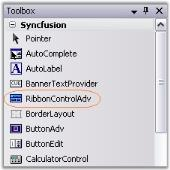

# Ribbon Form

EssentialStudio now gives a similar look and feel of MS Office 2007, to its Office 2007 controls, using RibbonControlAdv which comes with rounded corners. This section will guide you in creating a Ribbon form using RibbonControlAdv. 

### Creating Ribbon Form

1. Drag and drop the RibbonControlAdv on to the form.

   

2. To convert an ordinary form to Ribbon form, do the following.

   The forms in the application by default will extend to the Form class. Add the respective namespace and programmatically change it as RibbonForm class.

   ~~~ cs

		using Syncfusion.Windows.Forms.Tools;

		public partial class Form1 : RibbonForm 

   ~~~
   {:.prettyprint }

   ~~~ vbnet

		Imports Syncfusion.Windows.Forms.Tools

		Partial Public Class Form1

   ~~~
   {:.prettyprint }

Inherits RibbonForm

## Appearance Settings

This section discusses various appearance and behavior settings of the Ribbon form.

#### Appearance Settings

The appearance of the ribbon form can be controlled using the below properties.

_Table_ _683_: _Property Table_

<table>
<tr>
<th>
Property</th><th>
Description</th></tr>
<tr>
<td>
Appearance</td><td>
Sets the appearance of the form. The values are,Normal andOffice2007 (Default)Office 2010</td></tr>
<tr>
<td>
ColorScheme</td><td>
Specifies the office color scheme of the Ribbon form. The color schemes are, Blue, Black, Silver and Managed (Default).</td></tr>
<tr>
<td>
EnableAeroTheme</td><td>
Specifies the Aero theme of the Ribbon form. </td></tr>
<tr>
<td>
EnableHighContrastTheme</td><td>
Specifies whether to use default High Contrast theme color</td></tr>
<tr>
<td>
Font</td><td>
Gets or sets the RibbonControlAdv Font.</td></tr>
</table>



//Specifies the appearance of the form.

this.Appearance = AppearanceType.Office2007;

//Specifies the office color scheme of the Ribbon Form.

this.ColorScheme = ColorSchemeType.Blue;

//To disable the Aerotheme

this.EnableAeroTheme = false;

//To enable the default High Contrast theme color

this.ribbonControlAdv1.EnableHighContrastTheme = true;





'Specifies the appearance of the form.
Me.Appearance = AppearanceType.Office2007

'Specifies the office color scheme of the Ribbon Form.
Me.ColorScheme = ColorSchemeType.Blue

'To disable the Aerotheme
Me.EnableAeroTheme = false

'To enable the default High Contrast theme color

Me.ribbonControlAdv1.EnableHighContrastTheme = true



### Vista Aero Theme

Vista Aero theme support is available for Ribbon Form when used in Vista machine.

## Customization

The property which lets you set borders for the Office2007Style form is as follows.

_Table_ _684_: _Property Table_

<table>
<tr>
<th>
Property</th><th>
Description</th></tr>
<tr>
<td>
Borders</td><td>
Gets/sets the border values of an Office 2007 style form. Sets borders for Left, Top, Right and Bottom sides of the form.</td></tr>
</table>



this.Borders = new System.Windows.Forms.Padding(10);





Me.Borders = New System.Windows.Forms.Padding(10)



### Customizing the Top Left Edge

This TopLeftRadius property gets/sets the curved radius of the top left edge of the form. Default is 8.



this.TopLeftRadius = 20;





Me.TopLeftRadius = 20



