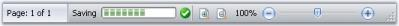
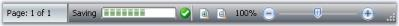

# StatusStripEx

Essential Tools has come up with StatusStripEx control which can be added to the bottom of the Ribbon. It can hold controls like TrackBarEx, ProgressBar, StatusStripButtons, and so on.

## Creating a StatusStripEx

#### Through Designer

The StatusStripEx can be added to the form by dragging a StatusStripEx control from the Toolbox. It can be docked to the bottom of the RibbonControlAdv. 

Dock the StatusStripEx control to the bottom using Dock property.

### Adding Items to the StatusStripEx

Access the Items property of the control, to open the Items Collection Editor. Use this editor to add customized StatusControl items. The Editor will let you modify the look and feel of the items using the properties provided on it right side.

 

N> A shortcut to add the ToolStripStatus Items is through Tasks Window. See Smart Tag options to know more.

### Through Code

StatusStripEx can be created programmatically using the code below. This code snippet adds a ToolStripStatus Label to the StatusStripEx control.



using Syncfusion.Windows.Forms.Tools;

//Declaring the StatusStripEx and ToolStripStatusLabel

private Syncfusion.Windows.Forms.Tools.StatusStripEx statusStripEx1;

private System.Windows.Forms.ToolStripStatusLabel toolStripStatusLabel1;

//Initializing the StatusStripEx and ToolStripStatusLabel

this.statusStripEx1 = new Syncfusion.Windows.Forms.Tools.StatusStripEx();

this.toolStripStatusLabel1 = new System.Windows.Forms.ToolStripStatusLabel();

//Adding ToolStripStatusLabel to StatusStripEx

this.statusStripEx1.Items.AddRange(new System.Windows.Forms.ToolStripItem[] {

this.toolStripStatusLabel1});

this.Controls.Add(this.statusStripEx1);

//Docking the StatusStripEx to Bottom

this.statusStripEx1.Dock = Syncfusion.Windows.Forms.Tools.DockStyleEx.Bottom;





Imports Syncfusion.Windows.Forms.Tools

'Declaring the StatusStripEx and ToolStripStatusLabel 

Private statusStripEx1 As Syncfusion.Windows.Forms.Tools.StatusStripEx

Private toolStripStatusLabel1 As System.Windows.Forms.ToolStripStatusLabel

'Initializing the StatusStripEx and ToolStripStatusLabel 

Me.statusStripEx1 = New Syncfusion.Windows.Forms.Tools.StatusStripEx() 

Me.toolStripStatusLabel1 = New System.Windows.Forms.ToolStripStatusLabel() 

'Adding ToolStripStatusLabel to StatusStripEx 

Me.statusStripEx1.Items.AddRange(New System.Windows.Forms.ToolStripItem() {Me.toolStripStatusLabel1}) 

Me.Controls.Add(Me.statusStripEx1)

Docking the StatusStripEx to Bottom'

Me.statusStripEx1.Dock = Syncfusion.Windows.Forms.Tools.DockStyleEx.Bottom



A sample which demonstrates the creation of StatusStripEx control and adding ToolStripStatus Items are available in the below sample installation location.

…\My Documents\Syncfusion\EssentialStudio\Version Number\Windows\Tools.Windows\Samples\Advanced Editor Functions\ActionGroupingDemo

## Smart Tag Options

Clicking the Smart Tag of the StatusStripEx, displays the below Tasks window. This window lets you add ToolStripStatus Items.

The options are,

* Dock - Provides docking options for StatusStripEx control.

### StatusControl Items

* Add StatusLabel - Adds a status label item.
* Add ProgressBar - Adds a ProgressBar item.
* Add DropDownButton - Adds a dropdownbutton item.
* Add SplitButton - Adds a split button item.
* Add PanelItem - Adds a Panel item.
* Add TrackBar Item - Adds a TrackBar item.

### Notifications Items

* Add StatusStripButton - Adds a Button item.



[Creating a StatusStripEx](/windowsforms/ribbonadv/statusstripex.html#creating-a-statusstripex)

[ColorSchemes for StatusStripEx](/windowsforms/ribbonadv/statusstripex.html#colorschemes-for-statusstripex)



## SizingGrip Settings

The StatusStripEx control has a sizing grip at its bottom right corner. This sizing grip can be shown or hidden using SizingGrip property. The below properties controls the appearance of the sizing grip.

_Table_ _781_: _Property Table_

<table>
<tr>
<th>
Property</th><th>
Description</th></tr>
<tr>
<td>
GripStyle</td><td>
Specifies the style of the sizing grip.</td></tr>
<tr>
<td>
GripMargin</td><td>
Gets or sets the margin for the sizing grip.</td></tr>
</table>



this.statusStripEx1.SizingGrip = true;

this.statusStripEx1.GripStyle = ToolStripGripStyle.Visible;

this.statusStripEx1.GripMargin = new Padding(5);





Me.statusStripEx1.SizingGrip = True

Me.statusStripEx1.GripStyle = ToolStripGripStyle.Visible

Me.statusStripEx1.GripMargin = New Padding(5)



## ColorSchemes for StatusStripEx

StatusStripEx supports all the three color schemes, i.e., Silver, Blue and Black schemes of Office2007. It can be changed using OfficeColorScheme property.

Tooltips



this.statusStripEx1.OfficeColorScheme = Syncfusion.Windows.Forms.Tools.ToolStripEx.ColorScheme.Silver;





Me.statusStripEx1.OfficeColorScheme = Syncfusion.Windows.Forms.Tools.ToolStripEx.ColorScheme.Silver



### Custom Colors

We can also apply custom colors to the StatusStripEx by setting OfficeColorScheme to "Managed" and specifying the custom color through the ApplyManagedColors method as follows.



this.statusStripEx1.OfficeColorScheme = Syncfusion.Windows.Forms.Tools.ToolStripEx.ColorScheme.Managed;

Office2007Colors.ApplyManagedColors(this, Color.DarkGreen);





Me.statusStripEx1.OfficeColorScheme = Syncfusion.Windows.Forms.Tools.ToolStripEx.ColorScheme.Managed

Office2007Colors.ApplyManagedColors(Me, Color.DarkGreen)





[Creating a StatusStripEx](/windowsforms/ribbonadv/statusstripex.html#creating-a-statusstripex)

[Smart Tag Options](/windowsforms/ribbonadv/statusstripex.html#smart-tag-options)

[SizingGrip Settings](/windowsforms/ribbonadv/statusstripex.html#sizinggrip-settings)



## Custom Context Menu

It is possible to customize the statusbar context menu that displays in StatusStripEx, to look like Word2007. This can be done by setting StatusString property of NotificationItems like StatusStripButton, StatusStripLabel, so on.



this.statusStripLabel1.Text = "Pages";

this.statusStripLabel1.StatusString = "1/1";





Me.statusStripLabel1.Text = "Pages"

Me.statusStripLabel1.StatusString = "1/1"

