# Appearance Settings

## Setting Visual Styles

The Ribbon control ships with a number of built-in themes such as Office2007, Office2010, Office2013,TouchStyle and Office2016.

The following code example illustrates how to set style for the RibbonControlAdv.





this.ribbonControlAdv1.RibbonStyle = RibbonStyle.Office2016;





Me.RibbonControlAdv1.RibbonStyle =RibbonStyle.Office2016




* Office2016 Style

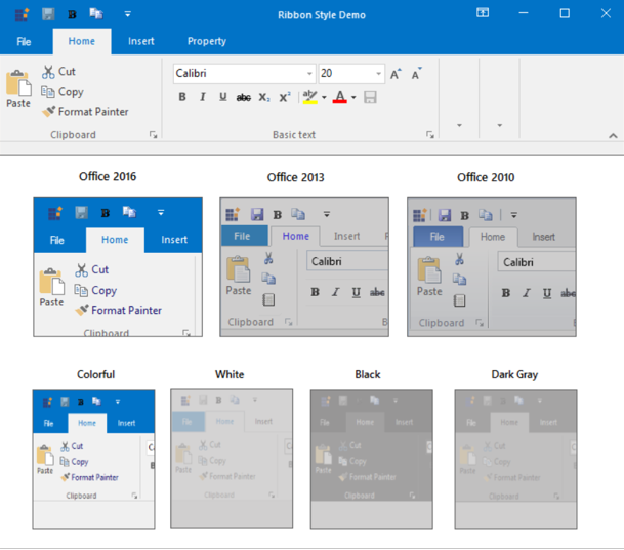

* TouchStyle

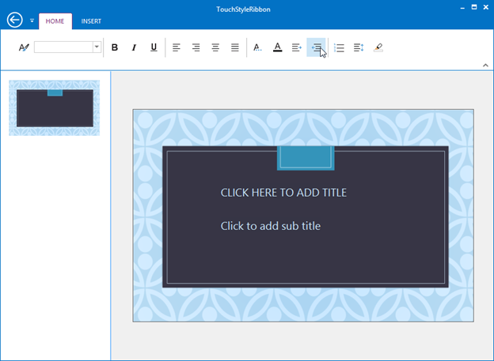

* Office 2013 Style

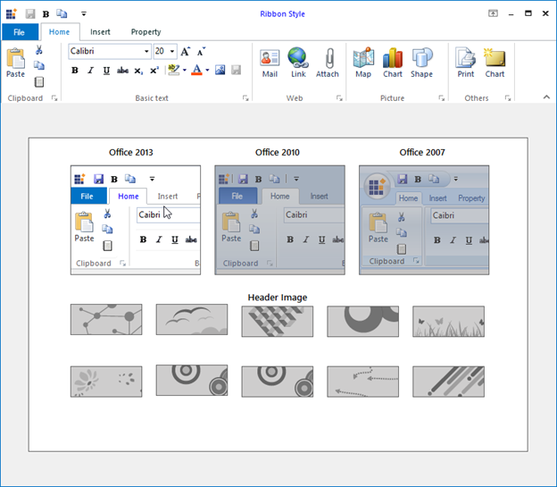

* Office 2010 Style

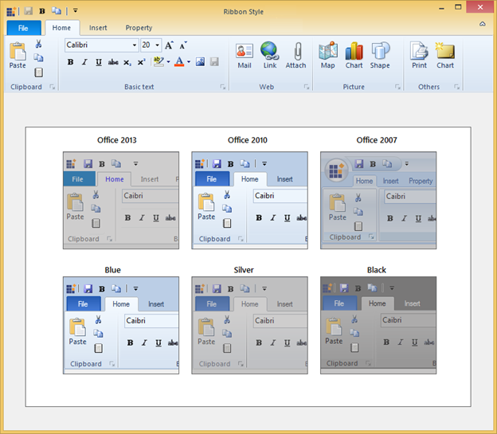

* Office 2007 Style

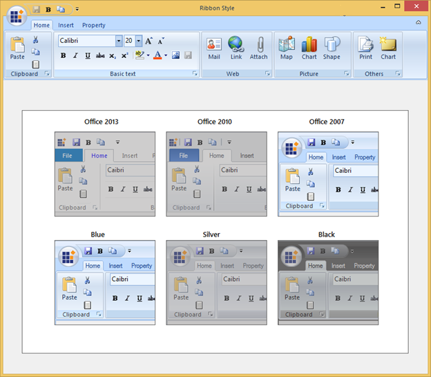

##	Office 2016 Color Schemes

The RibbonControlAdv includes new color schemes as available in the Office 2016 suite to provide a more personalized experience with the RibbonControlAdv. RibbonControlAdv now supports four themes: White, Black, Dark Gray and Colorful. 

The following code sample illustrates how to set the Colorful theme for the Office 2016 style RibbonControlAdv.     





this.ribbonControlAdv1.Office2016ColorScheme = Office2016ColorScheme.Colorful;





Me.ribbonControlAdv1.Office2016ColorScheme = Office2016ColorScheme.Colorful
  




* Colorful

* White

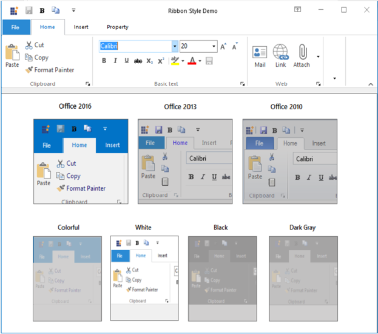

* DarkGray

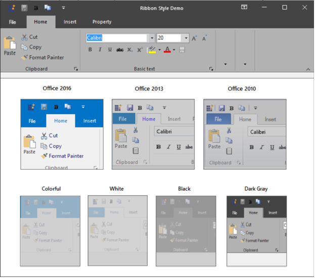

* Black

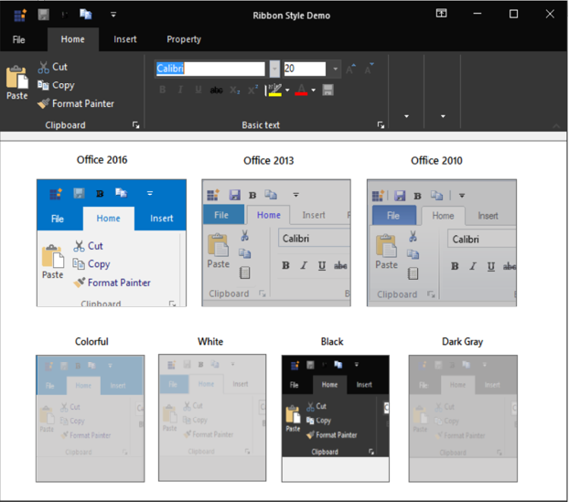

##	Office 2013 Color Schemes

The RibbonControlAdv includes new color schemes as available in the Office 2013 suite to provide a more personalized experience with the RibbonControlAdv.

RibbonControlAdv now supports three themes: White, LightGray, and DarkGray. These themes can be set through the Office2013ColorScheme property to tone down the bright white background of the ribbon. 

The following code sample illustrates how to set the DarkGray theme for the Office 2013 style RibbonControl.





this.ribbonControlAdv1.Office2013ColorScheme = Office2013ColorScheme.DarkGray;





Me.ribbonControlAdv1.Office2013ColorScheme = Office2013ColorScheme.DarkGray
  




* Dark Gray

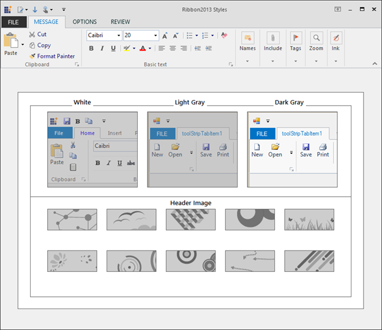

* Light Gray

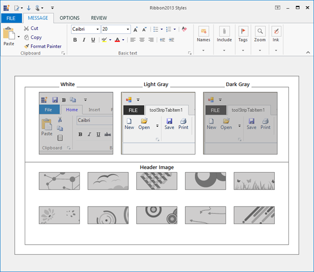

* White (Default)

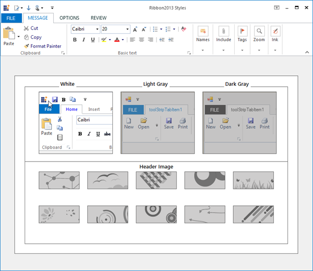

## OfficeColorSchemes

The Ribbon Control Adv has come up with the same visual style of Office 2007. The users can choose between three colors Blue, Silver and Black which, can be set through the OfficeColorScheme property of the RibbonControlAdv class.





this.ribbonControlAdv1.OfficeColorScheme = Syncfusion.Windows.Forms.Tools.ToolStripEx.ColorScheme.Blue;





Me.ribbonControlAdv1.OfficeColorScheme = Syncfusion.Windows.Forms.Tools.ToolStripEx.ColorScheme.Blue





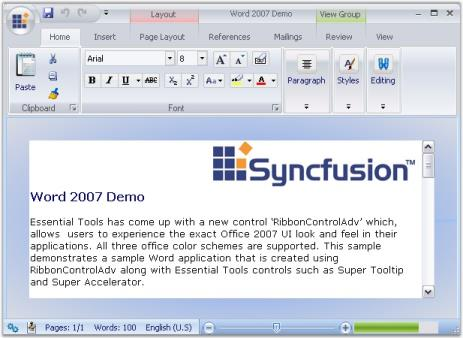

## Custom Color Scheme 

To set custom colors, set the ColorScheme as Managed. Then set the desired color using the  Syncfusion.Windows.Forms.Tools.Office12ColorTable.ApplyManagedColors method. 





//set the custom color to the form and RibbonControlAdv 

this.ColorScheme = ColorSchemeType.Managed;

this.ribbonControlAdv1.OfficeColorScheme = ToolStripEx.ColorScheme.Managed;

Office12ColorTable.ApplyManagedColors(this, Color.Red); 





'set the custom color to the form and RibbonControlAdv 

Me.ColorScheme = ColorSchemeType.Managed

Me.ribbonControlAdv1.OfficeColorScheme = ToolStripEx.ColorScheme.Managed

Office12ColorTable.ApplyManagedColors(Me, Color.Red)





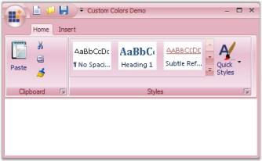

## Office 2016 ColorTable

RibbonControlAdv can now be fully customized in Office2016 style under Colorful theme. This can be achieved by using Office2016ColorTable property.

In the property window of the Ribbon, click the Office2016ColorTable property. The following window will be shown

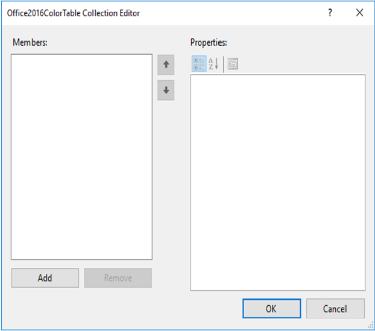

Click Add button to customize the RibbonControlAdv with the Office2016ColorTable property.

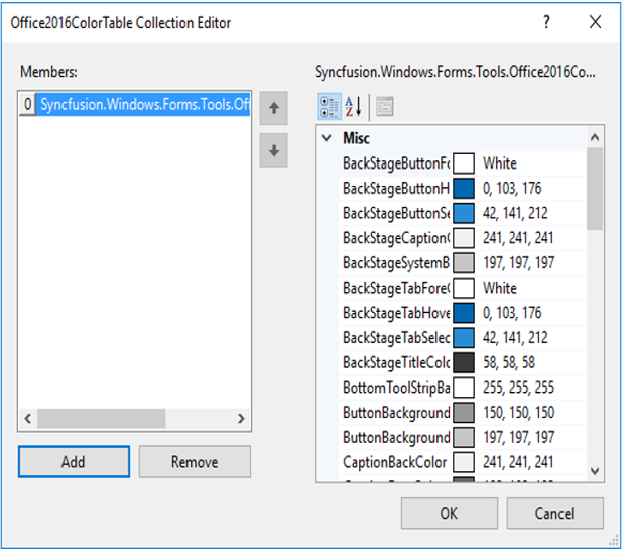

To achieve the above customization through code behind, follow the below steps.





 //Create instance for the Office2016ColorTable 

 Office2016ColorTable color = new Office2016ColorTable();

 //Ribbon Background Color Customization 
 
 //To set the Header color
 
 color.HeaderColor = ColorTranslator.FromHtml("#2a579a");

 // To set the TabItem Back Color

 color.TabBackColor = ColorTranslator.FromHtml("#2a579a");
 
 //To set the Title fore color
 
 color.TitleColor = Color.White;

 //Backstage customization 
 
 //To set the BackStageButton Hover color
            
 color.BackStageButtonHoverColor = ColorTranslator.FromHtml("#19478a");
  
 // To set the BackStageButton SelectionColor
 
 color.BackStageButtonSelectionColor = Color.FromArgb(62, 109, 181);
 
 // To set the BackStageTab SelectionColor
 
 color.BackStageTabSelectionColor = Color.FromArgb(62, 109, 181);
 
 //To set the BackStageTab HoverColor
 
 color.BackStageTabHoverColor = ColorTranslator.FromHtml("#19478a");
 
 // To set the BackStageButton ForeColor
            
 color.BackStageButtonForeColor = Color.White;
 
 // To set the BackStageTab ForeColor
            
 color.BackStageTabForeColor = Color.White;
            
 // To set the Backstage title fore color
            
 color.BackStageTitleColor = ColorTranslator.FromHtml("#3a3a3a");
            
 // To set the BackStage SystemButton Background
 
 color.BackStageSystemButtonBackground = ColorTranslator.FromHtml("#c5c5c5");
 
 // To set the Backstage caption color
 
 color.BackStageCaptionColor = ColorTranslator.FromHtml("#f1f1f1");

 // Gallery Item Customization 
 
 //To set the GalleryItem TextColor
 
 color.GalleryItemNormalTextColor = ColorTranslator.FromHtml("#7f7f7f");
 
 //To set the GalleryItem Hover TextColor
 
 color.GalleryItemHoveredTextColor = ColorTranslator.FromHtml("#2b2b2b");
 
 //To set the Gallery item back color
            
 color.GalleryItemNormalColor = ColorTranslator.FromHtml("#ffffff");
 
 // To set the Gallery item checked color
            
 color.GalleryItemCheckedColor = ColorTranslator.FromHtml("#afafaf");
 
 // To set the Gallery item hover color
 
 color.GalleryItemSelectedColor = ColorTranslator.FromHtml("#afafaf");

 
 // ToolstripTabItem customization
 
 //To set the Selected TabColor
 
 color.SelectedTabColor = ColorTranslator.FromHtml("#2a8ad4");
 
 //To set the Hover Tab Fore Color
 
 color.HoverTabForeColor = Color.White;
 
 //To set the Checked Tab Color
 
 color.CheckedTabColor = ColorTranslator.FromHtml("#f1f1f1");
 
 //To set the Checked Tab Fore Color
 
 color.CheckedTabForeColor = ColorTranslator.FromHtml("#0173c7");
 
 // To set the TabItem fore color
 
 color.TabForeColor = Color.White;

 // ToolstripEx customization
 
 // To set the Toolstrip back color
 
 color.ToolStripBackColor = ColorTranslator.FromHtml("#f1f1f1");
 
 // To set the ToolStrip caption back color
 
 color.CaptionBackColor = ColorTranslator.FromHtml("#f1f1f1");
 
 // To set the ToolStrip text color
 
 color.CaptionForeColor = ColorTranslator.FromHtml("#666666");
 
 // To set the ToolStrip border color
 
 color.ToolStripBorderColor = ColorTranslator.FromHtml("#d2d2d2");

 // To set the ToolStripSplitter color
           
 color.ToolStripSpliterColor = ColorTranslator.FromHtml("#d2d2d2");

 //ToolStripItem customization
 
 // To set the ToolStripItem fore color
 
 color.ToolStripItemForeColor = ColorTranslator.FromHtml("#575757");
 
 // To set the ToolstripButton pressed  back color
           
 color.ButtonBackgroundPressed = ColorTranslator.FromHtml("#969696");
 
 // To set the ToolstripButton selected back color
 
 color.ButtonBackgroundSelected = ColorTranslator.FromHtml("#c5c5c5");
 
 // To set the selected SplitButton Background color
 
 color.SplitButtonBackgroundSelected = ColorTranslator.FromHtml("#c5c5c5");

 //Launcher customization 
 
 //To set the Launcher back color
 
 color.LauncherColorNormal = ColorTranslator.FromHtml("#7e7e7e");
 
 // To set the selected Launcher color 
 
 color.LauncherColorSelected = ColorTranslator.FromHtml("#505050");
           
 // To set the Selected Launcher back color
 
 color.LauncherBackColorSelected = ColorTranslator.FromHtml("#c5c5c5");

 //RibbonPanel customization
 
 // To set the RibbonPanel back color
 
 color.PanelBackColor = ColorTranslator.FromHtml("#f1f1f1");
 
 // To set the Ribbon panel border color
 
 color.RibbonPanelBorderColor = ColorTranslator.FromHtml("#d2d2d2");
 
 // To set the Ribbon minimize button back color
 
 color.UpDownButtonBackColor = ColorTranslator.FromHtml("#c5c5c5");

 //Context Menu customization
 
 // To set the Context menu back color
 
 color.ContextMenuBackColor = Color.White;
 
 // To set the ContextMenu Title Back color
 
 color.ContextMenuTitleBackground = Color.FromArgb(30, Color.LightGray);
 
 // To set the ContextMenu Item selected back color
 
 color.ContextMenuItemSelected = ColorTranslator.FromHtml("#c5c5c5");

 // Quick DropDown button customization
 
 // To set the Quick Access Button back color
 
 color.QuickDropDownBackColor = ColorTranslator.FromHtml("#ffffff");
 
 // To set the Quick Access Button hover back color
 
 color.QuickDropDownSelectedcolor = ColorTranslator.FromHtml("#2a8dd4");
 
 // To set the Quick Access Button pressed back color
 
 color.QuickDropDownPressedcolor = ColorTranslator.FromHtml("#0067b0");

 //System Button customization
 
 // To set the System button back color
 
 color.SystemButtonBackground = ColorTranslator.FromHtml("#2a8ad4");
 
 // To set the Close Button back color
 
 color.CloseButtonBackground = ColorTranslator.FromHtml("#e81123");
 
 // To set the combobox dropdown color
 
 color.DropDownBackColor = ColorTranslator.FromHtml("#ffffff");

 //TabGroup Customization 
 
 // To set the TabGroup back color
 
 color.TabGroupBackColor = Color.FromArgb(1, 70, 122);
 
 // To set the TabGroup fore color
 
 color.TabGroupForeColor = Color.FromArgb(165, 185, 210);

 // Adds the color table instance to the ColorTable
 
 this.ribbonControlAdv1.Office2016ColorTable.Add(color);





'Create instance for the Office2016ColorTable 
 
 Dim color As Office2016ColorTable =  New Office2016ColorTable() 
 
 'Ribbon Background Color Customization 
 
 'To set the Header color
 
 color.HeaderColor = ColorTranslator.FromHtml("#2a579a")
 
 ' To set the TabItem Back Color
 
 color.TabBackColor = ColorTranslator.FromHtml("#2a579a")
 
 'To set the Title fore color
 
 color.TitleColor = Color.White
 
 'Backstage customization 
 
 'To set the BackStageButton Hover color
 
 color.BackStageButtonHoverColor = ColorTranslator.FromHtml("#19478a")
 
 ' To set the BackStageButton SelectionColor
 
 color.BackStageButtonSelectionColor = Color.FromArgb(62, 109, 181)
 
 ' To set the BackStageTab SelectionColor
 
 color.BackStageTabSelectionColor = Color.FromArgb(62, 109, 181)
 
 'To set the BackStageTab HoverColor
 
 color.BackStageTabHoverColor = ColorTranslator.FromHtml("#19478a")
 
 ' To set the BackStageButton ForeColor
 
 color.BackStageButtonForeColor = Color.White
 
 ' To set the BackStageTab ForeColor
 
 color.BackStageTabForeColor = Color.White
 
 ' To set the Backstage title fore color
 
 color.BackStageTitleColor = ColorTranslator.FromHtml("#3a3a3a")
 
 ' To set the BackStage SystemButton Background
 
 color.BackStageSystemButtonBackground = ColorTranslator.FromHtml("#c5c5c5")
 
 ' To set the Backstage caption color
 
 color.BackStageCaptionColor = ColorTranslator.FromHtml("#f1f1f1")
 
 ' Gallery Item Customization 
 
 'To set the GalleryItem TextColor
 
 color.GalleryItemNormalTextColor = ColorTranslator.FromHtml("#7f7f7f")
 
 'To set the GalleryItem Hover TextColor
 
 color.GalleryItemHoveredTextColor = ColorTranslator.FromHtml("#2b2b2b")
 
 'To set the Gallery item back color
 
 color.GalleryItemNormalColor = ColorTranslator.FromHtml("#ffffff")
 
 ' To set the Gallery item checked color
 
 color.GalleryItemCheckedColor = ColorTranslator.FromHtml("#afafaf")
 
 ' To set the Gallery item hover color
 
 color.GalleryItemSelectedColor = ColorTranslator.FromHtml("#afafaf")
 
 
 ' ToolstripTabItem customization
 
 'To set the Selected TabColor
 
 color.SelectedTabColor = ColorTranslator.FromHtml("#2a8ad4")
 
 'To set the Hover Tab Fore Color
 
 color.HoverTabForeColor = Color.White
 
 'To set the Checked Tab Color
 
 color.CheckedTabColor = ColorTranslator.FromHtml("#f1f1f1")
 
 'To set the Checked Tab Fore Color
 
 color.CheckedTabForeColor = ColorTranslator.FromHtml("#0173c7")
 
 ' To set the TabItem fore color
 
 color.TabForeColor = Color.White
 
 ' ToolstripEx customization
 
 ' To set the Toolstrip back color
 
 color.ToolStripBackColor = ColorTranslator.FromHtml("#f1f1f1")
 
 ' To set the ToolStrip caption back color
 
 color.CaptionBackColor = ColorTranslator.FromHtml("#f1f1f1")
 
 ' To set the ToolStrip text color
 
 color.CaptionForeColor = ColorTranslator.FromHtml("#666666")
 
 ' To set the ToolStrip border color
 
 color.ToolStripBorderColor = ColorTranslator.FromHtml("#d2d2d2")
 
 ' To set the ToolStripSplitter color
 
 color.ToolStripSpliterColor = ColorTranslator.FromHtml("#d2d2d2")
 
 'ToolStripItem customization
 
 ' To set the ToolStripItem fore color
 
 color.ToolStripItemForeColor = ColorTranslator.FromHtml("#575757")
 
 ' To set the ToolstripButton pressed  back color
 
 color.ButtonBackgroundPressed = ColorTranslator.FromHtml("#969696")
 
 ' To set the ToolstripButton selected back color
 
 color.ButtonBackgroundSelected = ColorTranslator.FromHtml("#c5c5c5")
 
 ' To set the selected SplitButton Background color
 
 color.SplitButtonBackgroundSelected = ColorTranslator.FromHtml("#c5c5c5")
 
 'Launcher customization 
 
 'To set the Launcher back color
 
 color.LauncherColorNormal = ColorTranslator.FromHtml("#7e7e7e")
 
 ' To set the selected Launcher color 
 
 color.LauncherColorSelected = ColorTranslator.FromHtml("#505050")
 
 ' To set the Selected Launcher back color
 
 color.LauncherBackColorSelected = ColorTranslator.FromHtml("#c5c5c5")
 
 'RibbonPanel customization
 
 ' To set the RibbonPanel back color
 
 color.PanelBackColor = ColorTranslator.FromHtml("#f1f1f1")
 
 ' To set the Ribbon panel border color
 
 color.RibbonPanelBorderColor = ColorTranslator.FromHtml("#d2d2d2")
 
 ' To set the Ribbon minimize button back color
 
 color.UpDownButtonBackColor = ColorTranslator.FromHtml("#c5c5c5")
 
 'Context Menu customization
 
 ' To set the Context menu back color
 
 color.ContextMenuBackColor = Color.White
 
 ' To set the ContextMenu Title Back color
 
 color.ContextMenuTitleBackground = Color.FromArgb(30, Color.LightGray)
 
 ' To set the ContextMenu Item selected back color
 
 color.ContextMenuItemSelected = ColorTranslator.FromHtml("#c5c5c5")
 
 ' Quick DropDown button customization
 
 ' To set the Quick Access Button back color
 
 color.QuickDropDownBackColor = ColorTranslator.FromHtml("#ffffff")
 
 ' To set the Quick Access Button hover back color
 
 color.QuickDropDownSelectedcolor = ColorTranslator.FromHtml("#2a8dd4")
 
 ' To set the Quick Access Button pressed back color
 
 color.QuickDropDownPressedcolor = ColorTranslator.FromHtml("#0067b0")
 
 'System Button customization
 
 ' To set the System button back color
 
 color.SystemButtonBackground = ColorTranslator.FromHtml("#2a8ad4")
 
 ' To set the Close Button back color
 
 color.CloseButtonBackground = ColorTranslator.FromHtml("#e81123")
 
 ' To set the combobox dropdown color
 
 color.DropDownBackColor = ColorTranslator.FromHtml("#ffffff")
 
 'TabGroup Customization 
 
 ' To set the TabGroup back color
 
 color.TabGroupBackColor = Color.FromArgb(1, 70, 122)
 
 ' To set the TabGroup fore color
 
 color.TabGroupForeColor = Color.FromArgb(165, 185, 210)
 
 ' Adds the color table instance to the ColorTable
 
 Me.ribbonControlAdv1.Office2016ColorTable.Add(color)





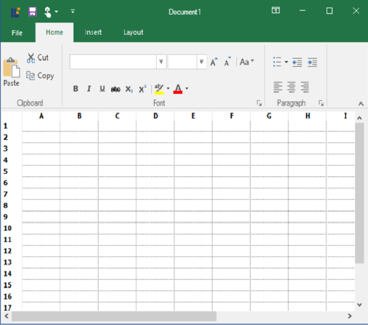

## TouchStyle ColorTable

RibbonControlAdv can now be fully customized in TouchStyle. This can be achieved by using TouchStyle ColorTable.
The following code demonstrate how to use the TouchStyleColorTable.





//Creates an instance for the TouchStyleColorTable

TouchStyleColorTable _touchColorTable = new TouchStyleColorTable();

//To set fore color of the Active tab item

_touchColorTable.ToolstripActiveTabItemForeColor = Color.RoyalBlue;
//To set fore color of the Inactive tab item

_touchColorTable.ToolstripTabItemForeColor = Color.White;
//To set the Button hover color

_touchColorTable.ButtonHoverColor = ColorTranslator.FromHtml("#cde6f7");
//To set the border color

_touchColorTable.ToolStripBorderColor = Color.Blue;

//To set the Menu button arrow color

_touchColorTable.MenuButtonArrowColor = Color.White;

//To set the Menu button hover in RibbonControlAdv

_touchColorTable.MenuButtonHoverArrowColor = Color.Pink;

//To set the header color of the RibbonControlAdv

_touchColorTable.HeaderColor = Color. DarkViolet;

//To set the body color of the dropdown items

_touchColorTable.DropDownBodyColor = Color.White;

//To set the fore color of the dropdown items

_touchColorTable.DropDownTextForeColor = Color.Black;

//To set the back color of the dropdown items

_touchColorTable.DropDownMenuItemBackground = ColorTranslator.FromHtml("#0272c5");

//To set the body color of the selected dropdown items

_touchColorTable.DropDownSelectedTextForeColor = Color.White;

//To set the border color of the ToolStripTabItem.

_touchColorTable.ToolstripTabItemBorder = ColorTranslator.FromHtml("#0272c5");

//To set the back color of active ToolStripTabItem

_touchColorTable.ActiveToolStripTabItemBackColor = ColorTranslator.FromHtml("#0272c5");

//To sets the back color of active ToolStripTabItem

_touchColorTable.BackStageButtonColor = ColorTranslator.FromHtml("#0272c5");

//To sets the Color of the BackStageButton for Hovering.

_touchColorTable.BackStageButtonHoverColor = Color.AliceBlue;

//To sets the Caption color for the Backstage.

_touchColorTable.BackStageCaptionColor = Color.BlanchedAlmond;

//To sets the color of the CloseButton in BackStageVisibleMode.

_touchColorTable.BackStageCloseButtonBackground = Color.BlueViolet;

//To sets the BackColor of the MenuButton.

_touchColorTable.BackStageNavigationButtonBackColor = ColorTranslator.FromHtml("#0272c5");

//To sets the ForeColor of the MenuButton.

_touchColorTable.BackStageNavigationButtonForeColor = Color.White;

//To sets the color for BackStageTab.

_touchColorTable.BackStageTabColor = ColorTranslator.FromHtml("#0272c5");

//To sets the Color of the BackStageTab for Hovering.

_touchColorTable.BackStageTabHoverColor = Color.BlanchedAlmond;

//To sets the color for ToolStripBorder.

_touchColorTable.BottomToolStripBackColor = ColorTranslator.FromHtml("#0272c5");

//To sets the color of the button for checked state.

_touchColorTable.ButtonCheckedColor = Color.Blue;

//To sets the color of the Button for pressed state.

_touchColorTable.ButtonPressedColor = Color.BlueViolet;

//To sets the color of the close button.

_touchColorTable.CloseButtonBackground = Color.CadetBlue;

//To sets the color of the Close Button in pressed state.

_touchColorTable.CloseButtonPressed = Color.Red;

//To sets the color for the DropDown Text.

_touchColorTable.DropDownTextForeColor = Color.Black;

//To sets the color for the DropDown Title.

_touchColorTable.DropDownTitleBackground = Color.WhiteSmoke;

//To sets the color for RibbonHeader.

_touchColorTable.HeaderColor = ColorTranslator.FromHtml("#0272c5");

//To set the value of the BackColor of the tab when the mouse is hover on it.

_touchColorTable.HoverTabBackColor = Color.Violet;

//To set the value of the ForeColor of the tab when the mouse is hover on it.

_touchColorTable.HoverTabBackColor = Color.Wheat;

//To sets the color for Image Margin.

_touchColorTable.ImageMargin = Color.Yellow;

//To sets the color for when mouse hovers MenuButtonArrow.

_touchColorTable.MenuButtonHoverArrowColor = ColorTranslator.FromHtml("#0272c5");

//To sets the color for OverFlowArrow.

_touchColorTable.OverFlowArrowColor = Color.Navy;

//To sets the color of the QATButton for hover state.

_touchColorTable.QATButtonHoverColor = Color.MediumAquamarine;

//To sets the color for QATDown Arrow.

_touchColorTable.QATDownArrowColor = Color.LimeGreen;

//To sets the back color of active RibbonPanel

_touchColorTable.RibbonPanelBackColor = ColorTranslator.FromHtml("#0272c5");

//To sets the color of the SplitButton for Pressed state.

_touchColorTable.SplitButtonPressed = ColorTranslator.FromHtml("#0272c5");

//To sets the color of the SplitButton for selected state.

_touchColorTable.SplitButtonSelected = Color.LightYellow;

//To sets the color for SystemButtonBackground.

_touchColorTable.SystemButtonBackground = ColorTranslator.FromHtml("#0272c5");

//To sets the color of the SystemButton in pressed state.

_touchColorTable.SystemButtonPressed = ColorTranslator.FromHtml("#0272c5");

//To sets the color for TabScrollArrow.

_touchColorTable.TabScrollArrowColor = ColorTranslator.FromHtml("#0272c5");

//To sets the color of the DropDown Arrow.

_touchColorTable.ToolStripArrowColor = Color.Red;

//To sets the color for ToolStripBorder.

_touchColorTable.ToolStripBorderColor = ColorTranslator.FromHtml("#0272c5");

//To sets the color for Button Border.

_touchColorTable.ToolstripButtonPressedBorder = ColorTranslator.FromHtml("#0272c5");

//To sets the color of the selectedTabBorder.

_touchColorTable.ToolstripSelectedTabItemBorder = Color.DodgerBlue;

//To sets the color for Splitter.

_touchColorTable.ToolStripSpliterColor = Color.Red;

//To sets the color of the TabForeColor.

_touchColorTable.ToolstripTabItemForeColor = Color.White;

//To apply TouchStyleColorTable for RibbonControlAdv

this.ribbonControlAdv1.ApplyTouchStyleColorTable(_touchColorTable);





'Creates an instance for the TouchStyleColorTable 

Dim _touchColorTable As New TouchStyleColorTable()

'To set fore color of the Active tab item

_touchColorTable.ToolstripActiveTabItemForeColor = Color.RoyalBlue

'To set fore color of the Inactive tab item

_touchColorTable.ToolstripTabItemForeColor = Color.White

'To set the Button hover color

_touchColorTable.ButtonHoverColor = ColorTranslator.FromHtml("#cde6f7")

'To set the border color

_touchColorTable.ToolStripBorderColor = Color.Blue

'To set the Menu button arrow color

_touchColorTable.MenuButtonArrowColor = Color.White

'To set the Menu button hover in RibbonControlAdv

_touchColorTable.MenuButtonHoverArrowColor = Color.Pink

'To set the header color of the RibbonControlAdv

_touchColorTable.HeaderColor = Color. DarkViolet

'To set the body color of the dropdown items

_touchColorTable.DropDownBodyColor = Color.White

'To set the fore color of the dropdown items

_touchColorTable.DropDownTextForeColor = Color.Black

'To set the back color of the dropdown items

_touchColorTable.DropDownMenuItemBackground = ColorTranslator.FromHtml("#0272c5")

'To set the body color of the selected dropdown items

_touchColorTable.DropDownSelectedTextForeColor = Color.White

'To set the border color of the ToolStripTabItem.

_touchColorTable.ToolstripTabItemBorder = ColorTranslator.FromHtml("#0272c5")

'To set the back color of active ToolStripTabItem

_touchColorTable.ActiveToolStripTabItemBackColor = ColorTranslator.FromHtml("#0272c5")

'To sets the back color of active ToolStripTabItem

_touchColorTable.BackStageButtonColor = ColorTranslator.FromHtml("#0272c5")

'To sets the Color of the BackStageButton for Hovering.

_touchColorTable.BackStageButtonHoverColor = Color.AliceBlue

'To sets the Caption color for the Backstage.

_touchColorTable.BackStageCaptionColor = Color.BlanchedAlmond

'To sets the color of the CloseButton in BackStageVisibleMode.

_touchColorTable.BackStageCloseButtonBackground = Color.BlueViolet

'To sets the BackColor of the MenuButton.

_touchColorTable.BackStageNavigationButtonBackColor = ColorTranslator.FromHtml("#0272c5")

'To sets the ForeColor of the MenuButton.

_touchColorTable.BackStageNavigationButtonForeColor = Color.White

'To sets the color for BackStageTab.

_touchColorTable.BackStageTabColor = ColorTranslator.FromHtml("#0272c5")

'To sets the Color of the BackStageTab for Hovering.

_touchColorTable.BackStageTabHoverColor = Color.BlanchedAlmond

'To sets the color for ToolStripBorder.

_touchColorTable.BottomToolStripBackColor = ColorTranslator.FromHtml("#0272c5")

'To sets the color of the button for checked state.

_touchColorTable.ButtonCheckedColor = Color.Blue

'To sets the color of the Button for pressed state.

_touchColorTable.ButtonPressedColor = Color.BlueViolet

'To sets the color of the close button.

_touchColorTable.CloseButtonBackground = Color.CadetBlue

'To sets the color of the Close Button in pressed state.

_touchColorTable.CloseButtonPressed = Color.Red

'To sets the color for the DropDown Text.

_touchColorTable.DropDownTextForeColor = Color.Black

'To sets the color for the DropDown Title.

_touchColorTable.DropDownTitleBackground = Color.WhiteSmoke

'To sets the color for RibbonHeader.

_touchColorTable.HeaderColor = ColorTranslator.FromHtml("#0272c5")

'To set the value of the BackColor of the tab when the mouse is hover on it.

_touchColorTable.HoverTabBackColor = Color.Violet

'To set the value of the ForeColor of the tab when the mouse is hover on it.

_touchColorTable.HoverTabBackColor = Color.Wheat

'To sets the color for Image Margin.

_touchColorTable.ImageMargin = Color.Yellow

'To sets the color for when mouse hovers MenuButtonArrow.

_touchColorTable.MenuButtonHoverArrowColor = ColorTranslator.FromHtml("#0272c5")

'To sets the color for OverFlowArrow.

_touchColorTable.OverFlowArrowColor = Color.Navy

'To sets the color of the QATButton for hover state.

_touchColorTable.QATButtonHoverColor = Color.MediumAquamarine

'To sets the color for QATDown Arrow.

_touchColorTable.QATDownArrowColor = Color.LimeGreen

'To sets the back color of active RibbonPanel

_touchColorTable.RibbonPanelBackColor = ColorTranslator.FromHtml("#0272c5")

'To sets the color of the SplitButton for Pressed state.

_touchColorTable.SplitButtonPressed = ColorTranslator.FromHtml("#0272c5")

'To sets the color of the SplitButton for selected state.

_touchColorTable.SplitButtonSelected = Color.LightYellow

'To sets the color for SystemButtonBackground.

_touchColorTable.SystemButtonBackground = ColorTranslator.FromHtml("#0272c5")

'To sets the color of the SystemButton in pressed state.

_touchColorTable.SystemButtonPressed = ColorTranslator.FromHtml("#0272c5")

'To sets the color for TabScrollArrow.

_touchColorTable.TabScrollArrowColor = ColorTranslator.FromHtml("#0272c5")

'To sets the color of the DropDown Arrow.

_touchColorTable.ToolStripArrowColor = Color.Red

'To sets the color for ToolStripBorder.

_touchColorTable.ToolStripBorderColor = ColorTranslator.FromHtml("#0272c5")

'To sets the color for Button Border.

_touchColorTable.ToolstripButtonPressedBorder = ColorTranslator.FromHtml("#0272c5")

'To sets the color of the selectedTabBorder.

_touchColorTable.ToolstripSelectedTabItemBorder = Color.DodgerBlue

'To sets the color for Splitter.

_touchColorTable.ToolStripSpliterColor = Color.Red

'To sets the color of the TabForeColor.

_touchColorTable.ToolstripTabItemForeColor = Color.White

'To apply TouchStyleColorTable for RibbonControlAdv

Me.ribbonControlAdv1.ApplyTouchStyleColorTable(_touchColorTable)





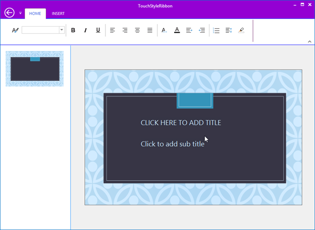

