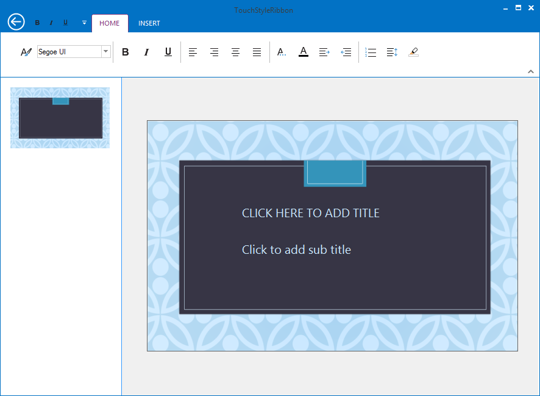

# How to customize QuickPanelAlignment in RibbonControlAdv TouchStyle?

By default, QAT DropDownButton is placed on the left of the ToolStripTabItems. It can be placed on the right side of the ToolStripTabItems by using the property named “QuickPanelAlignment” and it helps to specify the alignment of the QATDropDownButton.

Property Table

<table>
<tr>
<th>
Property</th><th>
Description</th></tr>
<tr>
<td>
QuickPanelAlignment</td><td>
Specifies where the QuickItemsDropDownButton needs to be shown, and it is applicable only for Touch style.</td></tr>
<tr>
<td>
Left</td><td>
Specifies the Left alignment for QuickDropDown button.</td></tr>
<tr>
<td>
Right</td><td>
Specifies the Right alignment for QuickDropDown button.</td></tr>
</table>



//Specifies the QAT DropDown button at default (left) position.

this.ribbonControlAdv1.QuickPanelAlignment = QuickPanelAlignment.Left;

//Specifies the QAT DropDown button at right side of the ToolStripTabItems.

this.ribbonControlAdv1.QuickPanelAlignment = QuickPanelAlignment.Right;





'Specifies the QAT DropDown button at default (left) position.

Me.ribbonControlAdv1.QuickPanelAlignment = QuickPanelAlignment.Left

'Specifies the QAT DropDown button at right side of the ToolStripTabItems.

Me.ribbonControlAdv1.QuickPanelAlignment = QuickPanelAlignment.Right



N> The property named “QuickPanelAlignment” is only applicable when RibbonStyle is set as TouchStyle.

