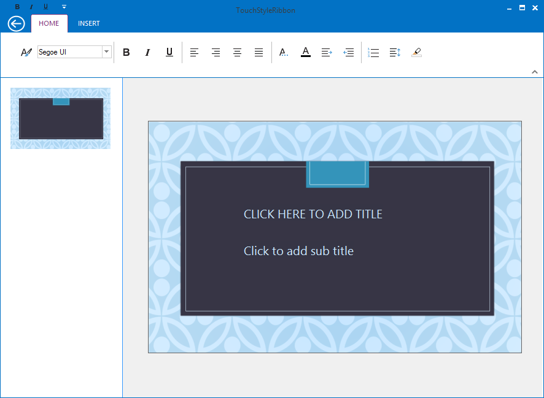

# How to customize QuickPanelAlignment in RibbonControlAdv TouchStyle?

By default, Quick panel is placed on the left of the ToolStripTabItems. It can be placed on the right and top side of the ToolStripTabItems by using the property named “QuickPanelAlignment” and it helps to specify the alignment of the QAT panel.

<table>
<tr>
<th>
Property</th><th>
Description</th></tr>
<tr>
<td>
QuickPanelAlignment</td><td>
Specifies where the Quick panel needs to be shown, and it is applicable only for Touch style.  {{'__Left__ '| markdownify }}- Specifies the Left alignment for Quick panel,  {{'__Right__ '| markdownify }}- Specifies the Right alignment for QuickDropDown button,   {{'__Top__ '| markdownify }}- Specifies the Top alignment for Quick Panel.</td></tr>
</table>



//Specifies the Quick panel at default (left) position.

this.ribbonControlAdv1.QuickPanelAlignment = QuickPanelAlignment.Left;

//Specifies the Quick panel at right side of the ToolStripTabItems.

this.ribbonControlAdv1.QuickPanelAlignment = QuickPanelAlignment.Right;

//Specifies the Quick panel at top side of the ToolStripTabItems.

this.ribbonControlAdv1.QuickPanelAlignment = QuickPanelAlignment.Top;





'Specifies the Quick panel at default (left) position.

Me.ribbonControlAdv1.QuickPanelAlignment = QuickPanelAlignment.Left

'Specifies the Quick panel at right side of the ToolStripTabItems.

Me.ribbonControlAdv1.QuickPanelAlignment = QuickPanelAlignment.Right

'Specifies the Quick panel at top side of the ToolStripTabItems.

Me.ribbonControlAdv1.QuickPanelAlignment = QuickPanelAlignment.Top



N> The property named “QuickPanelAlignment” is only applicable when RibbonStyle is set as TouchStyle.

* Left

* Right

* Top

